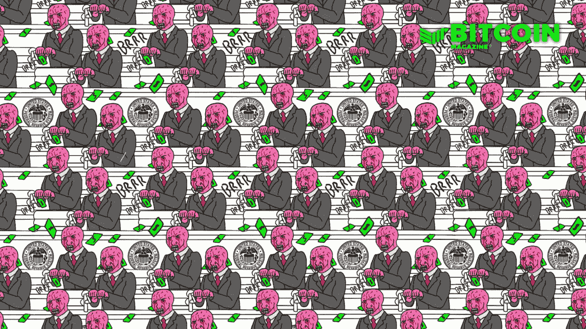
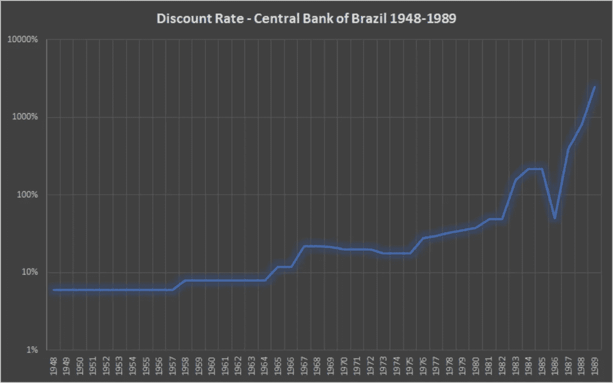
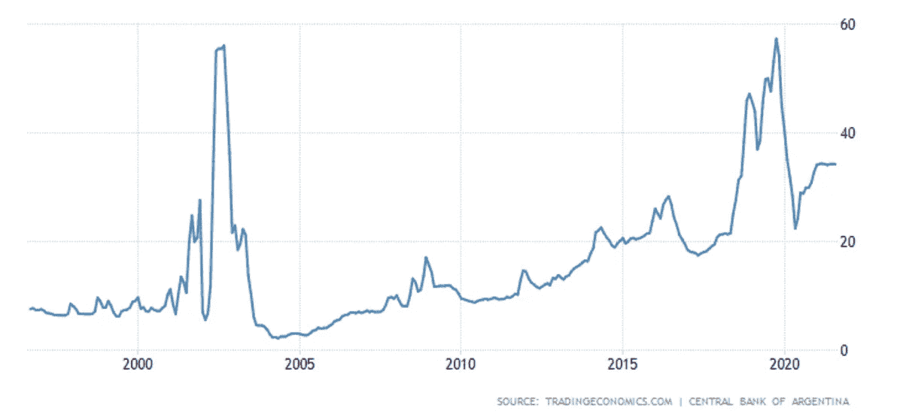
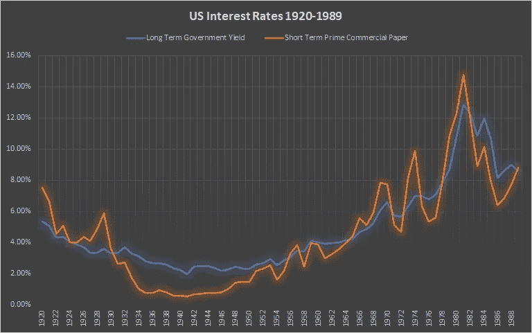
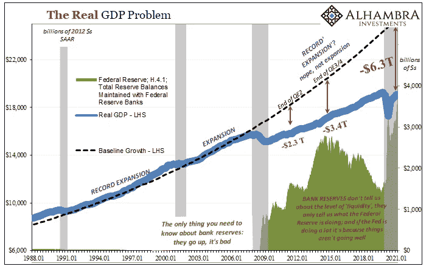
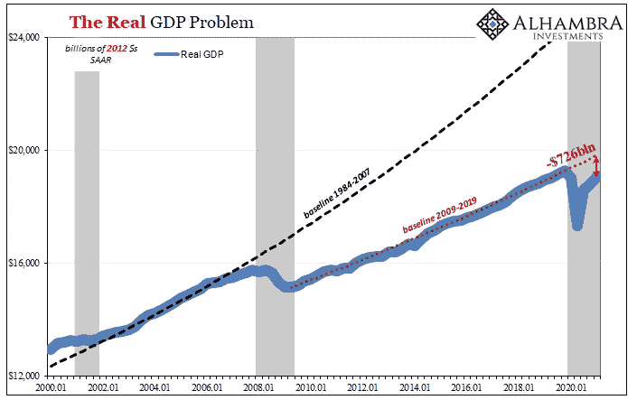
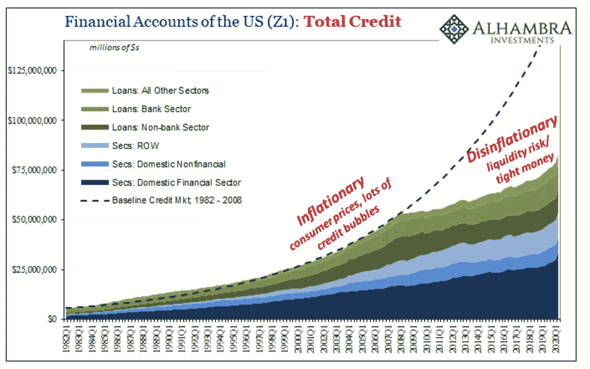
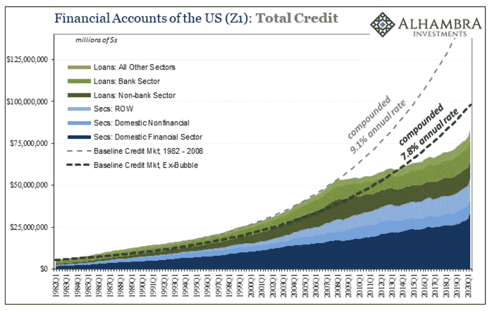
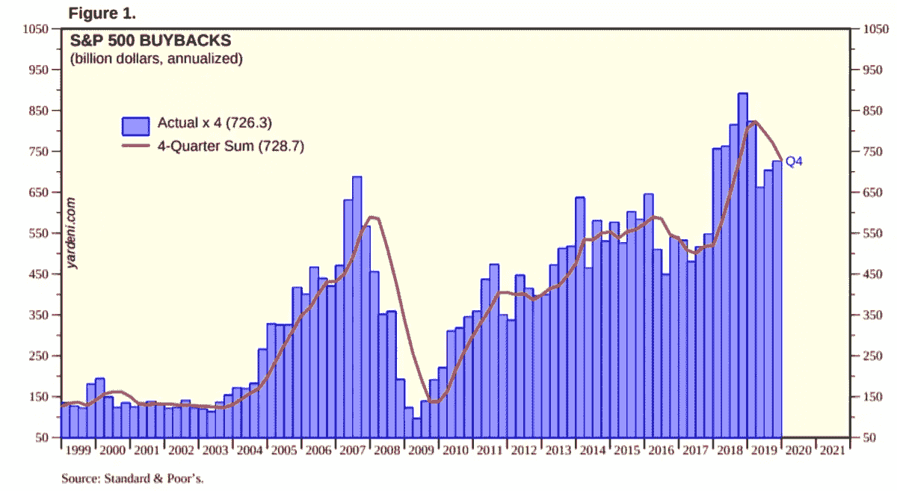
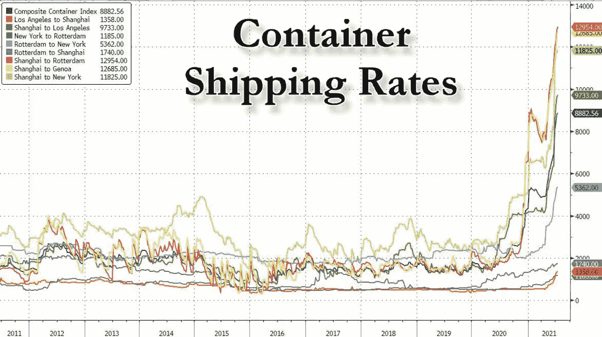

# 反对比特币通胀叙事的理由

> 原文：<https://medium.com/coinmonks/the-case-against-bitcoins-inflation-narrative-277b61cd4555?source=collection_archive---------5----------------------->

彼得·希夫(Peter Schiff)、黄金虫子(gold bugs)、财经媒体和许多比特币创造者有什么共同点？人们普遍认为,“印钱”是困扰我们经济的许多价格上涨的罪魁祸首。虽然不能说某些领域的价格正在上涨，如住房、股票、债券和木材(尽管是暂时的)，但我相信，这些价格上涨的源头来自一个与大多数人倾向于假设的不同的地方。

在过去的几个月里，我一直在收集与通货膨胀相关的信息，并希望利用这个机会与比特币观众分享我的发现。我们将使用这封信来尝试并确定在通货膨胀以及反通货膨胀/通货紧缩环境中人们期望看到的事情类型。我们还将试图找出全球金融危机后资产和消费价格上涨的罪魁祸首(GFC)。

在比特币领域，有两个话题肯定会引起你的积极关注。一个是促进通货膨胀叙事，另一个是促进看涨价格势头。在我看来，涵盖上述主题的许多文章都可以归结为纯粹的啦啦队，往往缺乏实质内容。尽管这封信将涉及通货膨胀的话题，但它实际上是在为另一种观点提供支持，而不是最流行的观点。对于大多数读者来说，这篇文章可能有点长，但不要担心，它的图表和文字一样多，我们将使用的图表和插图将有助于我们的分析。

为了开始，我们首先需要确定通货膨胀和通货紧缩环境在社会和经济行为方面的属性，人们可能期望在每种类型的环境中观察到这些属性。为此，我们将更多地利用历史先例。我们将从确定一个真正的通货膨胀环境的属性开始分析。

# 通胀环境是什么样的？

为了理解在通胀环境下会发生什么，我们将以历史为鉴。我们将关注通货膨胀时期对利率和消费者行为等领域的影响。下面的通货膨胀事件是按时间顺序排列的，基本上涵盖了上个世纪左右的时间。我们从布尔什维克俄罗斯开始。

# 苏联

> “第一次世界大战和 1917 年革命导致了一段前所未有的通货膨胀时期。到 1917 年，卢布已经损失了其 1913 年交换价值的 75%；到 1920 年，它已经损失了 1913 年外汇价值的 99.9%。商品价格指数在 1913 年至 1918 年间上涨了 5800%，在 1913 年至 1921 年间上涨了 490 万%。”——《利率的历史》，第 598 页

一个重要的恶性通货膨胀事件是布尔什维克革命后苏联的恶性通货膨胀。上面提供的例子可能会让人们想起更现代的事件，如津巴布韦和委内瑞拉的经历。所以我们知道这段时间苏联卢布发生了什么，但是利率是如何反应的呢？根据《利率史》，1923 年 Gosbank 的存款利率高达 72%，但该书也指出，这些利率并不代表供求关系，而是由苏联委员决定的，因此可能会高得多。在贷款方面，同年支付的贷款利息超过 216%。此外，典当行可以收取高达 120%的贷款预付款。前面提到的苏联委员在此期间控制了银行业的方方面面，因此黑市利率很可能比上面提到的要高得多。

# 魏玛德国

> 那个时候(1922 年 2 月)唯一能做的就是尽快把现金变成别的东西。节约是愚蠢的。然而，毫无疑问，在奥地利，有许多农民的行为令人发指。沙赫特博士对通货膨胀年代的描述回忆道，农民们用他们的纸币尽可能快地购买各种有用的机器和家具，以及许多无用的东西。在那个时期，大多数不喜欢音乐的家庭都可以找到大而直的钢琴。”——《当金钱死去》第 109 页

从行为的角度来看，在高通胀到极端通胀期间，你可能会看到的一件事是，消费者试图尽快摆脱快速贬值的货币。第一次世界大战后的几年里，这正是你在德国看到的情况。消费者会在拿到钱的那一刻，争先恐后地购买他们能买到的任何东西。事实上，情况变得如此糟糕，以至于生产商和零售商不能也不想出售他们的商品，并通过限制开门时间来应对，否则他们的库存将很快被清空，店主将不得不接受迅速贬值的德国马克。此外，在此期间，德国记录了超过 10，000%的贷款，但由于恶性通货膨胀的混乱、法国人对鲁尔区的占领以及政治极端主义，真实的黑市利率可能会高得多。

# **巴西**

*Figure 1\. Discount rate for the Bank of Brazil, 1948–1989 (*[*Source*](https://www.amazon.com/History-Interest-Rates-Fourth-Finance/dp/0471732834)*).*

由于 1948 年至 1989 年间利率的波动，图 1 中的图表设定为对数标度。1964 年军事政变后，巴西政府开始了国家货币克鲁塞罗的贬值进程，以应对这一时期发生的各种危机，如 1979 年的石油危机。在 1993 年由于恶性通货膨胀最终崩溃之前，货币本身总共经历了三次反复。从图 1 中我们可以清楚地看到，就在克鲁塞罗最终内爆之前，利率呈抛物线形，因此，印钞和利率之间存在明显的因果关系。当货币被印刷出来时，利率就会随之上升。我们一次又一次地看到这种行为。

# 阿根廷

*Figure 2\. Deposit interest rate in Argentina, 1994–2021 (*[*Source*](https://tradingeconomics.com/argentina/deposit-interest-rate)*).*

阿根廷与通货膨胀的斗争众所周知。过去 20 年的两次主要通胀事件与 1998-2002 年的阿根廷大萧条和 2018 年的阿根廷货币危机同时发生。在两次危机的高峰期，利率飙升以应对比索的贬值。图 2 显示了银行在过去 25 年中支付给储户的利率。在撰写本文时，2021 年 9 月 4 日，储户再次获得 34%的存款利息，这表明大通胀时期会导致利率大幅上升。

上一节的引文和图表提供了一致的证据，表明高通货膨胀率导致利率越来越高。此外，从行为角度来看，我们看到，在极度通胀时期，公民总是会尽最大努力抛售货币，购买几乎任何不可能凭空变出来的东西。虽然没有在提供的任何图表中显示，但也值得一提的是，为了跟上持续的通货膨胀，工资也往往大幅增加。我们将引用米尔顿·弗里德曼(Milton Friedman)关于利率和货币政策之间关系的一段话来结束本节:

> “从经验上来说，低利率是货币政策紧缩的一个信号——从某种意义上说，货币数量增长缓慢；高利率是货币政策宽松的标志——从货币数量快速增长的意义上来说。最广泛的经验事实与金融界和学院派经济学家普遍认为理所当然的方向恰恰相反。”

在我们继续下一节时，我们将记住这句话的一部分。

# 反通胀/通缩环境是什么样的？

既然我们已经彻底了解了通胀环境是什么样子，我们就可以更容易地确定定义反通胀或通缩环境的属性类型。在这一特定的部分，我们将不再观察过去，而是更多地观察美国目前的事态。我们将观察债券、大宗商品(如木材)和 CPI 指数的表现(特别关注最近的数据)。我们将首先观察几个关键指数的行为。

# 商品指数

这条推文不言自明。尽管有大量的“印钞”和美联储的干预，商品指数仍然低于 2008 年的水平……这发生在任何印钞开始之前。在美联储资产负债表经历了 13 年的激烈扩张后，这些指数为何仍低于 2008 年的水平？

# 木材

正如 Jeffrey Snider 喜欢说的那样，货币供应的膨胀会导致“消费价格的持续、广泛的上涨”，但这不是我们在这里看到的。事实上，尽管实施了多次量化宽松(QE)操作，但木材价格在 2013 年至 2016 年间成功下跌。图 3 更能说明两次短期繁荣，第一次是在 2018 年，另一次是在新冠肺炎衰退开始后，随后是随后的萧条。由于新冠肺炎的影响，工人们被迫呆在家里，木材订单猛增。以前计划外的项目是为了打发时间，有效地从未来获取需求，并将其定位在现在，结果木材价格急剧上升。同样，当一切重新开始，正常生活回归，需求减弱，价格跌回地面。

# 美元指数

在 GFC 事件之后，随着四次(严格来说是五次)量化宽松政策的出台，人们可能会认为 DXY(美元指数)的价值会大幅下降，但我们看到的情况恰恰相反。就连为应对新冠肺炎而释放出来的强大 QE 也无法将 DXY 推低至 2014 年前的水平。还请注意，2008 年 DXY 低于 75，甚至在 QE 开始之前。这一较低的读数是有道理的，因为它发生在商业银行贷款(真正的信贷扩张)蓬勃发展的时期之后，并且是在欧洲美元体系没有出现任何问题的背景下。自 2008 年以来，随着如此大量的“印钞”，我们预计该指数甚至会比当时更低，但我们看到的情况恰恰相反。

# 消费价格指数

当查看这些图表时，重要的是要记住，当前的 CPI 打印是 2020 年春季全球停工带来的[历史低价的函数。例如，石油价格在 2020 年 4 月下跌，但到 2021 年 4 月反弹至每桶 60 美元以上。石油是 CPI 篮子中的一个重要组成部分，因此毫不奇怪，我们的第一个 CPI 大数据是 2021 年 4 月登记的 4.2%，该数据以 2020 年 4 月为基数。此外，美国是一个石油净进口国，因此目前的航运拥堵以及全球集装箱舱位的创纪录成本，给油价带来了进一步的上行压力，进而影响了 CPI。这个过程仅仅是供求关系的作用，而不是印钞。此外，随着与之比较的基数的增加，这些消费物价指数将在短期内下降。](https://www.usatoday.com/in-depth/money/2020/05/12/coronavirushow-u-s-printing-dollars-save-economy-during-crisis-fed/3038117001/)

我还想指出，许多人利用消费物价指数中的峰值来证明通货膨胀的说法是正确的，但当通货膨胀的说法不再得到同样的消费物价指数的支持时，他们又转而认为通货膨胀是受到操纵的。如果你打算使用 CPI，保持一致将是明智的——要么选择使用，要么选择不使用。

# 美国利率 1920 年至 1989 年

*Figure 4\. U.S. interest rates, 1920–1989 (*[*Source*](https://www.amazon.com/History-Interest-Rates-Fourth-Finance/dp/0471732834)*).*

帮助读者形象化通货膨胀/通货紧缩时期和利率之间关系的最好方法之一是在图表上绘制历史利率。图 4 描绘了美国从 1920 年到 1989 年的短期和长期利率。我们可以用这张图表来说明利率如何对高通胀和低通胀时期做出反应，方法是在我们的分析中使用历史先例。

1929 年至 1933 年间，美国有 9000 多家银行倒闭，迫使信贷大幅收缩，随后引发了恶性通缩螺旋。为了试图抑制价格的急剧下跌，罗斯福政府甚至购买并屠宰牲畜，试图通过减少供应来提高肉类价格(在大萧条时期也是如此)。同样地，农民被付钱让其他类型的农产品远离市场，这种行为人为地减少了这些产品的供应，以提高它们的价格。

那么，在一个以通缩、信贷收缩和贷款环境紧张为特征的时期，利率会做出怎样的反应呢？如图 4 所示，当时的利率表现与现在一样，即不断下降并保持在低水平，因为机构和个人涌入最安全的金融工具，试图避免任何额外的损失。根据我们被告知的情况，这是违反直觉的，但是，当信贷变得稀缺时，利率将下降并保持在低水平，直到情况发生变化。

20 世纪 30 年代与 60 年代和 70 年代形成了鲜明的对比。20 世纪 60 年代和 70 年代，银行信贷迅速扩张，不仅是在美国，而是在全世界。这种信贷扩张是与欧洲美元体系的增长同步发生的，欧洲美元体系是一种国际美元体系，至今仍存在。那么，我们如何知道这一时期信贷条件宽松呢？那时候的一些历史应该会对这个问题有所启发。

1944 年《布雷顿森林协定》后，美元成为世界储备货币，表面上以每盎司 35 美元的价格与黄金挂钩，美国本身也成为世界上其他国家黄金的存放地。这种安排所提供的特权对约翰逊和尼克松政府来说太诱人了。从国内的“伟大社会”到国外的越南战争，这两个项目都需要大量的资金。这两个代价高昂的错误导致流通中的美元数量增加，而黄金数量没有随之增加，这引起了美国一些主要储户的不满。第二次世界大战的将军和当时的总统戴高乐是第一个怀疑美国缺乏偿付能力的人，并于 1965 年将法国黄金汇回国内。其他国家也开始这样做，布雷顿森林协定在 1971 年被永久撕毁，结果，美元现在自由浮动。除了战争时期，政治家们在这个国家的历史上第一次拥有了一张空白支票。

20 世纪 70 年代基本上是 60 年代的延续，信贷持续扩张，直到 20 世纪 80 年代初，利率攀升至如此之高，信贷被迫收缩。当我们查看图 4 时，我们注意到另一个违反直觉的趋势。随着 20 世纪 60 年代和 70 年代信贷扩张，利率也在上升。这并不局限于美国，而是一种世界范围的现象，包括欧洲大部分地区和其他地方。

在这一点上，你可能会说“这很好，但是在美联储创造了数万亿美元的情况下，后 GFC 世界怎么没有通货膨胀呢？”为了回答这个问题，我们首先需要解释银行准备金和纸币之间的区别。

# 论银行准备金的效用

**什么是银行准备金？**

QE 业务涉及资产互换。然而，美联储为了参与交换而凭空变出来的资产不是钞票，而是一种叫做银行准备金的东西。美联储创造了这些支付少量利息的银行准备金，并将其兑换为商业银行资产负债表上的资产，如抵押贷款支持证券或美国国债。当该计划在十多年前首次推出时，美联储利用 QE 从商业银行的账目中吸收不良资产，特别是刚刚提到的抵押贷款支持证券，这是一个著名的例子。

商业银行用不良资产换取银行准备金的时间点，是事情变得有趣的地方。常识，加上金融媒体和美联储本身的支持，会让你相信那些银行储备和你钱包里的钞票是一样的，但事实并非如此。银行准备金是一种不能脱离银行体系的资产，这些银行准备金也不能起到纸币的作用，因为两者是不可替代的。在不涉及商业银行准备金要求的太多细节的情况下，银行准备金本质上是一种综合增加银行准备金数量的信贷，其理念是增加银行资产负债表上的准备金数量将使银行有信心在流动性不足时根据这些额外准备金发放贷款，并保持经济运转。

总而言之，银行准备金本质上是美联储发行的会计信用，不能离开银行体系。这些储备只是告诉我们美联储在做什么，而不是商业银行在做什么。相比之下，纸币是由商业银行系统创造的，可以存在于银行系统内外。钞票是我们日常交易中使用的东西，也是制造通货膨胀的工具。要记住的关键是，银行准备金和钞票是不可替代的。为了更好地理解这个令人困惑的话题，我也在继续自学这个话题，请参考杰夫·斯奈德的这篇文章。

# 银行储备的失败

图 5 显示了追溯到 1980 年代的实际国内生产总值增长趋势，而图 6 显示了追溯到 2000 年的相同趋势。图 5 中还包括 GFC 之前和之后系统中的银行准备金水平，绿色阴影部分。图 6 放大了一点，以便更清楚地放大新冠肺炎的衰退。在这两幅图中，黑色虚线显示了 1984 年至 2007 年间 GDP 增长的趋势线，而蓝色线代表了 1984 年至今的实际 GDP。

*Figure 5\. Real GDP growth, 1980–2021 (*[*Source*](https://alhambrapartners.com/2021/04/29/well-that-clears-up-nothing/)*).*

*Figure 6\. Real GDP growth, 2000–2021 (*[*Source*](https://alhambrapartners.com/2021/04/29/well-that-clears-up-nothing/)*).*

在 GFC 之前，系统中没有银行准备金。在 QE 时代之前，银行储备实际上并不存在，但自 2008 年以来，银行储备数量激增。有趣的是，尽管在 GFC 之前，银行体系中几乎没有银行准备金，但实际 GDP 增长率实际上更高。尽管危机后出现了大量银行准备金，但实际 GDP 增长率确实下降了，从经济中消耗了 6.3 万亿美元的产出。由于美联储创造了大量的储备，我们原本预计会有一个快速的恢复，回到趋势线，但这不是我们所看到的。相反，我们看到的是显著的通货紧缩，如图 7 和图 8 所示。

*Figure 7\. Total credit in the U.S. financial accounts (*[*Source*](https://alhambrapartners.com/2020/09/25/bubbles-and-balance-sheets-demanded-money-credit-supply/)*).*

*Figure 8\. Compounded rate from 1982–2021 (*[*Source*](https://alhambrapartners.com/2020/09/25/bubbles-and-balance-sheets-demanded-money-credit-supply/)*).*

GFC 之后，贷款增速大幅下降，以至于其复合利率从 1982 年的 9.1%降至 7.8%；削减幅度如此之大，以至于从经济中抹去了大约 6.3 万亿美元。任何认为 QE 正在通胀的人都应该看看上面的四张图表。非常明显的是，尽管有大量的 QE，后 GFC 时期的通货膨胀比之前的时期要少。换句话说，QE 和银行准备金政策在助长通胀方面是一个令人沮丧的失败。

然而，有趣的是，尽管通胀率较低，但资产泡沫的数量和规模在 GFC 之后似乎有所增加，尽管互联网和房地产泡沫相对而言也非常大。其中的原因很重要，值得探究，因为它不是通货膨胀的结果。

# 那么，谁或什么是资产价格上涨的原因呢？

我们已经了解到，银行准备金并不像人们所说的那样会导致通货膨胀。因此，我们需要问自己的下一个问题是，谁或什么应该对过去 13 年来已经变得非常明显的各种资产泡沫负责？我们将通过下面的两个例子来回答这个问题。

*Figure 9\. Stock Buybacks and Passive Indexing (*[*Source*](https://www.investopedia.com/articles/financial-advisors/121415/stock-buybacks-good-thing-or-not.asp)*).*

自 2009 年以来，股票回购在公司中的流行程度激增。然而，人们经常忽略的一点是，股票回购实际上创造了一个零和环境。当企业更愿意将收入流投入金融资产时，实体经济在这一过程中被忽视了。我的意思是，在股票回购上每花一美元，就意味着从其他地方拿走了一美元。这种缩减消除了生产性努力的资源，如运营或研发的扩张，这最终会转化为经济中薪酬更低的工作岗位。我们知道这是真的，因为劳动力参与率处于过去半个世纪的最低水平，这是自 20 世纪 70 年代女性开始进入劳动力市场以来的最高水平。金融媒体为就业增长拉拉队的无力尝试毫无意义，因为它们所拉拉队的微不足道的就业增长基本上是由零售部门的低薪工作组成的。总的来说，公司更愿意以公众和经济为代价来增加股东的财富。

然而，股票回购并不是股价上涨的唯一催化剂。一个鲜为人知但可能更强大的力量是被动索引的兴起。当投资管理公司或多或少盲目地将客户的 401K 缴款分配到特定的一篮子股票时，就会出现被动指数化，通常是那些在金融行业最知名的股票，如亚马逊或苹果。像贝莱德(BlackRock)和先锋(Vanguard)这样的公司管理着超过 7 万亿美元的资产，可以通过聚集客户的资金，然后将其配置到股票中，独自推动市场。

当公司不信任经济状况时，由于他们认为经济脆弱，他们会将资源部署到他们认为会提供安全回报的任何领域。将资本用于业务扩张是一个有风险的提议，尤其是如果你不相信经济中有足够的需求来支付资本配置的成本。

事实上，股票回购和被动指数化浪费了价值数万亿美元的资本，仅仅是为了提高资产价格，但这是一个零和游戏，没有真正的经济利益，结果导致实体经济遭受损失。简而言之，股票市场的增长

最好用股票回购和被动指数来解释。

# 集装箱运费

人们对去年食品和其他商品价格的飙升再熟悉不过了；但是，这些价格真的是货币供应量增加的函数吗？还是有更好的答案？图 10 显示了自新冠肺炎经济衰退开始以来，集装箱运输成本的巨大增长，以及进口成本的巨大增长。如果乍看之下，你认为这是牛市高峰时期的比特币图表，你会被原谅。

*Figure 10\. Container shipping rates, 2011–2021 (*[*Source*](https://talkmarkets.com/content/news/union-pacific-halts-shipments-from-west-coast-to-chicago-to-ease-significant-congestion?post=320498&page=2)*).*

那么，集装箱运输成本和通货膨胀之间有什么联系呢？众所周知，美国存在巨额贸易逆差，与其他国家的贸易差额一直为负，这意味着进口商品多于出口商品。根据经济分析局的数据，2021 年第一季度出口了 4086 亿美元的商品，但进口了 6770 亿美元，这意味着仅第一季度进口的商品就超过了出口的 2500 亿美元。当一个国家的经济严重依赖进口时，运输成本的大幅上涨会更加明显。

# 破窗谬论…嗯，算是吧

经常发生的情况是，观察者变得迷恋于基于特定资产或商品(如股票和木材)快速增长的通胀叙事。与此同时，人们没有注意到倒闭企业的激增，也没有注意到伴随着全国各种商业房地产的无处不在的“出租”标志。这就是我之前提到的零和游戏。

虽然泡沫在股票和房地产等领域形成，但它们是以实体经济为代价的。弗雷德里克·巴斯夏(Frédéric Bastiat)的“破窗谬论”中最重要的一点是可见与不可见的原则。在他的寓言中，一个店主的窗户被一些不守规矩的年轻人打破了。那些观察窗户被打破以及随后的修复工作的人，只关注了围绕着窗户修复过程的所有经济活动。他们宣称打碎的窗户为玻璃工创造了更多的工作是多么伟大，却忽略了这样一个事实，即店主购买西服的资源减少了，这对裁缝来说是一个负面的结果。总之，虽然打破窗户对玻璃工来说是一个好处，但对店主来说也是一个损失，延伸到裁缝。同样，股市确实在上涨，但这是以那些空荡荡的店面为代价的。

# 这对比特币意味着什么

比特币一直在反通胀、有时甚至是通缩的环境中上涨，这意味着有机利益、投机和行业增长是价格的主要驱动力。信贷扩张至少可以部分解释比特币价格上涨的唯一领域是最近的刺激支出，假设上述支出是通过发债而非税收融资的。然而，国债市场规模巨大，参与者众多，包括外国政府。我看到的最新拍卖数据表明，对政府债务的渴求远远大于可获得的债务数量，因此我们不应该这么快就认为货币供应的膨胀正被用来购买这种类型的债务。

十多年来，黄金投资者一直在大声疾呼通胀，但长期以来被视为通胀对冲工具的黄金价格仍低于 2011 年的高点。以类似的方式，比特币被认为是一种通胀对冲工具，以至于当谈到促进通胀叙事时，这个空间也成为了一个回音室。然而，通货膨胀这个话题本身就非常复杂，涉及到许多细微的差别。此外，要理解这一主题，对金融系统管道系统的深刻理解是必要的，因为我们需要能够清楚地识别信贷创造的传导机制，然后以真正的酒吧间风格将信贷给予离龙头最近的人。

我认为，弥漫在比特币领域和其他地方的关于通胀的教条观点需要受到挑战，因为它正引导其追随者得出一个错误的结论，即比特币价格上涨是因为通胀，而证据似乎支持其他原因。如果通货膨胀真的来到美国(我认为它最终会到来)，我的猜测是比特币的价格会上涨到只有阿根廷或者土耳其公民才能理解的水平。

# 最后的想法

价格上涨不仅仅是因为货币供应的膨胀。考虑供给和需求等其他因素也同样重要。我敢肯定，尽管有这么多证据，人们还是会试图宣称“公司在用印出来的钱购买股票。”如果确实如此，那么请向我提供确凿的证据，并指出印钞流向这些大公司的传递机制。如果有人能够清楚地说明这一过程，那么我很乐意改变我的看法。

然而，如果一个人不能这样做，那么对他们来说，最好是重新考虑他们在这个问题上的立场，进一步了解这个问题，并保持开放的态度。一旦你对货币体系的运作方式有了更好的理解，以及对美联储扩大信贷的传导机制究竟有多有限有了更好的理解，你就会发现，目前美联储本身没有办法印钞票。

此外，像美联储喜欢说的那样，涉及刺激支付的项目只是“暂时的”，可能会提供短期提振。一旦刺激措施用尽，价格将开始回落，就像我们看到的木材价格一样。总而言之，当谈到通货膨胀这个话题时，我认为习语的名言“细节决定成败”是最适用的。金融系统内部的管道比想象的更加微妙和复杂。

这是肯特·波尔金霍恩的客座博文。所表达的观点完全是他们自己的，不一定反映 BTC 公司或比特币杂志*的观点。*

*原载于 2021 年 9 月 14 日 https://bitcoinmagazine.com***。**

*   *[用信用卡购买密码的 10 个最佳地点](https://blog.coincodecap.com/buy-crypto-with-credit-card)*
*   *[OKEx 回顾](/coinmonks/okex-review-6b369304110f) | [Kucoin 交易机器人](/coinmonks/kucoin-trading-bot-automate-your-trades-8cf0ca2138e0) | [期货交易机器人](/coinmonks/futures-trading-bots-5a282ccee3f5)*
*   *[AscendEx Staking](https://blog.coincodecap.com/ascendex-staking)|[Bot Ocean Review](https://blog.coincodecap.com/bot-ocean-review)|[最佳比特币钱包](https://blog.coincodecap.com/bitcoin-wallets-india)*
*   *[霍比评论](https://blog.coincodecap.com/huobi-review) | [OKEx 保证金交易](https://blog.coincodecap.com/okex-margin-trading) | [期货交易](https://blog.coincodecap.com/futures-trading)*
*   *[Godex.io 审核](/coinmonks/godex-io-review-7366086519fb) | [邀请审核](/coinmonks/invity-review-70f3030c0502) | [BitForex 审核](https://blog.coincodecap.com/bitforex-review)*
*   *[Crypto.com 费用](/coinmonks/binance-fees-8588ec17965) | [僵尸加密审查](/coinmonks/botcrypto-review-2021-build-your-own-trading-bot-coincodecap-6b8332d736c7) | [替代品](https://blog.coincodecap.com/crypto-com-alternatives)*
*   *[有哪些交易信号？](https://blog.coincodecap.com/trading-signal) | [Bitstamp vs 比特币基地](https://blog.coincodecap.com/bitstamp-coinbase) | [买索拉纳](https://blog.coincodecap.com/buy-solana)*
*   *[ProfitFarmers 点评](https://blog.coincodecap.com/profitfarmers-review) | [如何使用 Cornix 交易机器人](https://blog.coincodecap.com/cornix-trading-bot)*
*   *[MXC 交易所评论](/coinmonks/mxc-exchange-review-3af0ec1cba8c) | [Pionex vs 币安](https://blog.coincodecap.com/pionex-vs-binance) | [Pionex 套利机器人](https://blog.coincodecap.com/pionex-arbitrage-bot)*
*   *[我的密码交易经验](/coinmonks/my-experience-with-crypto-copy-trading-d6feb2ce3ac5) | [《比特币基地评论》](/coinmonks/coinbase-review-6ef4e0f56064)*
*   *[CoinFLEX 评论](https://blog.coincodecap.com/coinflex-review) | [AEX 交易所评论](https://blog.coincodecap.com/aex-exchange-review) | [UPbit 评论](https://blog.coincodecap.com/upbit-review)*
*   *[AscendEx 保证金交易](https://blog.coincodecap.com/ascendex-margin-trading) | [Bitfinex 赌注](https://blog.coincodecap.com/bitfinex-staking) | [bitFlyer 点评](https://blog.coincodecap.com/bitflyer-review)*
*   *[麻雀交换评论](https://blog.coincodecap.com/sparrow-exchange-review) | [纳什交换评论](https://blog.coincodecap.com/nash-exchange-review)*
*   *[拥护卡审核](https://blog.coincodecap.com/uphold-card-review) | [信任钱包 vs MetaMask](https://blog.coincodecap.com/trust-wallet-vs-metamask)*
*   *[Exness 评测](https://blog.coincodecap.com/exness-review)|[moon xbt Vs bit get Vs Bingbon](https://blog.coincodecap.com/bingbon-vs-bitget-vs-moonxbt)*
*   *[如何开始通过加密贷款赚取被动收入](https://blog.coincodecap.com/passive-income-crypto-lending)*
*   *[加密货币储蓄账户](/coinmonks/cryptocurrency-savings-accounts-be3bc0feffbf) | [加密交易机器人](https://blog.coincodecap.com/best-crypto-trading-bots)*
*   *[BigONE 交易所评论](/coinmonks/bigone-exchange-review-64705d85a1d4) | [CEX。IO 审查](https://blog.coincodecap.com/cex-io-review) | [Swapzone 审查](/coinmonks/swapzone-review-crypto-exchange-data-aggregator-e0ad78e55ed7)*