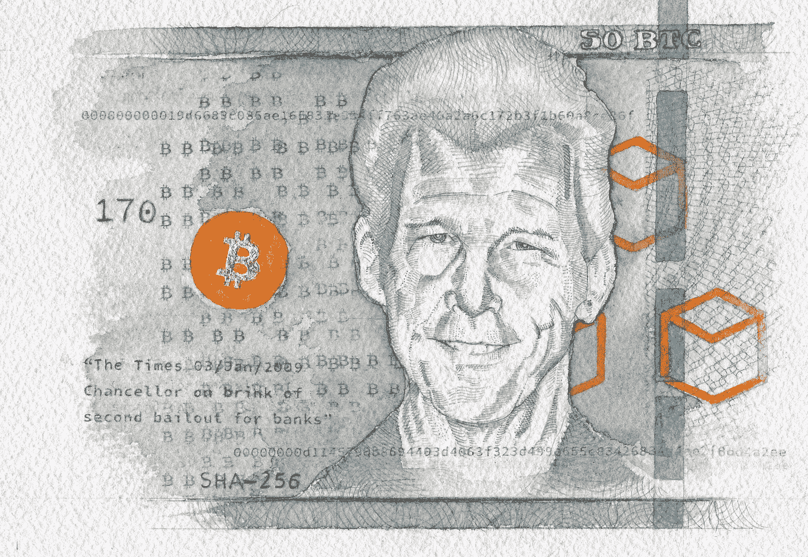
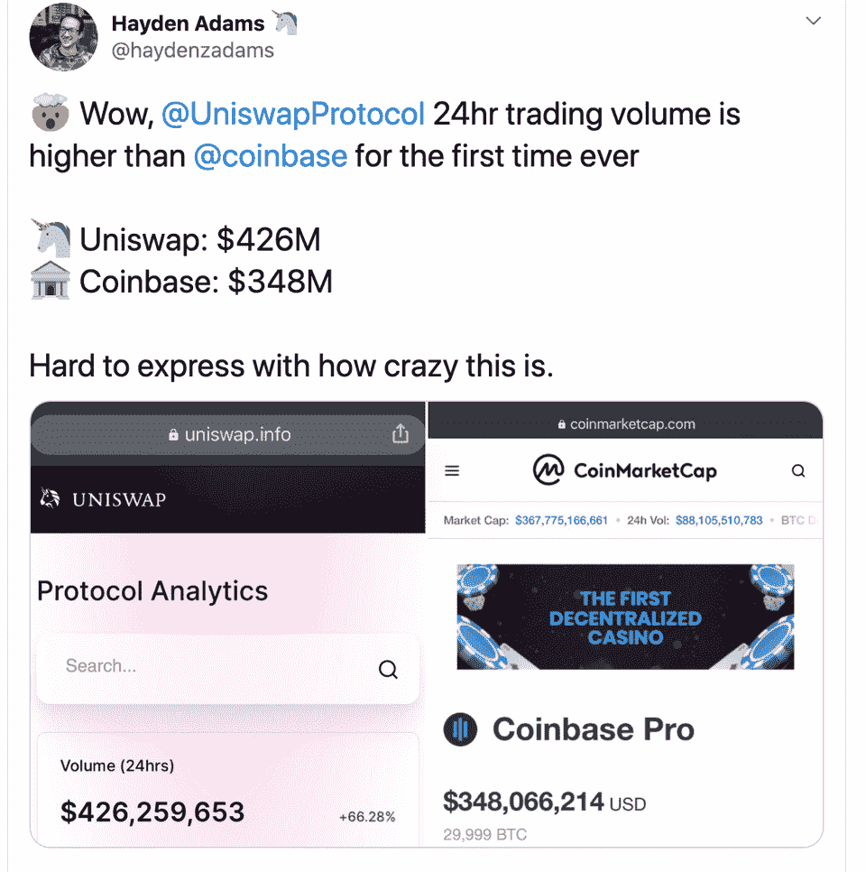

# 50 万美元的比特币/以太坊是一片黑暗的森林

> 原文：<https://medium.com/coinmonks/the-case-for-500k-bitcoin-ethereum-is-a-dark-forest-90d279c4f15a?source=collection_archive---------2----------------------->

## ETC 第三次受到攻击/ ConsenSys 获得法定人数

哈尔·芬尼因肌萎缩性脊髓侧索硬化症(ALS)去世已经六年了。[阅读](https://bitcoinmagazine.com/articles/the-genesis-files-how-hal-finneys-quest-for-digital-cash-led-to-rpow-and-more)哈尔对加密技术、数字现金、隐私和比特币贡献的不懈追求。

## 试试 [Bitsgap](https://bitsgap.com/?ref=2cb1231&utm_source=coinmonks&utm_medum=blog&utm_campaign=coinmonks_newsletter)

寻找简单的易于使用的加密交易机器人？试试 Bitsgap。

[Bitsgap](https://bitsgap.com/?ref=2cb1231&utm_source=coinmonks&utm_medum=blog&utm_campaign=coinmonks_newsletter) 是一个非常棒的平台，提供简单的交易机器人、信号、套利机会和强大的交易终端。

## 最新消息📰

*   ETC 遭遇[一个月内第三次 51%](https://www.coindesk.com/ethereum-classic-blockchain-subject-to-yet-another-51-attack) 攻击
*   LINE [在日本推出](https://www.coindesk.com/line-launches-digital-asset-wallet-and-blockchain-development-platform)数字资产钱包
*   美联储主席杰罗姆·鲍威尔宣布了控制通货膨胀的新措施
*   FTX [以 1.5 亿美元收购](https://www.theblockcrypto.com/post/75965/ftx-blockfolio-crypto-app-acquisition) Blockfolio
*   根据美国国税局(IRS)的规定，价值低于 1 美元的微交易属于应税事件
*   50 万美元比特币的[案](https://winklevosscapital.com/the-case-for-500k-bitcoin/)
*   Uniswap 的一个分支 SushiSwap 刚刚跨越了 10 亿美元的总价值，并在 FTX 上市(然而，这可能是对 T21 轻松赚钱的追求)
*   [bZx 在攻击后重新启动](https://tokentuesdays.substack.com/p/the-rebirth-of-bzx-protocol)，重点关注安全性
*   ConsenSys [收购](https://twitter.com/Consensys/status/1298248994515189761)摩根大通的法定人数([播客](https://www.youtube.com/watch?v=KqHsYnWpMxk)
*   有人因为电子钱包的恶意软件版本丢失了 [1400 BTC](https://twitter.com/verretor/status/1299920970011029505)
*   高产农业是不可持续的
*   韩国主要加密交易所[在 99%的交易量涉嫌造假后查封](https://www.zerohedge.com/markets/major-korean-crypto-exchange-seized-after-99-trading-volume-allegedly-faked)

## 模因

*   [Ethheads](https://twitter.com/coinsmash_/status/1299915475858657280)
*   如何成为霍德林的[大师](https://www.reddit.com/r/Bitcoin/comments/ii3c3o/how_to_become_master_of_hodling/)！！
*   欣快感[解释了](https://www.reddit.com/r/Bitcoin/comments/iizwpg/euphoria_explains_bitcoin/)比特币
*   比特币正处于泡沫之中，但并不像你想象的那样
*   我偶尔会睡觉
*   比特币的八大[定律](https://www.reddit.com/r/Bitcoin/comments/igxcli/the_8_laws_of_bitcoin/)
*   虽然我是新来的

## 播客💽

*   Saifedean 的[比特币标准](https://saifedean.com/podcast/)播客
*   投资于 DeFi 范式

## 好的读物📑

*   以太坊是一片[黑暗森林](/@danrobinson/ethereum-is-a-dark-forest-ecc5f0505dff)
*   比特币对所有人来说都是一种货币
*   在 [Shitcoins](https://blog.lopp.net/shitcoins-stos/) 和 STOs 上
*   哈尔·芬尼对数字现金的追求如何引领 RPOW
*   [之路](https://twitter.com/TechemyCapital/status/1299126257167204353)以 5 万亿美元锁定
*   解开 Uniswap:网上做市的[未来](/dragonfly-research/unbundling-uniswap-the-future-of-on-chain-market-making-1c7d6948d570)
*   DeFi 不需要进入主流
*   以太坊[费用市场](/@pintail/ethereum-fee-market-reform-eip-1559-as-a-question-of-fairness-567c52dac017)改革:作为公平问题的 EIP-1559
*   在侵入性的、隐秘的 [Bossware](https://www.eff.org/deeplinks/2020/06/inside-invasive-secretive-bossware-tracking-workers) 内部跟踪工人

## 开发商

*   [坚实度教程](/coinmonks/solidity-tutorial-all-about-mappings-29a12269ee14):关于映射的所有内容
*   路由多交易 CoinSwap 的详细[协议设计](https://lists.linuxfoundation.org/pipermail/bitcoin-dev/2020-August/018080.html)
*   zkSNARKS 和[密码](https://blog.coinbase.com/zksnarks-and-cryptographic-accumulators-f840da0b61c6)累加器
*   一个生产级平台，用于[为一般计算生成 STARK 证明](/@StarkWare/hello-cairo-3cb43b13b209)。
*   指南:成为 Eth2 测试网的验证者
*   无状态的科技树
*   以太坊[费用市场](/@pintail/ethereum-fee-market-reform-eip-1559-as-a-question-of-fairness-567c52dac017)改革:作为公平问题的 EIP-1559
*   用于管理 Eth 2 中常见任务的命令行工具
*   智能合同[编排](/coinmonks/smart-contract-orchestration-patterns-b9043b7c27c4)模式
*   以太坊[原语](/coinmonks/ethereum-primitives-1-2-e7ce0fa0a84c) #1.2

## 产品评论

*   Mudrex Invest——投资密码的简单方法
*   [quad ency Review](https://blog.coincodecap.com/quadency-review-a-crypto-trading-automation-platform)——专为专业人士打造的加密交易机器人
*   [Botsfolio 评论](https://blog.coincodecap.com/botsfolio-review-automate-crypto-investment)——让您的加密投资自动化的简单方法
*   Napbots 审查——增加加密回报的简单方法
*   [Shrimpy 评论](https://blog.coincodecap.com/shrimpy-crypto-trading-bot-review) —社交投资组合管理的加密交易机器人
*   你需要知道的 2020 年前 5 大[加密贷款平台](https://blog.coincodecap.com/top-5-crypto-lending-platforms)
*   [2020 年最佳加密交易机器人](/coinmonks/whats-the-best-crypto-trading-bot-in-2020-top-8-bitcoin-trading-bot-c16adeb13317)

想让我们展示你的产品吗？请在 [Twitter @coinmonks](https://twitter.com/coinmonks) 上联系我们

## 多方面的

*   [DeFi 安全](https://defisafety.com/)
*   [寻找比特币](https://rosenbaum.se/book/grokking-bitcoin-4.html) —一本比特币的书

*   [DefiDollar](/defidollar/defidollar-is-live-b8d9cbc08b88) 直播！
*   [好重影](https://goodghosting.com/) — DeFi 保存 app
*   分散式 [P2P 文件共享](/@Upfiring/the-upfiring-dapp-full-scale-project-launch-upfiring-1-2-2-55d3c8317818)
*   如何在两周内赚到 230 万美元
*   使用 Zapper 来[节省](https://defitutorials.substack.com/p/using-zapper-to-save-time-and-gas) &气体进入 yVaults 的时间

## 照片说明了一切📷

## 在 Coinmonks 上发布

如果你喜欢在 crypto/区块链空间上写教育文章，并且想在 Coinmonks 出版物上发表。只需在***【gaurav@coincodecap.com】****或者 DM 我**[***推特***](https://twitter.com/coinmonks)*

> **“如果你喜欢读***[*你也可以捐我们*](/coinmonks/monks-need-your-help-7440418d67ec) *。****

> ***[*在您的收件箱中直接获得最佳软件交易*](https://coincodecap.com/?utm_source=coinmonks)***

******