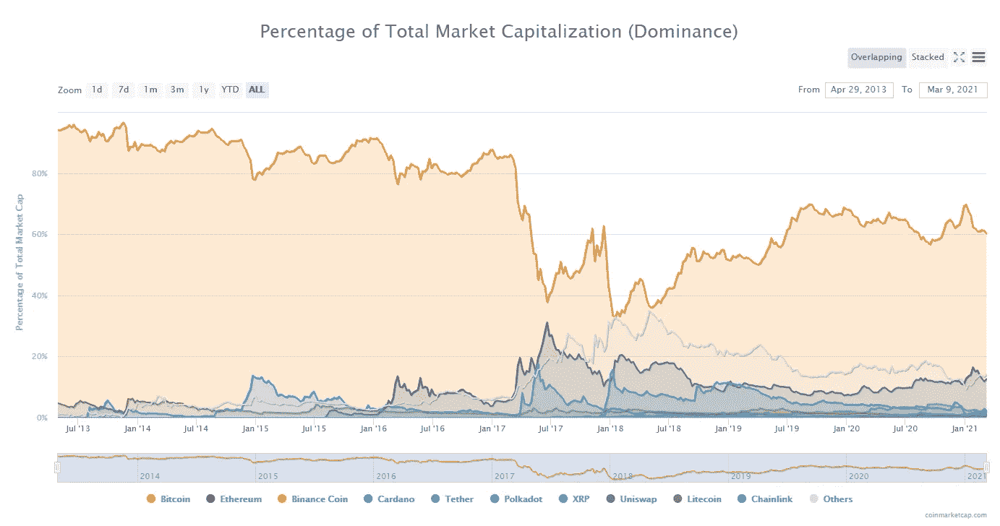

# 比特币最大化的理由

> 原文：<https://medium.com/coinmonks/the-case-for-bitcoin-maximalism-78c8d0c7b369?source=collection_archive---------3----------------------->

## 看看比特币是唯一重要的加密货币这一最有效的论点。

Photo by [Dmitry Demidko](https://unsplash.com/@wildbook?utm_source=medium&utm_medium=referral) on [Unsplash](https://unsplash.com?utm_source=medium&utm_medium=referral)

那些认为自己是“比特币最大主义者”的人和那些认为其他加密货币有价值的人之间一直存在一些冲突。前者认为所有其他加密货币都没有价值，比特币是唯一重要的货币。后者声称比特币老、慢、贵；其他东西将会——或者甚至*应该—* 取代它。

当然，这两种观点之间也有很多中间地带，但是浏览比特币和加密货币 Twitter 很快就会让你暴露在这些更极端的一边。

我花了很多时间思考双方的立场，并试图合理解释不同的观点。在这一章中，我想从“比特币最大化主义者”的角度探讨我认为最有效的三个论点，并试图总结比特币成为唯一重要的*货币背后的思想。*

## 分配

*比特币是唯一一种真正“自然”分布的数字资产。*

真正不可复制的[比特币](https://blog.coincodecap.com/a-candid-explanation-of-bitcoin)的一个极其独特的属性是流通中代币的初始分配。对于这一点，人们通常会谈论如何没有预矿，以及 Satoshi 在网络上线前 2 个月宣布了比特币——这两者都是相关且重要的，但最终这些因素也很容易被更新的加密货币项目重复。

比特币真正不可复制的一面是，在其存在的头一年半里，它没有任何价值。作为其诞生之初的第一个同类产品，并且还没有受到关注，这意味着它没有在任何交易所交易。事实上，甚至没有任何交易所有能力这样做。同样，没有人用它来购买商品或服务，因此*没有人能对这种神奇的互联网货币进行估价。这意味着比特币在那些对其感兴趣的人之间自由流通——崇拜非国家货币的密码朋克、认识到该系统天才的技术极客，以及(非常)早期采用者，他们没有立即放弃这个想法。*

这意味着比特币没有立即被鲸鱼、对冲基金和机构收购——在这个人人都在寻找下一个比特币的世界里，这是一个不可复制的壮举。新的加密货币在便宜的时候被收购，希望复制比特币早期的非凡投资机会，因此不会实现比特币那样的公平分配。

没有什么能够复制比特币真正自然的形成和流通。

## 安全性

*加密货币并不都是生而平等的——股权证明币也不像比特币那样一成不变。*

这是我认为容易忘记的一点。人们很容易被最新最伟大的技术所吸引，这些技术声称可以解决比特币的问题——提高每秒交易量，取消交易费用，或在基础层实现更复杂的功能。然而，所有这些都是有代价的，而这种代价往往以安全性、不变性和去中心化的形式出现；比特币的三大支柱。

这方面的一个例子是股权证明，它通常被称为比特币网络工作证明能源成本的“解决方案”。然而，他们通常没有提到，它极大地改变了链的不变性，因为重写交易历史不涉及外部成本。另一个示例是通过增加块大小或块时间来提高基础层吞吐量，这两种方法都会随着区块链大小的增加和节点运行成本的增加而降低分散性。

即使另一种硬币推出，而*确实*似乎在比特币的某些方面有所改进，并且理论上没有与之相关的权衡——在这种情况下，比特币已经领先围绕它形成的*信任*12 年。最终，任何新的加密货币都需要证明自己，这只能通过多年的战斗测试和大量资金的赌注来完成。在这方面，没有什么能够赶上比特币，除非比特币突然出现了严重的技术问题。

简单来说；没有其他加密货币能够同时满足这三个支柱，并在相同程度上经受住时间的考验，这导致了对系统整体安全性的高度信任。这并不是说其他加密货币项目中没有任何有用的创新，或者这些其他硬币不会有自己的用途，不会以自己的方式取得成功——但重要的是要记住比特币的闪光点。

## 网络效应

比特币目前占所有加密货币(有数千种)市值的 60%。如果我们只与其他试图成为货币的加密货币进行比较(相对于智能合约等更花哨的应用)，这个比例会更高。

A chart showing the “Bitcoin dominance” from the percentage of total market capitalisation from Coinmarketcap.com

事实上，即使经过 10 多年的替代硬币，这种主导地位仍然如此之高，这表明比特币的网络效应有多大。

然后，你必须考虑今天基于比特币的企业、应用和基础设施的数量。只要看看 [Strike](https://beta.strike.me/) 、 [Bottlepay](https://bottlepay.com/) 、 [Moon](https://paywithmoon.com/) 以及无数其他建立在 Lightning 网络之上的应用程序就知道了。

## 那又怎样？

当你还考虑到成吨的其他加密货币项目充满了骗局，预地雷和隐藏的中央集权，并记住我上面提到的事情；很容易理解为什么人们可能会选择简单地忽略除比特币之外的一切。

从一个只对替换/对冲国家发行的货币感兴趣的人的角度来看，这些问题非常重要。比特币*必须*高度安全、不可改变和去中心化，才能成为不可信的*全球货币/资产，*并且需要尽可能自然地分配。比特币已经解决了这个问题，坦率地说，已经赢了。

然而，我确实认为加密货币领域的其他创新仍然值得关注。过于狭隘的观点会损害其他去中心化的无信任系统在其他领域可能实现的巨大潜力，这些系统不一定从一开始就想与比特币直接竞争。

比特币接受新功能的速度很慢，这是理所当然的——这对全球硬货币资产很重要。但这意味着创新被推到边缘，被迫进入新项目——其中一些向上进入建立在比特币之上的层，一些则完全转向其他加密货币。当然，这些其他项目有比特币没有的问题，但可能从毛坯中出来的钻石可能会彻底改变一些我们甚至还没有考虑到的事情。

只是一定要记住:这些项目**是**在某处进行权衡。确保你知道它们是什么- *并考虑它们是否真的值得。*

> 加入 T21 电报集团，学习加密交易和投资

## 另外，阅读

*   最好的[密码交易机器人](/coinmonks/crypto-trading-bot-c2ffce8acb2a)
*   [印度比特币交易所](/coinmonks/bitcoin-exchange-in-india-7f1fe79715c9)
*   [比特币储蓄账户](/coinmonks/bitcoin-savings-account-e65b13f92451)
*   最好的[加密税务软件](/coinmonks/best-crypto-tax-tool-for-my-money-72d4b430816b)
*   [电网交易](https://blog.coincodecap.com/grid-trading)
*   [最佳密码交易所](/coinmonks/crypto-exchange-dd2f9d6f3769)