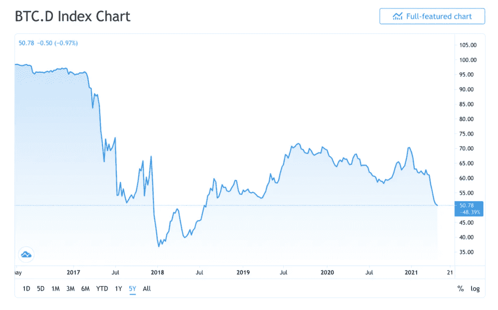
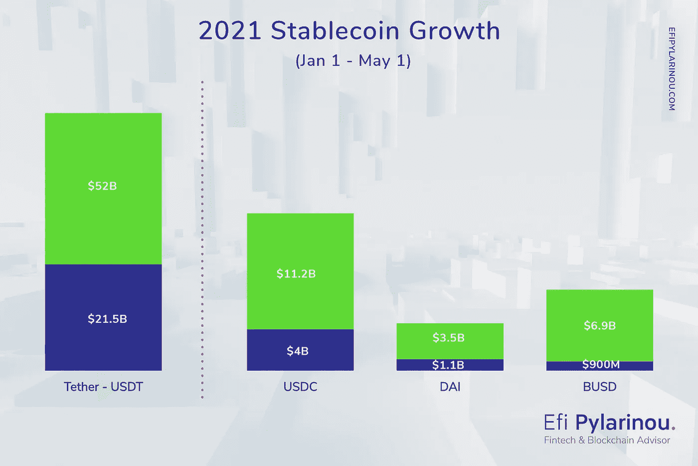
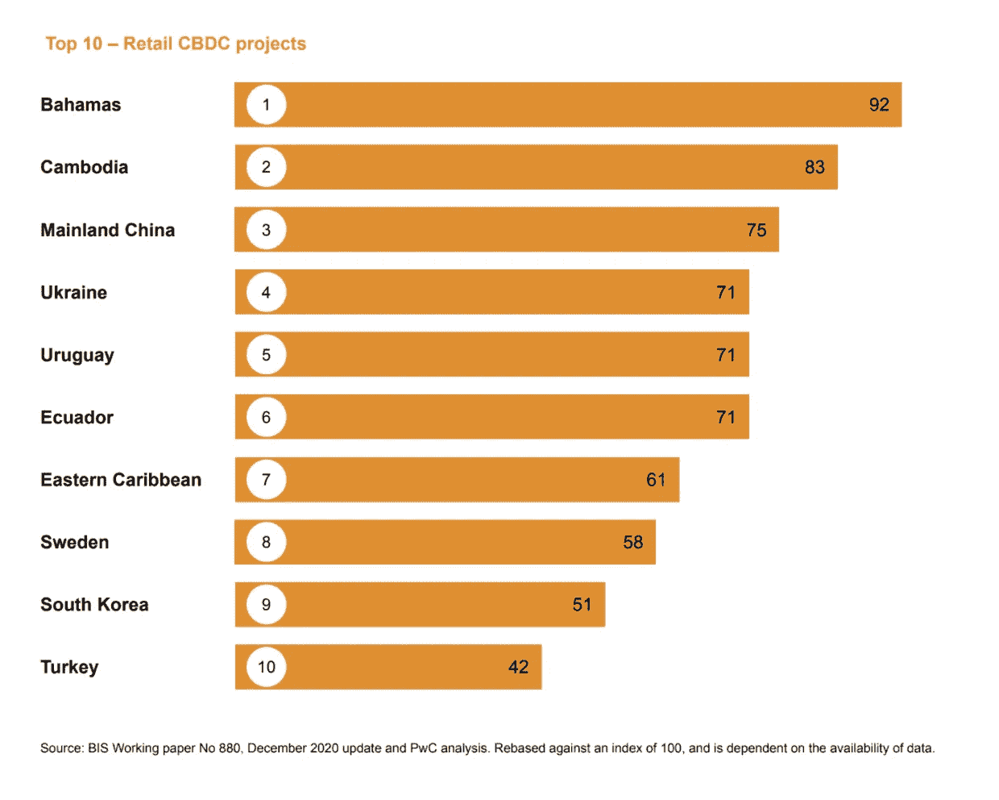
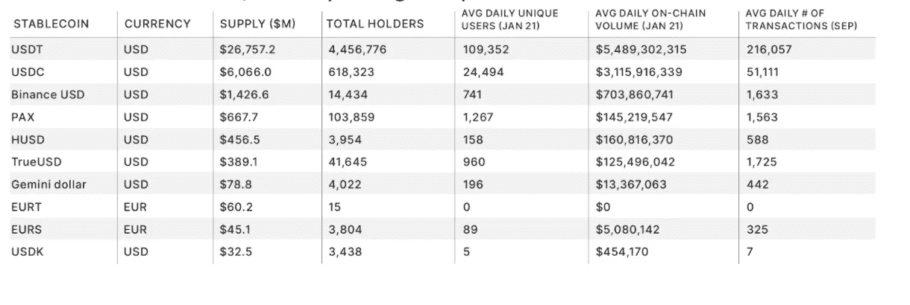

# 系绳翻转的情况

> 原文：<https://medium.com/coinmonks/the-case-of-a-tether-flippening-9ec3e588332a?source=collection_archive---------3----------------------->

Tether 一直保持着稳定的优势，与第二名和第三名保持着安全的距离。

*伊索寓言中的系绳是兔子，但是会有乌龟吗，为什么？*

传统上，市场成熟度是通过几种方式来衡量的。在股票和固定收益领域，我们关注各种金融工具或子行业、它们的流动性、新上市公司和一些增长指标。

截至 2017 年，加密货币的新兴资产类别由比特币主导，其市值自诞生以来约为 98%。工作共识证明和可开采加密货币在资产类别中也占主导地位。在不受监管的加密交易所上市的大多是比特币面值的股票。将比特币存放在交易所是加密货币市场的主要交易方式。

2017 年和 2018 年是加密货币市场的主要拐点。2017 年年中，世界注意到 ICO 资金首次超过早期风险投资资金。ICO 狂潮给市场带来了成千上万的新硬币。

尽管最终失败率通常很高，但这种失控的实验给这一资产类别增加了各种硬币。不可挖掘的硬币，新共识机制的硬币，空投，硬币燃烧和各种稳定硬币。

截至 2017 年底，硬币数量超过了 1000 枚，此后一直在上升。今天，Coinmarketcap 报告了接近 9，500 枚硬币，这意味着我们即将达到 10，000 枚，比 4 年前增加了 10 倍。

比特币市值主导地位的新常态变得更接近 75%。

随着 2018 年的开始，在壮观的市场调整期间(在达到约 2 万美元的 ATH 后，比特币在 15 个月内跌至 4 千美元，然后回升)，比特币的市值优势在 2018 年初首次达到 50%及以下的水平。随着比特币拒绝了最近 64k 美元的 ATH，跌至 50k 美元以下，我们目前正在重新审视这些主导水平。

另一个较少被提及的加密货币市场的结构性变化是 onramps 向加密交易所的转变。在 2018 年之前，进入不受监管的交易所主要是通过比特币，对于极少数受监管的交易所来说，是通过美元。2014 年与以太坊一起推出的与美元挂钩的 stablecoin 仅占加密货币交易所加密对的 5%。当中国的禁令生效时，随着密码交易的起伏，对系绳的需求大幅增长。

快进到今天，以比特币计价的货币对仅占交易量的 10%，低于 2017 年的 50%。Tether 显然是占主导地位的单位，据主要的加密交易所报告，它占交易所交易量的 60%。

稳定币增长的年份是 2020 年，因为稳定币市值增长迅速，稳定币品种急剧增加。

stablecoin 市场一直是加密交易所的主力，但也是一些 DeFi 应用的支柱。

几个醒目的数字，讲故事。

当我们进入 2021 年时，Tether 的市值为 215 亿美元，目前已经翻了一倍多，达到 52 亿美元，尽管面临所有法律问题和纽约司法部长的禁止。按市值计算，Tether 是最主要的稳定收入来源，目前约占 85%。其他增长最快的稳定货币是 USDC，另一种盯住美元的货币，从 40 亿加元增长到 2021 年的 112 亿加元；戴:马可道算法美元稳定币，今年从 11 亿美元涨到 35 亿美元；新加入的币安美元稳定币今年开始时价值约 9 亿美元，现在价值 69 亿美元

Stablecoins 将继续存在，OCC 对 stable coins 的监管批准意义重大，这一点我怎么强调都不为过。今年 1 月，美国 OCC 授权银行使用区块链和稳定币进行支付。VISA 与 Anchorage Bank(受监管的加密金融提供商之一)合作，正在为任何银行或金融机构构建能够处理加密交易的 API 产品。Circle 是受监管的 USDC 稳定币的美国发行商， *[1]* 推出了各种服务，使企业能够使用稳定币进行跨境支付和汇款。日本蓝筹股 GMO Internet 刚刚发行了两种 stablecoin，即与日元挂钩的 stablecoin (GYEN)和与美元挂钩的 stablecoin (ZUSD ),他们计划在他们的全球生态系统(约有 100 家企业)中使用这两种货币进行支付。

CBDCs 是另一种新兴的 stablecoins，它将改变 stablecoins 的现状，挑战系绳的统治地位。

目前的 CBD 的市值可以忽略不计，因为真正存在的只有巴哈马的 Sand Dollar、柬埔寨的 Bakong 和加勒比海的 DCash。中国的 DCEP 正处于试点阶段，但还有如此多的其他项目正在筹备中，这只是一个转折点发生的时间问题。

虽然以太坊加密朋克创造了“Flippening”作为以太坊市值超过比特币的主导事件，但我们应该看看当 Tether 失去主导地位时 stablecoins 的类似事件。当 stablecoin 的用例从仅仅是一个加密交易使能器扩展到渗透到支付系统时，这将会发生。这将很可能从使用私人 stablecoins 进行跨境支付开始(如 GMO Internet 正在计划的例子)，为中小企业建立什么样的 Circle，以及 DIEM 与其合作伙伴网络正在建立什么样的 Circle。关于 Stablecoins 的出色而全面的 [Block 研究报告](https://www.theblockcrypto.com/post/97769/stablecoins-bridging-the-network-gap-between-traditional-money-and-digital-value-brought-to-you-by-gmo-trust)还提到，Paypal 可能会与 Paxos 合作推出 stablecoin，这显然会改变外汇市场小额支付的游戏规则(PayPal 上的平均交易金额为 60 美元)。

当前的市场动态将比特币置于 50%(历史低位)的主导地位，以太置于 14.5%(历史高位)，而在稳定的比特币市场中，系绳处于 85%(历史高位)。

随着基于开源网络的私有 stablecoins 进入支付 3.0 市场，以及 CDBC 市场的增长，Tether 的主导地位面临风险。

普华永道最近的第一份报告“T2 全球 CBDC 指数”追踪了十大零售商业中心和十大批发商业中心的成熟度。

关于 Stablecoins 的 [Block 研究报告](https://www.theblockcrypto.com/post/97769/stablecoins-bridging-the-network-gap-between-traditional-money-and-digital-value-brought-to-you-by-gmo-trust)展示了 11 家市值已经超过 1000 万美元的 stablecoins(截至 2021 年 1 月的数据)。其中，只有泰瑟和 USDC 拥有超过 10，000 的日均独立用户。

stablecoin 市场已经准备好爆发，并向世界证明下一个适合市场的产品，超越加密交易。

不可否认，在目前的条件下，任何一家 CBDC 公司想要一路走到加密交易所，成为一个入口似乎都是遥不可及的。

然而，想想交易所之外基于 stablecoin 的支付，VISA crypto API 帮助银行在这个市场定位自己，Paypal 和 Square。

因为泰瑟似乎不是这个机会的竞争者。问题是目前的领跑者(Circle 和 Paxos)是否会主导稳定的硬币支付领域？

USDC 和 VISA 同流合污，Paxos 和 Paypal 同流合污。

Stripe 在 2018 年宣布了与 Circle 的早期合作，但此后没有任何进展。当我看着 Circle 套件提供的钱包、市场和商业账户 APIs 我感觉这个圆圈是 Web3.0 世界中数字支付领域的条纹。

Square 的 Cash App 围绕 stablecoins 一直保持沉默，但我无法想象没有什么在酝酿。

比赛正在进行，目前菲亚特支持的五大稳定品牌的格局可能很快就会改变，更重要的是，将有更多数量可观的私人稳定品牌。

底线是，一旦 stablecoins 超越了加密交易的界限，进入支付系统，那么 Tether 的统治地位将急剧下降。

现有的 stablecoin 是否能够在即将到来的 stable coin 支付的可扩展用例中占据主导地位，在很大程度上取决于 CBDCs 和监管区块周围的地缘政治。

稳定的货币格局是动态的，将会发生变化。

> 系绳仍然是兔子，但谁是乌龟或海龟。是被嘲笑的天秤座，更名为 DIEM 吗？它是一个甚至还没有诞生的私有 stablecoin 还是一个已经在纸上的 CBDCs？

*[1]USDC 是在美国的资金转移法律下运作的。*

📌推特:【https://twitter.com/efipm 

📌订阅我的 YouTube 频道，了解我的见解和行业领袖访谈。每周三新视频:【https://www.youtube.com/EfiPylarinou 

📌Spotify 播客。跟随这里:[https://open.spotify.com/show/5bRkZEYHSwPiGx7vTqylw6?si=Mg3hN5PDQ86K10GjeK52jw](https://open.spotify.com/show/5bRkZEYHSwPiGx7vTqylw6?si=Mg3hN5PDQ86K10GjeK52jw)

📌领英:[https://www.linkedin.com/in/efipylarinou/](https://www.linkedin.com/in/efipylarinou/)

📌网页:[https://efipylarinou.com/](https://efipylarinou.com/)