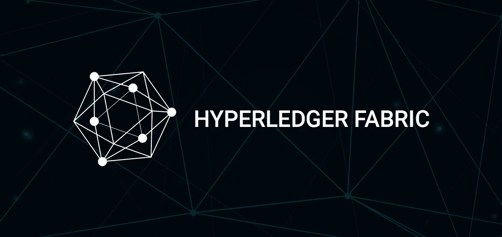
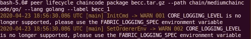
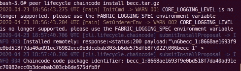
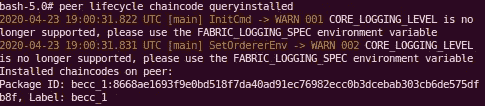
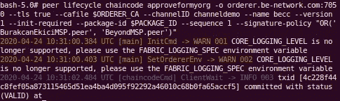
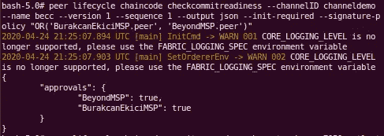
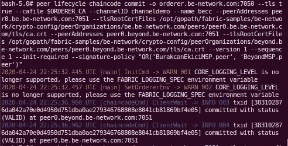

# Hyperledger Fabric v2 上的链码生命周期

> 原文：<https://medium.com/coinmonks/the-chaincode-lifecycle-on-hyperledger-fabric-v2-72dffb7acf30?source=collection_archive---------1----------------------->



在这个故事中，我们将研究链码流程是如何操作的。我们可以通过创建一个新通道并将通道功能设置为 v2 来使用结构链码生命周期。必须使用新的链码生命周期，而不是旧的生命周期，例如安装、实例化或更新链码。启用 v2 功能后，我们可以像在 1.4 版中一样使用链代码调用

> 在 [Hyperledger Fabric 文档](https://hyperledger-fabric.readthedocs.io/en/release-2.0/test_network.html)中，它说“当网络成员想要转移或更改分类帐上的资产时，会调用链码。”

根据[文档](https://hyperledger-fabric.readthedocs.io/en/release-2.0/chaincode_lifecycle.html#what-is-chaincode)，结构链码生命周期要求组织同意定义链码的参数，如名称、版本和链码认可政策。渠道成员通过以下四个步骤达成一致(并非渠道中的每个组织都需要完成每个步骤)。我检查了名为`be-network`的自定义网络上的所有步骤，有两个对等点分别为`peer0.be.be-network.com`和`peer0.beyond.be-network.com`，因此我们将检查以下步骤的命令会根据这种情况进行修改。

> 我们将使用带有几个子命令的`peer lifecycle chaincode`命令。这些子命令接受几个标志和参数。如果需要，您可以使用其他想要的标志。您可以在这里找到[中的旗帜详情。](https://hyperledger-fabric.readthedocs.io/en/release-2.0/commands/peerlifecycle.html#peer-lifecycle-chaincode-querycommitted)

在我们检查这些步骤之前，您必须知道您是通过进入 CLI 容器来执行这些操作的。我们使用`-e`添加每个组织的环境变量，我们通过下面的命令；

```
docker exec -e "CORE_PEER_LOCALMSPID=BurakcanEkiciMSP" -e "CORE_PEER_TLS_ROOTCERT_FILE=/opt/gopath/fabric-samples/be-network/crypto-config/peerOrganizations/be.be-network.com/peers/peer0.be.be-network.com/tls/ca.crt" -e "[CORE_PEER_MSPCONFIGPATH=/opt/gopath/fabric-samples/be-network/crypto-config/peerOrganizations/be.be-network.com/users/Admin@be.be-network.com](mailto:CORE_PEER_MSPCONFIGPATH=/opt/gopath/fabric-samples/be-network/crypto-config/peerOrganizations/be.be-network.com/users/Admin@be.be-network.com)/msp" -e "CORE_PEER_ADDRESS=peer0.be.be-network.com:7051" -it cli bash
```

> 此外，在另一个终端中，我们可以通过根据我们需要的组织更改环境变量来进入其他组织的 CLI 容器。

```
docker exec -e "CORE_PEER_LOCALMSPID=BeyondMSP" -e "CORE_PEER_TLS_ROOTCERT_FILE=/opt/gopath/fabric-samples/be-network/crypto-config/peerOrganizations/beyond.be-network.com/peers/peer0.beyond.be-network.com/tls/ca.crt" -e "[CORE_PEER_MSPCONFIGPATH=/opt/gopath/fabric-samples/be-network/crypto-config/peerOrganizations/beyond.be-network.com/users/Admin@beyond.be-network.com](mailto:CORE_PEER_MSPCONFIGPATH=/opt/gopath/fabric-samples/be-network/crypto-config/peerOrganizations/beyond.be-network.com/users/Admin@beyond.be-network.com)/msp" -e "CORE_PEER_ADDRESS=peer0.beyond.be-network.com:7051" -it cli bash
```

如果成功，我们必须看到以下内容:

```
bash**-**5.0*#*
```

那么步骤是什么(我提到了文档中每个步骤的定义)；

# 步骤 1:打包链码

*这一步可以由一个组织完成。*在安装每个对等体之前，需要对链码进行打包。我们使用`peer lifecycle chaincode package`命令。它将由`peer0.be.be-network.com` 对等体执行。

```
peer lifecycle chaincode package <PACKAGE_NAME> **--**path <PATH> **--**lang <LANG> **--**label <LABEL>
```

在这里；

*   `PACKAGE_NAME`必须是一个 tar 文件，所以它必须以`tar.gz`文件扩展名结尾= >我命名为*becc.tar.gz*
*   `PATH`指的是链码路径，必须位于 */opt/gopath/src/* 目录下因为我们进入了 CLI 容器= >我在*/opt/gopath/src/chain/mediumchaincode/go/*目录下创建了我的链码，并且只写了*chain/mediumchaincode/go/*部分因为我的链码是由 go 编写的，我们没有使用*/opt/opt*
*   `LANG`是指我们用来编写链码的语言= >我选择了 *golang*
*   `LABEL`可以是你想要的任何文本= >我标题为 *becc_1*



`peer lifecycle chaincode package`

# **第二步:在你的同伴上安装链码**

*每个使用链码背书交易或查询分类账的组织都需要完成这一步。*我们按顺序使用`peer lifecycle chaincode install`和`peer lifecycle chaincode queryinstall`命令。它们将由`peer0.be.be-network.com`和`peer0.beyond.be-network.com`同行执行。

```
peer lifecycle chaincode install <PACKAGE_NAME>
```

在这里；

*   必须与我们在上一步中给出的相同= >我命名为*becc.tar.gz*



`peer lifecycle chaincode install`

```
peer lifecycle chaincode queryinstalled
```

使用这个命令，我们批准了组织的链码定义，它生成了下一步需要的`PACKAGE_ID`。如下图所示。



the generated Package ID

# **步骤 3:批准贵组织的链码定义**

*每个使用链码的组织都需要完成这一步。在链码可以在渠道上开始之前，链码定义需要得到足够数量的组织的批准，以满足渠道的生命周期管理政策(默认为大多数)。*在为每个组织设置了`ORDERER_CA`和`PACKAGE_ID`变量后，我们使用`peer lifecycle chaincode approvemyorg`命令。它将由`peer0.be.be-network.com`和`peer0.beyond.be-network.com`同行执行。

```
export ORDERER_CA=/opt/gopath/src/github.com/hyperledger/fabric/peer/crypto/ordererOrganizations/example.com/orderers/orderer.example.com/msp/tlscacerts/tlsca.example.com-cert.pemexport PACKAGE_ID={Enter the package id that has been generated at previous step}peer lifecycle chaincode approveformyorg  -o orderer.be-network.com:7050 --tls --cafile $ORDERER_CA --channelID <CHANNEL_NAME> --name <CHAINCODE_NAME> --version <VERSION_TAG> --init-required --package-id $PACKAGE_ID --sequence 1 --signature-policy "OR('BurakcanEkiciMSP.peer', 'BeyondMSP.peer')"
```

在这里；

*   `CHANNEL_NAME`指我们创建的频道名称= > I 标题为 *channeldemo*
*   `CHAINCODE_NAME`指我们给的频道名= > I 标题为 *becc*
*   `VERSION_TAG`是指我们给的频道名称= > I 标题为 *1*
*   `--signature-policy`可以被网络中的组织改变(我们只有两个组织，分别是`BurakcanEkici`和`Beyond`

如果链码定义成功，您必须得到以下消息；



`peer lifecycle chaincode approvemyorg`

# **步骤 4:将链码定义提交给通道**

*一旦通道上所需数量的组织获得批准，提交事务需要由一个组织提交。提交者首先从已经批准的组织的足够多的同行收集认可，然后提交事务以提交链代码定义。在这一步中，我们使用了`peer lifecycle chaincode checkcommitreadness`和`peer lifecycle chaincode check`命令。它们将由`peer0.be.be-network.com`对等体执行。*

`peer lifecycle chaincode checkcommitreadness`命令不是必需的，但是我们需要检查我们是否为所有组织成功地定义了链码。

```
peer lifecycle chaincode checkcommitreadiness -o orderer.be-network.com:7050 --channelID <CHANNEL_NAME> --name <CHAINCODE_NAME> --version <VERSION_TAG> --tls --cafile $ORDERER_CA --init-required --sequence 1
```

在这里；

*   `CHANNEL_NAME`、`CHAINCODE_NAME`和`VERSION_TAG`必须与我们在前面步骤中所写的相同。

如果链码准备好提交，您必须得到以下消息。我们可以看到`BurakcanEkici`和`Beyond`已经准备好提交。



`peer lifecycle chaincode checkcommitreadness`

如果我们得到上面的消息，我们将执行`peer lifecycle chaincode check`命令。

```
peer lifecycle chaincode commit -o orderer.be-network.com:7050 ----channelID <CHANNEL_NAME> --name <CHAINCODE_NAME> --version <VERSION_TAG> --sequence 1 --init-required --tls --cafile $ORDERER_CA --peerAddresses <PEER_ADDRESS> --tlsRootCertFiles <TLS_ROOT_CERT_FILES>
```

在这里；

*   `CHANNEL_NAME`、`CHAINCODE_NAME`和`VERSION_TAG`必须与我们在前面步骤中所写的相同。
*   `PEER_ADDRESS`和`TLS_ROOT_CERT_FILES`是指对等地址和。我们将提交的每个对等体的 crt 文件路径，因此写入与我们的对等体数量一样多的`— peerAddress`和`— tlsRootCertFiles`。



`peer lifecycle chaincode check`

如果我们得到了上面的消息，一切正常。我们将能够查询或调用任何我们想要的对等体。

> [直接在您的收件箱中获得最佳软件交易](https://coincodecap.com/?utm_source=coinmonks)

[](https://coincodecap.com/?utm_source=coinmonks)