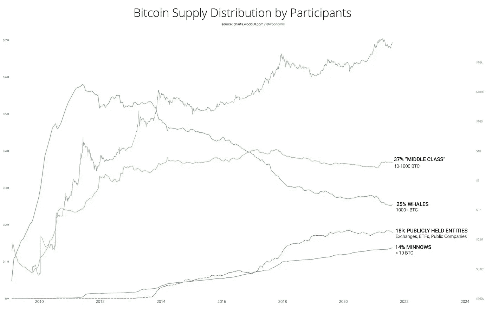
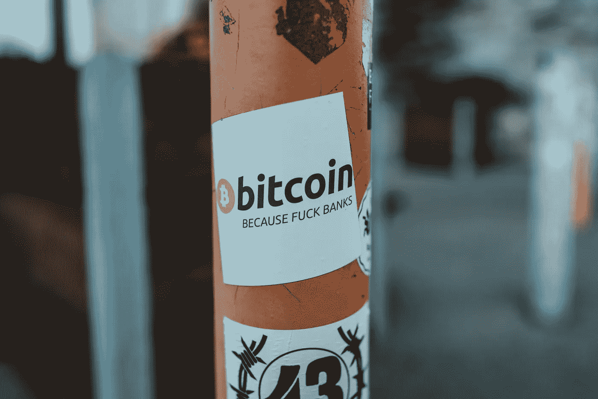
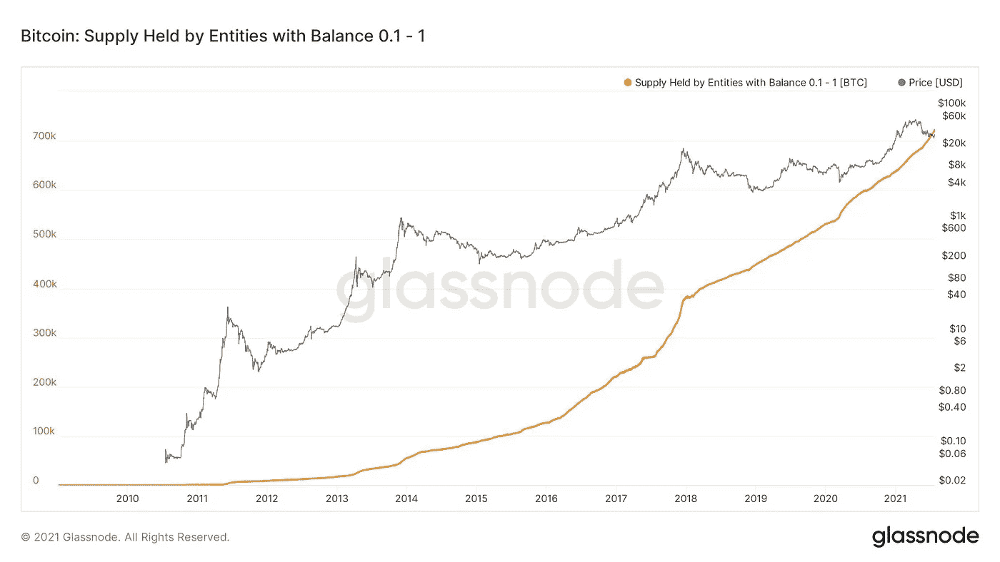

# 比特币持有者分布的变化——以及为什么它很重要

> 原文：<https://medium.com/coinmonks/the-changing-distribution-of-bitcoin-holders-and-why-it-is-important-1e18510ffb6?source=collection_archive---------7----------------------->

Bitcoin Whale -Photo by [Todd Cravens](https://unsplash.com/@toddcravens?utm_source=unsplash&utm_medium=referral&utm_content=creditCopyText) on [Unsplash](https://unsplash.com/s/photos/bitcoin-whale?utm_source=unsplash&utm_medium=referral&utm_content=creditCopyText)

## 比特币巨鲸

时常会有同类新闻故事重演，涉及一个早期比特币持有者，他用比特币购买了一些东西，比如披萨🤤，如果他们继续持有，现在将会值一大笔钱。这些故事凸显了比特币网络在其非常短的生命周期内所取得的成功，这导致了网络价值的显著增加。

对于那些很早就购买比特币，并成功持有的人来说，他们做得非常好，并发现生活正在改变财富。比特币在相对较短的时间内价格大幅上涨的问题是，它将网络的大量价值集中在一小部分持有人手中，[，俗称“鲸鱼”](https://www.investopedia.com/terms/b/bitcoin-whale.asp)。

随着比特币成为第一个真正去中心化和不可信的全球支付系统。像 2012 年那样，近 60%的比特币供应来自少数用户，确定性并不像 Satoshi 最初的愿景。比特币的价值高度集中于相对较少的用户，这也给比特币网络带来了自身的一系列问题。

当持有如此大估值的比特币时，鲸鱼能够相互勾结，通过[鲸墙、洗盘交易、停止狩猎等多种策略](https://www.linkedin.com/pulse/common-crypto-manipulation-techniques-nitin-kumar-/)操纵比特币价格，为自己谋利。以这种方式操纵市场导致了大量问题，如波动性增加，因此阻碍了公众对比特币和加密货币的整体看法。

Bitcoin Supply Distribution by Participants — Graph by [Willy Woo](https://twitter.com/woonomic/status/1425743947142373378/photo/1) via [Twitter](https://twitter.com/woonomic)

## 充满希望的趋势

自 2013 年以来，有一个持续的趋势，对比特币网络和比特币本身的概念都非常有利。鲸鱼拥有的比特币数量不断减少，而小鱼(BTC 不到 10 的人)和公共实体拥有的比特币数量不断增加。

因此，无论如何，比特币网络的价值正在从少数人手中转移到多数人手中。可以说，比特币本来就应该是这样的。

Bitcoin — Photo by [Claudio Schwarz](https://unsplash.com/@purzlbaum?utm_source=unsplash&utm_medium=referral&utm_content=creditCopyText) on [Unsplash](https://unsplash.com/s/photos/bitcoin-whale?utm_source=unsplash&utm_medium=referral&utm_content=creditCopyText)

## 跟随小鱼

在加密货币领域，机构投资者和大公司的到来吸引了媒体的大量关注。高调的首席执行官们已经开始公开支持比特币，并开始将其加入公司的金库。尽管这对比特币领域非常有利，因为它获得了商业领袖的认可，但关注小鱼小虾(持有< 10 BTC 的持有者)的购买行为要有趣得多。

Bitcoin Supply Distribution by Participants — Graph by Pi Prime Pi via [Twitter](https://twitter.com/PiPrimePi/status/1419402727537483778?_kx=dwX-ujOAs2lnDp4M6GVaaatbUGudwvgdXFokM87OmVutyBqD88P_LPIlRyL1J1Jb.KzLKES)

不管市场情绪或最近的价格走势如何，较小的小股东一直在稳步购买和积累比特币。随着我们看到加密货币在全球越来越广泛的采用，网络将变得越来越分散，网络的更多价值将传播给更多的人。参与比特币网络的人越多，这个网络就会变得越强大。

> 加入 [Coinmonks 电报频道](https://t.me/coincodecap)，了解加密交易和投资

 [## 最佳加密交易所| 2021 年十大加密货币交易所

### 加密货币交易所的加密交易需要了解市场，这可以帮助你获得利润…

blog.coincodecap.com](https://blog.coincodecap.com/crypto-exchange)  [## 2021 年 9 大最佳加密借贷平台

### 当谈到加密货币贷款时，大量因素等同于良好的收入状况。此外，借款的一部分…

blog.coincodecap.com](https://blog.coincodecap.com/crypto-lending)  [## 2021 年最佳加密交易机器人(免费和付费)

### 2021 年币安、比特币基地、库币和其他密码交易所的最佳密码交易机器人。四进制，位间隙…

medium.com](/coinmonks/crypto-trading-bot-c2ffce8acb2a)  [## 最佳 4 个加密交易信号电报通道

### 这是乏味的找到正确的加密交易信号提供商。因此，在本文中，我们将讨论最好的…

medium.com](/coinmonks/best-crypto-signals-telegram-5785cdbc4b2b)  [## BlockFi 评论 2021:利弊和利率

### 今天，我们提出了一个全面的 BlockFi 评论，这是一个成立于 2017 年的加密贷款平台，拥有其…

blog.coincodecap.com](https://blog.coincodecap.com/blockfi-review)