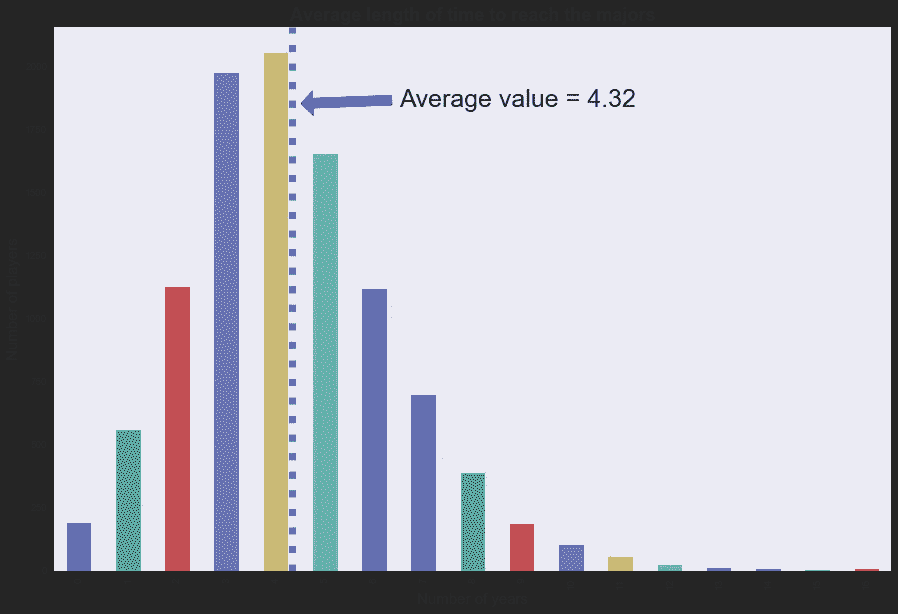
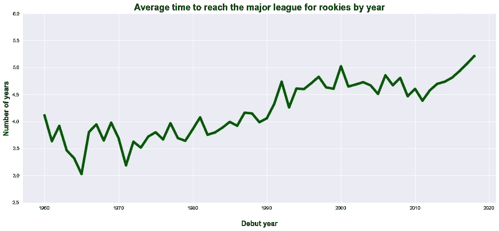
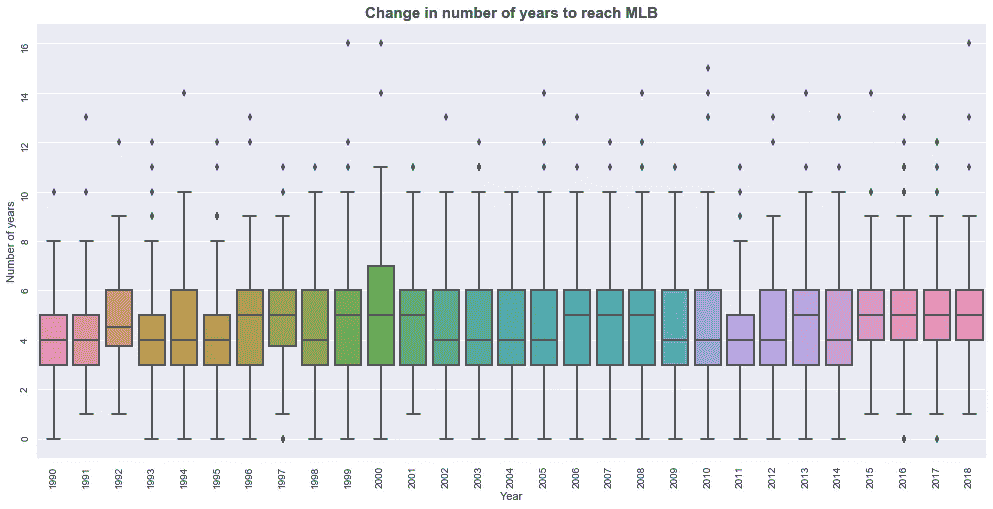
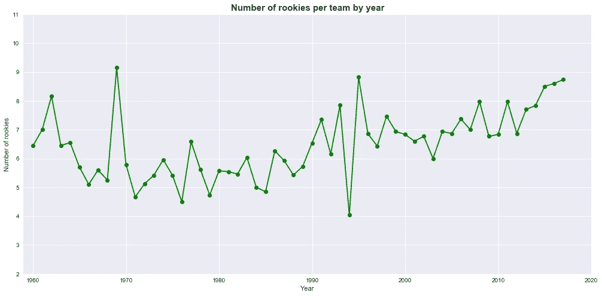
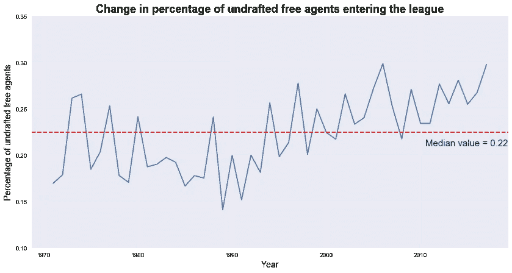

# MLB 新秀不断变化的面貌

> 原文：<https://medium.com/coinmonks/the-changing-look-of-mlb-rookies-ebbb650d7c01?source=collection_archive---------9----------------------->

一个(公认非常主观和不科学，但有趣的)衡量球员质量的方法是看进入联盟的球员的人口统计数据。下面，我们将看看与球员新秀年相关的各种统计数据(我们考虑的是他们在 MLB 首次亮相的那一年，不管他们参加了多少场比赛)。

一个很好的统计数据是球员在小联盟呆了多长时间。

(解释项目目标[的原帖在此](/coinmonks/is-the-quality-of-play-in-mlb-decreasing-ea0d69c09d17)，该帖的项目代码[在此](https://github.com/jordanbean/Project_Quality/blob/master/Project_Quality_Analysis.ipynb)。所有从 www.thebaseballcube.com[抓取的数据](http://www.thebaseballcube.com)和网页抓取代码[都在这里](https://github.com/jordanbean/Project_Quality/blob/master/player%20_scrape)。)

**域上下文**

为了理解为什么这是一个有意义的统计数据，我们将绕一小段路来理解美国职业棒球大联盟的阶段。与 NBA 不同，在 NBA 球员很大程度上直接从选秀进入联盟，MLB 有一个复杂的小联盟系统，在加入职业球队之前培养和准备球员。大联盟球队之前的步骤被称为“小联盟”。

小联盟由 A(“单 A”)、AA(“双 A”)、AAA(你现在已经知道模式了……)等联盟组成，AAA 最接近大联盟。在此期间，运动员接受各种教练针对其位置的指导教学。球队将他们的小联盟系统的质量视为未来成功的标志，也是通过对成熟的职业人才的有前途的交易来提高他们的职业球队的机会。

小联盟的职业生涯可以短到不到一年(很少)，也可以长到整个职业生涯。一段时间，但不要太长，在未成年人是公认的谨慎。从数据的变化中可以得出一些不同的解释。

在小联盟呆的时间越长，可能意味着队伍中的强手越来越少，因此他们需要更多的时间来发展，还没有“准备好进入大联盟”。或者，有些人可能会说一个菜鸟为联盟做了更多的准备，因为他们接受了更多的训练。

最终，解释是特定于玩家的，我们将探索价值是否在变化，以及它的趋势是什么。

**数据怎么说？**

在去除一些坏数据后，我们得到了以下到达专业的平均时间长度的图。不出所料，这些数据以 3-5 年为中心，具有长达 16 年的长尾效应。

虽然不寻常，但看到球员快速进入大联盟并不是闻所未闻的。他们可能是从另一个国家的职业联赛签来的，或者可能只是代表了精英中的精英。为了验证这一点，我们可以将他们的数据与整体玩家集进行比较。

表现出色的球员——那些在一年或更短时间内进入大联盟的球员——平均在第四轮被选中，而所有进入 MLB 的球员平均在第九轮被选中。在串联中，他们的平均投梭数为 92.6，而不是 258 ( *注:拔模轮数和投梭数的值越低越好*)。他们在大联盟的平均寿命为 7.62 年，而所有球员的平均寿命为 5.30 年。

**趋势是什么？**

合乎逻辑的下一步是了解这个数字如何随着时间的推移而变化。下图显示了从 1960 年到 2017 年进入联盟的新秀进入大联盟的平均时间(2018 年被排除在外，因为数据还不是最终的)。我们看到，自 2011 年以来，进入大满贯赛的时间稳步上升，目前对于 2017 年首次亮相的球员来说，达到历史最高水平超过 5 年。从 2010 年到 2017 年，进入大联盟的平均年限增加了 10%以上。

看待这些数据的另一种方式是它每年是如何分布的。为了不使图表过于混乱，我们将只过滤 1990 年至今的数据，因为这是与之前进行的天气分析相匹配的时间段。下面，我们可以看到价值分布在光谱的底端和顶端变得更紧密。此外，中值接近时间段的高端，并且在过去 4 年中保持一致。

一种可能的解释是，联盟中出现的超级巨星越来越少(不到一年进入联盟的“局外者”球员数量很少就证明了这一点)。此外，中值越高，这可能表明球员在进入联盟之前需要更多的发展。同样，有许多可能的解释，以上只是推测，但过去 3-4 年确实显示出与前 10 年不同的活动。

**每年新秀**

我们可以考虑的另一个衡量球场比赛质量的指标是每支球队的平均新秀数量，其理念是更有经验的球员将在球场上提供更好的比赛质量。从下面的图表中，我们可以看到数据中有很多噪音，因为每支球队的平均新秀数量从低到 4 到高到 9 不等。也就是说，看起来我们最近处于上升趋势。

我们可以关注的最后一个数据是联盟中未被选中的自由球员的比例是如何变化的。同样，这并不一定说明球员的质量(它可能更多地说明了球探的质量)，但仍然是一个值得一看的有趣图表。总体而言，我们认为趋势在 15%-30%之间移动，尽管随着时间的推移呈现出一定的上升趋势，目前的数字接近 2000 年代中期达到的历史最高水平。

结论:我们学到了什么？

查看图表和图形可以单独讲述一个有趣的故事，但良好的数据分析会将图表汇集成一个有凝聚力的故事。

对数据的一种解释是——缺少对球员个人的评论——进入联盟的球员类型是*不同的*。他们花更多的时间在小联盟(随后在更大的年龄进入大联盟)，平均职业生涯的长度呈温和下降趋势，因此平均每支球队的新秀数量在增加。最后，未选秀的自由球员在新秀中所占的比例呈上升趋势。

由于这项运动在过去十年中面临着兴趣的下降，很有可能在高中或高中以上历史上选择专注于棒球的运动员现在选择了篮球，足球，甚至足球。随着时间的推移，越来越多的“错过的球员”没有通过业余选秀和大学行列向上过滤，那些留下来的球员可能需要更多的时间来发展，以达到大联盟的潜力。

一些读者甚至评论说，将参加少年棒球联赛作为这项运动未来受欢迎程度的主要指标，我完全同意。产品的质量只取决于选择参加这项运动的运动员，这从年轻时就开始了。

同样，我上面概述的潜在驱动因素和影响本质上是推测性的。话虽如此，问题是有硬数据做后盾的，即使我的解读是关的。MLB 将谨慎地从多个角度应对这一挑战，最终希望改善赛场产品将扭转这项运动的受欢迎程度停滞不前的局面。

**接下来…** 我们将分析 MLB 队的历史最终排名数据，寻找竞争性质的变化，因为它与联盟中人才的分布有关。