# 啁啾机

> 原文：<https://medium.com/coinmonks/the-chirping-machine-4c73269c2871?source=collection_archive---------1----------------------->

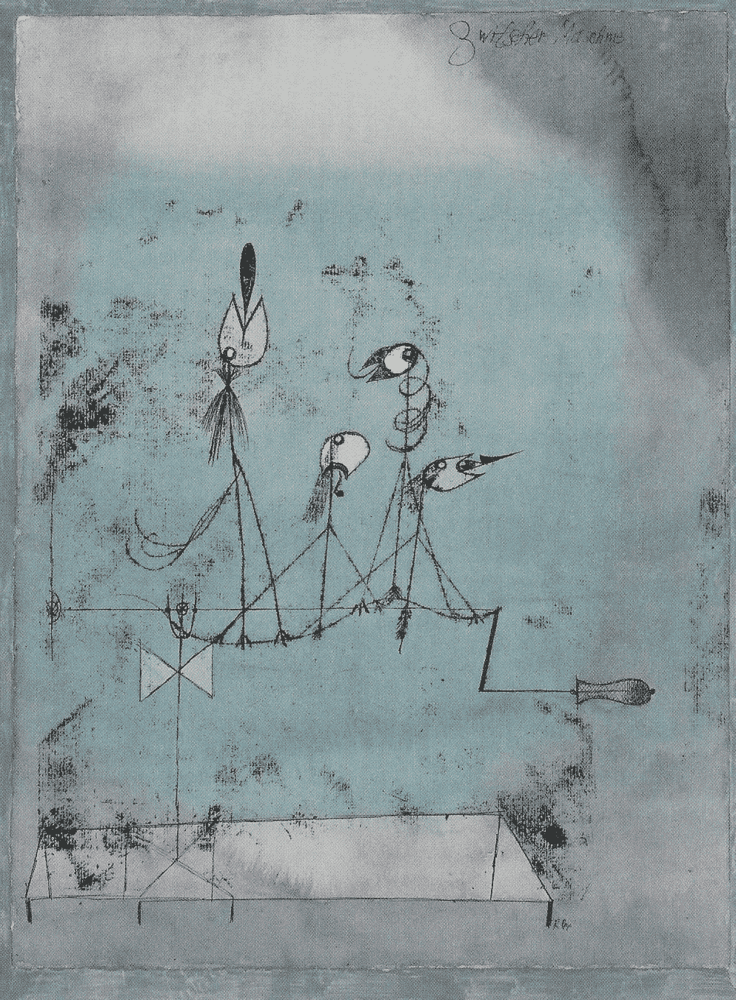

Pau Klee’s Die Zwitscher-Maschine – a group of machines telling each other the truth

你可以用一种方式来描述分布式账本，那就是一个互相告知真相的机器网络。

在分布式分类帐中，网络节点来回发送消息，如下所示:

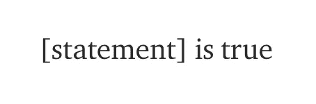

节点发送和接收这些真值陈述，验证它们是否为真，并将它们收集到一个真值陈述列表中，我们称之为分类帐:

这句话是对的:_______，这句话是对的:______ _，这句话是对的:_ _ _ _ _ _ _，这句话是对的:_ _ _ _，这句话是对的:_ _ _ _，这句话是对的:_ _ _ _，这句话是对的:_ _ _，并且…

这些消息的内容通常是关于债务的陈述，比如“Kendra 欠 vini cius 40 美元。”但是这些陈述真的可以是任何东西:天空是蓝色的，孔雀的尾巴是明亮的，今天下午下了一场小雨。在分布式账本的上下文中，这些陈述在我们(人类)的现实中是否为真并不重要，重要的是它们相对于由节点同意并记录在账本中的现实来说是真的。节点可以通过检查消息是否与分类帐中已经存在的任何语句冲突来验证该消息是否为“真”。

例如,“所有的猫都有六条腿”和“所有的猫都有八条腿”这两种说法不可能都是正确的，所以分类账中只能包括一条。分布式分类帐必须确保所有节点最终同意完全相同的分类帐，并且该分类帐不包含任何冲突的语句——一种分布式真相告知机器。

**套娃原则**

The first Matryoshka dolls, carved by Vasily Zvyozdochkin in 1890

在 IOTA 协议中有一个基本规则，如果我想让其他节点接受我的消息，我必须公开验证我从其他节点收到的两个或更多消息的真实性。因此，简单来说，一条消息应该是这样的:

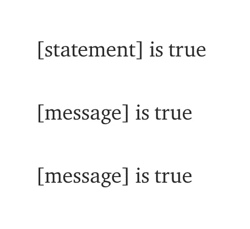

消息的第一部分是我添加到分类帐中的新语句，第二部分是从其他节点收到的一些相同格式的验证消息。由于这种递归属性，消息最终会扩展成这样:

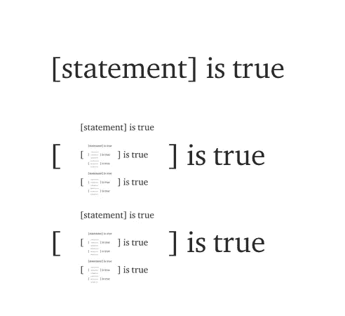

The Tangle, as seen from inside a single message

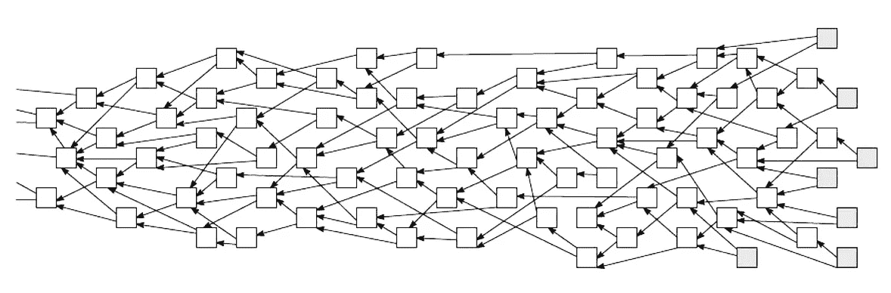

The same Tangle, as seen from outer space

因为一条消息证明了它所引用的消息的真实性，以及它们所引用的消息的真实性等等，所以每条消息最终都包含了整个混乱的历史，至少从某个角度来看，是在某个时刻。当一个节点发送一个消息时，它实际上是在说“这个声明是真的:_ _ _ _ _ 并且该消息引用的分类帐历史中的所有消息，从曾经发送的第一个消息开始，也都是真的。”混乱中的每一条信息都是混乱开始的直接视图，就像分支的河流，都通向大海。

当然，实际上来说，节点不能发送包含数百万或数十亿嵌套消息的消息。因此，节点只需通过在每个消息中包含它所引用的消息的散列(包含它们所引用的消息的散列，等等)来证明它们正在引用这个历史。这将分类账的整个历史压缩成非常少量的信息，很容易核实。

我承诺向持票人支付一英镑的金额

One pound is a promise to pay the bearer on demand the sum of one pound.

在处理加密货币时，分类账中的陈述没有提到天气或外来动物。它们只是关于谁欠谁多少钱的声明。就像一英镑(或任何法定货币)只是承诺付给某人一英镑一样，数字货币也是承诺付给某人数字货币。这些承诺是记录在分类账中的陈述，它们看起来像这样:

丙欠丁 20 美元

C 欠 D 的钱本身只是对另一条消息(或多条消息)的引用:这条消息包含首先承诺给 C 20 美元的语句。考虑到这一点，分类帐更新也可以这样表示:

c 欠 D 20 美元[消息]

或者

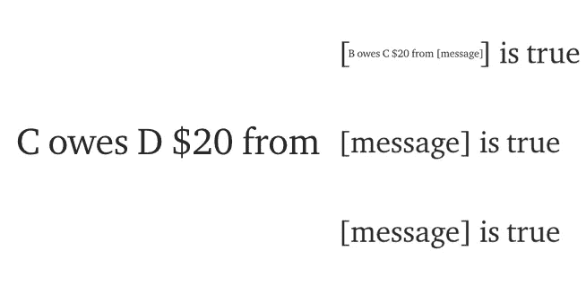

最后，信息开始看起来像这样:

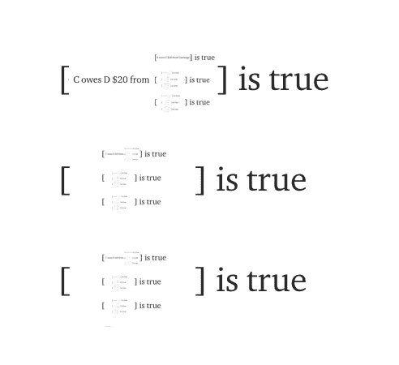

应该指出的是，在 UTXO 模式中，你可以向某人承诺欠你的一部分钱，然后承诺将剩余部分还给你自己，或者将许多不同的承诺组合成一个新的承诺。但最重要的是，数字货币和真实货币一样，只是一个给某人钱的承诺，它本身是另一个更古老的给某人钱的承诺。

与消息包含分类帐的整个过去一样，单个交易或 UTXO 更新引用它花费的资金的整个历史，类似于支票背面的累积背书，一直追溯到创建所有现有资金的第一条消息。

**事情的顺序**

由于其消息的递归性质，一些有趣的属性出现在这个纠结中。例如，分类账的旧部分变得非常难以改变。一个节点可以尝试发送一个消息，该消息引用了该缠结的另一个版本，该版本的过去与其他节点看到的不同，但是该消息将与所有其他节点的感知相冲突，并且它们不会认为该消息是真实的。例如:如果你试图改变平克·弗洛伊德的《乌玛玛》封面上的任何嵌套图像，任何拥有该专辑数十万份拷贝之一的人都会看到。你如何让那些人相信你的是真实的版本？

正如“过去”这个词已经表明的那样，另一个重要的性质出现在这个简单的要求中，即一个消息验证两个更早的消息:分类帐至少有一个事件的部分顺序，一种时间感。也许不可能(或者至少很难)确定两个没有引用连接的消息的顺序，但是可以说一个消息在它验证的任何消息之后，在验证它的任何消息之前。也不可能发出已经被分类帐中的消息引用的新消息。

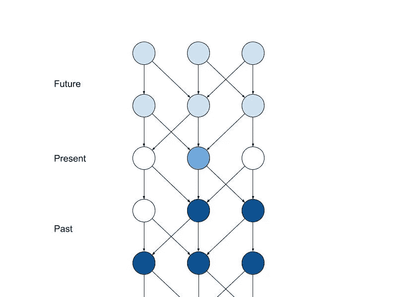

The Tangle is partially ordered

(部分)顺序和不可变的过去这两个属性是任何分布式分类帐的基本属性。如果过去可以被任意改变，如果事件之间没有顺序关系，从这个意义上说，“时间”是没有意义的。从这个角度来看，分布式账本中的信息不仅仅是关于真相的陈述，也是一个*事件*，它必须与时间上先于它的事件所建立的现实因果一致。同样，我也不能用刚刚摔碎在地板上的杯子喝水，分布式账本防止了双重花费，并再现了一种因果关系的最小表达。

**双花**

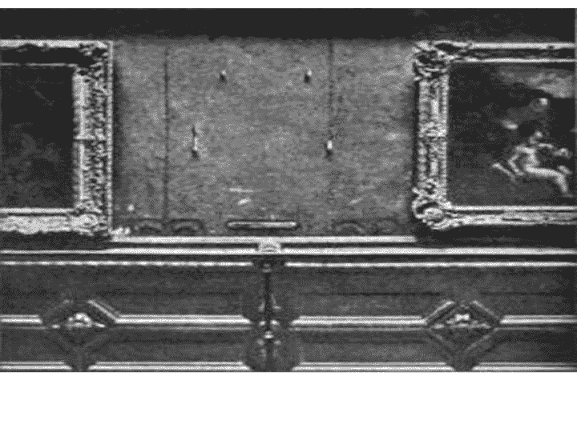

The Mona Lisa after it was stolen

据说，文森佐·佩鲁贾在 1911 年偷了《蒙娜丽莎》,他把它交给了一位伪造大师伊夫·肖德隆，肖德隆制作了几幅完美的复制品，这些复制品依次卖给了不同的买家，肖德隆得到了原作的报酬。一些人推测，真迹已经丢失，一群艺术品经销商和历史学家无法就哪一幅完美的复制品是真迹达成一致，他们秘密地选择了一幅并销毁了其他的，这样我们就可以继续我们的生活，而不会想到《蒙娜丽莎》实际上是一幅没有真迹的复制品。

记住这一点，想象一下比阿特丽斯像这样广播一个分类帐更新:

`Beatrice owes **Cecilio** $20 from [Ariadne owes Beatrice $20 from […]]`

当节点收到这一更新时，它们通过在分类帐中寻找阿里阿德涅向比阿特丽斯承诺那 20 美元的消息来检查是否属实，并检查比阿特丽斯是否已经向其他人承诺了那 20 美元。如果这两件事都是真的，那么这个信息就不会与账簿中记录的事实相冲突。比阿特丽斯的声明可以被记录下来，并作为未来信息的参考。

当网络中的所有其他节点都对分类帐进行了更新时，Beatrice 发布了新的更新，试图花费相同的资金:

`Beatrice owes **Dalia** $20 from [Ariadne owes Beatrice $20 from […]]`

当其他节点收到此消息时，它们执行与以前相同的检查，并看到 Beatrice 从 Ariadne 收到了资金。但他们也会看到一条消息，说碧翠丝已经把这些确切的资金寄给了塞西利奥。因为新的信息与分类账中记录的事实相冲突，它将被拒绝。

然而，在某些情况下，可能会发生 Beatrice 几乎同时发送两个消息，并且一些节点首先看到一个或另一个消息。一些节点会决定第一条消息是真的，而其他节点会决定第二条。每一种相互冲突的观点都代表了一本有效但相互排斥的分类账，它所记录的现实的两种可能的未来。

虽然当时没有其他人在房间里，但据说聚集在一起鉴定这幅名画的专家们已经投票决定了要保护哪幅蒙娜丽莎免遭破坏。同样，分布式账本中的一致性问题是关于找到一种方法，当出现冲突时，网络中的所有节点都同意账本的单一版本，以建立对现实的共享感知。

**决定猫的生死**

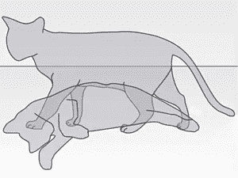

Two possible realities

解决冲突的一个简单方法是询问网络中的每个人他们更喜欢哪个版本的分类账，然后让每个人都跟随多数人的投票。

这种方法的第一个问题，也是所有分布式分类帐的问题，是有人可以设置大量节点并投任意数量的票来影响共识或完全阻止共识——迫使网络分裂成两个不可调和的现实。

对所谓的 Sybil 攻击的解决方案是要求节点证明对有限资源的访问，以便在共识过程中投票。例如，在比特币中，能够证明自己拥有一定哈希能力的矿工，被允许写入账本，并通过这样做来投票选出最长的链。在 IOTA 中，能够证明能够访问一定数量代币的人被授予与他们持有的代币数量成比例的投票权。这种投票权被称为 *mana* ，可以委托给任何参与网络的节点。有了法力投票权是昂贵的，任何人都不可能投任意多的票。

与许多其他分布式分类帐(如比特币或以太坊)不同，IOTA 是一种无领导协议，这些分类帐选择单个块生产者来写入分类帐的更新。参与网络的每个节点，无论其拥有多少投票权，都可以参与共识过程。

简单地询问网络中的每个节点对冲突的意见会导致另一个问题:每个节点都必须将其意见发送给其他每个节点。在小型网络中，这可能没问题，但是一旦有成千上万的节点投票，每当出现冲突时，网络的大部分带宽将被用于传递这些投票，并且节点将承受验证它们接收的所有投票的签名的计算成本。无领导协议需要一种投票机制来最小化用于传达投票的消息的数量和大小。

[快速概率共识](https://arxiv.org/abs/1905.10895)是一个对等审查的无领导共识协议，具有强大的安全保证，将在今年晚些时候在 IOTA 协议中实现。节点从节点的随机子样本中请求意见，而不是向网络中的所有节点查询它们的意见。在发生冲突的情况下，节点根据它们从其他节点随机选择的意见重复更新它们的意见，并最终就遵循哪个版本的分类帐达成一致。因为拥有大量法力的节点会被更频繁地查询，所以它们也可以直接在 tangle 中发布它们的意见，进一步最小化消息开销。尽管这是对 FPC 的高度简化的描述，但是该投票协议具有可证明的安全保证，并且可以与任意大的验证者集合一起伸缩。

**选择自己的冒险**

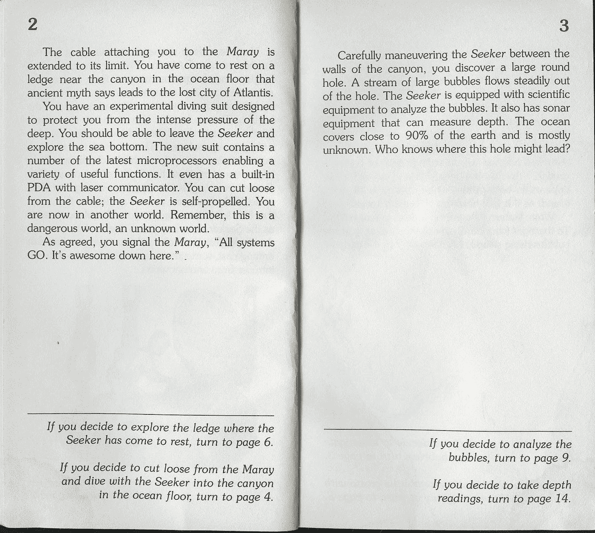

Choose whichever reality you prefer

这里概述的另一个可能的和稍微更具实验性的解决方案[(多元宇宙共识，又名关于纠结投票)是简单地将所有信息本身视为投票。如果我看到两个冲突的消息，我可以通过发出新消息来投票支持其中一个消息，新消息将引用我更喜欢的冲突消息，即我先看到的消息或投票较多的消息。因为每一条消息都是一个声明“账本的整个历史都是真实的”，通过选择引用冲突集中的一条消息，一个节点就对它喜欢的账本现实版本投下了一张由它的法力加权的选票。](/@hans_94488/a-new-consensus-the-tangle-multiverse-part-1-da4cb2a69772)

如果我为一个现实投了一票，然后发现大多数其他节点都在为另一个现实投票，我可以转换立场，开始在更多节点投票的账本版本中发布消息(根据他们的法力加权)。一旦网络中 51%的 mana(如果由诚实节点控制)集中在冲突的一方，只要所有节点最终接收到相同的消息，攻击者就不可能阻止网络达成共识。这种方法的优点是消息开销为零，并且很难被攻击。

一种可能的攻击媒介是恶意节点在冲突中迅速转换立场，投票支持一个现实，然后支持另一个现实，使得两个现实都没有超过 50%的投票稳定下来——将这种纠结变成类似薛定谔的僵尸猫，既不活也不死。尽管执行起来可能极其困难，但亚稳定攻击理论上可以由任何节点执行，不管它拥有多少法力，但只要选择正确的时机。

然而，我相信，基于本文开头所述的基本思想，这个问题可能有一个简单的解决方案，即每个节点都必须验证它从其他节点收到的语句的真实性。

**这种说法是错误的**

当一个节点在一个冲突集合中为一个现实投下一票时，它不仅对它所引用的消息的真实性作出声明(这些消息是真实的……)，它还作出第二顺序声明:“这是我所感知的具有最大批准权重的现实。”

为了防止节点任意改变其意见，可以使用缠结本身来验证节点正在投出“诚实”的一票，即从它认为拥有较少票数的现实切换到它认为拥有较多票数的现实。

如果我们考虑在节点对给定现实的投票的过去圆锥中可观察到的批准权重作为其“感知现实权重”，那么我们可以从共识中排除任何表达从较重现实到较轻现实的意见改变的“不诚实”投票。因此，当一个节点将其意见从现实 A 更新到现实 B 时，只有当该节点感知的现实 B 权重大于其感知的现实 A 权重加上其自身权重时，投票才会“算数”(即，该节点的批准权重将应用于现实 B)。

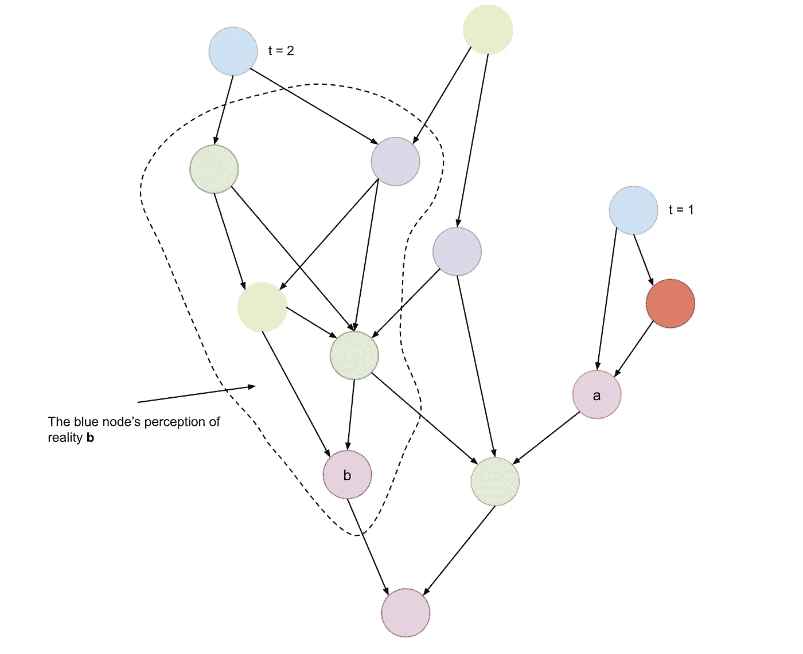

The blue node voted for Reality A first, and then changed its opinion by voting for Reality B. The honesty of its vote can be verified by looking at the Tangle.

在上图中，在时间= 1 时，蓝色节点必须已经感知到现实 A，以至少具有在其第一次投票的过去圆锥中可见的批准权重加上其自己的批准权重。蓝色节点还必须已经看到现实 B 在其第二次投票的过去锥中具有批准权重。通过比较这两个值，其他节点可以容易地验证蓝色节点的意见改变的诚实性。

执行这种简单的验证将意味着试图任意转换阵营的攻击者将被迫为冲突集中每个现实的越来越重的部分投票，并且最多只能在一段时间内延迟达成共识，这非常困难。

这个想法只是扩展了协议级的原则，即一个节点应该验证其他节点的声明，因为投票给一个给定的现实等同于声明“这是更重的现实。”正如我在整篇文章中试图展示的那样，似乎简单的要求，即节点在自己的陈述中以及关于他人的陈述中“说出真相”,几乎不可阻挡地导致了作为网络的一种新兴属性的共识。

**超越比特币**

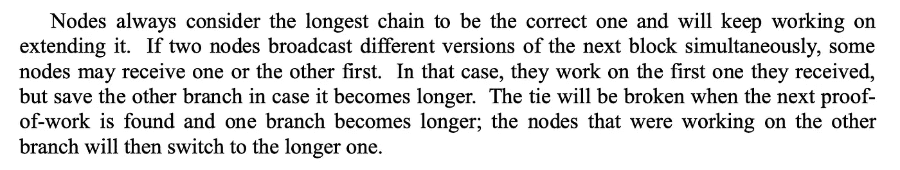

A description of longest-chain-wins consensus from the Bitcoin whitepaper

Nakamoto 共识的突破是设计了一种分布式共识协议，通过让参与者简单地闲聊分类账的新更新，为他们喜欢的分类账版本投票，从而在无许可网络中扩展。

然而，比特币被设计成具有较慢的确认时间，以防止许多数据块制作者同时添加新的数据块。如果几十个数据块并行发布，网络将会看到许多不同的链，分类账的竞争版本，并且永远无法就一个最长的链达成一致。从某种意义上说，通过限制确认时间来强制执行分类账的线性更新，比特币旨在防止泰戈走出区块链。

从这个角度来看，比特币的缺点是走得不够远。IOTA 在许多方面都是独一无二的，尤其是在这一事实上，它扩展了 Nakamoto 共识的原则，建立了并行分类账更新的免费、无领导协议，可与任意大组验证器一起扩展。因为所有节点都在共识挖掘竞赛中协作，所以消除了竞争，网络的计算能力被用来以尽可能最有效和分散的方式保护网络。

这些都是我对这个项目感兴趣的原因，这个项目是为数不多的试图扩展比特币创新的项目之一。

1.  如果你认为分类账更新是因果结构中的事件，那么传达这些事件的信息就像*观察事件*一样，记录了观察者与该事件的相遇。越多的观察者看到一个事件，或者看到其他人看到这个事件，事件本身就越凝固在分类账-现实的因果结构中。从这个意义上说，事件和对事件的观察之间的区别似乎在分类账因果结构的最细微层次上瓦解了。当网络中不同的观察者记录到两个因果*可能*但互斥的事件时，就会发生冲突。共识意味着观察者都同意“知道”冲突集中的一个事件，也就是说这个事件已经“发生”了。通过一个问题的方式陈述:如果在森林中发布了一个分类账更新，并且没有人在附近听到它，它会发出声音吗？
2.  故事的这一部分完全是为了戏剧效果而编造的。
3.  这就是为什么共识并不依赖于永远保留账本的全部历史。以便到达共识节点，仅跟踪证明当前分类帐状态的消息。一旦新的状态被确认，节点可以删除检测冲突不需要的旧信息。分布式账本是讲真话的机器，不是[无限存档](https://urbigenous.net/library/library_of_babel.html)。