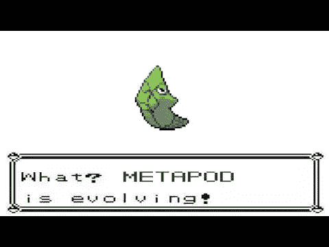

# 合同前奏:一个案例研究

> 原文：<https://medium.com/coinmonks/the-contract-prelude-a-case-study-b82352dec8b9?source=collection_archive---------0----------------------->


> 嗯——合同前奏？我以前从未听说过这个术语…

我们会谈到这一点，但在进入合同前奏之前，为什么它有用，以及如何正确使用它，请允许我分享一个关于我最初如何对它们产生兴趣的小故事。

当君士坦丁堡/圣彼得堡上线时，我着手在 Mainnet 上执行第一个合同[变形记](/@0age/the-promise-and-the-peril-of-metamorphic-contracts-9eb8b8413c5e)。现在，变形契约的目标是能够部署一个**防白痴契约**，一个总是可以用新代码“重置”的契约，不管你犯了多么糟糕的错误*(因为，让我们面对它:每个人都会犯错误)。*带着这个目标，我建立了一个[变形合同工厂](https://etherscan.io/address/0x00000000c9329eab0ede00c18accad77db00aa73)并且[用一个小消息在块`7280025`中部署了一个合同](https://etherscan.io/address/0x714352eb3b0198e9c830a8c4bf16705db89a078f#code)，意图通过一个简单的`CALL`来`SELFDESTRUCT`它并且部署一个新的。

然而，我很快意识到我犯了一个错误——`SELFDESTRUCT`是第一个操作码，但我没有先在堆栈上放置一个转发地址，这意味着调用**会导致堆栈下溢，因此契约无法重置！**(别慌:我在`7280046`区块部署了一个新的变形契约，在`7280070`区块[成功重新绑定](https://etherscan.io/address/0x000000009042b40070c8f83bff1293005dc25257#code)。)

这凸显了变形合同的一个奇怪的怪癖——它们遭遇了与大多数合同完全相反的问题。而*通常*的第一法则是**不惜一切代价避免**达成`SELFDESTRUCT`，第一法则为*变质*契约*(假设你想让* ***待*** *变质)*是为了**保证**契约无论如何都能达成`SELFDESTRUCT`、**！**


Metamorphic contracts do not fear destruction—they yearn for it!

此后不久，我无意中发现了另一个大脚炮*(也许脚炮-****nuke****更恰当)*在处理变形契约时，[在这里演示了](https://etherscan.io/address/0x000000000073b6eeb97a1b007fa833561b10be1e)并如此概括:向一个契约发送一个魏，`SELFDESTRUCT`它，并将魏转发回它自己——然后**噗！那个魏不见了**。不仅仅是某处无法挽回，而是 ***全军覆没！*** 把“燃烧的乙醚”这个概念放在了一个全新的角度。

这不仅仅是一个让 it 部门对`selfdestruct(address(this))`负责的问题——假设您创建了与魏的合同`A`和与魏的合同`B`，其中`A`在销毁时将资金转发给`B`，而`B`将资金转发给`A`。您可能已经知道，当调用`SELFDESTRUCT`时，契约只被 ***调度*** 销毁，但实际上在事务结束时被*删除*。然后，您可能会假设账户余额也在交易结束时被 ***转发*** 给收款人——在这种情况下，您的假设是错误的！

资金实际上是由`SELFDESTRUCT`**、*(甚至不能被收款人拒绝，也不能像在* `CALL` *、*中那样作出反应)但是一旦交易结束，如果已经安排在`SELFDESTRUCT`中，它们将被永久销毁。因此，如果您销毁同一个事务中的`A`，那么`B`，您将获得以下余额序列:**

**`{a: 1, b: 1} => {a: 0, b: 2} => {a: 2, b: 0} => {a: 0, b: 0}`**

**我还会提到，在合同被销毁之前，资金可以从已经计划删除的合同中解救出来— [这里有一个例子](https://ropsten.etherscan.io/address/0x644a703af3cacd9954dcc758ea004f449a666a94#code)。此外，请记住，契约并不持有代币余额。相反，它们驻留在令牌契约的存储中，因此即使在`SELFDESTRUCT`之后它们也将持续存在，这很好——只要您可以重新部署！**

****

**Real heroes don’t run from the fire: they quench the flames!**

> **好了，轶事已经够多了— **什么是合同前奏？！****

**很公平，我就结束了，直奔主题。**

## **实现**

**很明显，我们已经获得了用任意运行时代码重新部署契约所需的工具，但显然 ***不是*** 傻瓜才知道。**

**我们需要一种方法来确保:**

*   **契约总是可以被销毁，所以它总是可以被升级**
*   ****资金在*被*销毁时将被运送到安全的目的地**，并在重新调配时返回合同。**

**因此，我们需要确保我们的变形契约能够拿起武器对抗重重困难，并摆脱这种致命的束缚。但是，问题就在这里:合同需要自我毁灭。毕竟没有`OTHER-DESTRUCT`操作码。我们如何确保契约总是可以被销毁，而不限制我们可以部署的契约类型或者期望它们每次都正确地实现适当的析构函数？**通过使用合同前奏**。**

## **合同前奏**

**契约前奏是**放置在契约运行时代码最开始的一段代码。**正常情况下，Solidity 契约将通过分配空闲内存指针、从调用数据中读取函数签名，并将签名传递给函数调度程序来启动执行，函数调度程序使用该签名跳转到所需的函数。相比之下，契约 prelude 被设计为在所有这些之前插入，并在调用契约时在函数调度器*(或任何其他东西)*之前执行。**

**prelude 可以用来在某些情况下转移契约行为，而不改变它们之前的契约的核心功能——以前有一个例子是关于透明代理的，代理的管理员可以管理契约升级，但是任何其他调用者都会触发一个`DELEGATECALL`到实现契约。**

**契约前奏也可以用于各种其他的好东西，比如存储元数据或者创建全局******可拥有*******仅***可支付的契约，应有尽有。另一个用例是利用调用契约时提供的 gas(或 gas 模某数)作为额外的、廉价的输入源——例如超高效的函数调度程序，它根据调用时使用的 gas 来选择跳转目的地！一个额外的、更好的应用程序是用于确定契约的运行时是在一个`CALL`还是一个`DELEGATECALL` *的上下文中执行(通过将* `ADDRESS` *与一个硬编码的契约地址进行比较)*，并根据给定的上下文修改它的行为——例如，如果您知道调用是一个`DELEGATECALL`，那么您可以在它上面运行一个套娃，并执行 ***另一个*** `DELEGATECALL`，而不会有对契约进行不必要的修改的风险。最后，现在你可能已经自己解决了，这对于确保合同是可破坏的也非常有用。********

****假设我们在它部署的每个变形合同的合同序言中指定我们的合同工厂地址，使得从工厂合同到变形合同的`CALL`将导致变形合同到`SELFDESTRUCT`。对于任何其他*来电者，前奏将被安全跳过。然后，我们还指定一个 ***不会*** `SELFDESTRUCT`的转发地址，将资金退回给合同。瞧，我们现在有了一个“硬化的”变形契约。现在，当工厂部署新合同时，它可以立即使用`EXTCODECOPY`检查结果运行时代码的开始，如果没有正确的 prelude，它将返回，取消整个操作！*****

****因此，Metapod 的想法诞生了。****

********

****Nintendo, please don’t sue!****

## ****Metapod —硬化变质合同****

****Metapod 是一个变形合同工厂，它可以防止非变形合同的部署和升级*时的资金损失(尽管只有当 Metapod 是通过 prelude 摧毁它的那个人时——如果你足够坚定，任何* *合同都只能做这么多来保护你免于烧光你的筹码)*。代码可以在 [Github](https://github.com/0age/metamorphic/blob/master/contracts/Metapod.sol) 上找到，部署的契约实例可以在 [Mainnet](https://etherscan.io/address/0x00000000002b13cccec913420a21e4d11b2dcd3c#code) 和 [Ropsten](https://ropsten.etherscan.io/address/0x0000000000f647ba29e4dd009d2b7cada21c1c68#code) 上找到。****

****它要求以下 44 字节的序言出现在它部署的所有契约上:****

```
**Metapod (Mainnet) - required prelude (44 bytes):
 0x6e2b13cccec913420a21e4d11b2dcd3c3318602b5773 ++
 dedicated_vault_address ++
 0xff5bMetapod (Ropsten) - required prelude (44 bytes):
 0x6ef647ba29e4dd009d2b7cada21c1c683318602b5773 ++
 dedicated_vault_address ++
 0xff5b**
```

****下面是 Ropsten 实例*所需 prelude 的分解(注意，Metapod 使用紧凑的* [*高效地址*](/@0age/on-efficient-ethereum-addresses-3fef0596e263) *和 5 个前导零字节)*:****

```
**Metapod (Ropsten) - prelude description
pc op opcode                                   [stack]
-- -- ---------------------------------------  -------------------
// Push Metapod’s address to the stack (compact so PUSH15 works).
00 6E PUSH15 0xf647ba29e4dd009d2b7cada21c1c68  [metapod_address]

// Push the caller’s address to the stack.
16 33 CALLER                                   [metapod, caller]

// XOR the two — equals zero if they are equal, non-zero otherwise.
16 18 XOR                                      [0 iff metapod]

// Push program counter for the jumpdest at end of prelude to stack.
18 60 PUSH1 0x2b                  [0 iff metapod, end_prelude_label]

// Jump to end of prelude (pc 43) unless Metapod is the caller.
20 57 JUMPI                                    []

// If Metapod *is* caller, push vault contract’s address to stack.
21 73 PUSH20 dedicated_vault_address           [vault_address]

// Schedule account for deletion & forward funds to vault contract.
42 FF SELFDESTRUCT                             []

// Otherwise we end up here with an empty stack and unused memory.
43 5B JUMPDEST                                 []**
```

****使用专用保险库合同的决定源于我们会计工作的简化。我们不是存储资金并跟踪工厂合同*中每个账户各自的余额(当资金通过* `SELFDESTRUCT` *)转发时，我们无法处理资金的接收，这使任务变得非常复杂)，而是将每个账户的余额隔离在一个唯一的合同中，然后该合同可以在重新部署时将资金发送回相关的变形合同。*****

****保险库契约地址的推导稍微复杂一点，每个 salt ( `20_byte_caller_address ++ 12_byte_identifier => 32_byte_salt`)都有一个唯一的保险库，但是您可以通过调用 Metapod 上的`findVaultContractAddress(bytes32 salt)`视图函数来确定给定 salt 的保险库，或者您可以只调用`getPrelude(bytes32 salt)`来一次性获得给定 salt 的整个前奏。****

****Metapod 有三种状态更改方法:****

*   ****`deploy(uint96 identifier, bytes initializationCode)`取提供的合同初始化代码*(是的，* ***可以使用构造函数！*** *)* 并在通过`CREATE2`部署临时契约时使用调用者的地址和提供的标识符作为 salt。这个契约然后拉入初始化代码，并使用`CREATE`部署变形契约，然后被销毁。当然，它会检查所需的前奏，如果有，就只允许部署。在实际需要之前，不会部署任何保险存储合同。****
*   ****`destroy(uint96 identifier)`将与给定标识符相关联的变形合同触发到`SELFDESTRUCT`，将任何资金转发到专用金库合同。****
*   ****`recover(uint96 identifier)`是一种专用的便捷方法，可以一次性清除具有给定标识符的金库、临时合同和变形合同，并将资金发送回调用者。不过，变形契约必须首先销毁。****

****太好了！所以我们拿起我们的契约，把必要的前奏贴在我们代码的前面，并把它提供给`deploy` … **，它回复**。****

********

****I was told there would be idiot-proofing…****

****第一个问题是，我们将 prelude 放在契约的 ***初始化代码*** 的开头，而不是契约的 ***运行时代码*** 的开头。但是这是一个相对容易的解决方法:Solidity 处理初始化的方式是运行所有的构造器逻辑，然后执行一个`CODECOPY`将所有的运行时代码放入内存并返回它。然后，我们需要做的就是找到指定我们正在复制的代码长度的`PUSH`，并将其增加 prelude 的大小，然后在运行时代码的开头插入 prelude，而不是在初始化代码的开头。听起来不太难，对吧？****

****你在寻找这样的序列:****

```
**...60xx8060yy6000396000f3fe6080604052...**
```

****还要注意的是，`60`的(`PUSH1`)可能是`61`的(`PUSH2`)。这是细目分类:****

```
**op opcode     [stack] & <memory> & *deployed_code*
-- ---------- -----------------------------------------
// push the length of the runtime code onto the stack.
60 PUSH1 xx   [..., runtime_length]// duplicate that value, used later for returning the runtime code.
80 DUP1       [..., runtime_length, runtime_length]// push the offset of the runtime code (i.e. location in the code).
60 PUSH1 yy   [..., runtime_length, runtime_length, code_offset]// memory offset is zero — put runtime code at start of memory.
60 PUSH1 0x00 [..., runtime_length, runtime_length, code_offset, 0]

// place the runtime code into memory, consuming three stack items.
39 CODECOPY   [..., runtime_length] <runtime_code>

// push the return offset (zero) for code to return from memory.
60 PUSH1 0x00 [..., runtime_length, 0] <runtime_code>

// deploy runtime code, using same length as we did in codecopy.
F3 RETURN     [...] *runtime_code*// the subsequent invalid opcode is there for safety, I guess.
FE INVALID// runtime code begins here - not executed during initialization.
60 PUSH1 0x80 
60 PUSH1 0x40
52 MSTORE
...**
```

****所以我们只是通过增加前奏的大小来改变长度(`xx`)。我们不需要改变偏移量(`yy`)，除非`PUSH1`需要改为`PUSH2`，在这种情况下，我们还会将它增加`1`。最后，我们移动 prelude，使其位于`INVALID`操作码和当前运行时代码之间。太好了，我们再试一次。****

****这一次，**合同成功部署！**太好了，现在我们来试着用一下。****

****还有…****

*******当* *吧！*** 我们称之为合同的抛出错误，到处都是`Invalid JUMPDEST` s！****

********

****Who would’ve thought that poking compiled EVM code would end up stirring up trouble like this?****

****怎么会这样嗯，**运行时代码中所有的** `**JUMP**` **指令都被破坏**。它们没有指向正确的`JUMPDEST`——相反，它们指向比预期的`JUMPDEST`早 44 个字节*的操作码，这很可能根本不是一个`JUMPDEST`，或者充其量是一个错误的操作码。此外，如果你有静态常量，比如十六进制字符串之类的，这些都是关闭的，因为它们使用`CODECOPY`来获取值，而不再指向正确的位置。*****

****好消息是我们的前奏还是不错的——谢谢，Metapod。我们可以销毁合同，再试一次。****

****为了解决这个问题，我们有一个更困难的任务——我们必须弄清楚每个`JUMP`(和`JUMPI`)指向哪个`JUMPDEST`，以及向每个`CODECOPY`提供什么代码偏移量。然后，我们需要找到这些值的来源并修正它们。*(取决于如何使用，* `PC` *操作码可能也需要修改——幸运的是，Solidity 不会生成任何操作码，并且专门依赖静态* `PUSH` *es 来设置跳转目的地。)*****

****现在，这显然会在语言级别得到理想的处理，所以 Solidity 或 Vyper 只是根据提供的前奏正确地生成它们。但是有一种更简单的事后分析方法——我们可以尝试对编译后的运行时代码进行 jumpdest 分析，并在编译后对其进行修改。这就是我要做的，所以我做了一个名为[铁壳昆](https://github.com/0age/metamorphic/blob/master/scripts/kakuna/kakuna.js)的概念验证(我知道，我就是忍不住)。****

********

****Well, now I’m definitely getting sued… hopefully my pseudonym holds up!****

## ****铁壳昆——翻转一些位并重新包装你的运行时****

****基本策略是遍历代码，将每个`PUSH`值放入堆栈，并跟踪它在哪里被使用。如果它从未得到`DUP`d，并最终作为`JUMP`或`JUMPI`目的地或`CODECOPY`偏移量被使用，那么它可以安全地递增前导码的长度，就像我们之前对初始化代码所做的那样。当我们点击`JUMPI`时，假设条件未知，我们**分叉并尝试两个选项**。****

****可悲的是，这个游戏计划很快土崩瓦解。简而言之，代码中潜在路径的数量很快就失控了。此外，您可能会遇到循环引用和其他愚蠢的情况，这会使代码不受静态分析的影响。从这里开始，通过操作代码的中间表示*(而不是字节码本身)*，可以改进铁壳昆。另一种使它更健壮的方法是使用一个“蹦床”，它存储从旧的`JUMPDEST`到新的*(理想情况下通过非结构化存储)*的映射，然后在指向蹦床的所有现有的`JUMP`和`JUMPI`操作码前面插入一个跳转目的地，然后生成正确的`JUMP`。此外， [EIP 615](https://github.com/ethereum/EIPs/issues/615) 提议修改`JUMP`语义，使之更符合 eWASM 的工作方式，这很好，但它也提议对现有的 EVM 进行相当重大的改革，这意味着我们将不得不用现有的东西来凑合。****

****这不是什么灵丹妙药，就像目前写的那样，对于复杂的合同几乎肯定会失败，但对于相对简单的东西，铁壳昆实际上可以完成这该死的事情。它还将执行我们上面使用的相同的初始化代码转换。因此，我们向它提供我们的初始化代码和我们想要插入的前奏，然后获取输出并将其交给 Metapod。而且—瞧吧— **它真的有效！******

********

****We did it — with only a few contract fatalities!****

****现在，这是不是比我们以前的更安全，更白痴？当然不是，但是如果你问我，它仍然是非常有趣的。代码验证被抛到了九霄云外，谁知道在转换后的代码中会隐藏着什么样的 bug。如果编译器增加了对插入前奏的支持，这些问题将会得到缓解。与此同时，至少合同可以被固定和重新部署*(记住，合同状态被清除)*——我要冒险一试**称之为胜利**。****

****即使这个特殊的案例研究不是你所喜欢的，我也希望它能帮助你演示如何使用合同前奏来为你带来好处，假设你能避开潜在的陷阱。我的前辈们，让我们一起努力改进他们周围的工具！*(为此，使用现有的* `solc` *功能来更可靠地插入前奏和修改输出的工作已经在进行中——敬请期待！)*****

****我要感谢我的许多同谋者和密友在这一努力中提供的帮助和反馈，包括[查尔斯·库珀](https://github.com/charles-cooper)、[雷蒙德·普尔弗](https://telegram.me/raymondpulver)、[洛伦茨·布赖登巴赫](https://twitter.com/ethlorenz)、[夏羽·戈塞林](https://medium.com/u/1aa2e52b3196?source=post_page-----b82352dec8b9--------------------------------)、[圣地亚哥·帕拉迪诺](https://twitter.com/smpalladino)、[马特·彻尼克](https://medium.com/u/2b893c124663?source=post_page-----b82352dec8b9--------------------------------)和[迈克尔·邓沃斯](https://twitter.com/michaeldunwort1)。****

> ****[直接在您的收件箱中获得最佳软件交易](https://coincodecap.com/?utm_source=coinmonks)****

****[](https://coincodecap.com/?utm_source=coinmonks)****