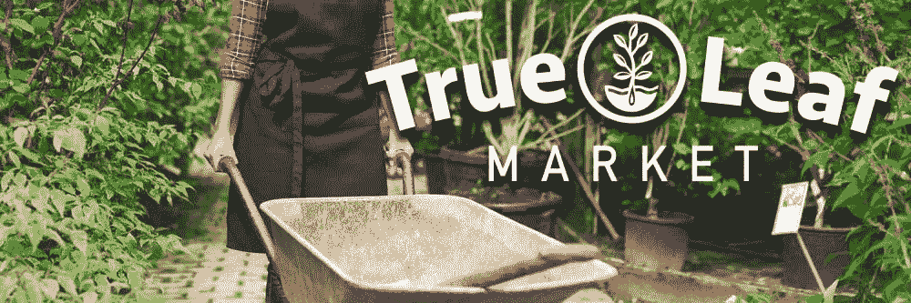

# 秘密农民年鉴

> 原文：<https://medium.com/coinmonks/the-crypto-farmers-almanac-896c901baecb?source=collection_archive---------2----------------------->

## DApp 发展环境的长期预测

[Burpee](https://www.burpee.com/) sells small packs of seeds at most hardware stores, great for beginners.

今天是我居住的地方春天的第一天，为了开始播种季节，我将出版一本 DApp 农民年鉴，为这个生长季节做准备，并帮助你们为下一个季节做准备。

我会引用《道德经》中的一句话来开始每个季节的预测，因为季节本身就是道的产物； [***道可以说是宇宙自然秩序的根本原则。***](/personal-growth/the-principle-of-wu-wei-and-how-it-can-improve-your-life-d6ce45d623b9) 作为一名建造者(DApp 建造者)，我发现《道德经》帮助我从首要原则出发进行推理。

## 隐泉

> 圣人之道，行而不争。-道德经。81

快速回顾以太坊的价格图表，让它看起来好像 cryptospring 在 2018 年 12 月 15 日正式开始。二月份，Consensys 发布了一份大气报告，其中 Joseph Lubin 写道，他认为我们已经度过了春天。他指出，一些在隐冬季节播种的种子发芽是主要指标:

1.  Gnosis 正在将对 DutchX 交易所平台的完全控制权让给 100%社区所有的 dxDAO，据 Marin Kö ppelmann 称，dx Dao“有潜力成为全球最大的金融实体。”
2.  数字出版商现在有了一个开源选项，因为 Civil 很快将被原生集成到 WordPress 的新出版平台 Newspack 中。
3.  随着 Gitcoin 对 CLR ( [资本约束的自由激进主义](/gitcoin/experiments-with-liberal-radicalism-ad68e02efd4))进行试验，众筹正在发展，以帮助贡献者获得指数级的更大匹配。
4.  除了第 2 层扩展解决方案的实时部署之外，还在 testnet 上发布了以太坊 2.0。

最闪亮绽放的花朵，从我的直接体验来看，是 POA 网络推出的 xDai sidechain。它已经在像 [Burner Wallet](http://xdai.io) 和 [Ching 这样的 DApps 上展示了比信用卡更好的用户体验！](http://ching.store)。

任何优秀的园丁都知道花园中最重要的元素是土壤。富含营养物质和生物活性，潮湿和酸性的土壤可以分解这些营养物质，使它们易于吸收。在以太坊领域，我们保持了与 cryptowinter 之前相同数量的活跃开发人员，cryptowinter 是一种通过会议、黑客马拉松和开源库建立合作关系的生物存在。尽管我们一直很忙，但我们一直在耗尽宝贵资本的生态系统。在隐冬期间，外部输入明显减少；它落在了向社区注入资本的既定项目上。这保持了以太坊生态系统的健康，而我的用于 Satoshi 链开发的工具和库几乎已经衰退。[星网上的莫比乌斯](https://github.com/mobius-network)就是一个不幸的例子库腐在阴影里另有[精彩](https://www.forbes.com/sites/rachelwolfson/2019/03/18/ibm-launches-a-blockchain-based-global-payments-network-using-stellars-cryptocurrency/) [近期](https://www.forbes.com/sites/panosmourdoukoutas/2019/03/19/bitcoin-and-stellar-get-another-boost-from-ibm/) [头条](https://www.marketwatch.com/story/ibm-ramps-up-cryto-related-cross-border-payments-offering-2019-03-18?mod=canadian-markets)。

对所有链上的 DApp 开发者来说，好消息是以太坊生态系统中进行的大部分 R&D 可以以低得多的成本在其他链上重新使用。对于如何将以太坊开发模式应用于 Satoshi 链，Bitcoin.com 回购是一个很好的案例研究。

在这个时候，以太坊的土壤是最健康的，水和肥料将能够服务于他们的预期目的，是高度可吸收的。建立在 Satoshi 链将挑战 DApp 园丁仔细选择可行的克隆和仔细监测环境条件。另一方面，适应贫瘠土壤的 DApp 品种可以结出更多奇异的果实，而且不像领头羊品种那样有太多杂草的竞争。

这个季节将持续近一年，因为全球经济仍然惊人地强劲和稳定。在 2019 年的大部分时间里，对投资者资金的竞争将非常少，创业公司将吸收所有当前可用的人才来从事前所未有的各种 DApps。

现在是建设、投资和试验的时候了。用于击败竞争对手的资源被误导和浪费了。在这里看着你 [BSV](https://bitcoinsv.io/) 。

## 隐夏

> 要理解事物的局限性，就要渴望它们。-道德经。一

就像今年的隐冬是有记录以来最长的一样，今年的隐夏也将是最长的。这有几个原因，但最重要的原因是自 2013 年 10 月[日](https://www.forbes.com/sites/andygreenberg/2013/10/02/end-of-the-silk-road-fbi-busts-the-webs-biggest-anonymous-drug-black-market/#3bbea5085b4f)以来，媒体对加密货币的负面报道一直相当频繁(强制性咨询声明:该文章的“一些”可能是假新闻)。在这个神秘的夏天，许多本应成为早期采用者的人在 2017 年下半年进入生态系统时被烧伤，这是一个媒体积极关注的非典型季节。这些用户会回来的，但他们是人，是习惯性的生物，所以我们不应该指望他们在 cryptoautumn 之前回来。

导致漫长夏季的其他因素包括姗姗来迟的全面衰退、这段时间 DApp 发展的成熟和多样性，以及不受欢迎的国有机构的干预。

无论这个神秘的夏天是否会出现全面衰退，都不会加速神秘的秋天的到来。普遍的经济衰退已经被预料到了，而且在它真正发生之前还会继续被预料到。除了学生贷款债务和市政债券之外，资本的避风港仍普遍受到信任。在相当长时间的持续增长和整合结束之前，对加密货币的普遍好感不会恢复。我的直觉是，今年夏天将持续三倍于最近的隐冬，这将使它比 [152 周](https://twitter.com/rektcapital/status/1072721029074608128)的整个最后上升趋势更长。请注意，从今天起，加密技术可能要过四年才会出现抛物线。

DApp 发展的成熟性和多样性将为这种抛物线式繁荣提供对冲，因为投资者将根据 dapp 自身的优点而不是其潜在链的优点进行比较。一些连锁店将拥有高达 1000 万活跃用户的杀手级应用，但没有一家会达到 1 亿日活跃用户(dau)。其中许多将从用户界面中抽象出代币经济学。许多人将提供小额信贷服务，并以任何其他应用程序都无法达到的更高质量提供这些服务，但世界级的用户体验不足以打破数十亿传统金融客户的习惯。许多项目将由财富 500 强公司领导，这些公司只向超级业余爱好者展示加密经济学，这些项目的价值将反映在他们的股票上，而不是他们的本地令牌上。

国家支持的机构之间的相互干扰将压低密码价格，并导致投资放缓至企业的步伐。监管机构将做监管机构做的事情，并寻找新的监管对象，要求对开源软件进行沙盒测试的许可，对哪怕是最小的无关紧要的交易提出 KYC/反洗钱要求，并给传统行业带来沉重负担，阻止它们尝试加密商务。巧合的是，sto 将成为时尚，并将最终出现在人们的雇主赞助的退休账户中。在民主国家，大型银行和贸易公司将利用区块链来减少交易时间和成本，同时发起立法来阻止竞争对手这样做。至少有 12 个独裁政权将把他们的货币重新流通到私人链中，并尝试伪造交易的方法，与此同时，在简易器官摘取等严重威胁下，迫使他们的公民使用国家的官方密码。[直视你中国](https://en.wikipedia.org/wiki/Execution_van)。[俄国将切断区块链使用的所有 TCP/IP 端口，他们将允许他们所有的 DApp 开发者移民到西方。世界各地的情报和执法机构将编造故事，指控 DApp 生态系统中一些最有天赋的创新者。卡尔文·艾尔将是这些受害者中最臭名昭著的](https://www.wired.com/story/russia-internet-disconnect-what-happens/)，使他成为家喻户晓的名字，并为古巴赢得国际声望。至少一次重大恐怖袭击将完全由一枚隐私硬币资助，掩盖了国家赞助，并引发了一场“隐私硬币战争”。

这仍然是隐夏。

这项技术的潜在价值将会使市场图表一周接一周地上涨。任何一周没有国家赞助的活动发生，都将是广阔的密码市场上升的一周。随着用例在不同行业中被一次又一次地证明，投资和开发将在未来几周内以相当线性的方式持续不减。

隐夏期间会发生一件有趣的事情。99%在 cryptosummer 中启动的项目基本上都是试图在 cryptosummer 之前启动的项目的某些方面进行改进的模仿者。这些项目将试图改进源项目的狭窄范围，将源项目应用于新的行业，或者将源项目与另一种新兴技术相结合。他们将获得比他们的源项目所需资金多一个数量级的资金，并将大部分资金用于广告。这是因为与源项目竞争所需的人才仍然在源项目中，或者通常是不可雇佣的。人才缺口将由来自 web2 的天才项目经理、技能不足的开发商店和来自第五大道的营销天才来填补。剩下的 1%中的一部分将致力于一项突破性的技术，将不可信和可信系统与社交媒体结合起来，产生一个“[黑天鹅事件](https://www.investopedia.com/terms/b/blackswan.asp)”。

黑天鹅事件将标志着隐夏的结束和隐秋的开始。我将在隐冬部分解释黑天鹅事件可能是什么，但我们不会意识到它发生在隐冬或隐秋。当加密市场再次出现抛物线时，我们就会知道加密秋天已经到来。

Cryptosummer 将主要以 DApp 和用户体验的完善为标志，以至于它们优于脸书、Medium、Visa、PayPal、YouTube、YouPorn、优步和 B&航空 DApps 开发者、区块链研究人员和投资者的工作是照料他们在春天种植的花园，以便他们可以在收获季节为客户提供更高质量的产品。

谷歌和亚马逊赚的钱比以往任何时候都多，他们对加密交易也很放心。

任何进入这个空间的新来者都会成为隐姓埋名者。只有隐姓埋名的人才会理解希望 DApps 做所有事情而不能做每一件事情的痛苦点。只有一个 cryptonative 将能够推动一个项目超越不可能的边缘，特别是在如此多的资源被投入到用户体验的时候。在此期间，对投资者资本和人才的竞争将会非常激烈，要么通过区块链专注的编码训练营，要么通过从最好的公司挖走最好的人才来提供人才。预计到 cryptosummer 结束时，顶级人才的年薪将高达 100 万美元。

## 隐秋

> 人们在成功的门槛上失败了。结束时要像开始时一样谨慎。-道德经。64

到了 cryptoautumn，我们已经在几个 DApps 上看到了数百万 dau。从未接触过加密的人正在以创纪录的时间获得他们的包裹，因为一群业余爱好者正通过预测市场押注他们的即时满足感。人们把他们退休的一部分押在 DApp 2.0.0-beta34 上，希望它能比 DApp 1.24.6 获得更多的市场份额。每个银行和发薪日预付场所都有一种方法来处理加密到法定转账。采矿者和验证者在世界各地都在盈利，通常是以完全可持续的方式脱离电网，在链条之间即时交换，以利用套利机会。主流媒体正在歌颂一个全加密的未来。

听起来不错，是吧？我们预计在 2023 年 3 月左右，未来几个月全球的天气会非常好。要么全球经济衰退已经过去，我们都很好；或者我们正处于其中，但我们的业务和投资是基于加密的，所以我们很好，或者资金将逃离传统市场进入加密市场，在这种情况下，我们将乘坐 lambos 前往月球。

这本年鉴里没有。这本历书没有一个美好的结局。

在 cryptoautumn，将会有无数的加密初创公司获得资金，上市，交易，并依赖其收入。都是不值钱的。在其他任何时候，它们可能都很好，但在这个特殊的季节，它们不值得任何人在它们身上投入时间或注意力，这些资源本可以更好地用于人工智能、无人机技术、增强现实、物流或医药。基本上任何有军事用途的东西。

10–15%的世界人口持有密码，其中大约一半暴露于其密码经济学。另一半人一直享受着技术带来的好处，但不愿卷入监管如此严格、与恐怖主义相关的事情。但是消息是如此积极，所有上次被烧伤的人都回来了！像他们一样的人在过去的四年里发了财，他们所要做的就是把他们的一些积蓄暴露在硬币市场上！

这种对加密的暴露是通过 DApps，而不是区块链本身。在我们努力将密码带给大众的过程中，我们作为 DApp 开发者已经将 dapp 带给大众。一旦用户加入，就没有权限了。一旦他们有了私人钥匙，他们就可以做任何他们喜欢的决定，地球上没有任何政府可以干涉，因为密码就是法律。这就是价值主张。在没有意识到这一点的情况下，我们已经让那些习惯于依靠政府来满足自己需求的人们，比政府用来影响或扭转这些决定的控制机制更有力量。没人能阻止接触到加密经济学的那一半人胜过另一半人。我们不能阻止他们每个人与一两个其他人交谈。我们当然不能阻止所有这些比中国人口还多的新超级用户投机和购买潜在的密码，并以抛物线的方式推高价格。

现在是收获我们在前两个季节所播种的东西的时候了。将你的止损设在 5%的滑点，然后乘着波浪上涨。你明智地播下了四年的种子，现在是你获利的时候了。如果全球经济还没有进入衰退，那么现在就要进入了。一个超级用户的国家，比地球上任何一个国家都大，已经控制了区块链，每个超级用户都在为自己的最大利益而行动，试图最大化利润。难以想象的巨额资金正从证券流向密码。很明显，sto 从来就不是证券，因为它们不受华尔街 85%闪电崩盘的影响。隐秋带来了人类历史上最大的财富再分配。没有人能肯定地预测这一点之后会发生什么。在计算机科学中，我们称之为奇点。

> 奇点的故事是个人变得不对称地被授权对抗国家的故事。-加布里埃尔·卡多纳，[B 计划:与加布里埃尔·卡多纳就比特币的发展轨迹进行对话](https://youtu.be/RMpLTEiVXOI?t=2666)

在这个过山车到达最高点之前，世界上一半的人口要么投资于加密，要么试图进入加密领域。另一半天生持怀疑态度，仅仅因为原则问题，他们会对免费三明治说不。

从会计的发明到信用证，我们花了两万年的时间。从[信用证](https://thefinanser.com/2011/08/we-are-knights-of-the-banking-table.html/)到复式记账用了大约四百年。从[复式记账法](https://web.archive.org/web/20171229112252/http://basicaccountinghelp.com/bookkeeping-instructions-from-the-mid-fifteenth-century/)到分布式分类账，我们用了六百年。我们用了不到 15 年的时间，从[分布式分类账](https://bitcoin.org/bitcoin.pdf)到奇点。

现在我们收割完了，我们扮演园丁的角色还没有结束。是时候**“卖一些，吃一些，存一些”**了。奇点可能是不可预测的，但季节却是。正如夏天之后是秋天，秋天之后是冬天。这是秘密核冬天！(请将短语“秘密核冬天”归于我，这将是可能进入维基百科文章的最具金属感的东西)

> 草原上冬天的开始是不可预测的。有时从 12 月开始，有时在 10 月中旬。当你到达 10 月底到 11 月初的时候，天气会变得非常快。你可以在一两天内从 10 度的晴天变成零下 10 度的暴风雪天。所以，漫长的时间不能停止；仍有许多事情要做。——杰克，[southsaskfarmer.com](https://southsaskfarmer.com/2014/11/06/what-do-farmers-do-after-harvest/)

七个月可能过去，十个月可能过去，我们事先不知道。只是当它发生时，不要被抓到拿着一个没有流动性的袋子。你作为个人应该完全退出市场。你的 DApp 可以继续做它的事情，在农业上我们称之为越冬，这很酷。但是你的收获需要转化成在即将到来的季节里对你有益的东西。

*   卖出一些:绝对不要接触加密。稳定的硬币可能是一个很好的途径，只要它们与某些东西挂钩，而不是像美元这样的民族国家的货币。你刚刚引发了一系列事件，将导致该资产类别过度膨胀。不是纸黄金，黄金股票，黄金证书，或者黄金期货，所有这些东西现在都是垃圾。想想香烟、朱尔豆荚、超清晰合唱团和大麻(蜡)。如果你不介意用“服务费”洗澡的话，金条和银条都可以。
*   吃一些:你刚刚摧毁了世界经济，所以新鲜食物在一段时间内可能有点奢侈。为了安全起见，我会买 12 个月的食物。只要确保它保存完好，便于携带，令人愉快。军用口粮并不坏，我曾经靠它生活。
*   存一些:将你投资组合的一部分转换成相对于需求来说不那么摇摆不定的资产；即使在最糟糕的时期，住房、电力、食品、清洁水、药品和废物处理也往往有相当稳定的需求。这一步最重要的部分是当 cryptospring 出现时，你可以用它来交换 crypto。(请随意重温早先链接的“一些”假新闻文章，或者安迪·格林伯格几年后打来电话的这篇文章。)
*   税:我在美国写这篇文章，我们在最后加了税。在杂货店已经是一件痛苦的事情，不得不猜测你的总数是多少，因为每个州-县-市的组合都有自己的总数，他们不会告诉你是多少，直到你已经打了电话。但是，即使在你已经展示了你可以多么努力地拥有国税局之后，你所在城市的所有雇员都需要拿到工资，他们中大约有一半人有枪。我建议留意一些标题为“指南”或“通知”的东西，关于如何在他们的网站上处理税务。它不太可能通过邮件传递。

说真的，奇点之后发生的一切都是不可预测的，确保你先为你的生存需求提前做好计划，这样你就能度过寒冬。然后，确保你有一个战争基金，你可以从 cryptowinter 一直到 cryptospring。

## 隐冬

> 不给邪恶任何反抗的东西，它就会自己消失。-道德经。60

这不是你的教皇的隐冬。每个人对小额信贷和高端金融的假设都被证明是灾难性的错误。那些把未来押在登月旅行上的人彻底破产了，对他们中的许多人来说，这是第二次。在经济上，你比精英们富裕。这让你成为目标。你是这个星球上每个国家的头号公敌，受到伤害的人们要求他们的政府追究你的责任。

世界各地的人们正在死去，因为他们赖以满足基本生存需求的政府已经破产。整个行业已经被破坏到了停止的地步。印度和巴基斯坦之间甚至爆发了核战争，这样双方的领导人都可以把对方当成替罪羊，并保留他们对合法性的掌控。宗教领袖利用人类悲剧来增加他们自己的权力，并巧合地为了击败技术偶像崇拜而激进化了一大群军事年龄的男性。全世界的政治家都动员起来进攻，因为战争是国家的健康，而民族国家现在不太健康。政府需要他们的人民需要他们，人民认为他们需要他们的政府。第二次世界大战帮助人们朝着一个共同的目标重新组织起来，接受中央计划经济，这样他们就可以得到生存所需要的必需品。

战争，甚至世界大战，一般都是局部性的事务。如果你避免征兵或居住在补给线交汇处的城市地区，你将不会受到伤害。如果你能避免被认为是隐核冬天的工程师之一，并且住在一个乡村农业中心，你应该能坚持到隐核春天。

只有一个问题，我在隐夏期间提到的黑天鹅事件。有一种新的分布式计算技术叫做“信任网”。它允许用户对他们通过社交媒体联系的任何人的可信度进行评级。它运行在分布式账本技术上，并保持熟人印象的不变记录。它汇总了与你有联系的人的评级，并返回地球上与你有关系的任何人的可信度分数。在获得大量用户之前，它的功能并不完善，但现在它已经具备了。如果它在 cryptosummer 开始时获得了广泛的采用，它可以证明 DApp 开发者的善良和慈善的本质。它甚至可以证明政客们的自私和不可信，他们把一场灾难的受害者送进另一场灾难的绞肉机。但历史并非如此。当传统机构服务于更大的利益，而密码通过信仰的力量让每个人变得富有时，就不需要信任之网了。然而现在，时局艰难，人们绝望，没有人可以真正信任。

在一个完美的世界里，你可以继续做你的生意，系统会把你列为值得信赖的人。它可以在公众舆论的法庭上为你辩护，反对出于政治动机的起诉。但它有一个漏洞:Sybil 攻击通过伪造或仿造身份并以该身份投票来破坏声誉系统。在过去的 70 年里，信任网的投票成员从来没有允许 Sybil 攻击的迹象不受惩罚。但是现在呢？非常时期，非常手段。

要么信任的网络使我们能够回到一个普遍和平的状态，并实际上改善社会，超越我们在 21 世纪初所经历的，要么把控制权交给国家行为者，以换取增加的安全，我们都得到 21 世纪初中国的社会信用体系。不管怎样，我们在区块链的社会信用成了我们所能拥有的最有价值的货币。

在 cryptowinter 结束时，我们通过区块链驱动的 DApp 对货币、债务和信用进行了集体控制。事实证明，加密货币(至少以这种形式)是唯一值得信赖的货币形式。你是它无畏的设计师之一，这让你无法取悦任何人。

即使隐冬没有变得如此严重，个人也将拥有前所未有的力量来影响整个机构，而这些机构是由和我们没有什么不同的人组成的。非常重要的是，我们要提前计划，不要给邪恶任何东西去对抗，尤其是我们头脑中的邪恶。

## 下一个隐泉

> 不干涉，人靠自己变富。-道德经。57

Crypto 进行了一次艰难的 beta 测试，现在它已经准备好投入生产了！

在下一个隐泉，普通大众会比这次隐泉更怀疑隐泉，因为会有更多的人不可避免地受到它的伤害。我们将从一个更大的活跃用户群开始，他们中的许多人将成为这项技术的传播者，因为这项技术已经以实用的方式为他们服务了五年。

下一个 cryptospring 将是历史上最长的，因为我们没有履行我们的承诺，crypto 没有平等地赋予每个人权力，政客们比以往任何时候都更加诋毁它。

到那时，我们在互联网上将会有一个价值层和一个信誉层。我们将有许多流行的 DApps 的连锁，可持续和审查阻力。在那个季节，我们将为新的搜索引擎播下种子，为信息、真相、金融、商品、服务和所有的东西储存库。我们的历史和记忆将在那里保存和访问。我们的认知将会被其他数十亿人以他们自己的最大利益做出的决定所增强。随着市场效率成为我们可以单独操纵的东西，市场周期将会延长，波动性将会降低，就像在袖珍计算器上进行算术运算一样容易。

只是记得这次要负责任地管理客户期望。我将在下一次 cryptospring 检查，看看我是否打破了农民年鉴 80%的准确率。

If you need seeds in bulk, I recommend [True Leaf Market](https://www.trueleafmarket.com/)

> [在您的收件箱中直接获得最佳软件交易](https://coincodecap.com/?utm_source=coinmonks)

