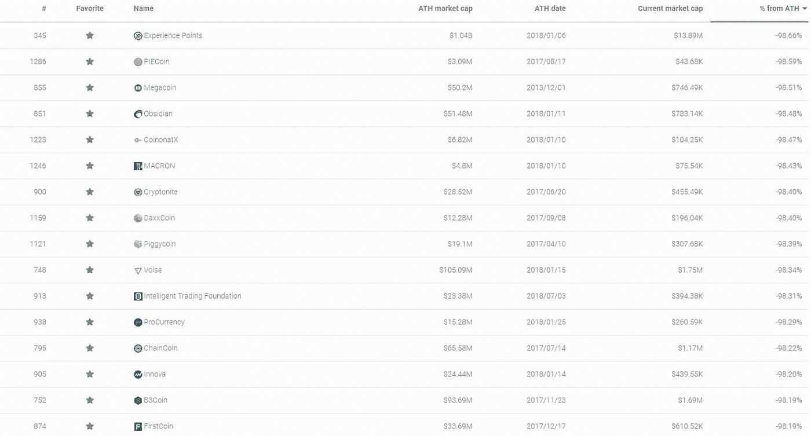
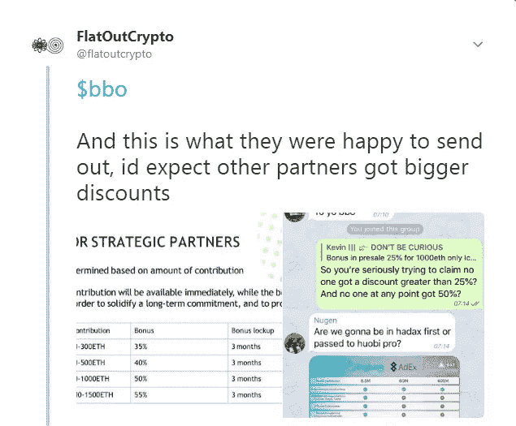
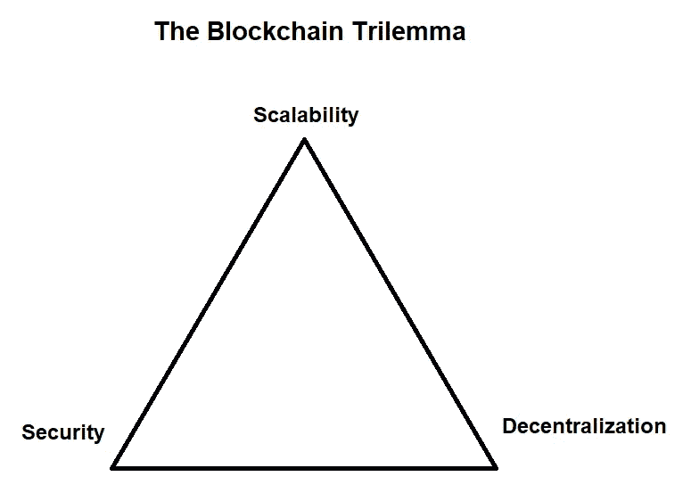

# 加密知识差距——我们是如何走到这一步的，为什么它很重要，以及如何变得更好

> 原文：<https://medium.com/coinmonks/the-crypto-knowledge-gap-how-we-got-here-and-how-we-can-improve-233d167894bd?source=collection_archive---------2----------------------->

**如果你喜欢这篇文章请关注我**[**@ flat outcrypto**](http://twitter.com/flatoutcrypto)**。**

在过去的 12 个月里，关于加密资产的估值是否已经超过当前的采用率的讨论越来越多。然而，人们较少讨论的是，市场增长已经超过了对该系统的技术和金融要素的一般理解。日益成熟的市场和广泛不成熟的知识库之间的这种并列关系正在影响整个加密空间。

在过去十年的大部分时间里，平均能力水平都很高。这是由许多因素驱动的，但主要原因是因为进入壁垒很高:

1.  对于普通人来说，挖掘、存储或使用比特币或其他加密资产在技术上要求很高
2.  由于缺乏便利服务，购买加密资产变得更加困难
3.  认知度低，或与不可取的元素(如丝绸之路)相关联
4.  比特币(以及更普遍的加密货币)在概念上很难被接受

因此，这个领域通常是那些更具技术性的人(我指的不是纯粹的开发者或工程师，而是理解区块链如何运作的人)或掌握比特币固有的概念原则的人(比如去中心化的重要性)的领地。

2017 年加密资产价格的爆炸结束了这一局面，因为各方(到目前为止已经发展到包括大量开发者以及各种积极参与的行业机构、公司、监管机构、主流媒体和其他子集)的激增引起了公众的关注。这种兴趣得到了更方便用户的服务(如比特币基地)的满足，这些服务在前几年一直在稳步改进和增长。人口统计学也随之改变，显著降低了平均知识水平。

**面向营销的行业**

急于投机意味着服务涌现出来以满足这种需求。但这种需求不是为了了解 DLT，而是渴望贸易。和单独交易。信息共享做出了相应的反应，贸易讨论主导了传统媒体、社交媒体、留言板和加密资产网站。

压倒性的问题从“DLTs 是如何工作的，为什么它会改变世界(这将为我这个早期投资者带来巨大的回报)”变成了“未来两天什么会翻 5 倍”。

这导致了秘密营销的快速扩张。我不希望把 2017 年之前描绘成一个乌托邦，我们坐在一起唱着 Kumbaya，同时努力改善人类。当然，有很多猜测。对利润的追求推动了人们对这一领域的兴趣。但行业的较小性质、相对较高的理解程度和有限的主流关注限制了“先令”的规模。简而言之，没有足够的项目，没有足够的销售对象，也没有足够的资金让它变得像现在这样有价值。同样，变化是迅速的。

*   2017 年 1 月 1 日。只有 24 个项目的价值超过 1000 万美元，只有比特币的价值超过 10 亿美元。日交易量保持在 1 亿加元的健康水平。ICOs 在 2016 年筹集了 1 亿加元
*   2018 年 1 月 1 日:507 个项目价值超过 1000 万美元。42 个项目价值超过 10 亿美元。3 个项目价值超过 1000 亿美元。仅比特币的日交易量就达 170 亿美元。ICOs 在 2017 年筹集了 55 亿加元
*   7 月 1 日:价格可能已经下降，但 2018 年上半年，ico 已经筹集了 60 亿美元

这使得今年 ico 平均每月筹资 20 亿美元。很难想象 20 亿美元能买到什么，但不要抱任何幻想——它能买到大量营销力量。这也是许多 ico 使用它的原因。夸张的 ICO 加薪被用来把不需要那么多钱的团队变成炒作机器。购买了数字广告。出版物被增选。赞助的活动和会议。许多项目在世界各地的显要位置购买广告空间，包括电视广告和时代广场等位置的黄金房地产。人们也被收买，作为“顾问”或“投资者”保留下来。

Predators, all around

不幸的是，这些钱很少被用于培养人们去**使用网络或 dapp*。太多的团队(尽管毫无疑问，有许多明智的团队在有效地使用资金)通常更专注于维持或提高他们的令牌的价格，而不是专注于更广泛地采用他们的产品。数百万、数十亿美元被浪费在引诱密码社区在众筹上购买或用荒谬的计划支撑其象征性价格上，如回购计划、不必要的交易所上市或购买所谓的“合作关系”*

# *为什么它很重要*

*但是谁在乎呢？有什么坏处？如果项目想浪费他们的钱支撑他们的价格并危及炒作，那么我该批评谁呢？*

*但这很重要。这很重要，原因有很多，因为它:*

1.  *削弱生态系统*
2.  *增加波动性*
3.  *增加对潜在投资者的剥削*

# *该部门的削弱*

*整个行业的资源流动效率低下。在任何行业，资源(资本和人才)都应该流向最强者，而弱者将被淘汰。然而，在加密领域，资本目前流向强者和弱者。如果你会营销，你就能筹集数百万资金——不管你在建造任何东西时的实际能力或经验如何。这有三个影响:*

*   *它减缓了空间的发展*
*   *考虑到他们巨大的 ETH 储备，弱队太富有而不能消亡。它们可以像僵尸公司一样运作，太富而不能死，太无能而不能茁壮成长*
*   *资本和资源都流向了那些没有考虑生态系统最佳利益的团队*

**

*Zombie companies won’t be as easy to get rid of*

*第一点应该是不言而喻的，尽管如果这是最坏的结果，较慢的进展速度可能是可以接受的。与此同时，僵尸公司并不理想，将有助于(1)但不会对生态系统造成持久的破坏，除了急剧的冲击，如清算他们的储备和突然关闭公司，或用他们以前的 ICO 融资创办一家新公司并从头开始。但是，这是可以遏制的。*

*从长期来看，第三点可能是最危险的。*

*如果一个项目筹集了足够的资金，不管它作为一个分散网络的质量如何，它都可以压倒竞争，会发生什么？如果去中心化的梦想只是被增选，就像之前的互联网一样，会怎么样？拥有数十亿美元的资金意味着你可以取得相当大的成就。去中心化并没有赢得胜利，对于它可能看起来像什么有很多不同的观点(如果我不得不阅读另一份承诺 10 万或 100 万或 1000 万 tps 的白皮书，同时试图隐藏它所需的明显的集中，我会尖叫)。*

*最后一点；许多人提到了治理的重要性。用户越来越被期望成为治理决策的积极参与者。其中，DPoS 网络依靠这种参与来保证网络的安全。当用户缺乏技术知识时，他们该如何投票？大多数人甚至不知道他们应该投票。这对网络的安全性和网络集中化的风险有什么影响？*

# *价格与现实脱节*

*密码市场不稳定。这是意料之中的——我们仍在构建如何对它们进行估值的模型，对于不同的加密资产如何/何时/是否可以货币化存在不同的想法，很少有人采用。简而言之，这是一个新兴的发展中市场，我们正处于价格发现阶段——波动是意料之中的。*

*然而，我猜想，知识的缺乏加剧了价格与任何可行现实的脱节。不是炒潜力，而是兴起了一个行业来支撑钱炒投机的重量。在 2017 年底/2018 年初的 alt 运行中，许多加密资产脱离了任何理性，在这一时期，阅读任何白皮书或过多考虑加密资产都是浪费时间，因为只有一个因素很重要——炒作的能力。*

*我不仅仅是在重申普遍的观察结果，即整体估值超过了任何现实的潜在估值，而是一部分加密资产超过了更广泛市场的趋势。它们变得(许多现在仍然如此)脱离了任何现实主义，取而代之的是被大多数人交易，他们不了解它们，不了解市场，甚至不了解为它们估值所需的成分。因此，他们最终将拥有价值损失 95%以上的资产:*

**

*98%+ losses will become more common as projects fail*

*详细探讨这一点超出了本文的范围，但我认为，当崩溃来临时，最不为人所知的资产(通常也是最被大肆宣传的资产)受到的打击最大，同时也证明了在不同时期对真正的坏消息(如黑客攻击、剽窃、延迟和其他此类小麻烦)具有惊人的弹性。为什么？因为坏消息不能影响不是基于现实的东西的价格。*

# *增加剥削*

*我可以在这里触及交易的一些不受监管的方面(清洗交易、市场操纵等)，但我认为随着市场的发展，更大的参与者推出交易所，监管得到执行，这些将逐步淘汰。*

*然而，许多 ico 目前的做法往往令人震惊，也没有得到足够的讨论，因为有太多的当事方从一个往往不透明的过程中获利。ico 最初被认为本质上是一种众筹手段，大多数早期 ico 都是由散户投资者在一个阶段买下的。随着 2017 年的进展，这种情况发生了变化，越来越多的人开始做预售，作为奖励社区早期成员或以某种方式为项目做出贡献的人的一种方式。现在这已经变得更加紧张，这些预售现在先于私人销售和种子轮。*

*大多数 ico 现在在这些早期阶段出售大部分代币，使得散户投资者无法获得代币(引用监管原因)。然后，他们要么在众卖中出售少量(总供应量的 5-10 %),要么完全取消。这造成了被压抑的需求和供应的集中。*

*我不想淡化向散户投资者出售股票的监管风险，因为这些风险是存在的。然而，这种向禁止的转变伴随着缺乏透明度和保持令牌分发模式的其余部分不变——这对普通人不利。*

**

*传统的创业公司以很低的折扣卖给早期投资者，因为他们承担了项目失败的巨大风险。这就是为什么传统模式认为一个成功的初创公司的估值会在一系列融资轮次中增加——因为许多公司会在融资过程中消亡。*

*太多的项目采用了这种模式，并将其浓缩到毫无意义。众筹开始前几周可能会有一轮种子期。许多预售活动在众筹开始前一秒钟就结束了。许多人甚至在进行大减价的同时进行私下销售(至少现在有一个项目正在这样做！).*

*那么这些资金是用来做什么的呢？为什么会有这么大的折扣？它的工作方式是这样的:*

1.  *T-8 周:公司确实从风险投资或该领域其他声誉良好的公司筹集到了预期筹资总额的 2.5%(例如，2000 万美元的硬上限为 50 万美元)。他们将获得 50-90%的折扣(或 100-1000%的奖金，这听起来有点过分)*
2.  *T-4 周:他们拿着这些钱出去筹集更多的资金，在领先的网站上购买一些正面报道，也许会找一个“顾问”来为他们兜售，从质量较低的风险投资基金或更有可能的资金池(筹集 100-200 万美元)那里获得宣传。这一过程可能会持续一段时间，一些池会比其他池获得更好的折扣。大多数情况下，资金池(或唯一合格投资者)可能会获得 25%至 70%的折扣。哦，还有一些风险投资公司会在这期间把他们的一些配额卖给资金池。项目团队将被告知，任何问题将被删除或忽略*
3.  *T-0:然后公司拿着这笔钱开始认真营销，这样他们就可以在众筹中达到 2000 万美元的硬性上限。风险投资/声誉良好的公司赞助者的标志将到处张贴，以证明该项目是多么“坚实”*
4.  *T+2 周:代币发行。如果它以 3-5 倍的价格开盘，那么这意味着该团队的代币(比如总供应量的 20-30%)现在可能价值 1200-2000 万美元，此外还有 2000 万美元的增加的 ETH。如果令牌在启动时转储，谁在乎呢？它可能下跌 50-90 %,而风险投资基金和资金池仍会赚钱。*

*筹集的资金没有用于让团队在下一轮融资前继续开发。大多数团队只进行一次令牌生成活动，并在早期出售令牌供应。不，他们给予很大的折扣，作为建立社区的捷径。他们这样做是为了在众筹中尽可能多地筹集资金。*

**

*但是谁在乎呢？首先，投资者被骗了，因为他们既不能参与，也不知道巨额奖金和折扣的细节。这些通常与可怜的小(不，六周的背心期不算锁定！)或者没有锁定期。这些投资者随后被风险投资基金和资金池抛弃(再次澄清，这显然不是所有的风险投资基金和资金池——有许多好的参与者)。没有充分的理由不向所有投资者提供之前融资的细节。透明是好事，不是坏事。*

*诸如此类的趋势(还有更多的趋势)将会降低人们对这个领域的信任，导致监管行动的增加，并最终扼杀采用，因为团队没有建立一个感兴趣的用户社区，他们只是让一小部分希望快速更换令牌的人参与进来。做更多的工作来打击恐怖主义并揭露公然的侵权行为符合每个人的利益*

# *那么我们如何变得更好呢？*

*随着时间的推移，有些方面会自然改善。例如，随着更大的投资者进入市场，更透明的交易所出现，以及我们开发出更好、更广泛接受的加密资产估值模型，波动性将会降低。*

*因此，我不太关心交易，更感兴趣的是既能帮助弥合技术差距又能防止许多投资者被剥削的措施。其中一些步骤很小，但我相信这些步骤既实用又能改善我们的行业。*

# *短期*

**项目透明度**

*一个简单的改变。团队不需要透露个人投资者，但要明确有效代币价格和每轮投资期间出售代币的数量。ICO 上市/审查网站应开始强调不提供这种透明度的公司，并将奖金作为考虑的最重要因素之一。当然，不言而喻，受归属期限制的代币应该在智能合约中持有，并且只在适当的时候释放(令人震惊的是，依赖智能合约的项目经常没有出于非常明显的目的使用智能合约)。*

**

*Stop lying to us*

*稍微延伸一下，团队应该提供全面的月度或季度更新，包括资金的使用情况，以及这是否符合众筹承诺。我们经常在白皮书中听到团队的计划和消耗率。*

*鉴于监管的未知性，项目团队可能会倾向于降低透明度，而不是增加透明度。我们需要与此作斗争，并尽可能鼓励透明度。像 [ICO 治理基金会](https://icogovernance.org/)这样的自律行业组织是这方面的必要发展。*

**更多考虑代币销售/分销**

*开始时分配大部分(或全部)供应有时是合适的，但并不是在所有情况下都合适。但是，这是当前的默认设置。更多的团队应该考虑进行小规模加薪，并保留供应直到以后。这可能会更好地协调团队和项目之间的利益，同时给予更多的灵活性。*

*保持供应也可以用来激励用户(而不是交易者)或在产品发布时推动采用。团队还应该考虑更长的锁定期。是的，这可能会吓跑一些投资者——但有许多例子表明，锁定期相当长的项目筹集的资金超过了足够的资金。*

*此外，团队应该停止分发不合理的奖金，这些奖金往往在没有授权期的主要众筹销售前几周或几天发放。有许多团队已经证明，没有这种行为，他们很有可能成功。将奖金的大小与他们承担的风险和他们提供的资金的重要性挂钩。*

**更加重视用户参与**

*同样，我将尽量不挑特定项目的毛病，但启动一个依赖于选民参与的网络，而不便于用户在选举人中实际投票，是不可接受的。想象一下，如果一个政府要求人民投票，但依靠人民自己来建造投票站和印制投票卡。你认为这会有多大效果？*

*去中心化部分依赖于鼓励尽可能多的用户参与，同样，如果你不提供关于如何运行节点、标记令牌或任何其他东西的明确指示，以促进尽可能多的人保护网络，这同样适用。这些都是需要采取的简单步骤，并且完全属于项目团队的职责范围。这并不像“建造它，他们就会来”那么简单。需要的是‘我们如何建造它，让他们来’。*

# *中期的*

**秘密新闻和内容监管**

*新闻业的问题当然不局限于秘密领域。大多数(并非全部)加密新闻网站本质上是靠广告收费的，或者充斥着低质量的内容，读起来就像一个机器人在网页上吐出了 500 个单词(遗憾的是，许多网站可能就是这样)。*

**

*此外，没有人会在意对他们没有投资的项目的负面报道(有成千上万的其他项目——为什么要在糟糕的项目上浪费时间呢？)但是人家真的很在乎有没有投入。这导致了压力和威胁，因为即使指控是真的，大批的骗子也会抓住每一个机会喊“FUD”。如果这是一个真实的问题，那就不是 FUD——这只是新闻。结果呢？作为一名作家，如果你写得好，你的作品会被更多的人阅读，而且你不必处理骚扰。你可以看到哪个方面可能会被写得更多。*

*由于我对这种变化在不久的将来不抱太大希望，因此质量的责任很大程度上取决于对用户创造的(大部分是免费的)内容的监管。*

*与加密资产相关的信息资源数量显著增加，但许多最优质的内容现在却隐藏在人们的视线之外，要么局限于寻求阻止“文”集团的私人团体，通过更难搜索的媒体(如电报)进行搜索，要么完全迷失在竞相推广他们通常无用的最喜欢的内容的漩涡中*

*例如，Medium 包含比任何加密新闻网站更高质量的内容，但其中大部分注定永远不会被阅读，因为它很难找到。除非你是极少数可以依靠最大粉丝转发的人之一，否则你的内容将基本保持隐藏。像 Reddit 这样的网站也在努力解决这个问题，因为机器人大军会投票支持劣质内容，而优质内容会被忽视。普通用户倾向于分享和支持那些以积极的方式描述他们项目的内容，而否决其他内容。Twitter 更好，但当然很大程度上依赖于你的追随者名单的管理。也就是说，我依靠 Twitter 来寻找其他网站上的最佳内容——链接材料的质量远远高于其他平台。*

*这方面的一个日益增长的趋势是每天和每周的时事通讯，如 [TokenDaily](http://tokendaily.co) 和 [TokenEconomy](#) 以及由[纳撒尼尔·惠蒂莫尔](https://twitter.com/nlw)等人策划的 Twitter 阅读。这些是非常重要和真正有益的。*

*我们如何改进的另一种方法可以在诸如 [Messari](https://messari.io/tcr/whitepaper.pdf) 这样的项目中看到。梅萨里的目标是建立“一个公共数据库，存放标准化代币发行者披露的信息，可以作为代币经济的金融支柱，就像现代金融市场中 SEC 的埃德加数据库一样”。这符合对透明度的需求，但[令牌管理的注册管理机构](/@tokencuratedregistry/the-token-curated-registry-whitepaper-bd2fb29299d6)(TCR)也有助于推广和获取高质量的内容。*

*这种 TCRs 的使用，其中项目信息是免费的、开源的，并在经济上受到激励，以确保准确性和质量，可能被证明是提高信息质量的一个组成部分。他们不是没有问题，但他们肯定能提供帮助。*

**项目提供内容**

*这是一个棘手的问题，但我相信，公司可以发挥作用，更好地向公众宣传 DLT 是什么，以及他们项目的组成部分。根据公司的不同，信息可能会有所不同，例如:*

*   *项目:什么是 DLT，什么是区块链，共识算法 X 是如何工作的，我们为什么选择它，我们正在努力消除的潜在攻击媒介是什么，我们的解决方案固有的问题是什么(CAP 定理、可伸缩性三元悖论等)*
*   *交易所:把你的资产留在交易所有什么风险，你如何把你自己的代币存放在私人钱包里，每种加密资产的基本信息(供应量、当前市值、发行价、重要新闻事件、投资者数量/众筹详情等信息的链接、白皮书的解释/分类等)*

**

*这可以是相当简短的(比如你第一次访问 MyEtherWallet/MyCrypto 时出现的介绍性警告),也可以是更详细的资源，比如 BitMex 的 research 输出。如果有更多非英语语言的内容也会有所帮助。*

*项目也应该致力于让他们的白皮书更容易被理解。我从大约 500 份白皮书中抽取了样本，并根据字数和可读性对它们进行了分析(为了方便起见，我采用了 Flesch-Kincaid 等级，我确信它存在缺陷和问题，但这是浏览这么多白皮书的唯一现实方法)。我发现:*

*   *它们的长度大幅增加，从 2016 年的平均 5869 个词增加到 2018 年的 9381 个词*
*   *弗莱斯-金凯分数从 18 分提高到 13 分，这意味着它们变得更容易阅读*

*由于我随机抽取的论文样本，这些结果可能有些武断，但增加的篇幅符合我自己的经验。不幸的是，我怀疑大部分的附加内容都是同样的反复强调区块链是什么，比特币缺乏可扩展性等等，等等，等等，我们明白了。比特币做不了 Visa 那么多 TPS，我们已经听过几百遍了。重点解释你自己的项目，它是如何工作的，以及它将如何改善用户的生活。*

*我对弗莱斯-金凯评分的下降感到惊讶，但这可能是因为普通人针对的是普通投资者，所以故意让它变得更简单。另一方面，一些更“严肃”的白皮书是难以理解的。至少让所有人都能看到你的摘要(旁注:它可能已经有近十年的历史了，但比特币白皮书仍然是白皮书应该是什么样的最清晰和最好的例子之一，即使是现在也很值得一读)。*

**项目失败**

*变化的最大驱动力之一将是项目开始失败，驱动令牌值为 0。到目前为止，加密资产的相关性很高，这意味着弱项目以与强项目相似的方式增加或减少。随着市场的成熟，我们开始看到项目失败，投资者将意识到尽职调查的重要性，资金应该停止流向糟糕的团队。*

# *长期的*

*这个空间是一个新的领域，因此技术知识将随着时间的推移扩散到更广泛的受众，就像计算机、互联网、应用程序开发和基本上所有的技术开发一样。*

*为了加快这一过程，我建议新进入这一领域的人(或希望更多地了解技术方面的人)少关注单个项目，而更多地关注理解它们所必需的构件，例如:*

*   *什么是不同类型的 DLT，例如区块链*
*   *在区块链或比特币的背景下，去中心化意味着什么*
*   *什么是共识算法，它们如何解决拜占庭将军问题*
*   *网络是如何被攻击的？我们如何阻止他们被攻击？*
*   *为什么 DLT 会做出这样的设计选择，例如[可扩展性三难困境](https://www.jeffersoncapital.info/the-scalability-trilemma/)、[上限定理](https://en.wikipedia.org/wiki/CAP_theorem)*

**

*Understand the tradeoffs projects make*

*适度详细地理解这五个入门主题将使你更有能力提炼扔给你的信息，并能够客观地评估哪些主题走了不可接受的捷径或提出了不可取的系统。*

*我还试图用关于[共识机制](https://flatoutcrypto.com/home/introtoproofofwork)和[攻击媒介](https://flatoutcrypto.com/home/cryptointrosybilattack)的介绍性文章做出一点小小的改变，并让一些[更难的](https://flatoutcrypto.com/home/maidsafeparsecexplanation)白皮书[变得容易理解](https://flatoutcrypto.com/home/avalancheprotocol)。*

# *走向*

*随着时间的推移，一些问题会自然解决。我们将看到估值模型受到更多关注，机构的进入将带来更高的专业水平和研究资源。坏演员将被揭露。*

*其他问题不仅限于加密，例如人们越来越倾向于相信他们想相信的真相，假新闻的出现以及现在在我们全球高效网络中传播的大量信息。*

*然而，如上所述，可以做出明确而简单的改变，使情况更加公平，更容易为所有人所利用。如果获得通过，它们将使生态系统成为一个更强大、更公平的空间。*

***如果你喜欢这篇文章请关注我**[**@ flat outcrypto**](http://twitter.com/flatoutcrypto)**。***

***免责声明:我过去曾向资金池捐款，将来还会继续捐款。我认为，从投资者的角度来看，资金池没有任何问题，我认为透明和终结巨额奖金的责任在于项目团队(尽管我通常会避免为有这种奖金的项目捐款)。***