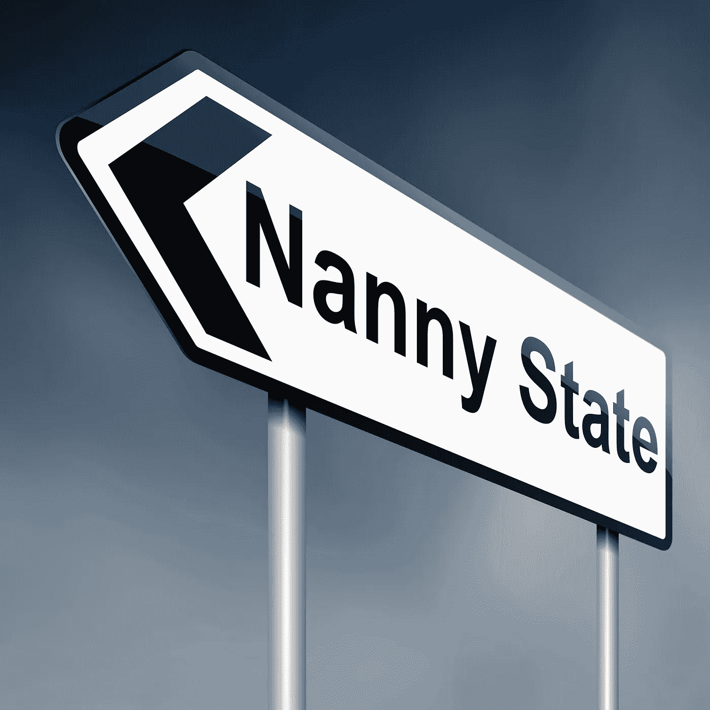

# 秘密保姆民族国家

> 原文：<https://medium.com/coinmonks/the-crypto-nanny-nation-state-1a71a8d7a5c0?source=collection_archive---------14----------------------->

~dwulf

当我和一个拥有法国和美国双重国籍的朋友聊天时。我们讨论了加密货币的机遇，以及它在世界上是如何发展的。作为一名工程师，我真心喜欢这个想法。效率和效用的水平吸引了我，并使我相信，将一个人的所有财富放入一个纯粹、不掺杂、透明的财富责任单位系统是处理财务的最佳方式。

作为一名工程师，我一直在寻求建立一种有效的机制，将第三方中介排除在我的业务之外，专注于隐私，消除任何和所有的监管关系，并保持我的业务是我的业务，而不是我的业务和其他人的业务。

我的朋友告诉我一些即将到来的加密货币 DeFi 的奇妙项目将有助于做到这一点，但不幸的是，由于美国的监管问题，任何和所有美国公民都被限制参与其中。

这激怒了我，因为我的出生和美国公民身份是偶然的，我发现自己被排除在前沿区块链和加密项目之外，这些项目更具创新性，对该领域的先进项目开放。试图为这些项目创建用户帐户来进行实验被我位于美国的 IP 地址地理屏蔽了。他们网站上的横幅明确表示，任何和所有美国公民都被禁止创建账户和参与他们的生态系统。

允许美国公民参与的任何选项通常都是原始系统的淡化版本，该系统排除了受欢迎的令牌，限制了任何交易的杠杆能力，并强制要求 KYC/反洗钱注册，包括社会安全号码、税号、个人政府身份证、用公用事业账单或银行信件进行的地址验证。

这方面的一个例子是币安。他们最初的交易系统最终关闭了所有美国公民用户的账户，并因为监管问题禁止他们开设任何用户账户。但美国市场很大，大到足以让币安创建另一个名为币安美国的无能交易所，该交易所的加密货币选择有限，杠杆选择也受到限制。此外，对提交的 KYC/反洗钱进行认证需要等待很长时间。

对于采用加密生态系统来说，这是一个严重的问题，因为监管机构正在禁止美国公民以适当的、非 KYC/反洗钱的方式加入，因为强迫美国公民注册直接违反了加密经济自由的 5 个支柱(开放、公共、无国界、中立和抵制审查)

## **美国公民戴的伟大的加密绿帽子**

BTC 要出发了，每个人都想坐火车去兰博。BTC 的美妙之处在于，在世界历史上，货币机制第一次掌握在人民手中，而不是政治家手中。在很大程度上…

旧世界经济中仍有陈旧的垂死派别，政府和他们腐败的系统开始意识到分散的区块链和作为其一部分的加密货币不会消失，并正在创造真实的世界价值和先进的效用，旧世界经济无法从任何参与该系统的人那里保留这些价值和效用。他们希望他们的卷须在每一个加密钱包被创造。

证券交易委员会，国税局，财政部，以及每一个给他们的公民戴绿帽子的独裁者都会不择手段地对你的密码进行绝对控制和监控。这在美国尤其如此，可悲的是，他们正在为他们的养牛公民创造特殊的圈养围栏，这些围栏经过适当的批准和消毒，供他们使用。

虽然自由世界的其他人有更多更好的选择，但美国公民是一个特例，他们的社会安全号码或税务 id 进行标记和索引，并被要求提交这个号码用于就业和日常银行业务，这违反了加密自由的 5 大支柱(开放、公开、无边界、中立和抵制审查)的精神，以保护美国公民的名义，创造了一个特殊的游戏围栏沙箱，在那里他们可以不受惩罚地受到“保护”、监视和监控。

## **避开监管小丑的变通办法**

虽然监管者确实在一定程度上控制了加密价格和汇率的波动性，但并非所有风险都消失了。他们不可能完全控制一个分散的系统。

他们可能没有能力直接迫使他们的公民获得他们想要的戴绿帽子的地位，监管机构确实撒下了一张大网，迫使其他离岸加密交易所限制美国的任何人参与国际加密交易所的广泛自由。

这不仅通过抑制新加密机制的完全自由来限制美国公民参与全球加密竞赛，而且还使美国公民对全球加密和最灵活和突破性的加密选项关闭。

为了避免这些监管限制，并保持独立于监管路障和自由抑制法律，我建议所有加密用户，尤其是美国公民采取以下措施:

## **不向常规交易所进行 KYC/反洗钱**

这可能是最难做到的，但也是最重要的，因为一旦你将你的个人身份附加到任何交易所或加密钱包上，你就立即成为了容易被攻击的目标。要么是像黑帽黑客这样的犯罪分子，无良雇员，要么是腐败的政府机构。您的个人身份允许集中和完善的鱼叉式网络钓鱼攻击，即使是最勤奋的安全意识用户也可能成为受害者，在自我主权和完全保管的区块链加密游戏中，只需一个错误就可以失去一切，如果他们知道您是谁，他们可以定制个性化的攻击来没收您的加密资产。

## **习惯性使用 VPN 和 TOR 网络**

你应该已经这样做了，默认情况下，在你的计算生活的所有领域。即使您不进行 KYC/反洗钱并暴露您的身份和您与您的加密资产的联系，间谍机构、老练的黑客和其他勤奋的力量也能够慢慢地判断您的大概位置和身份，缩小您是谁和您的加密资产的可能性池。

## **分散你的加密资产，使用区块链安全工具**

使用多个热的、暖和的和冷的加密钱包，使用加密混合器，并在安全专用硬币和代币之间交换加密持有物，从 BTC 到莫尼罗，通过混合器运行它，将其交换到另一个硬币或代币，然后返回。目前，这可能是昂贵的，花费很多汽油，但随着更好的区块链被开发出来，解决了移动你的密码的高成本，如 Polkadot/Kusama，Cardano 等，这样做的成本会下降。

虽然第一种方法是 100%有效的，但综合方法的良好组合将增加中介机构以指数方式锁定你的难度，增加阻力，防止你成为低处悬挂的果实。

> 加入 Coinmonks [电报频道](https://t.me/coincodecap)和 [Youtube 频道](https://www.youtube.com/c/coinmonks/videos)了解加密交易和投资

## 另外，阅读

*   [最佳加密交易信号电报](/coinmonks/best-crypto-signals-telegram-5785cdbc4b2b) | [MoonXBT 评论](/coinmonks/moonxbt-review-6e4ab26d037)
*   [OKEx 评论](/coinmonks/okex-review-6b369304110f) | [Coinswitch 俱吠罗评论](/coinmonks/coinswitch-kuber-review-1a8dc5c7a739) | [比特币基地收费](/coinmonks/coinbase-fees-831e77d4f2c5)
*   [AscendEX 审查](/coinmonks/ascendex-review-53e829cf75fa) | [OKEx 交易机器人](/coinmonks/okex-trading-bots-234920f61e60) | [OKEx 交易机器人](/coinmonks/okex-trading-bots-234920f61e60)
*   [火币交易机器人](https://blog.coincodecap.com/huobi-trading-bot) | [如何购买 ADA](https://blog.coincodecap.com/buy-ada-cardano) | [Geco？一次审查](https://blog.coincodecap.com/geco-one-review)
*   [币安 vs 比特邮票](https://blog.coincodecap.com/binance-vs-bitstamp) | [比特熊猫 vs 比特币基地 vs Coinsbit](https://blog.coincodecap.com/bitpanda-coinbase-coinsbit)
*   [如何购买 Ripple (XRP)](https://blog.coincodecap.com/buy-ripple-india) | [非洲最好的加密交易所](https://blog.coincodecap.com/crypto-exchange-africa)
*   [非洲最佳加密交易所](https://blog.coincodecap.com/crypto-exchange-africa) | [胡交易所评论](https://blog.coincodecap.com/hoo-exchange-review)
*   [eToro vs robin hood](https://blog.coincodecap.com/etoro-robinhood)|[MoonXBT vs by bit vs Bityard](https://blog.coincodecap.com/bybit-bityard-moonxbt)
*   [Stormgain 评论](https://blog.coincodecap.com/stormgain-review) | [Probit 评论](https://blog.coincodecap.com/probit-review) | [北海巨妖评论](/coinmonks/kraken-review-6165fc1056ac)
*   [如何在势不可挡的域名上购买域名？](https://blog.coincodecap.com/buy-domain-on-unstoppable-domains)
*   [印度的加密税](https://blog.coincodecap.com/crypto-tax-india) | [altFINS 审查](https://blog.coincodecap.com/altfins-review) | [Prokey 审查](/coinmonks/prokey-review-26611173c13c)
*   [Blockfi vs 比特币基地](https://blog.coincodecap.com/blockfi-vs-coinbase) | [BitKan 点评](https://blog.coincodecap.com/bitkan-review) | [期货交易机器人](/coinmonks/futures-trading-bots-5a282ccee3f5)
*   [南非的加密交易所](https://blog.coincodecap.com/crypto-exchanges-in-south-africa) | [BitMEX 加密信号](https://blog.coincodecap.com/bitmex-crypto-signals)