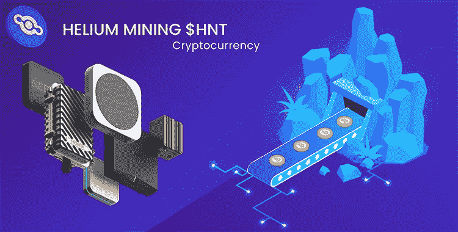

# Crypto Oracle | Mine Crypto With Radio—20 倍 HNT 价格潜力

> 原文：<https://medium.com/coinmonks/the-crypto-oracles-mine-crypto-with-radio-hnt-price-potential-c8dd3866b28b?source=collection_archive---------8----------------------->

## 只需一个 400 美元的氦兼容热点，每月至少赚取 100 美元的采矿加密。

[Helium Website](https://www.helium.com/mine#hotspots)

你有没有考虑过挖掘加密货币？你可能已经意识到，只有在大规模和使用最高质量的计算机设备的情况下，这样做才有意义。这很贵，但有更经济的东西。你现在可以用无线电使用[氦](https://www.helium.com/mine#hotspots)采矿，并在氦区块链上赚取他们的 HNT 加密货币。**氦正在为物联网、5G 和一般无线设备构建一个分散的“人民网络”**。

## 它是如何工作的

氦使用**覆盖证明激励模型**工作，该模型基本上检查氦热点是否正在广播 LongFi 信号。存在随机选择的热点，其挑战其他热点并见证热点以确认挑战。一旦覆盖范围通过验证，所有参与验证的人员都将获得 HNT 奖励。一些 HNT 被刻录成数据信用(DC)，然后用于向互联网发送数据。

**注*** :氦社区已经批准并一致推荐[山猫矿工 300](https://www.bobcatminer.com/) 热点。它拥有网络中最大的用户群之一。您可以使用 [Hotspotty](https://hotspotty.net/) 作为工具来帮助优化和管理您的热点。入门视频指南:

拆箱&如何设置:

## 燃烧和薄荷平衡

**使用 DC 的设备越多，HNT 被烧毁的次数就越多。**最终，该算法将找到一个烧钱和造币的平衡，使网络高效运行，同时保持可持续的 HNT 供应——这有效地使 HNT 保持其价值，并随着更多的参与者加入、获得和持有他们的密码而增值。每焚烧 1 美元的 HNT，就能铸造 10 万 DC。

网络中实施了净排放建议，基本上将 DC 的一小部分转换回 HNT，以奖励用户。当对 DC 需求很高时，这种转变就会放缓。反之亦然。目前的净排放率为 1%。

## HNT 令牌组学

首先，重要的是要注意到没有**矿前或最初的硬币提供** (ICO)氦。然而，**出售的安全令牌与分配给氦公司和投资者的总 HNT 供应量**的 35%的百分比份额相关。(即，如果投资者持有 50%的证券代币，他们将获得分配给该分配组的 35% HNT 中的 17.5%。)

1.2 亿 HNT 是在协议生效的头两年铸造的，供应量上限为 2.23 亿。HNT 已经制定了一个减半的时间表来降低通货膨胀率。最近，年铸造量从 6000 万下降到 3000 万。每两年排放率将减半，直到达到最大供应量。这将需要 50 年的时间。

## 分散式 5G 对集中式电信的利用

5G 的信号强度由于其 5Ghz 的频率而容易被破坏。频率越高，范围越短。这意味着需要比旧的无线基础设施更多的 5G 塔，这使得该技术的扩展成本高昂且耗时。氦利用加密来激励来自世界任何地方的**人运行 5G 氦热点**，然后可以被任何接入网络的 5G 兼容设备利用。

氦的首席执行官最近暗示**传统互联网服务提供商将能够利用氦 5G 网络**。这对 HNT 来说是一个非常好的消息，因为该网络将获得更多的使用、关注和采用。

## 对运行氦热点的担忧

**来自氦热点授权卖家的所有数据都是加密的。**然而，如果你计划使用**非授权设备进行挖掘，**发送的数据有可能没有经过加密。坚持使用官方认可的设备。

然而，你不需要运行一个热点就可以投资 HNT 代币。

## 前方的路

到目前为止，Helium 的前进道路由社区提出的无数改进建议组成。一个值得注意的问题是**允许你拥有或添加多个钱包来接受 HNT 奖励**，如果你利用朋友拥有的财产并签订利润分享协议，这可以更容易地扩大你的网络。

还有一个氦分散治理的提议，需要锁定 HNT 的投票权。这将**减少流通供应**——这是 HNT 价格潜力的另一个看涨因素。

**还提出了区域奖励等级，这将优化特定区域的热点奖励**。本质上，这使得网络更有效地扩展，从而增加每个人的利润；更多的热点将上线，允许更广泛的连接和处理更多的数据，这增加了 HNT 的收入。

# 结论

总而言之，有一个忠诚的、充满激情的团队和社区参与了氦的开发和改进。人民网每天都在增长，现在有超过 20 万个热点。每天，越来越多的人抓住了 crypto 带来的机会。在疫情期间，我们已经看到一种模式，人们辞去工作，追求更独特和真实的方式来建立他们的财富——用无线电挖掘密码似乎是一个显而易见的，聪明的机会。氦必将继续增长，并使其象征 HNT 的价格飙升，其基本价值主张是为所有人建立一个全球性的分散网络。

感谢阅读 ***加密神谕*** 系列！如果你认为我应该调查任何与密码相关的事情，那么通过 Twitter DM ( [@kyledcollins](https://twitter.com/kyledcollins) )告诉我。我总是在寻找好机会。此外，如果您有任何问题，请随时联系我们**。**

*请注意，我写的都不是财务建议——只是我对投资机会的看法。*

电子邮件:kyledanielcollins@gmail.com

> 加入 Coinmonks [电报频道](https://t.me/coincodecap)和 [Youtube 频道](https://www.youtube.com/c/coinmonks/videos)了解加密交易和投资

## 也阅读

 [## 杠杆代币[多头代币]终极指南

### 杠杆化令牌是具有杠杆化风险敞口的 ERC20 令牌，不考虑保证金、要求、管理…

medium.com](/coinmonks/leveraged-token-3f5257808b22)  [## 最佳加密交易所| 2021 年十大加密货币交易所

### 加密货币交易所的加密交易需要了解市场，这可以帮助你获得利润。之前…

blog.coincodecap.com](https://blog.coincodecap.com/crypto-exchange)  [## 2021 年最佳加密交换平台| CoinCodeCap

### 如果我们看看今天的场景，许多加密货币交换平台提供了广泛的功能和深度…

blog.coincodecap.com](https://blog.coincodecap.com/best-swap-platforms)  [## 2021 年最佳加密借贷平台| 6 大比特币借贷平台

### 获得比特币和其他加密货币的最佳贷款利率

medium.com](/coinmonks/top-5-crypto-lending-platforms-in-2020-that-you-need-to-know-a1b675cec3fa)  [## 2021 年 6 大最佳硬件钱包|顶级加密硬件钱包[更新]

### 最好的加密货币硬件钱包是绝对必要的。我们将在 NGRAVE、Ledger Nano X 和…

medium.com](/coinmonks/the-best-cryptocurrency-hardware-wallets-of-2020-e28b1c124069)  [## 2021 年最佳免费加密交易机器人

### 2021 年币安、比特币基地、库币和其他密码交易所的最佳密码交易机器人。四进制，位间隙…

medium.com](/coinmonks/crypto-trading-bot-c2ffce8acb2a)  [## 最佳 4 个加密交易信号电报通道

### 这是乏味的找到正确的加密交易信号提供商。因此，在本文中，我们将讨论最好的…

medium.com](/coinmonks/best-crypto-signals-telegram-5785cdbc4b2b)  [## 获取信号、交易机器人和套利

### 编辑描述

blog.coincodecap.com](https://blog.coincodecap.com/bitsgap-review)  [## 40 个最佳电报频道，用于加密、电影、表演和演讲| CoinCodeCap

### 编辑描述

blog.coincodecap.com](https://blog.coincodecap.com/best-telegram-channels)