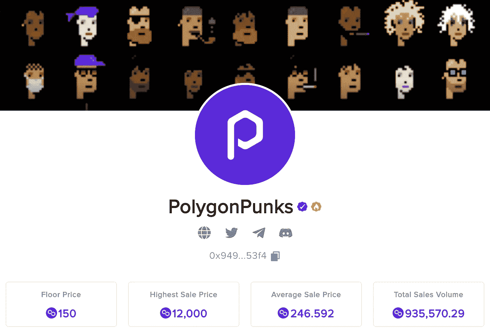
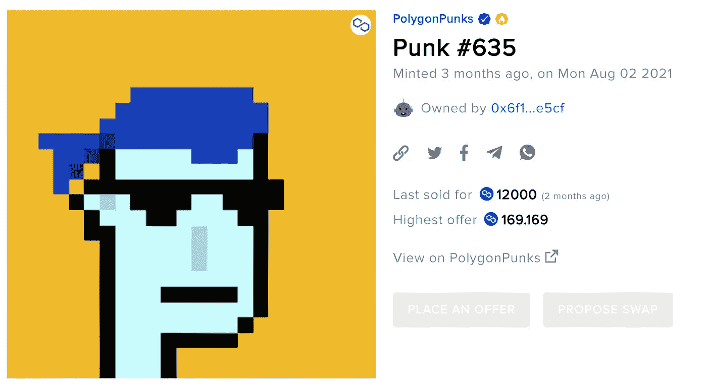

# 加密神谕|多边形债券将推动多边形 NFT 市场

> 原文：<https://medium.com/coinmonks/the-crypto-oracles-polygonpunks-will-propel-the-polygon-nft-marketplace-fc14f798b2c0?source=collection_archive---------3----------------------->

## PolygonPunks 将把 NFTs 介绍给一批新的 web 3 用户。

[PolygonPunks NFT Marketplace](https://app.nftrade.com/assets/polygon/0x9498274b8c82b4a3127d67839f2127f2ae9753f4)

一旦他们以六位数或更多的美元开始销售，他们就席卷了全世界。这引起了很多关注，人们开始问他们错过了什么。为什么这些像素化的个人资料照片卖这么高？[一旦加里·维以超过 300 万美元的价格购买了一台](https://decrypt.co/77328/gary-vaynerchuk-cryptopunk-ethereum-nft)，他庞大的粉丝群和 NFT/加密社区就注意到了。但那时想参与炒作已经太晚了。现在你必须有六位数的可支配收入才能买一台。**对于绝大多数人来说，进入这个具有炒作和文化意义的新社区的门槛变得遥不可及。**

## 朋克的意义

加密朋克是以太坊区块链上发行的第一批 NFT 之一。它们是由幼虫实验室在 2017 年 6 月发布的。随着 NFT 势头越来越猛，特别是随着[Beeple 6900 万美元的 NFT 艺术品拍卖](https://www.nytimes.com/2021/03/11/arts/design/nft-auction-christies-beeple.html)，人们开始寻找 NFT 来购买。NFT 是首批被创造出来的产品之一，价格迅速上涨。在这个新的蓬勃发展的市场中，人们想要拥有以太坊上的第一批收藏品。一个充满活力的社区在隐朋克周围形成。繁荣过后不久，就出现了骗局。

PolygonPunks 看起来与 CryptoPunks 相似——它们有相似的特征，但实际上更多样化，具有独特的属性和各种背景颜色。**最棒的是，PolygonPunks 是第一批在 Polygon 网络上创建的“朋克”，而且还比较实惠！**

## 多边形网络|未来的突出

Polygon 网络为分散金融(DeFi)和 NFTs 创造了奇迹，因为它是以太坊区块链的快速、高效和廉价的扩展解决方案。**它已经民主化了进入 NFT 空间的途径。**随着越来越多的人加入 DeFi 和 NFTs，Polygon 的用户群将因其低廉的交易费而增长。**这种入职人数的激增将通过第二层网络，就像多边形一样，因为机构** [**开始建立在它们**](https://www.coindesk.com/business/2021/09/01/coinbase-to-use-polygons-ethereum-scaling-solution-to-reduce-prices-settlement-times/) **之上。NFT 最大的市场——Opensea 上的账户总数只有 35 万多一点。**我们甚至还没有接近 NFT 的潜在市场参与者数量。****

以太坊网络上的交易费用对许多人来说是进入和关闭的一大障碍。不可避免的是，比特币基地将寻求集成第 2 层解决方案，因为这将增加他们的市场份额并最大化他们的利润。这意味着更容易进入 Polygon 上的 NFT 市场，因为在网络上获得资金将变得更容易。

**最终，PolygonPunks 被完美定位，以占领错过了 CryptoPunks 并拒绝加入以太坊网络的市场。**你认为进入这个市场的新人会寻找什么样的 NFT？新用户在 Polygon 上看到的可能是最熟悉的 NFTs。

**比特币基地正在推出自己的 NFT 市场，有理由推测它可能建立在 Polygon 网络上(或者至少支持它)。**自从比特币基地对 Polygon 进行风险投资，并宣布整合 Polygon 进行交易以来，越来越明显的趋势是向更实惠的区块链网络过渡。Polygon 将会特别受欢迎，因为比特币基地的采用，也因为它是为与以太坊主网协同工作而构建的——利用它的用户基础和安全性。现在让我们来看看 PolygonPunk 迄今为止的成长情况。

# 迄今为止的增长

## 热情的社区

PolygonPunks NFTs 的销售额已经超过 300 万美元，尽管它是 CryptoPunks 的翻版(有人认为它没有创意，很平庸)。该社区一直在持续增长，销售活动也一直很稳定，偶尔会出现高峰(因为这些买家看到了价值，并购买了最罕见的多边形玩具)。

分散项目背后的美妙之处在于，任何一群热情的支持者都可以团结起来，推动他们自己的计划来改进一个项目，并将其融入文化之中。这就是我们在聚精会神的实验中看到的。

## DMCA 对幼虫实验室的反通知——多边形陷阱的胜利

CryptoPunks 的创造者幼虫实验室对 PolygonPunks NFT 收藏提起了版权侵权诉讼。Opensea 随后将 PolygonPunks 从平台上撤下，等待进一步通知。PolygonPunks 以 DMCA(版权)反通知回应了幼虫实验室的索赔，并取得了胜利——这标志着该项目的合法性和价值的不确定性的结束。[**NFT 收藏品随后在 Opensea 重新上市，购买量一直在增加。**](https://cointelegraph.com/news/cloned-cryptopunks-are-back-on-opensea-marketplace-after-dmca-counter-notice)

## 分散土地伙伴关系

PolygonPunks 已经与元宇宙一家流行的空间和服务公司“分散之地”合作，为 PolygonPunks 的持有者指定虚拟空间。你现在可以在分散土地的公共空间展示你的多边形。我听说元宇宙将会有更多的公用事业公司。

## VC 会谈和更多的合作伙伴被戏弄

PolygonPunks 的社区领导人正在努力与能够为持有者带来更多价值的相关方建立联系。我收听了一个“问我任何事”(AMA)——这通常会在官方 [Discord](https://discord.com/invite/qHmfuzYgpn) 或 [Twitter](https://twitter.com/PunksOnPolygon) 中宣布——我还听到社区领袖在与风险投资伙伴进行潜在的合作。**这也暗示着，随着现实世界对持有者的利用，将会有更多的合作伙伴！这让我对这个项目总体上非常看好。**

# 结论

**本质上，PolygonPunks 社区随着时间的推移取得了正增长。这个系列开始时有稳定的采用，直到突然剩下的几千个 NFT 在几分钟内被制造出来。**从那时起，该项目一直处于价格探索阶段，社区领导为发展该项目付出了宝贵的努力。很明显，NFT 已经变得有些派系化——这不一定是件坏事。更多的人加入 Polygon 社区并在网络上寻找有价值的 NFT 只是时间问题——从而为现有的派系增加更多的力量。****

Polygon 上的第一批 NFT 朋克对新用户来说肯定是一个赌注，因为这些收藏品看起来很熟悉，而且其创建背后有一段有趣的历史。可以肯定的是，随着时间的推移，更多有经验的 NFT 社区成员将意识到 PolygonPunks 的价值，这也将推动他们的资本流向 Polygon NFT 市场，并带动更多的需求。

**这只是 NFT 市场的开始。**就创造和实用性而言，这一领域还有很多值得探索的地方，它远非一种快速的时尚。我很高兴看到这一景观的未来以及 PolygonPunks 领导人将建立的公用事业和社区。

感谢阅读 ***的加密神谕*** ！如果你认为我应该调查任何与密码相关的事情，那么请通过 Twitter DM ( [@kyledcollins](https://twitter.com/kyledcollins) )告诉我。我总是在寻找好机会。另外，如果您有任何问题，请随时联系我们**。**

*请注意，我写的都不是财务建议——只是我对投资机会的看法。*

电子邮件:kyledanielcollins@gmail.com

> 加入 Coinmonks [电报频道](https://t.me/coincodecap)和 [Youtube 频道](https://www.youtube.com/c/coinmonks/videos)了解加密交易和投资

## 也阅读

 [## 杠杆代币[多头代币]终极指南

### 杠杆化令牌是具有杠杆化风险敞口的 ERC20 令牌，不考虑保证金、要求、管理…

medium.com](/coinmonks/leveraged-token-3f5257808b22)  [## 最佳加密交易所| 2021 年十大加密货币交易所

### 加密货币交易所的加密交易需要了解市场，这可以帮助你获得利润。之前…

blog.coincodecap.com](https://blog.coincodecap.com/crypto-exchange)  [## 2021 年最佳加密交换平台| CoinCodeCap

### 如果我们看看今天的场景，许多加密货币交换平台提供了广泛的功能和深度…

blog.coincodecap.com](https://blog.coincodecap.com/best-swap-platforms)  [## 2021 年最佳加密借贷平台| 6 大比特币借贷平台

### 获得比特币和其他加密货币的最佳贷款利率

medium.com](/coinmonks/top-5-crypto-lending-platforms-in-2020-that-you-need-to-know-a1b675cec3fa)  [## 2021 年最佳免费加密交易机器人

### 2021 年币安、比特币基地、库币和其他密码交易所的最佳密码交易机器人。四进制，位间隙…

medium.com](/coinmonks/crypto-trading-bot-c2ffce8acb2a)