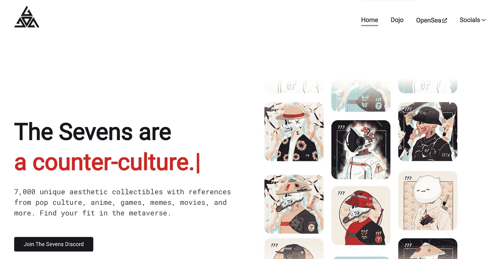
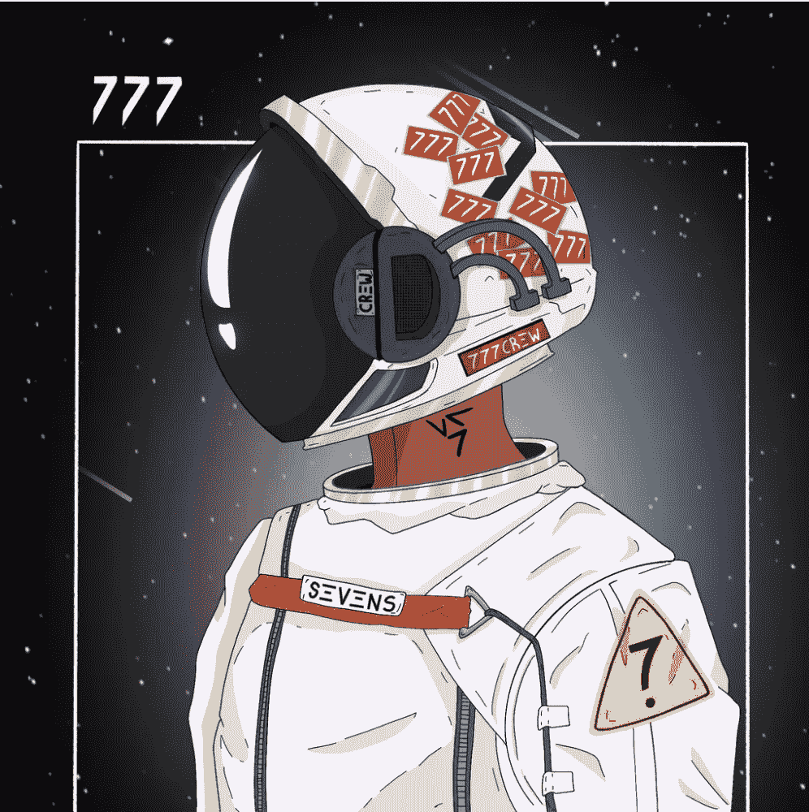
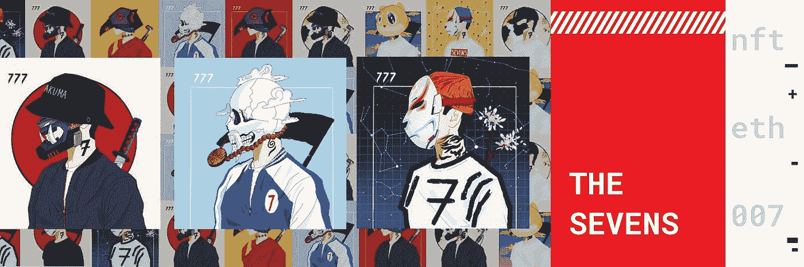

# 加密神谕|七人 NFT 计划正准备发射🚀

> 原文：<https://medium.com/coinmonks/the-crypto-oracles-the-sevens-nft-project-is-preparing-for-liftoff-7ccff8d13d9?source=collection_archive---------5----------------------->

## 为什么 99%的 NFT 项目将归零，为什么 7 将有助于形成一种新的文化范式。

[The Sevens Official Site](https://thesevensofficial.com/)

***编者按:不是理财建议***

非专利技术的创立开辟了知识产权的新世界——尤其是对艺术家而言。**艺术家现在可以将他们的艺术作品或内容符号化，并以版税和出处出售**——所有权的证明和历史。一旦数字资产的所有权能够通过 NFTs 和区块链得到证明，在钱包里没有令牌化资产的情况下要求其所有权就变得轻浮和不酷了。这是由于非功能性测试的可验证性，甚至是一些非功能性测试的用例。这个拥有 NFT 艺术品的用例的想法让我开始讨论七的潜力；它们是收藏品，是反文化运动，是元宇宙和 NFT 景观的影响者。

吸引我进入七人组的主要原因是他们在路线图中宣称的一个**敏锐的观察和建议**:

> “该领域的许多项目都相当孤立。我们想象未来会有很多 NFT 项目相互合作，就像世界上很多时尚品牌一样。我们将寻找并接触潜在的合作伙伴。”

然后他们继续解释他们的愿景:

> “我们的愿景是通过 NFTs 将世界各地的人和项目联系起来并赋予他们权力。我们想象一个未来，所有 NFT 的项目和品牌和谐地一起工作，无论是在实体领域还是在数字领域。

这种洞察力是我喜欢在 NFT 项目中看到的——它引领潮流，具有前瞻性。有送货的保证吗？不，但是好处太大了，不能错过。另外，他们“理解”的事实(并且与我对 NFTs 的愿景一致)足以让我投资这个项目。

关键是要有远见，否则这个项目不会走得很远。这是目前许多 NFT 项目的问题。大多数路线图几乎没有创意(或者根本没有路线图)，许多 NFT 项目中有许多非原创性和低努力的艺术作品(旨在成为艺术或个人资料照片)。这类项目是不会成功的(NGMI)！NFT 是长期存在的，所以如果你不考虑长期，你就已经失败了。

[The Sevens #6100](https://opensea.io/assets/0xf497253c2bb7644ebb99e4d9ecc104ae7a79187a/6100)/7000

# 路线图分解

我将快速浏览一下团队在相对较短的时间内计划的事情。路线图是不断变化和发展的。

# 第四季度–2021 年

正如他们所承诺的那样，七人组一直在联系合作伙伴。我可以确信地说，作为持有人，我已经获得了十倍的回报——尽管底价低于我购买 NFT 的价格(更多关于为什么这在项目初期并不重要)。

## [缥缈集体](https://twitter.com/etherealcnft)合伙

七人组现在已经与许多项目合作，但 Ethereal Collective 和 Ethereum Towers 项目对我来说是最突出的。缥缈集体是一个组织，

> "通过世界上最大的 NFT 展览和活动将现实世界和数字世界结合起来."

对于 NFT 空间来说，这是一个非常重要的举措，因为它增加了其在文化中的存在和合法性，同时融合了新旧文化。**缥缈的集体艺术支持者通行证让你可以进入这些展览。** **有了 3，你就可以在展览中获得一个永久的位置来展示你钱包里的 NFT 艺术品，还可以选择出租你的位置**。多酷啊。这种用途对收藏家和艺术家来说是件大事。如果收藏家打算出售他们的特定藏品，并为其带来独特的关注，这给他们提供了一种新的寻找流动性的方法。新的和现有的 NFT 艺术家可以利用这一点来促进他们的工作在一个有针对性的设置。

**七人桌持有者可以提前接触到这个项目**，这让他们中的一些人获得了预售名额，同时也让他们比其他人更早注意到这个令人兴奋的项目。

## [以太坊塔](https://twitter.com/ethereumtowers?lang=en)合伙

以太坊塔是元宇宙的一个项目，出售虚拟摩天大楼中的公寓。他们的目标是让广泛的 NFT 社区生活在他们的空间里。他们把自己描述成一个社会房地产实验。元宇宙才刚刚开始，我认为虚拟房地产是其中很大的一部分。想想《侠盗猎车手 V》(GTAV)中的公寓——每个人都在努力获得游戏中最好的公寓，向朋友炫耀，并最大限度地利用游戏中的时间。

**七人组被分配到几十个以太坊大厦公寓空间**通过赠品和竞赛的方式分配给持有者。

我喜欢缥缈的集体和以太坊塔像七一样具有前瞻性。我相信这两个有远见的合作伙伴是七人组团队意识的副产品。这让我长期看好 Sevens 项目。

还有我没有提到的其他伙伴关系，还会有更多。

## 社区艺术竞赛

Sevens **举办了一场艺术比赛，以寻找一名社区成员，与首席艺术家**一起为第二季的项目工作。我认为让社区参与到 NFT 项目的成功中来是很重要的。这表明你既想取悦他人，又想赋予他人权力。被选中的艺术家现在有机会展示自己的作品，同时有机会与伟大的艺术家和团队合作，以进一步拓展 Sevens 的视野。

## 赌注、同伴和实用令牌$ZENI

seven 发布了一个“Dojo”来“训练”我们的 seven。**在 Dojo 中，我们获得了$ZENI** ，这是一个治理和实用令牌，供应上限为 7，777，777。有了 700 美元泽尼，人们可以用 700 美元泽尼换一个七人同伴 NFT。有人开玩笑说**当你的七 NFT 和一个同伴配对的时候会有东西被解锁。**

One of [The Sevens Companion NFT](/@TheSevensOfficial/the-sevens-story-continues-6cd318cb7a62)

对于$ZENI 的**实用程序，陈述如下:**

> 第一季买同伴
> 
> 买？？？在第二季中
> 
> 买？？？在第三季中
> 
> DAO 投票权
> 
> 优先获得协作和赠品
> 
> Merch 空投，折扣，获得一次性
> 
> 随着故事的继续，还有数不清的好处

正如你所看到的，团队正在提前思考如何给持有者带来最大的价值。此列表中有多个激动人心的使用案例，并且没有为 Sevens 团队成员分配任何令牌。

Sevens 还准备推出一个网上商店，在那里社区可以代表这个品牌。

## 扑克锦标赛

七人组的玩家目前正在参加一场扑克锦标赛，他们将获得 **1 ETH 奖金，并有机会与职业扑克玩家**[**Maxwell Young**](https://www.cardplayer.com/poker-news/25714-max-young-how-he-built-his-bankroll-and-broke-through-as-a-live-poker-tournament-player)对战。如果其中一名进入决赛桌的玩家击败了职业玩家，他们将**解锁并获得一张特殊的 1 对 1 七 NFT** 。到目前为止，这场锦标赛非常有趣，并且提供了一个很好的方式去了解其他的持有者。

# Q1——2022 年

## 第二季发布

在 2022 年第一季度，**第二季预计在**上映。所有第一季的持有者，无论是没有在市场上列出他们的 7 或 7.77 ETH 或更多，快照前，都有资格获得金色铸币通行证— **空投 NFT** 。这是一笔非常划算的交易，因为它为这些持有者节省了时间和金钱。不符合此标准的所有其他“7”持有者，如果在从快照日期(快照是在特定时间或区块记录的区块链数据)开始发布之前至少有 50%的时间持有他们的“7”，将收到第二季造币的白名单。

这一季还会有更多的$ZENI 代币赌注。

## 孵化计划和国库基金

Sevens 团队还将启动一个孵化项目，与更多的艺术家合作，T2 将建立一个社区金库，帮助 T4 资助未来由我们社区选择的项目想到未来项目的所有可能性，这让我兴奋不已。

# Q2——2022 年

## 道发射

Sevens DAO 的开发和**发布定于 2022 年第二季度。持有人将能够通过提出项目和投票表决解决方案来管理项目。**

本季度也将是 Dojo 和$ZENI 分配的最后一个季度。

## 突变机制

最后，将会有一个**突变机制**，这个机制**将会使七国集团的非金融资产缩水**。这些属性将会改变(我想如果你选择加入的话),赋予 NFT 艺术新的、潜在的更罕见的特征

我还希望在所有这些季度看到更多的合作伙伴关系。

# 结论

Sevens 正处于将自己定位为一个充满活力、富有创造力的长期 NFT 项目的早期阶段。社区在成长，持有者的额外津贴也在增加。**优质合伙企业已经为一些股东带来了可观的投资回报，而且合伙企业的名单还在不断扩大。**为治理建立一个 DAO** 授权持有者为项目的命运做出更多贡献。**艺术家孵化器和社区基金**将更多地宣传这个项目，同时为成功的艺术家提供宝贵的经验和机会。**

项目的底价可能会比开始时预期的低，但这只是过程的一部分。每幅 NFT 作品的合法所有者最终都会被找到——这些人看到了整个项目的价值，而不仅仅是想快速转手。这些人与 Sevens 团队和社区有着相似的意识形态，而不是因为价格不是单向上涨(这不是世界的运作方式)而恐慌抛售的人。价值是随着时间的推移而发现的，那些能够推断趋势、花时间了解项目和市场(尤其是新项目和市场)的人将成为赢家。

有了**坚实的路线图**和**一个团队决心**实现他们对 NFTs 的愿景，Sevens 是目前最好的项目之一，我很高兴成为社区的一部分，看着它成长。

感谢阅读 ***加密神谕*** ！如果你认为我应该调查任何与密码相关的事情，那么通过 Twitter DM ( [@kyledcollins](https://twitter.com/kyledcollins) )告诉我。我总是在寻找好机会。此外，如果您有任何问题，请随时联系我们**。**

*请注意，我写的都不是财务建议——只是我对投资机会的看法。*

电子邮件:kyledanielcollins@gmail.com

> 加入 Coinmonks [电报频道](https://t.me/coincodecap)和 [Youtube 频道](https://www.youtube.com/c/coinmonks/videos)了解加密交易和投资

## 另外，阅读

*   [什么是保证金交易](https://blog.coincodecap.com/margin-trading) | [美元成本平均法](https://blog.coincodecap.com/dca)
*   [支持卡审核](https://blog.coincodecap.com/uphold-card-review) | [信任钱包 vs MetaMask](https://blog.coincodecap.com/trust-wallet-vs-metamask)
*   [投资印度的最佳加密软件](https://blog.coincodecap.com/best-crypto-to-invest-in-india-in-2021) | [WazirX P2P](https://blog.coincodecap.com/wazirx-p2p)
*   [7 个最佳零费用加密交易平台](https://blog.coincodecap.com/zero-fee-crypto-exchanges)
*   [最佳网上赌场](https://blog.coincodecap.com/best-online-casinos) | [期货交易机器人](/coinmonks/futures-trading-bots-5a282ccee3f5)
*   [分散交易所](https://blog.coincodecap.com/what-are-decentralized-exchanges) | [比特 FIP](https://blog.coincodecap.com/bitbns-fip) | [宾邦评论](https://blog.coincodecap.com/bingbon-review)
*   [用信用卡购买密码的 10 个最佳地点](https://blog.coincodecap.com/buy-crypto-with-credit-card)
*   [加拿大最佳加密交易机器人](https://blog.coincodecap.com/5-best-crypto-trading-bots-in-canada) | [Bybit vs 币安](https://blog.coincodecap.com/bybit-binance-moonxbt)
*   [用于 Huobi 的加密交易信号](https://blog.coincodecap.com/huobi-crypto-trading-signals) | [Swapzone 审查](/coinmonks/swapzone-review-crypto-exchange-data-aggregator-e0ad78e55ed7)
*   最佳[密码交易机器人](https://blog.coincodecap.com/best-crypto-trading-bots) | [购买索拉纳](https://blog.coincodecap.com/buy-solana) | [矩阵导出评论](https://blog.coincodecap.com/matrixport-review)
*   [Coldcard 评论](https://blog.coincodecap.com/coldcard-review) | [BOXtradEX 评论](https://blog.coincodecap.com/boxtradex-review)|[uni swap 指南](https://blog.coincodecap.com/uniswap)