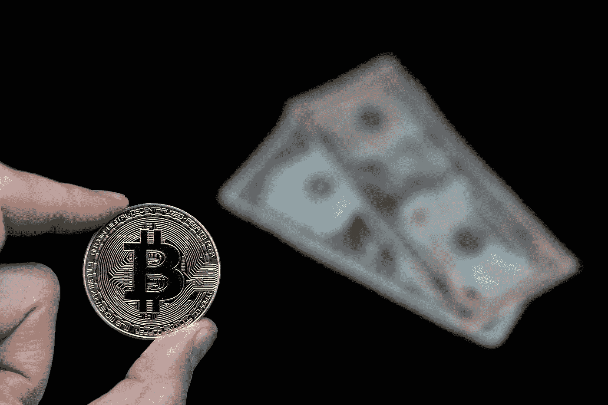
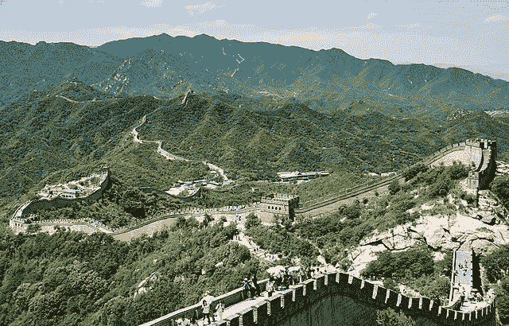

# 隐密战争:中国/印度 vs 瑞士/萨尔瓦多

> 原文：<https://medium.com/coinmonks/the-cryptowars-china-india-vs-switzerland-el-salvador-1b5ac5cbcf45?source=collection_archive---------9----------------------->

Image Credit: [Marco Verch](https://www.flickr.com/photos/30478819@N08/38695763932)

Public Domain

密码战正式开始了。也许战争这个词太过强烈，但如果你问一个密码迷，我猜他们对最近来自印度的消息感到有点震惊？这场“斗争”，让我们称之为大政府及其对中央集权和监管加密货币的渴望与世界公民及其对去中心化的渴望之间的较量。

这就像大卫和歌利亚的经典故事；弱小者对强大者，善良者对邪恶者，当然还有穷人对富人。谁会赢？

今天的帖子，一份虚构的侦察报告，世界超级大国中国和印度与小瑞士和萨尔瓦多之间的秘密战斗，完全符合大卫和歌利亚的形象。

**在蓝色角落**我们有一个分散的团队，一个相当小的团队，代表人民和新兴的加密货币行业。分散团队的成员赞同以太坊、区块链、所有非功能性金融工具和分散货币系统，让公民能够控制自己的金融命运。如今，团队分权的主要参与者包括两位热爱加密的世界巨星:

Public Domain

***瑞士* :** 瑞士是一个田园诗般美丽的地方，它一直是一个金融系统的家园，那里藏着来自任何地方的资金。每个人都知道。这没什么，即使它只是为那些有足够钱藏起来的人提供了隐私和纯粹的财务自由。

今天仍然如此，但也远不止如此。今天，瑞士是世界上对加密爱好者和主导加密货币行业的公司最具吸引力的地方。

一个名为 [Crypto Valley](https://cryptovalley.swiss/) (瑞士楚格)的地方是比特币、以太坊、比特币瑞士、Consensys 等公司总部的所在地。Crypto Valley 的创业公司集体价值超过 400 亿美元！在瑞士，加密很热门，但加密谷就像一个分散的数字货币天堂，加密可以用于各种市政服务，如交通，甚至纳税。瑞士目前是球迷的最爱。

Image Credit: [L. E. MacDonald](https://commons.wikimedia.org/wiki/File:Surfing_in_El_Salvador_by_L._E._MacDonald.png)

***萨尔瓦多*:**9 月，我发表了《萨尔瓦多、比特币和洗钱传闻》，不久前，该国总统纳伊布·布克莱(Nayib Bukele)及其政府将比特币作为法定货币，并推出了一款名为 Chivo 的应用，允许其公民将比特币兑换成现金。

萨尔瓦多的最新消息？显然，布克勒正在关注他的队友瑞士，因为他的政府刚刚宣布将在康查瓜火山的底部建造一座比特币城。毫不夸张地说，萨尔瓦多正在密码领域爆发！

**在红色角落的**是 Team Central，这是一个国家的集合，这些国家要么已经全面禁止公民加密货币的使用，要么即将实施禁令，要么正在分散比特币等，以支持由每个国家的中央银行发行的集中式数字货币。如今，Team Central 的主要参与者包括中国和印度，中国已经实施了全面禁令，印度最近宣布了类似于中国的加密禁令。

Image Credit: [CEphoto, Uwe Aranas](https://commons.wikimedia.org/wiki/File:Badaling_China_Great-Wall-of-China-01.jpg)

***中国*** :世界上第一个正式禁止所有与加密相关的公民活动的超级大国，包括采矿。中国是一个共产主义国家。我想这一举动并不奇怪？

预计中国政府将很快推出央行发行的数字货币——数字元。

Public Domain

***印度* :** 正如我上周在[为 *CoinMonks*](/coinmonks/india-takes-steps-to-ban-crypto-1ccb527ee014) 撰写的帖子中所写的，印度“就差这么一点”就要禁止比特币及其加密兄弟了。这项禁令将包括采矿和任何其他与加密相关的商业活动。

这可能没有中国的禁令影响深远，但鉴于印度这样规模和金融范围的国家正在考虑任何形式的加密货币禁令，市场情绪似乎正在发生变化。

## 磁带的故事

从录像带的故事中，我们可以看出这是一个巨大的不匹配。这是一个错配的水平，迈克尔·斯平克斯面对迈克泰森或更糟，洛奇巴尔博亚对俱乐部伯郎，战斗我

分散团队和集中团队之间的匹配到底有多差？[看看下面最简单的数字:](https://www.worldometers.info/gdp/gdp-by-country/)

## 团队中心

> 中国——人口 14 亿，国内生产总值 12.2 万亿美元
> 
> 印度——人口 13.8 亿，国内生产总值 2.6 万亿美元
> 
> 总计 27.8 亿美元，国内生产总值 14.8 万亿美元

## 团队分散

> 瑞士——860 万人，国内生产总值 6790 亿美元
> 
> 萨尔瓦多——650 万人，国内生产总值 248 亿美元
> 
> 总计 1510 万人，国内生产总值 7038 亿美元

这相当于 27.5 亿人口和超过 14 万亿美元的 GDP！这很重要，因为这些国家做出的关于加密的决定要么对全球人口和金融市场产生巨大影响，要么没有。虽然正在瑞士和萨尔瓦多发生的事情是革命性的、勇敢的和鼓舞人心的，但它只影响了全球人口的一小部分——他们的人口。当中国和印度采取行动时，世界上三分之一的人口会立即受到影响。

我们其他人只能远远地看着，退缩或欢呼，因为最终我们都受到我们所生活的国家的法律的约束。情绪对全球金融市场的影响有限。话说回来，洛奇在复赛中击倒了克劳伯·朗，而中国最近的禁令只对比特币的价格产生了一个影响——它上涨了。

黑暗的隧道中有一线希望，尤其是当一群像瑞士和萨尔瓦多这样充满激情的球员可能激励整个世界追随他们的时候。分散的团队当然有可能取得巨大的成功。

他们会做吗？我个人对那些渴望分散财务未来的人寄予厚望，但我的直觉告诉我，集权最终会胜出。我在分散模式中看到了太多的金融欺诈和太多容易洗钱的机会，我的经验告诉我这种情况不会持续太久。

表示“受到某种对待的人”:dividend | reverend

> 加入 Coinmonks [电报频道](https://t.me/coincodecap)和 [Youtube 频道](https://www.youtube.com/c/coinmonks/videos)了解加密交易和投资

## 也阅读

 [## 杠杆代币[多头代币]终极指南

### 杠杆化令牌是具有杠杆化风险敞口的 ERC20 令牌，不考虑保证金、要求、管理…

medium.com](/coinmonks/leveraged-token-3f5257808b22)  [## 最佳加密交易所| 2021 年十大加密货币交易所

### 加密货币交易所的加密交易需要了解市场，这可以帮助你获得利润。之前…

blog.coincodecap.com](https://blog.coincodecap.com/crypto-exchange)  [## 2021 年最佳加密借贷平台| 6 大比特币借贷平台

### 获得比特币和其他加密货币的最佳贷款利率

medium.com](/coinmonks/top-5-crypto-lending-platforms-in-2020-that-you-need-to-know-a1b675cec3fa)  [## 2021 年最佳免费加密交易机器人

### 2021 年币安、比特币基地、库币和其他密码交易所的最佳密码交易机器人。四进制，位间隙…

medium.com](/coinmonks/crypto-trading-bot-c2ffce8acb2a)  [## 最佳 4 个加密交易信号电报通道

### 这是乏味的找到正确的加密交易信号提供商。因此，在本文中，我们将讨论最好的…

medium.com](/coinmonks/best-crypto-signals-telegram-5785cdbc4b2b)  [## 5 个最佳社交交易平台[2021] | CoinCodeCap

### 困惑于社交交易和副本交易哪个平台最好？本文将带您了解各种…

blog.coincodecap.com](https://blog.coincodecap.com/best-social-trading-platforms)  [## BlockFi 评论 2021:利弊和利率| CoinCodeCap

### 今天，我们提出了一个全面的 BlockFi 评论，这是一个成立于 2017 年的加密贷款平台，拥有其…

blog.coincodecap.com](https://blog.coincodecap.com/blockfi-review)  [## 如何在印度购买比特币？2021 年购买比特币的 7 款最佳应用[手机版]

### 如何使用移动应用程序购买比特币印度

medium.com](/coinmonks/buy-bitcoin-in-india-feb50ddfef94)  [## 加密税务软件——五大最佳比特币税务计算器[2021]

### 不管你是刚接触加密还是已经在这个领域呆了一段时间，你都需要交税。

medium.com](/coinmonks/best-crypto-tax-tool-for-my-money-72d4b430816b)  [## 存储比特币的最佳加密硬件钱包[2021] | CoinCodeCap

### 保管您的数字资产很容易，但找到正确的存储方式却是一项繁琐的任务。在线钱包有一个风险…

blog.coincodecap.com](https://blog.coincodecap.com/best-hardware-wallet-bitcoin)  [## Pionex 评论 2021 |免费加密交易机器人和交换

### Pionex 是为交易自动化提供工具的后起之秀。Pionex 上提供了 9 个加密交易机器人…

medium.com](/coinmonks/pionex-review-exchange-with-crypto-trading-bot-1e459d0191ea)