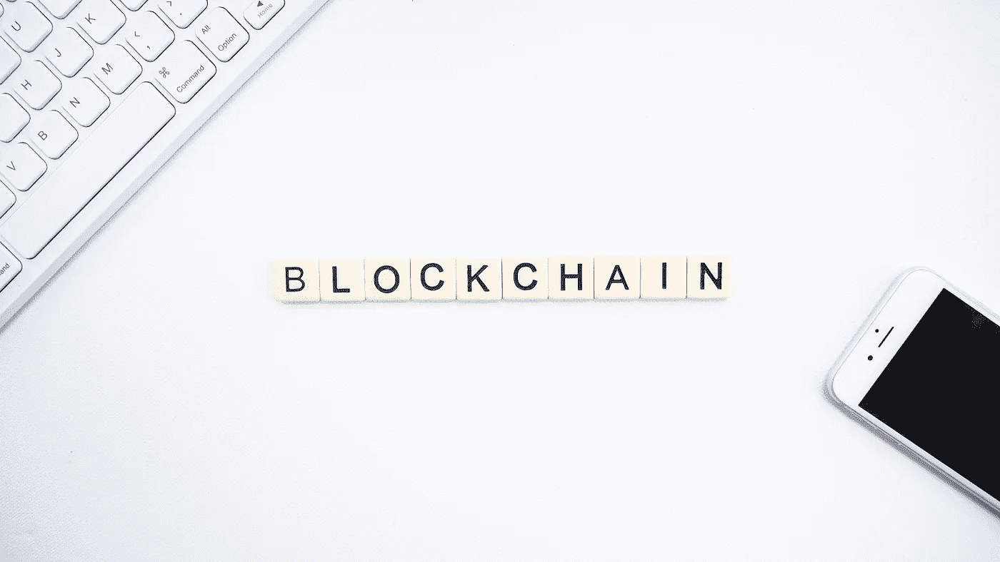

# The Curious Case of China and Cryptocurrencies

> 原文：<https://medium.com/coinmonks/the-curious-case-of-china-and-cryptocurrencies-6665edace22f?source=collection_archive---------2----------------------->

China is big in many senses of the word. It is the world’s most populous country and a major global economy. The same applies to the context of the crypto industry: China is one of the largest players in the market. It is no wonder that news from China often attract a lot of attention and sometimes even shake the market up. Why is that? [ChangeHero](https://changehero.io/) tried looking into this question.

## **Status quo**

On October 24th, President Xi Jinping underscored the importance of developing financial technologies and blockchain — which was followed by a further [crackdown](https://www.coindesk.com/crypto-markets-overreaction-to-xis-blockchain-remark-prompts-tougher-crackdown) on crypto businesses. On a first glance, it might look like a paradox but in the context of the history of blockchain and cryptocurrencies in China, this makes complete sense.

During the last few years, China has had quite a complicated relationship with the nascent crypto industry. The country is the [top blockchain adopter](https://forkast.news/china-blockchain-report/) in the entire world, a massive amount of cryptocurrency is being mined, stored and circulated within its borders. At the same time, officially they want nothing to do with cryptocurrency which they themselves have made synonymous with “scam” after failing to provide regulation.

Residents and experts alike [assure](https://vechain101.com/2019/01/24/quick-look-oceanex-chinese-exchanges/) that, while not as massive as before, the trading and usage of cryptocurrency in China is still at large. It is not like using cryptocurrency is unlawful — there is no explicit prohibition on holding coins and tokens or trading currencies. Mining is not illegal, quite the opposite — it is widespread in a few provinces, especially where electricity is subsidized. It is a real, tangible industry with its own practices.

Some exchanges, like Huobi and OKCoin, complied with the official stance and switched to trading currencies on an “over-the-counter” basis. Huobi also thrived thanks to expanding abroad. The new regulations gave an advantage to overseas platforms who targeted Chinese traders — and that is how Binance became one of the largest exchanges in a span of time so short traditional exchanges could only dream about. However, smaller Chinese-based exchanges, like Biss, made headlines for another reason: [police investigations](https://www.coindesk.com/china-is-poised-for-another-crypto-trading-crackdown-as-speculation-returns).

## **Divorce from crypto**

**Photo by** [**Launchpresso**](https://unsplash.com/@launchpresso?utm_source=unsplash&utm_medium=referral&utm_content=creditCopyText) **on** [**Unsplash**](https://unsplash.com/?utm_source=unsplash&utm_medium=referral&utm_content=creditCopyText)

2017 年的加密热潮在中国掀起了一股 ICO 热潮。不用说，欺诈者已经抓住了这个机会，许多投资者永久地失去了他们的储蓄。由于没有这种新型金融的法律框架，中国当局不可能防止进一步的金融损失或向受害者提供回报，因此打击行动开始了。官方媒体采用了一种说辞，根据这种说辞，加密货币在最好的情况下是一种风险投资，在最坏的情况下是一种彻头彻尾的骗局，并一直沿用至今。

微博(中国广泛使用的社交媒体平台)上一篇帖子中关于加密货币和区块链的内容受到该服务指南的限制，现有的提到这两者的帖子都已被删除。这也是官方努力支持后者的正面形象并谴责前者的一部分。然而，由于中国仍然在加密市场占有很大份额，很明显，一些中国公民并没有将他们的信息来源局限于国家控制的渠道。

中国将区块链与加密货币分离的政策不仅仅影响中国。中国当局的官方声明[在交易所引起了许多震动](https://www.nottingham.edu.cn/en/economics/documents/ner-issue-1/a-brief-overview-on-china-and-cryptocurrency.pdf):2017 年 9 月的声明导致 BTC 大幅下跌，其价格在习主席呼吁采用区块链后上涨。

## **好艺人借**

一些专家声称，将区块链技术与其加密货币起源分开，可能实际上为前者在中国的更广泛采用铺平了道路。2019 年上半年，那里通过了一项密码学法律，该法律应该成为政府支持的区块链应用程序的框架，最重要的是，它应该成为中央国家数字货币的框架。

由于根据中国法律，加密货币不具有“实际”价值，中国政府提议以区块链为基础创建自己的货币，但同时为其提供法定货币。除此之外，这种货币将与人民币一对一挂钩，就像稳定的硬币一样。CBDC——央行数字货币— [将于今年年底在一些选定的地区进行测试，并于 2020 年得到更广泛的应用](https://www.coindesk.com/chinas-central-bank-likely-to-pilot-digital-currency-in-cities-of-shenzhen-and-suzhou-report)。

对中国来说不幸的是，他们的数字货币仍然集中意味着它是可妥协的，所以世界还没有看到国家将发明什么样的网络安全奇迹来阻止黑客和欺诈。

## **那么我们为什么要关心数字元呢？**

出于同样的原因，你会关心数字化或任何货币。别担心，中国不太可能试图入侵密码行业——他们的目标不同。

由一个权威机构——在这种情况下是中国人民银行——提供 CBDC 的算法将意味着国家将更容易获得网络中的交易，这有利于监测，也有利于扩大服务和降低运营成本。这可能会为其他国家树立一个先例。数字人民币在国外将更容易获得，这对那些希望与中国企业合作的人来说并不重要。

与此同时，西方正带着谨慎的好奇心观察中国。一些美国官员和专家担心数字人民币可能会通过[消除](https://beincrypto.com/chinas-blockchain-revolution-helping-cut-out-us-tech-companies/)[美元提供的](https://www.coindesk.com/in-wargaming-exercise-a-digital-yuan-neuters-us-sanctions-and-north-korea-buys-nukes)杠杆和制裁而在全球金融体系中取代美元。CBDC 的中央集权性质引起了一些专家对公民权利的担忧，因为匿名和对个人财务的控制没有任何保障。

尽管如此，鉴于习主席对区块链的支持，Twitter 上一些有影响力的人表达了他们的希望。Misha Lederman 和 Gabor Gurbacs 公开称赞中国的技术进步政策，并指出美国应该效仿。莱德曼还指出，在这种政治形势下，最大的公司——创网络、币安、VeChain 平台和区块链项目 NEO——将会受益匪浅。

考虑到这一切，我们真的可以说中国欢迎区块链吗？他们的眼光显然与这项技术最初的想法不同，那就是去中心化。然而，中国不会错过数字货币的优势，他们将以自己的方式实现这一点。只有时间才能证明他们的计划是否会成功并获得支持。谁知道中国人对区块链的看法是否会影响全世界的科技？幸运的是，我们不用等太久，因为一切都将很快开始。

敬请关注 [Twitter](https://twitter.com/Changehero_io) 、[脸书](https://www.facebook.com/Changehero.io/)和 [Medium](/@changehero) 上的 [ChangeHero](https://changehero.io/) ，了解更多关于 crypto 的此类信息丰富的文章和激动人心的优惠。

> [直接在您的收件箱中获得最佳软件交易](https://coincodecap.com/?utm_source=coinmonks)

