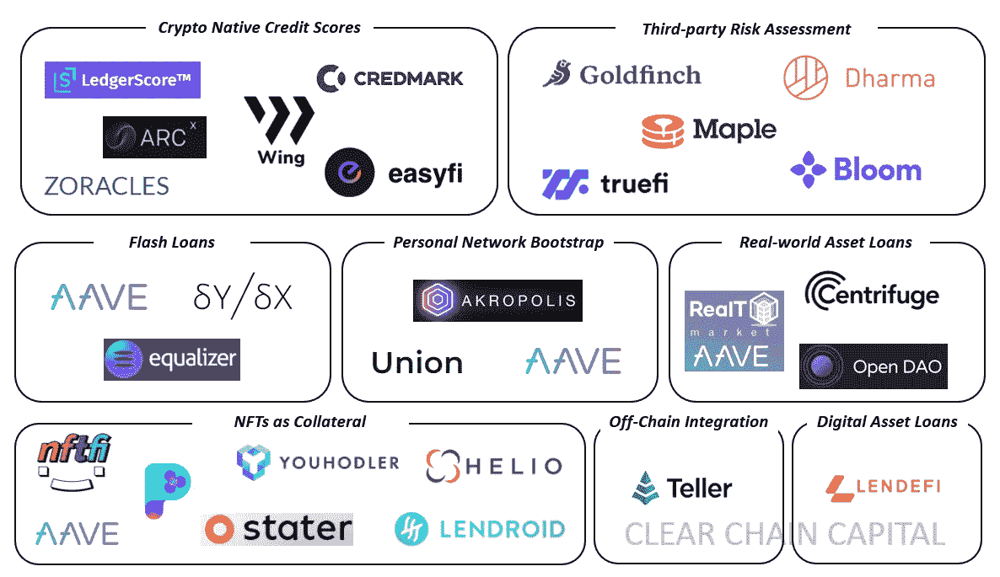
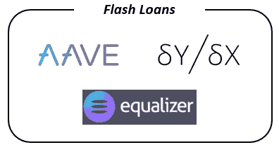
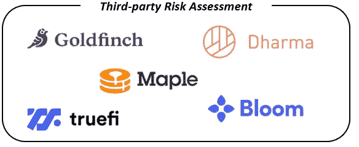
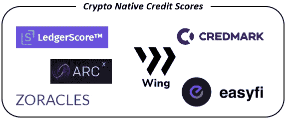
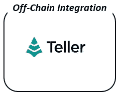
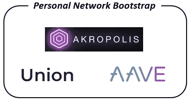
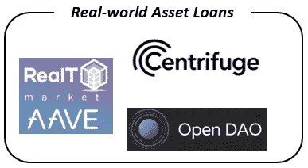
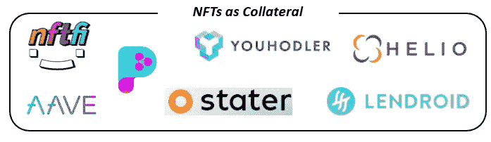
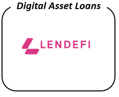

# 抵押不足的违约贷款的现状— 2021 年

> 原文：<https://medium.com/coinmonks/the-current-state-of-undercollateralized-defi-lending-2021-1f84e14527b5?source=collection_archive---------0----------------------->

Source: Clear Chain Capital

## **概述**

自 2017 年以来，抵押不足的贷款一直是 DeFi 中难以实现的圣杯。大多数 DeFi 在当前过度循环的形式下，通过 Maker、Compound 和 Aave 等平台，服务于相对循环的用例。这主要是因为唯一愿意提供 1.5-3 倍杠杆的交易方是希望在加密市场获得杠杆的交易商。抵押不足的贷款可以使分散的信贷市场为更广泛的使用案例所利用，并有可能成为主流。

这就是为什么自 2017/18 赛季以来，几家公司一直试图推出这一市场。然而，关键的挑战一直是找到一种适当的方法来评估和分配借款人的信誉，并确保贷款人的存款安全。2020/21 年，抵押不足的贷款趋势重新抬头，并带来了一些解决分散信用评估问题的创新解决方案。在这篇文章中，我们深入探讨了每一种解决方案，并评估了每一种解决方案的使用案例、优势和风险。总的来说，这一领域相对较新，无论哪个项目/方法最终奏效，抵押不足的贷款都可能引领下一波 DeFi 的采用和增长。

抵押不足贷款的当前状况可分为八个主要部分:

1.  快速贷款
2.  第三方风险评估
3.  加密本地信用分数
4.  链外信贷整合
5.  个人网络引导
6.  真实世界的资产贷款
7.  NFTs 作为抵押品
8.  数字资产贷款

# **1。快速贷款**

**用例:**套利、抵押品互换、清算

**优势:**近乎即时还款，无违约风险

**挑战:**不能用于大多数传统用例，如个人贷款等。

快速贷款是无抵押贷款，借款和还款必须发生在同一笔交易中。事实上，两者都必须完成才能进行处理，这确保了违约风险基本为零。这种结构对于那些希望利用两个指数之间的机会，避免价格波动，同时也利用杠杆的套利者特别有用。这就是为什么超过 80%的$3B+快速贷款量被限制为套利。总体而言，快速贷款是一种创新产品，但不太可能被用于套利和抵押品互换之外。

# 2.**第三方风险评估**

**用例:**个人贷款、小额信贷、分散的大宗经纪业务

**优势:**分散交易对手风险；将财务激励与信用评估员结合起来

**挑战:**建立一个拥有足够数据和工具的专门风险评估员网络，以做出适当的信贷决定

2021 年，第三方风险评估一直是风投的最爱，Maple Finance 和 Goldfinch 都从声誉良好的基金那里筹集了有意义的资金。这种模式引入了贷方和借方之外的第三方来执行信用评估的角色。作为交换，这些集团必须拿出自己的部分流动性，一旦他们批准的贷款出现违约，这些流动性将首先被削减。这建立了一个合理的激励结构，使抵押不足，同时为连锁信用评分系统铺平了道路。

这种结构的关键挑战将是建立一个拥有适当水平借款人数据的有能力的信用评估员网络。这对于 Goldfinch 等零售机构来说，比 Maple 等面向机构的大宗经纪公司更具挑战性。然而，如果一个平台能够聚集一群有能力的评估人员，并使借款人的数据提供过程顺利，这可能是一个可行的模式。

# **3。加密本地信用分数**

**使用案例:**个人贷款、小额信贷等。

**优势:**数据的长寿性和不变性；跨平台可用性

**挑战:**到目前为止，大多数用户的链上数据不足；用户能够切换钱包，如果一个违约

这里的想法是通过利用各种历史链上活动来引导链上身份，包括历史贷款偿还、产量耕作、贸易活动、治理参与等。这可能是有价值的，因为这些数据将持续复合并自动更新。此外，根据用户的同意，这些数据可以跨多个平台使用。虽然链上身份可能是不可避免的，但我们目前所处的初始阶段受到了无限虚拟身份的挑战，如果一个人违约，就可以切换钱包。对此最可行的解决方案可能是某种形式的 Zk 证明，使客户能够舒适地共享他们的真实世界 id，并以假名的方式将其绑定到一个钱包上。跨越这一障碍的平台将最终促进大量数据的移动，使其变得相对有价值。

# **4。链外信贷整合**

**用例:**个人贷款、小额信贷等。

**优势:**数据充足；连接到固定身份

**挑战:**非加密原生；对 TradFi 基础设施的依赖

该解决方案通过导入链外信用数据来帮助承保抵押不足的贷款，解决了加密本地身份所面临的引导挑战。从短期来看，这是一个合适的策略，但随着时间的推移，需要过渡到利用链上的加密原生数据，以便插入任何分散的堆栈。

# **5。个人网络引导**

**使用案例:**个人贷款、小额信贷等。

**优势:**有机网络效应，违约率低

**挑战:**如果不使用其他指标，很难扩展；如果一个钱包违约，用户可以更换钱包

在这个用例中，借款人必须直接得到贷款池成员的批准。通过邀请借款，该平台通过有机网络效应发展，引入了链外信任的元素。这是一个聪明的方法来引导抵押不足的贷款，而不依赖于可能有限的数据。围绕这一方法的主要挑战将是在不纳入额外数据点的情况下扩展网络，因为仅基于这些还款的数据收集需要时间才能具有统计意义。总的来说，这是一个可行的策略，可以随着时间的推移进行适当的转换，以便有效地扩展。

# **6。真实世界资产贷款**

**用例:**抵押贷款和其他实物资产贷款

**优势:**由现实世界资产部分抵押

**挑战:**实物资产的潜在流动性不足，取决于市场状况

真实世界的资产通过 NFTs 在链条上表现出来，NFTs 抵押另一部分贷款。这看起来非常像传统的抵押贷款，只是贷款融资是分散的。这种方法面临的唯一挑战是资产流动性不足，即使是集中贷款也是如此。尽管这一市场还非常早期，但它非常有前景，因为它可以消除大量的繁文缛节和官僚主义，而这些正是 TradFi 版真实世界资产贷款的特征。

# **7。NFTs 作为抵押品**

**使用案例:**个人贷款、小额信贷等。

**优势:**能够将非金融资产作为抵押品过账

挑战:资产流动性不足

NFT 支持的贷款是一个有趣的概念，可能会成为抵押不足的贷款领域的一个利基部分。从长远来看，一些非上市公司可能会获得类似杰森·布拉克的地位，使它们的市场流动性相对较高。由于 NFT 是加密的，如果它们是流动的，那么在链上表达它们并使用它们来解决缺省值是很容易的。然而，这个市场在抵押不足的贷款领域可能仍然是一个小市场的原因是，大多数 NFT 艺术品可能会失宠，失去市场流动性，使它们成为抵押品的糟糕选择。

# 8。数字资产贷款

**用例:**杠杆交易

**优势:**对交易资产的控制

**挑战:**规模有限

此使用情形类似于 Aave、Compound 等。，除非 Lendefi 自己在一份智能合同中保管所购买的资产，直到贷款得到偿还。因此，如果一笔借入资产的交易对借款人不利，合同会在归还剩余资本之前清算头寸并弥补损失。这可能是另一个相对小众的用例。

# **结论**

总体而言，很明显，尽管抵押不足的贷款市场还处于萌芽状态，但已经活跃起来。随着该领域继续经历成长的阵痛，我们相信这可能是我们将看到下一波 DeFi 创新的地方。最终，适应并生存下来的项目有可能为主流 DeFi 采用建立防护栏。

 [## 最佳免费加密交易机器人——前 16 名比特币交易机器人[2021]

### 2021 年币安、比特币基地、库币和其他密码交易所的最佳密码交易机器人。四进制，位间隙…

medium.com](/coinmonks/crypto-trading-bot-c2ffce8acb2a)  [## 最佳 6 个加密交易信号电报通道

### 这是乏味的找到正确的加密交易信号提供商。因此，在本文中，我们将讨论最好的…

medium.com](/coinmonks/best-crypto-signals-telegram-5785cdbc4b2b) 

> 加入 [Coinmonks 电报频道](https://t.me/coincodecap)，了解加密交易和投资

## 另外，阅读

*   [尤霍德勒 vs 科恩洛安 vs 霍德诺特](/coinmonks/youhodler-vs-coinloan-vs-hodlnaut-b1050acde55a) | [Cryptohopper vs 哈斯博特](https://blog.coincodecap.com/cryptohopper-vs-haasbot)
*   [币安 vs 北海巨妖](https://blog.coincodecap.com/binance-vs-kraken) | [美元成本平均交易机器人](https://blog.coincodecap.com/pionex-dca-bot)
*   [如何在印度购买比特币？](/coinmonks/buy-bitcoin-in-india-feb50ddfef94) | [WazirX 审核](/coinmonks/wazirx-review-5c811b074f5b) | [BitMEX 审核](https://blog.coincodecap.com/bitmex-review)
*   [比特币主根](https://blog.coincodecap.com/bitcoin-taproot) | [Bitso 评论](https://blog.coincodecap.com/bitso-review) | [排名前 6 的比特币信用卡](/coinmonks/bitcoin-credit-card-bc8ab6f377c6)
*   [双子座 vs 比特币基地](https://blog.coincodecap.com/gemini-vs-coinbase) | [比特币基地 vs 北海巨妖](https://blog.coincodecap.com/kraken-vs-coinbase) | [硬币罐 vs 硬币点](https://blog.coincodecap.com/coinspot-vs-coinjar)
*   [印度加密交易所](/coinmonks/bitcoin-exchange-in-india-7f1fe79715c9) | [比特币储蓄账户](/coinmonks/bitcoin-savings-account-e65b13f92451) | [Paxful 审核](/coinmonks/paxful-review-4daf2354ab70)
*   [杠杆令牌](/coinmonks/leveraged-token-3f5257808b22) | [最佳加密交易所](/coinmonks/crypto-exchange-dd2f9d6f3769)
*   [Godex.io 审核](/coinmonks/godex-io-review-7366086519fb) | [邀请审核](/coinmonks/invity-review-70f3030c0502) | [BitForex 审核](/coinmonks/bitforex-review-c4bb28d9e271) | [HitBTC 审核](/coinmonks/hitbtc-review-c5143c5d53c2)
*   [Crypto.com 费用](/coinmonks/binance-fees-8588ec17965) | [僵尸密码审查](/coinmonks/botcrypto-review-2021-build-your-own-trading-bot-coincodecap-6b8332d736c7) | [替代品](https://blog.coincodecap.com/crypto-com-alternatives)
*   [MXC 交易所评论](/coinmonks/mxc-exchange-review-3af0ec1cba8c) | [Pionex vs 币安](https://blog.coincodecap.com/pionex-vs-binance) | [Pionex 套利机器人](https://blog.coincodecap.com/pionex-arbitrage-bot)
*   [我的加密副本交易经历](/coinmonks/my-experience-with-crypto-copy-trading-d6feb2ce3ac5) | [比特币基地评论](/coinmonks/coinbase-review-6ef4e0f56064)
*   [加密货币储蓄账户](/coinmonks/cryptocurrency-savings-accounts-be3bc0feffbf) | [跑马圈地](https://blog.coincodecap.com/staking-crypto) | [盗 x 评论](/coinmonks/stealthex-review-396c67309988)
*   [BigONE 交易所评论](/coinmonks/bigone-exchange-review-64705d85a1d4) | [CEX。IO 审查](https://blog.coincodecap.com/cex-io-review) | [Swapzone 审查](/coinmonks/swapzone-review-crypto-exchange-data-aggregator-e0ad78e55ed7)
*   [最佳比特币保证金交易](/coinmonks/bitcoin-margin-trading-exchange-bcbfcbf7b8e3) | [Bityard 保证金交易](https://blog.coincodecap.com/bityard-margin-trading) | [Prokey 审核](/coinmonks/prokey-review-26611173c13c)
*   [加密保证金交易交易所](/coinmonks/crypto-margin-trading-exchanges-428b1f7ad108) | [赚取比特币](/coinmonks/earn-bitcoin-6e8bd3c592d9) | [Mudrex 投资](https://blog.coincodecap.com/mudrex-invest-review-the-best-way-to-invest-in-crypto)
*   [WazirX vs coin dcx vs bit bns](/coinmonks/wazirx-vs-coindcx-vs-bitbns-149f4f19a2f1)|[block fi vs coin loan vs Nexo](/coinmonks/blockfi-vs-coinloan-vs-nexo-cb624635230d)
*   [BlockFi 信用卡](https://blog.coincodecap.com/blockfi-credit-card) | [如何在币安购买比特币](https://blog.coincodecap.com/buy-bitcoin-binance)
*   [密码副本交易平台](/coinmonks/top-10-crypto-copy-trading-platforms-for-beginners-d0c37c7d698c) | [五大区块链替代方案](https://blog.coincodecap.com/blockfi-alternatives)
*   [信用贷款审核](/coinmonks/coinloan-review-18128b9badc4)|[Crypto.com 审核](/coinmonks/crypto-com-review-f143dca1f74c) | [货币融资融券交易](/coinmonks/huobi-margin-trading-b3b06cdc1519)
*   [顶级付费加密货币和区块链课程](https://blog.coincodecap.com/blockchain-courses) | [币安评论](/coinmonks/binance-review-ee10d3bf3b6e)
*   [在美国如何使用 BitMEX？](https://blog.coincodecap.com/use-bitmex-in-usa) | [BitMEX 点评](https://blog.coincodecap.com/bitmex-review) | [币安 vs Bittrex](https://blog.coincodecap.com/binance-vs-bittrex)
*   [最佳免费加密信号](https://blog.coincodecap.com/free-crypto-signals) | [YoBit 评论](/coinmonks/yobit-review-175464162c62) | [Bitbns 评论](/coinmonks/bitbns-review-38256a07e161)
*   [OKEx 回顾](/coinmonks/okex-review-6b369304110f) | [Kucoin 交易机器人](/coinmonks/kucoin-trading-bot-automate-your-trades-8cf0ca2138e0) | [期货交易机器人](/coinmonks/futures-trading-bots-5a282ccee3f5)
*   [比特币基地赌注](https://blog.coincodecap.com/coinbase-staking) | [热点评论](/coinmonks/hotbit-review-cd5bec41dafb) | [库币评论](https://blog.coincodecap.com/kucoin-review)
*   [最佳加密交易信号电报](/coinmonks/best-crypto-signals-telegram-5785cdbc4b2b) | [MoonXBT 评论](/coinmonks/moonxbt-review-6e4ab26d037)
*   [Coinswitch 俱吠罗评论](/coinmonks/coinswitch-kuber-review-1a8dc5c7a739) | [电网交易机器人](https://blog.coincodecap.com/grid-trading) | [比特币基地收费](/coinmonks/coinbase-fees-831e77d4f2c5)