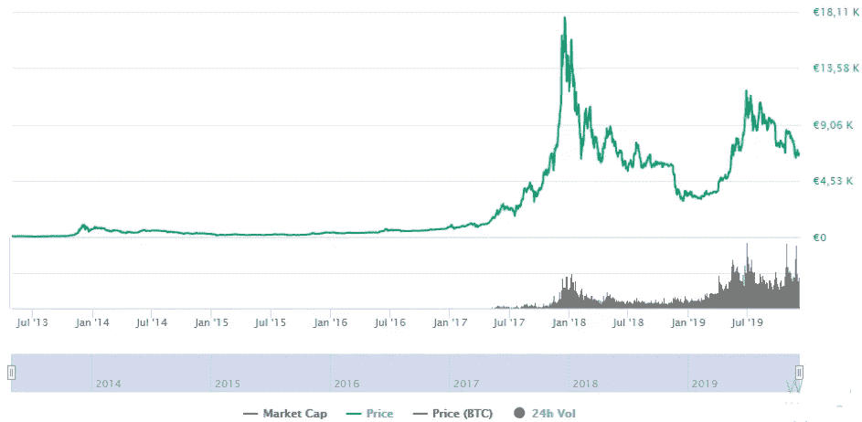

# 比特币的周期

> 原文：<https://medium.com/coinmonks/the-cycles-of-bitcoin-fd0b181a29e5?source=collection_archive---------1----------------------->

本文讨论了比特币减半对比特币价格的影响，以及比特币的技术和定价周期在这方面的作用。

在你阅读这篇文章之前，我想解释一下什么是减半，这样一切都可以理解。

**比特币的算法**说，21 万块后比特币**的创造总是**减半**，这种情况**大约每 4 年发生一次**。[当你想了解更多关于比特币的内容时，请阅读我的文章《什么是比特币》](/@l.wiesflecker/what-is-bitcoin-bc9b9ffc5b3b)。**

比特币本质上有两个周期。它们彼此**不是周期性的**，**而是相关的**。

**技术周期**是由 [**比特币**](https://blog.coincodecap.com/tag/bitcoin/) **算法**决定的**，而**定价周期是大量人产生的效果**。**

如果选择高时间范围作为考虑的基础，这当然只有在波动性仍然很高的情况下才值得注意。
从长期的宏观生态角度来看，[比特币](https://blog.coincodecap.com/tag/bitcoin/)的价格倍增应该会降低，直到达到一个或多或少稳定的价格。

[coinmarketcap.com](https://coinmarketcap.com/currencies/bitcoin/)

**2013 年至 2019 年比特币价格**

由于没有一个系统从一开始就是完美的，所以必须分阶段发展。**每个周期都带来新的大点**。总是要看开源的比特币协议会不会进一步发展。因此，我们可能会在 2020 年 11 月左右看到扩展 Taproot 和 Schnorr。这可能会导致价格上涨。

围绕这一点，**新的想法发展**，这些**成为实验**，要么**大获成功**要么**以涅槃**告终。最终，人民的决定才是最重要的**(分散！)**，参与人数随着每个周期增长。

## 比特币的技术周期

比特币的**技术周期从减半持续到减半**。所以我们以 2016 年 7 月 09 日最后减半的那一天作为“开始”，将基于 2017 年 12 月 17 日价格上限的价格应用于基于周期持续时间的天数。当前的**周期可能会在 2020 年 5 月 12 日**结束。[看这里倒计时！](https://www.bitcoinblockhalf.com/)

减半后，需要一段时间，直到群众注意到供应短缺。这主要是由于市场上[比特币](https://blog.coincodecap.com/tag/bitcoin/)的供应量中只有一定比例来自新比特币的创造。其余的来自琐碎的交易、积累等。接下来是空前高涨的炒作。

现在**术语值开始起作用**。价值是一种存在于我们内心的感觉。如果一个人认为某样东西不再值得拥有，他或她就会扔掉它。下一个人看到这个，也做了同样的事情。**连锁反应！整个事情当然也可以朝着另一个方向发展。**

## 结果:

有人在价格减半时买入，在下一个价格减半时卖出，他就赚了。因为开始时的价格一直低于结束时的价格。**但是要小心！它不必一直保持这种状态。周期的开始和结束都显示出标准化价格越来越高的趋势。**换句话说，与价格峰值的差异正在变小。**
这其中的原因可能是比特币的通胀自然降低。到目前为止，每一次炒作都很重要，因为它带来了“新鲜血液”,从而给网络带来了更多的资本和安全性。**

> 在我看来，我们将在每个周期看到一个新的历史高点。——卢卡斯·维斯弗莱克

## 比特币价格周期

比特币的价格周期是这样计算的:在所谓的峰值后的底部形成期间，选择价格最小值作为“起点”。
**事实:越晚到达下一个顶峰，它就越高。几个周期后，倍数会越来越小，价格会稳定下来。换言之，相关的波动性将非常低。**
减半对比特币的价格有着惊人的作用。随着时间的推移，比特币似乎失去了更少的波动性，并获得了价格稳定性。

比特币在不久的将来会如何发展，我们 100%不知道。尽管如此，我们可以假设减半后的短缺将对比特币的价格产生积极影响。

另一方面，当前的低价也可能是比特币的一个破坏性因素。如果 BTC·哈尔文斯的通货紧缩理论失败，我们将会看到几次翻转。没有 halvings 和有无限供应的硬币，如 ETH 或 Grin，可以击倒 BTC 国王。

最终，从长远来看，halvings 可能会扼杀 BTC，因为如果价格不同时上涨，分配给矿工的钱越来越少，他们就会停止采矿，这导致了网络的强烈集中化。一旦没有更多的硬币被开采出来，矿工们只收到交易费作为奖励。

这对我们来说是一个非常激动人心的时刻。你怎么想？请在评论中告诉我！

> [在您的收件箱中直接获得最佳软件交易](https://coincodecap.com/?utm_source=coinmonks)

我在每月一期的 [**简讯中分享了更多私密的想法，你可以在这里查看**](https://mailchi.mp/bf8f8e8ed697/keep-in-touch-with-lukas) 。请在评论中告诉我，并在各种社交媒体平台上加入我:

[**推特**](https://twitter.com/WiesfleckerL)●[**insta gram**](https://www.instagram.com/lukaswiesflecker/)●[**脸书**](https://www.facebook.com/lukaswiesfleckerr)●[**Snapchat**](https://www.snapchat.com/add/luggooo)**●[**LinkedIn**](https://www.linkedin.com/in/lukas-wiesflecker-1b11251a5/)**

**无论你做什么，都要带着爱和激情去做！**