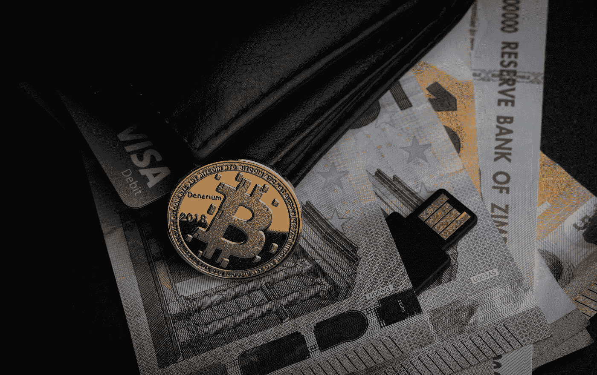

# 加密货币的阴暗面

> 原文：<https://medium.com/coinmonks/the-dark-side-of-cryptocurrencies-2fe08b4b3915?source=collection_archive---------2----------------------->

加密货币无法避免被用于非法交易，因为它们提供匿名性。它们是安全港，是吸引那些想要隐藏其金融交易的人的磁石。事实上，加密货币的这一阴暗面是许多人对加密货币持强硬态度和不屑一顾的原因之一。我在另一篇文章 [**中已经部分讨论过这样的担忧，比特币会取代美元**](/coinmonks/will-bitcoin-replace-the-us-dollar-f5598add5ef6) **吗？**但随着加密货币作为资产进行交易，也有人担心市场操纵。

但仅仅因为加密货币被用于非法交易并不意味着我们应该完全摒弃它们，就像我们不会因为它们也被用于非法交易而摒弃法定货币一样。但有一个相反的论点:加密货币的匿名性使它们比法定货币更危险。另一方面，匿名是加密货币的一个价值主张，因为它们吸引了那些希望私下交易而不通过中介或警惕监管机构的人。

> 很难调和个人的隐私权和交易匿名权与公众的安全权。

双方选择他们的交易保持私密没有错，但这也意味着犯罪分子将利用和滥用这种“匿名设施”。你看，加密也有同样的问题。加密用于确保机密性，但这也是执法部门的一大难题，因为它阻止了刑事调查。当 2020 年 1 月有报道称 [**美国联邦调查局要求苹果公司帮助解锁两部 iPhones 手机**](https://www.nytimes.com/2020/01/07/technology/apple-fbi-iphone-encryption.html) 作为刑事调查的一部分时，加密辩论成为了新闻头条，在那起枪击案中有三人被杀。个人隐私权和交易匿名权与公众的安全保障权很难调和。当涉及到个人隐私权和公众的安全权时，加密和加密货币之间有相似之处。

Photo by [Aleksi Räisä](https://unsplash.com/@denarium_bitcoin?utm_source=medium&utm_medium=referral) on [Unsplash](https://unsplash.com?utm_source=medium&utm_medium=referral)

# **加密货币、市场操纵和犯罪**

在 2021 年 2 月接受彭博采访时，NYU 大学教授努里埃尔·鲁比尼(绰号“末日博士”)措辞强硬，称比特币是“自我实现的泡沫”，认为比特币最近的升值与市场操纵等因素有关:

> “它(比特币)正在飙升，因为有大量的操纵，有抽取和转储计划，有欺骗，有清洗交易，有前台运行……。].从根本上说，比特币不是一种货币，不是一种记账单位，不是一种可扩展的支付手段，也不是一种稳定的价值储存手段”。 ***努里埃尔·鲁比尼，NYU 斯特恩商学院。彭博***

*Nouriel Roubini —* CNBC Photo

他还认为，随着资金利用加密货币跨境流动，缺乏资本控制将使其对“犯罪分子、恐怖分子、人口贩子或逃税者”具有吸引力

如果鲁比尼教授是对的，那么我们就有两个问题:(1)加密货币被犯罪分子和恐怖分子利用的风险，(2)市场操纵(白领犯罪)。随着投资者购买和交易比特币和其他加密货币，这非常令人担忧。如果确实存在涉及加密货币的广泛市场操纵，那么它们将成为自由市场的威胁，因为比特币的市值达到 1 万亿美元，其价格超过 57，000 美元(今天为 49，000 美元)。如果存在向加密货币的大规模“资本迁移”，那么监管加密货币可能是必要的——尽管我也说过，彻底的监管可能会阻碍未来的创新。我已经说过**监管缓慢而技术快速**，这就是为什么监管某些技术很困难。

# **政府、监管和干预**

2021 年 2 月 22 日，美国消费者新闻与商业频道引用美国财政部长珍妮特·耶伦关于比特币的话， ***“就其被使用的程度而言，我担心它经常被用于非法金融……”***。公平地说，说罪犯也利用传统银行进行非法融资是有道理的。这不是一个精确的比较，但相关指出。事实上，各大银行过去都承认或参与过非法活动。例如，2019 年，瑞士主要银行瑞银(UBS)因“帮助法国富裕客户逃避税务当局”而被责令支付 51 亿美元。同样令人震惊的是，国际调查记者联盟在 2019 年发表的一份报告指出:

> “美国政府的秘密文件显示，摩根大通、汇丰和其他大银行通过为在世界各地传播混乱和破坏民主的影子人物和犯罪网络转移巨额非法现金，对抗洗钱打击。”
> 
> 国际调查记者联合会

还有许多其他案件牵涉到大银行从事非法金融活动。

为了将讨论带回加密货币，政府和监管机构开始控制加密货币，因为随着它们变得更加主流，它们可能会“滋生犯罪”。2020 年 12 月，据报道， [**金融犯罪执法网络提出规则，旨在填补某些可兑换虚拟货币和数字资产交易的反洗钱监管空白**](https://home.treasury.gov/news/press-releases/sm1216) **。**这是一个监管者可能不会接受(更不用说采纳)加密货币的基本价值主张(匿名和去中心化)的信号。加密货币的支持者必须意识到，在当今相当不安全的全球经济中，一种货币不可能同时是虚拟的、匿名的和去中心化的。这种结合带来了金融、经济、社会和法律风险。

> 一种货币不可能同时具有虚拟性、匿名性和分散性。

另外，2020 年 10 月有报道称， [**美国的加密执行框架是对国际交易所的一个警告**](https://www.coindesk.com/doj-crypto-framework-warning) **。**美国监管机构的这些举措表明，他们对加密货币采取了强硬和毫不妥协的立场。这一点也很明显，因为美国证券交易委员会(SEC)迄今为止一直拒绝批准加密货币交易所交易基金，而欧洲和最近加拿大已经批准了此类交易所交易基金。

加密货币的成功，特别是比特币被犯罪分子滥用和被市场参与者操纵，确实是它们的阴暗面。人们希望，随着加密货币成为主流，它们将为市场提供透明度，并让监管机构和执法部门能够发现和追踪非法活动——前提是人们的隐私权和保密权不会受到不合理的影响。这将需要立法者和隐私专家的辩论和审查。

互联网是一个危险的公共网络，期望所有的交易保持私密是在期待乌托邦。同时，期望个人为了“公共利益”而牺牲他们的隐私权和保密权也是不可取的。也许答案是在两者之间找到平衡。即使我们找到了这种平衡，也很难说谁应该决定这种平衡应该是什么。谁应该是法官和仲裁人？同样，这需要辩论和审查。

归根结底，犯罪和涉嫌市场操纵可能会阻碍比特币等加密货币的广泛应用。那些参与加密货币(包括加密交易平台)业务和技术开发的人必须注意公众和政府的不安。他们必须采取措施提供证据和保证，确保其网络和平台中的犯罪行为和市场操纵最小化。但不能有双重标准:我们必须让处理法定货币的人(银行)和处理加密货币的人(平台、交易所和开发商)承担同等责任。

双方都有阴暗面。

**来源和进一步阅读:**

[https://www . Bloomberg . com/news/videos/2021-02-17/bit coin-is-a-self-fulfilling-bubble-roubini-warns-video](https://www.bloomberg.com/news/videos/2021-02-17/bitcoin-is-a-self-fulfilling-bubble-roubini-warns-video)

 [## 美国财政部

### 美国财政部下属的金融犯罪执法网络(FinCEN)要求…

home.treasury.gov](https://home.treasury.gov/news/press-releases/sm1216)  [## DOJ 的加密框架是对交易所的警告

### 司法部(DOJ)刚刚向全球加密交易所发出警告:遵守美国法律，否则将面临…

www.coindesk.com](https://www.coindesk.com/doj-crypto-framework-warning)  [## 耶伦对“极度低效”的比特币发出警告

### 财政部长珍妮特·耶伦周一发出警告，称比特币对投资者和金融机构都有危险。

www.cnbc.com](https://www.cnbc.com/2021/02/22/yellen-sounds-warning-about-extremely-inefficient-bitcoin.html)  [## 瑞银因帮助富有的法国客户逃避税务当局而被勒令支付 51 亿美元罚款

### 巴黎(美联社)-一家法国法院命令瑞士最大的银行瑞银支付 45 亿欧元(51 亿美元)的罚款…

www.marketwatch.com](https://www.marketwatch.com/story/swiss-bank-ubs-ordered-to-pay-42-billion-in-fines-2019-02-20)  [## 全球银行藐视美国的打击，为寡头、罪犯和恐怖分子服务

### 美国政府的秘密文件显示，摩根大通、汇丰和其他大银行公然对抗洗钱…

www.icij.org](https://www.icij.org/investigations/fincen-files/global-banks-defy-u-s-crackdowns-by-serving-oligarchs-criminals-and-terrorists/) 

**萨拉姆·纳扎特的文章**

> 加入 Coinmonks [Telegram group](https://t.me/joinchat/EPmjKpNYwRMsBI4p) 学习加密交易和投资

## 另外，阅读

*   什么是[闪贷](https://blog.coincodecap.com/what-are-flash-loans-on-ethereum)？
*   最好的[密码交易机器人](/coinmonks/crypto-trading-bot-c2ffce8acb2a) | [网格交易](https://blog.coincodecap.com/grid-trading)
*   [3 商业评论](/coinmonks/3commas-review-an-excellent-crypto-trading-bot-2020-1313a58bec92) | [Pionex 评论](/coinmonks/pionex-review-exchange-with-crypto-trading-bot-1e459d0191ea) | [Coinrule 评论](https://blog.coincodecap.com/coinrule-review-a-perfect-trading-bot)
*   [AAX 交易所评论](/coinmonks/aax-exchange-review-2021-67c5ea09330c) | [德里比特评论](/coinmonks/deribit-review-options-fees-apis-and-testnet-2ca16c4bbdb2) | [FTX 交易所评论](/coinmonks/ftx-crypto-exchange-review-53664ac1198f)
*   [n 平均零点评审](/coinmonks/ngrave-zero-review-c465cf8307fc) | [Phemex 评审](/coinmonks/phemex-review-4cfba0b49e28) | [PrimeXBT 评审](/coinmonks/primexbt-review-88e0815be858)
*   [by bit Exchange Review](/coinmonks/bybit-exchange-review-dbd570019b71)|[bit yard Review](https://blog.coincodecap.com/bityard-reivew)|[coin spot Review](https://blog.coincodecap.com/coinspot-review)
*   [3 commas vs crypto hopper](/coinmonks/3commas-vs-pionex-vs-cryptohopper-best-crypto-bot-6a98d2baa203)|[赚取秘密利息](/coinmonks/earn-crypto-interest-b10b810fdda3)
*   最好的比特币[硬件钱包](/coinmonks/the-best-cryptocurrency-hardware-wallets-of-2020-e28b1c124069?source=friends_link&sk=324dd9ff8556ab578d71e7ad7658ad7c) | [BitBox02 回顾](/coinmonks/bitbox02-review-your-swiss-bitcoin-hardware-wallet-c36c88fff29)
*   [莱杰 vs n rave](https://blog.coincodecap.com/ngrave-vs-ledger)|[莱杰 nano s vs x](https://blog.coincodecap.com/ledger-nano-s-vs-x)
*   [密码拷贝交易平台](/coinmonks/top-10-crypto-copy-trading-platforms-for-beginners-d0c37c7d698c) | [比特码拷贝交易](https://blog.coincodecap.com/bityard-copy-trading)
*   [Vauld Review](https://blog.coincodecap.com/vauld-review)|[you hodler Review](/coinmonks/youhodler-4-easy-ways-to-make-money-98969b9689f2)|[BlockFi Review](/coinmonks/blockfi-review-53096053c097)
*   最好的[加密税务软件](/coinmonks/best-crypto-tax-tool-for-my-money-72d4b430816b) | [硬币追踪评论](/coinmonks/cointracking-review-a-reliable-cryptocurrency-tax-software-5114e3eb5737)
*   最佳[密码借贷平台](/coinmonks/top-5-crypto-lending-platforms-in-2020-that-you-need-to-know-a1b675cec3fa) | [杠杆令牌](/coinmonks/leveraged-token-3f5257808b22)
*   [莱杰 Nano S vs 特雷佐 one vs 特雷佐 T vs 莱杰 Nano X](https://blog.coincodecap.com/ledger-nano-s-vs-trezor-one-ledger-nano-x-trezor-t)
*   [block fi vs Celsius](/coinmonks/blockfi-vs-celsius-vs-hodlnaut-8a1cc8c26630)|[Hodlnaut 审查](https://blog.coincodecap.com/hodlnaut-review)
*   [Bitsgap 审查](/coinmonks/bitsgap-review-a-crypto-trading-bot-that-makes-easy-money-a5d88a336df2) | [Quadency 审查](/coinmonks/quadency-review-a-crypto-trading-automation-platform-3068eaa374e1)
*   [埃利帕尔泰坦评论](/coinmonks/ellipal-titan-review-85e9071dd029) | [赛克斯斯通评论](https://blog.coincodecap.com/secux-stone-hardware-wallet-review)
*   [DEX Explorer](https://explorer.bitquery.io/ethereum/dex)|[w](https://explorer.bitquery.io/graphql)|[local bitcoins 评论](https://blog.coincodecap.com/localbitcoins-review)
*   最佳[区块链分析](https://bitquery.io/blog/best-blockchain-analysis-tools-and-software)工具| [赚比特币](https://blog.coincodecap.com/earn-bitcoin)
*   [加密套利](/coinmonks/crypto-arbitrage-guide-how-to-make-money-as-a-beginner-62bfe5c868f6)指南:新手如何赚钱
*   最佳[加密制图工具](/coinmonks/what-are-the-best-charting-platforms-for-cryptocurrency-trading-85aade584d80) | [最佳加密交易所](/coinmonks/crypto-exchange-dd2f9d6f3769)
*   [如何在印度购买比特币](https://blog.coincodecap.com/buy-bitcoin-app-india)？
*   [印度比特币交易所](/coinmonks/bitcoin-exchange-in-india-7f1fe79715c9) | [比特币储蓄账户](https://blog.coincodecap.com/bitcoin-savings-account)
*   了解比特币的[最佳书籍有哪些？](/coinmonks/what-are-the-best-books-to-learn-bitcoin-409aeb9aff4b)

> [直接在您的收件箱中获得最佳软件交易](/coinmonks/newsletters/coinmonks)

