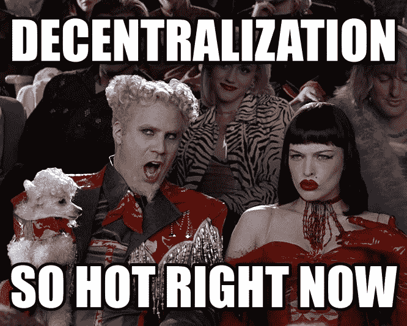

# “分散化”交易所的阴暗面

> 原文：<https://medium.com/coinmonks/the-dark-side-of-decentralized-exchanges-82d49d55e419?source=collection_archive---------6----------------------->

随着区块链工业的日益发展,“分散化”一词已经被左翼和右翼的项目所采用，这些项目为了自身的经济利益而试图使用这个词。这种说法在分散式交易所(DEx)的舞台上得到了很好的体现，在那里，项目都在宣扬它们的完全分散化和卓越的功能，结果却给用户留下了笨重、昂贵或者根本没有以分散方式运行的平台。虽然分散式交易所背后的概念对加密货币交易者来说是有意义的，但它必须克服许多当前市场解决方案所显示的问题。

# 真的是去中心化了吗？

正如 Etherdelta 的用户最近发现的那样，分散的交换加上集中的托管等于大问题。只要运营交易所的实体利用集中托管或任何其他类型的集中离链功能，就始终存在恶意攻击的风险或与基于信任的系统相关的问题。如果分散化被交易所吹捧，它必须不仅适用于资金交易所本身，而且适用于维护交易所及其软件、数据存储和服务器的性质。

火上浇油的是，由中央实体运营的交易所很可能仍受美国证券交易委员会、CFTC 和 FinCEN 的监管，这使其未来取决于这些机构如何决定交易所是否真正去中心化，或者只是将“去中心化”作为一种营销手段。至少它们可能受了解客户(KYC)和反洗钱(AML)法律的约束，要求用户披露其个人身份信息。

# 没有链条的区块链

对于 DEx 来说，当它在区块链之外执行交易，然后在链上结算这些相同的交易时，宣传分散化是很常见的。然而，这首先忽略了利用区块链技术的意义，留下了这样一个问题，即像 0x 这样的交易所是否真的以其用户被误导的方式利用了区块链技术。使交易脱离链，同时解决了以最小的订单匹配的汽油成本协调大量交易的问题，首先消除了区块链上的无信任、分散交易的好处，使这种交易在功能上可行，但不是真正的分散解决方案。

# 加密跟踪令牌

许多 dex 都增加了一个额外的层，那就是将令牌与数字资产挂钩的功能。像 Waves、Bitshares 和 OpenLedger 这样的 dex 不允许用户直接交易加密货币，而是要求所有交易都通过加密挂钩的令牌来完成，其价值与基础数字资产的价值挂钩。

这不仅给交易过程增加了额外的步骤，不得不从钉住的代币到数字资产(如果需要，然后到菲亚特)进行交易，还需要对交易所有额外的信心，以维持代币对其基础数字资产的钉住价格。初学加密货币的交易者可能不明白，在交易这种代币时，他们实际上并不是在交易加密货币本身，而是一种基于智能合约技术的虚构硬币，旨在模仿特定的加密货币。业内最大的挂钩代币 Tether 被操纵的报道应该会让用户担心是什么保障了他们正在交易的代理代币的价格。

# 订单匹配

在交易所中提供去中心化固然很好，但如果用户必须以点对点的方式寻找自己的订单，比如在 LocalBitcoins 和 Bisq 上，交易所就只是充当了加密货币事实上的 Craigslist，而没有为用户提供足够的价值。

分散的订单簿对于维护用户的最佳价值是必要的。然而，一些 dex，如 Waves，声称保持完全去中心化，通过一个集中节点匹配订单，消除了对交易所去中心化的任何要求。集中式订单匹配再次暴露了用户试图摆脱的集中化问题，例如对第三方的信任和对恶意攻击的敏感性以及资金损失。

订单匹配的另一个问题是需要在单独的托管账户中保存资金以确保交易安全，这减缓了买卖双方的交易过程。这再次迫使用户信任中介托管账户，以保护他们的资金和功能。

# 解决方案

去中心化交易所兴旺发展的唯一途径是，它是以完全去中心化的方式构建的，没有一个实体从它的存在和使用中受益。这意味着消除使用平台的额外费用以及任何一个实体的控制，同时仍然提供一个安全和快速交易的平台。

Rogue 是一个真正的*分散协议，用于以太坊上的自动代币做市商&交易。通过该协议，任何 ERC20 令牌都可以在交易所进行交易。这对新代币来说是一个巨大的好处，新代币可以在交易所上市，而无需向交易所支付任何费用或分配硬币，这在集中式和分散式交易所都太常见了。*

(补充说明:在开发 Rogue 的过程中，许多 ICO 初创公司都曾与我们接触，他们愿意提供 5-10%的代币，用于在我们的协议中列出，之前他们知道这将是免费的，而且与其他所有交易所不同，Rogue 不充当看门人。显然，这是业内普遍接受的私下交易……)

流氓协议将订单匹配的链外功能交给用户自己，而不是集中的第三方。用户的本地节点向区块链发送在哪里插入他们的订单的提示，而不是为对等合同支付链上汽油来完成工作。由于它是链外和去中心化的，所以它变成了一个优化订单匹配的自由过程！以这种方式，用户执行集中方的功能，就像 0x 以前执行的那样，除了这样做没有额外的费用。*(我现在最不想成为*[*【ZRX*](https://coinmarketcap.com/currencies/0x/)*……)*

我们希望，创建一个完全为用户利益而设计的去中心化交换协议，对于一个充斥着欺诈和非法索赔的行业来说，将是一个受欢迎的解决方案。我们将在以太坊(*和可能的以太坊经典*)上发布 Rogue，希望传播诚实的去中心化和实现货币自治。

请在下面的评论区告诉我你的想法！我想知道人们是否像我一样对区块链产业冷嘲热讽