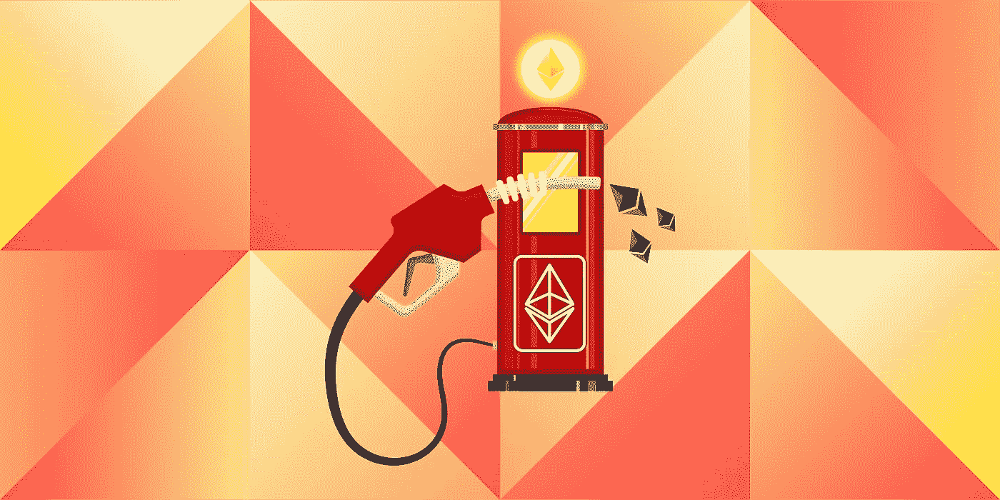

# 我眼中的分散世界。

> 原文：<https://medium.com/coinmonks/the-decentralized-world-as-i-see-it-a823acfa1e67?source=collection_archive---------4----------------------->

请注意，这是一篇观点文章。

Car stuck in traffic at night.

时不时你会从平凡中找到灵感。今天，我在结束了一天漫长的工作后，坐在回家的汽车里，随后和我的朋友在波士顿当地的一家啤酒厂进行了一次坚固性研究。交通拥挤困扰着许多很久以前为太少人建造的大城市，也影响着波士顿市。这让人们有充足的时间独自思考。今天我的思绪飘到了我周围的其他赛车上。读者，我有一个问题要问你…

## 你怎么能向我证明你拥有你的车？

当然，你可以给我提供标题或贷款信息。这些数据大概保存在一个数据库中，所以如果我对这些信息有争议，它可以被核实。在这样做的同时，您也接受了无论谁拥有该数据库都是一个真实的来源，并且数据可能会被恶意黑客破坏和修改，这些黑客会发现安全漏洞，对该数据库中的每条记录提出质疑。我希望这些系统得到很好的维护和保护，但是我已经意识到这些系统已经过时了。他们是来自皇冠的现代印章。

A seal marking a document valid

我有一些坏消息。我们拥有项目，但不拥有代表这些项目的数据。随着科技公司变得越来越大，随着世界各地的政府拥有比以往任何时候都多的关于其人民的数据，我们已经自由地放弃了这些权利。是时候结束这一切了。解决方案正在构建中。

## 区块链、智能合约和世界计算机

在不久的将来，拥有你的汽车也将拥有你的汽车的数据在多个世界范围的数据库称为**区块链。**

区块链如何确保所有权？

你拥有的独一无二的钥匙。这个密钥是一长串字符和数字，对某些人来说几乎不可能破解。众所周知，你可以用这些钥匙接收和发送比特币、以太币和其他硬币，但鲜为人知的是，你的钥匙也可以是区块链上的智能合约的所有者。

智能合同包含什么？这里有一个简单的例子，这绝不是你在汽车智能合同上能找到的一切。

> 智能合同汽车
> 
> **地址** : 0xfkdsovjiofi432ffyy5y5fda(智能合同地址)
> 
> **所有者** : 0xf8349fj2304g3438204312(代表你的私钥的公钥)
> 
> **其他信息**:车辆识别号、年份、品牌、型号、以前的维修、所有权人、牌照
> 
> **业主可以采取的行动:**
> 
> 将所有权转移到新密钥

使用正确的钥匙，您现在可以证明您拥有这款智能合约所代表的汽车。政府或公司现在可以利用这些数据，但只有你才能声称拥有这些数据的所有权。这份合同也可能包含第三方可以进行的各种修改，但只有你可以转让它的所有权。维修店可能拥有代表汽车店的智能合同的钥匙。该修理店可以有权将先前的修理添加到该合同中。

当我坐在车流中时，这个想法引发了一场风暴。当一辆车可以成为合同时，任何东西都可以成为合同。公司可以为他们出售的物品签订合同，你可以证明这些物品的所有权。举例来说，三星可以在 Galaxy s10 手机上市前卖给你合同，你可以用这份合同去商店买一部。有一天，甚至会有代表你的合同。政府可以用它来征税和赋予投票权，学校可以用它来确保你是学生，家庭可以用它来记录。当前在集中数据库上进行的任何表示真实世界中项目的所有权或关系的操作，都将在这些区块链上表示为智能合同。你将最终拥有你已经拥有的有形资产的数字存在。它将成为世界计算机。

many objects connected together by arrays of 1’s and 0's

除了实物之外，人们可以使用这些智能合同创建应用程序，以省去大多数由于当前的集中化世界而变得如此庞大的中间商公司。优步、脸书和易趣都可以被智能合约取代，降低人们为服务支付的价格，增加数据所有权。在不久的将来，随着公司股票成为区块链上的象征性资产，甚至股票市场也将变成区块链上的 24 小时交易。

## 以太坊、以太和气体

目前最有希望成为这种去中心化未来中坚力量的竞争者是 [**【以太坊】**](https://en.wikipedia.org/wiki/Ethereum) **。**以太坊是区块链上使用和开发最广泛的支持智能合约的平台。以太坊分发称为以太的代币。任何改变区块链上某些东西的行为都会消耗气体形式的以太。在我看来，如果以太坊设法成为未来的主要区块链，那么已经持有以太的人将看到巨大的回报，因为公司开始意识到这些代币本质上是未来的数字石油，并开始购买储备，我们已经看到数百家大公司对这项技术感兴趣。这些代币将运行整个经济，可能有大约 1.2 亿代币或更少的上限，使它们变得稀有和有价值。如果以太坊赢得这场加密竞赛，它将成为持有法定货币的新标准。它将是整个世界经济赖以存在的潜在宝贵资产。

Gas nozzle emitting ethereum tokens.

## 接下来会发生什么？

这取决于你。以太坊的发展宝座有很多竞争者。 [NEO](https://neo.org/) 、 [EOS](https://eos.io/) 和 [Cardano](https://www.cardano.org/en/home/) 等等。我鼓励你自己做研究。

对于开发人员来说，我鼓励你们[学习可靠性和智能合同开发](https://www.udemy.com/ethereum-and-solidity-the-complete-developers-guide/learn/v4/overview)，因为公司在未来几年将会急需智能合同开发人员。对这些开发人员的需求已经很高了，我只是预计需求将会增长。分散化的未来。

对于非开发者，多研究智能合约和区块链，考虑投资看起来有前途的项目，通过变得博学并与你的朋友分享这些信息来为这个领域做出贡献。

目前，一台完全成熟的**世界计算机**仍然有许多障碍，比如区块链的升级，但是你应该尽早学习这些技术。在你知道之前，它会包含你所做的一切。

> “你可以拖延，但时间不会。”——本杰明·富兰克林

Image of many computers surrounding the globe

# 感谢阅读！

我的以太坊地址:0x 947 dee 856 a 22 e 8598 addfe 4 EC 3175248235 eef 01

我的 LinkedIn:[https://www.linkedin.com/in/kyle-c-bryant/](https://www.linkedin.com/in/kyle-c-bryant/)

这个月我会在布宜诺斯艾利斯参加一个[黑客马拉松](https://ethbuenosaires.com/)，请告诉我你是否会去，这样我们就可以联系了！

这是我的第一篇文章，但是我希望在我深入研究开发智能合同的世界时能写更多的文章，敬请关注！