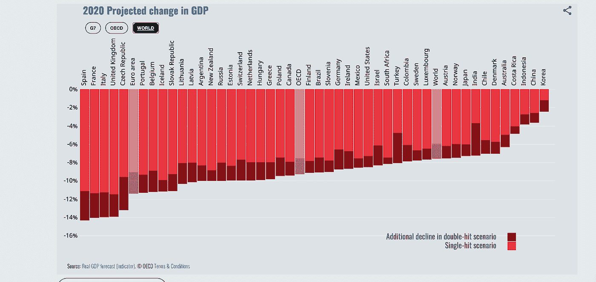
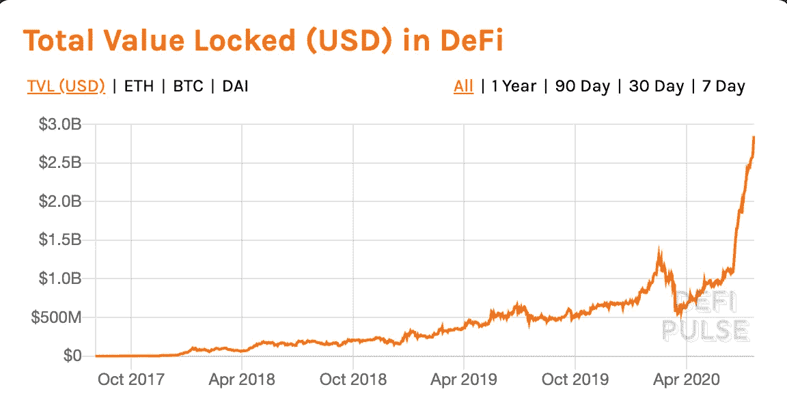
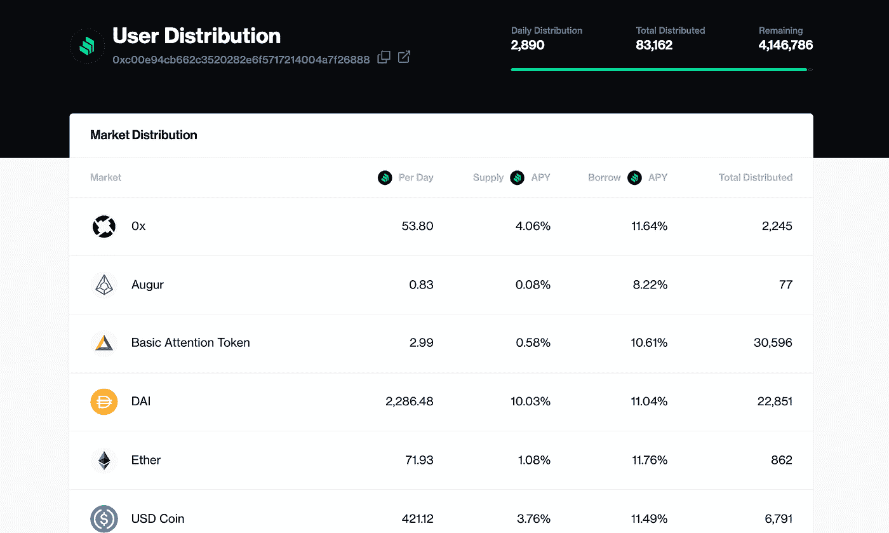
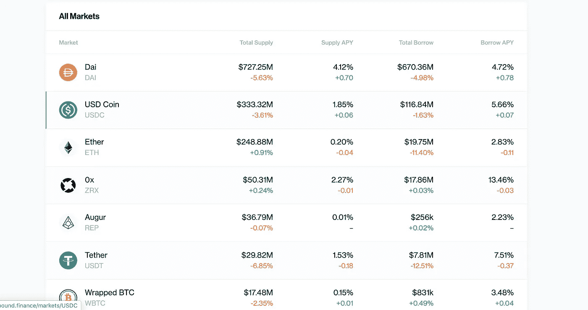
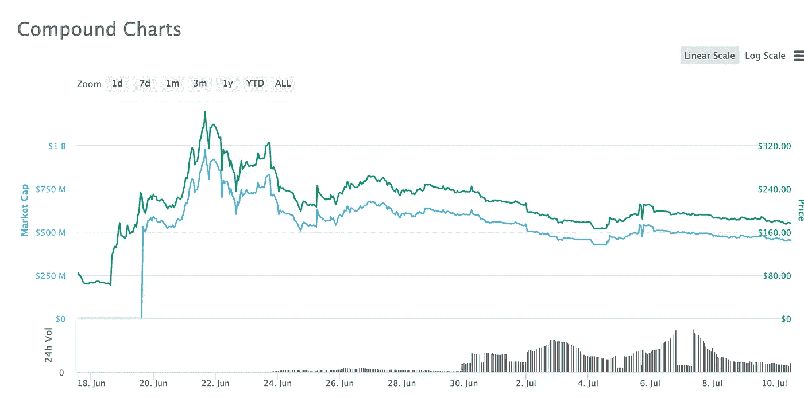
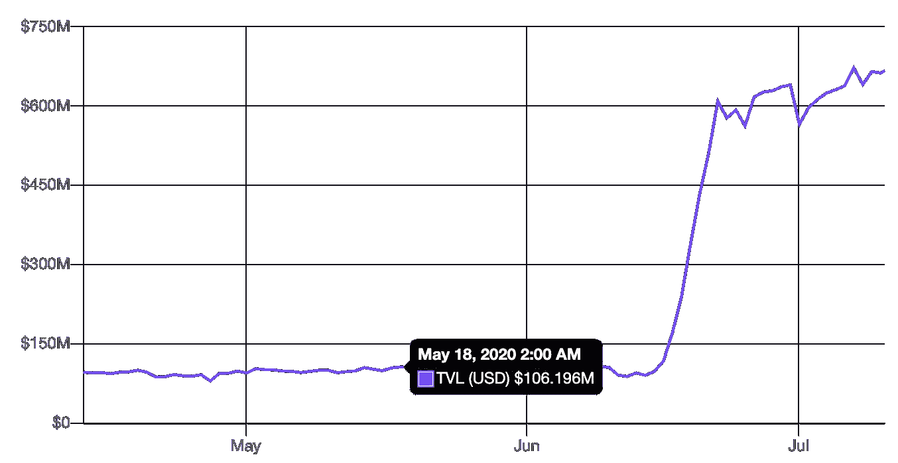
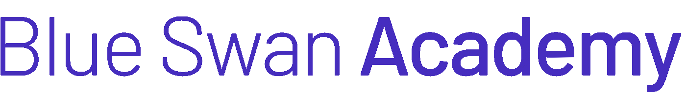

# DeFi 农业革命

> 原文：<https://medium.com/coinmonks/the-defi-agricultural-revolution-d6bca0a39d63?source=collection_archive---------2----------------------->

亲爱的密码爱好者:

DeFi 生态系统简直是一飞冲天。

当世界正走向本世纪最严重的经济衰退时，

Projection of the world’s GDP contraction range between -12 and -14%. Estimates from OECD.

[DeFi](https://blog.coincodecap.com/the-ultimate-guide-to-defi-decentralized-finance) 达到里程碑**28 亿美元总价值锁定并每分钟增长。**这不仅是一个前所未有的高数字，更重要的是，这一数字正呈指数级增长:系统锁定的总价值在上个月增长了 2 倍！

Exponential growth of total value locked in DeFi: Source: DeFi Pulse

这里发生了什么事？

双曲线增长曲线是由上个月宣布的[化合物](https://compound.finance/)引发的，这是一个未经许可的借贷平台，通过一种称为*流动性挖掘*或更通俗地说*产量农业*的新型激励机制发行和分发新的治理令牌(COMP)。

[**Yield farming**](https://blog.coincodecap.com/defi-yield-farming-and-liquidity-mining) 是一种新型激励工具，用于引导新兴平台的社区和市场。它奖励为网络提供价值的活跃用户，这些用户拥有决定未来协议更新的政治权利，有时还拥有经济权利，如现金流或其他价值累积机制。

其他项目如 [Uniswap](https://uniswap.org/) ，一个分散的交易所和自动化做市商(AMM)和 [Synthetix](https://www.synthetix.io/) ，一个 DeFi 衍生协议，开创了 DeFi 生态系统中的产量农业。然而，是上个月复合程序的发布使这个话题成为头条新闻。在 Compound 的程序中，一个新的治理令牌 COMP 是新创造的，并分发给那些积极为系统提供价值的用户。
在该计划中，代币归流动性提供者所有。虽然现在有可能在像 [Uniswap](https://uniswap.org/) 这样的分散式交换中获得 COMP 令牌，但其想法是用户可以通过积极参与协议来“赚取”令牌。

COMP rewards for liquidity providers. Source: [https://compound.finance/governance/comp](https://compound.finance/governance/comp)

治理令牌的这种分发被添加到用于向协议存入或借出资金的应计利率中。

这种新颖的激励机制是 [SAFG 模型](/ideo-colab/meet-the-safg-defis-emergent-framework-for-participatory-investing-and-protocol-development-62286a576fb5)(未来治理的简单协议)的实现，是 Y Combinator 的 [SAFTE 模型](https://docs.google.com/document/d/1q-czBdifFGDBLldgxsm6Ri5RWcePJtjKb4f7mwmfucY/edit)的迭代。在 SAFG 模型中，参与协议的人获得治理令牌，这些令牌最终可用于对协议变更进行投票。

按照设计，补偿令牌没有附加经济权利(现金流量或其他价值累积机制)，只有政治权利(对未来协议变更的投票)。然而，关于红利代币持有者可以在未来投票支持实施价值累积机制的猜测，使得红利代币的价格飙升。

$COMP price evolution since ist first issuance in the 20th of June. After a sharp spike, price has somewhat stabilized but it is still regarded by many analysts to be overvalued. Source: Coinmarketcap

用户蜂拥而至，为网络提供流动性，仅 1 个月就将锁定的价值提升了 6 倍！

Total value locked in the Compound protocol. Source: DeFi Pulse

正如它的名字*“流动性挖掘”*所暗示的，这个框架暗指最初的比特币激励结构，在这种结构中，为网络提供价值的用户(v.gr .提供安全性)会得到网络新铸造的硬币的奖励。是激励机构群体积极参与协议发展的一种形式。是一种补贴双边货币市场供应方的方式。

想象一下，在 20 世纪 90 年代，你是谷歌搜索引擎的早期用户，你获得了谷歌股票！很有趣，对吧？流动性挖掘也发生了类似的事情。早期用户可以分享网络。现在的区别是，只有为网络提供价值的活跃用户才会得到奖励，如果他们是被动的，他们会随着时间的推移而被稀释。

对于用户来说，流动性挖掘已经成为一个非常赚钱的被动收入机会。我们已经看到过去几周的年收益率(APY)超过 100%，这吸引了许多额外的投资者进入该领域。在此计算[预期薪酬奖励](http://www.predictions.exchange/compound/None)！当心风险！

自 COMP 宣布以来，越来越多复杂且有利可图的收益新兴机会已经出现。诸如 [Synthetix](https://www.synthetix.io/) (合成和衍生资产平台)[平衡器](https://balancer.finance/)(自动做市商和基金管理)[曲线](https://www.curve.fi/)(分散交易所)和 [Futureswap](https://exchange.futureswap.com/) (期货)等协议已经实施了类似的和[更复杂的程序](/renproject/introducing-an-incentivized-btc-liquidity-pool-by-ren-synthetix-and-curve-213d21691d9a)，用于同时激励不同平台中的流动性提供者。我们期望所有的 DeFi 协议都将实现某种流动性挖掘的变体，以奖励实际使用协议的活跃用户，并为他们提供流动性。不同协议的相互作用也带来了额外的收入机会，但也给赌桌带来了风险。

**风险**

一般来说，和传统金融一样，收益率越高，风险越高。和 DeFi 生态系统的其他部分一样，风险仍然没有被完全理解和发现。请勤奋，并考虑到这仍然是实验性的技术！迄今为止公认的最重要的风险是智能合约风险、平台风险、Oracle 风险、汇率风险和黑天鹅事件。

**智能合约风险**是 DeFi 协议中最常见的风险。这项技术是新的，代码可能有缺陷和漏洞可被利用。减轻这种风险的一种方法是通过 [Nexus Mutual](https://nexusmutual.io/) 购买智能合约保险。

**平台风险:**指以太坊平台整体的系统性风险。

**交易所&清算风险:**加密资产非常不稳定。如果用于借款的抵押品价值突然下跌，智能合约可以清算头寸，这可能导致部分或全部资金损失。

甲骨文风险:甲骨文是使用外部世界数据的定价源。他们总是有集中点，可以被操纵。 [Chainlink](https://chain.link/) 采用了在 DeFi 生态系统中广泛使用的解决方案，可以最大限度地降低这些风险。

**黑天鹅风险**:在 3 月份的市场崩盘中，价格单日下跌> 40%。由于不确定的全球经济形势，不可预见的风口不能丢弃。

**资源**

如果您想了解更多关于流动性开采和高产农业的信息，我们建议您:

**。最好的 DeFi 资源。时事通讯、播客和 DeFi 社区**

**[**通迅日报 Gwei**](https://thedailygwei.substack.com/) 作者安东尼·萨萨诺**

******:**卡蜜拉·鲁索通迅****

********

****蓝天鹅学院根据需求提供网络研讨会和在线研讨会，以培训个人和企业使用分散式金融工具。教育课程是入门级的，不需要以前的知识。我们相信“边做边学”，因此您将学会使用最重要的协议和应用程序。请在此查看我们当前的[产品。](https://academy.blue-swan.io/defi?utm_source=medium&utm_medium=article&utm_campaign=cw29-01)并注册订阅我们的[简讯。](https://academy.blue-swan.io/forms/258567)****

****蓝天鹅学院是一个面向区块链经济的教育平台，专注于法律和金融行业。****

****作者:胡安·埃斯卡隆****

> ****[*在您的收件箱中直接获得最佳软件交易*](https://coincodecap.com/?utm_source=coinmonks)****

********

****在 twitter 上关注我们！****

****[@ JCE callon](https://twitter.com/jcescallon)****

****[@学院 _ 天鹅](https://twitter.com/academy_swan)****