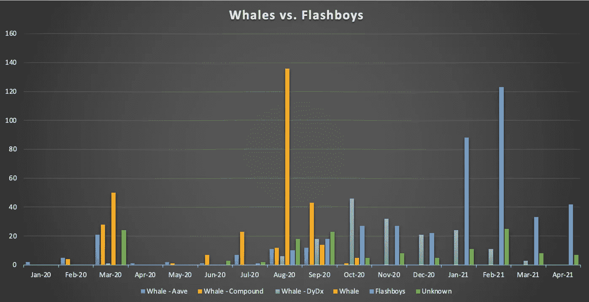
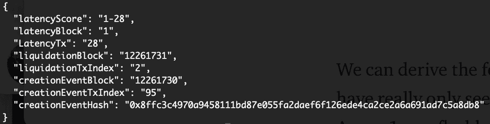
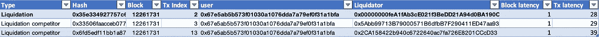
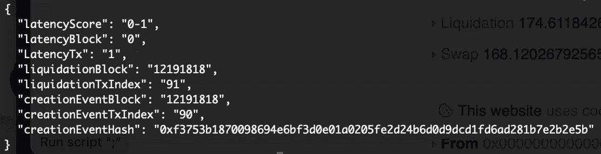
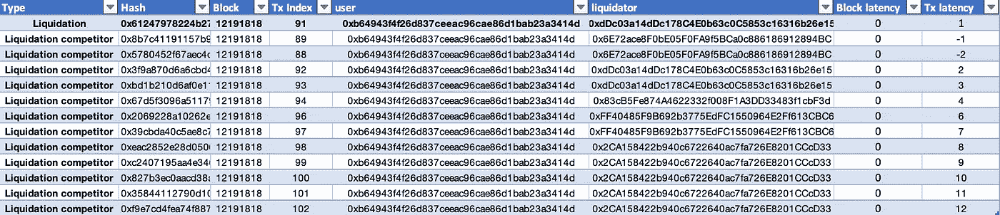
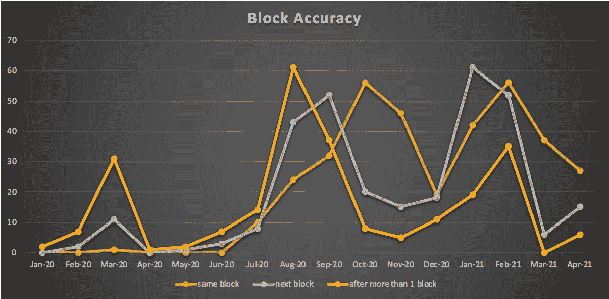
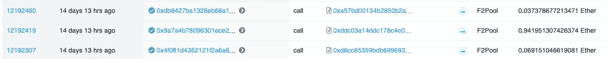

# DeFi 清算游戏

> 原文：<https://medium.com/coinmonks/the-defi-liquidation-game-aaef5c0b903d?source=collection_archive---------0----------------------->

Not all competitive multiplayer games require an APM optimized keyboard and mouse. Some are played with full nodes and mempool services.

MEV 空间活动频繁，在过去的几个月里吸引了大量的关注。[以太坊是黑暗森林](/@danrobinson/ethereum-is-a-dark-forest-ecc5f0505dff)、[逃离黑暗森林](https://samczsun.com/escaping-the-dark-forest/)、[沙门氏菌](https://github.com/Defi-Cartel/salmonella)和许多其他故事都强调，从区块链中提取价值是一项高度竞争的全天候游戏，由追求高分的各种个人玩，像 [KeeperDAO](https://keeperdao.com/#/) 或 [Flashbots](https://github.com/flashbots/pm#flashbots) 这样的项目试图以新的方式组织游戏。

根据[量化区块链可提取价值:森林有多黑中呈现的数据，MEV 空间可以大致分为几个子类？](https://arxiv.org/pdf/2101.05511.pdf)目前最重要的两个是:

## **套利**

描述在一个有限合伙人池中购买一项资产，同时在另一个有限合伙人池中以不同的价格出售该资产以获取利润的过程。创造 MEV 机会的交易可以是以显著方式改变 LP 池中资产价格的任何交易。例如，它可以由用户或机器人交易或通过清算或另一个套利机会提取价值的人创建。由于 Uniswap/Sushiswap 和其他 AMM 是以太坊上最常用的合同之一，所以这种 MEV 相当普遍也就不足为奇了。

## **清算**

自 2020 年初以来，Maker、Compound 和 Aave 等贷款协议出现了巨大增长。随着 TLV 的增加，清算量也有所增加，特别是在市场突然低迷时期，清算人偿还低于健康系数的用户贷款。虽然清算人通常采用与套利者类似的 MEV 捕获技术，如前跑和后跑，但 MEV 发现/创建/发生频率和竞争程度可能会有很大不同。本文对 DeFi 清算领域提供了一些更深入的见解。我们将看看清算人用来捕获 MEV 的技术。我们还将讨论如何测量延迟，这是 HFT 使用的一个关键指标，并将其应用于 MEV 领域。

用于生成图表的数据是从 2020 年 1 月至 2021 年 4 月发生在 Aave v1 和 v2 上的清算中收集的。导致低利润(少于 1 ETH)或负利润的清算已从数据集中删除。利润阈值的选择是为了捕捉那些有足够的经济激励来吸引多个清算人参与同一机会的清算。

如果你想回忆一下 DeFi 的清算工作，我推荐你在继续之前阅读[清算者:帮助 DeFi 运作的秘密鲸鱼](/dragonfly-research/liquidators-the-secret-whales-helping-defi-function-acf132fbea5e)。

# **鲸鱼大战闪电侠**

在我们深入分析清算之前，让我们先谈谈快速贷款。虽然现在能够在不提供任何担保的情况下借入价值数百万美元的密码是正常的，只要你在同一笔交易中偿还，但这仅在一年前是开创性和革命性的。大家记住的是像 [bZx 1](https://peckshield.medium.com/bzx-hack-analysis-exposes-challenging-defi-inherent-composable-liquidity-risks-e3e1c623b7bd) 、 [bZx 2](https://peckshield.medium.com/bzx-hack-ii-full-disclosure-with-detailed-profit-analysis-8126eecc1360) 或者[平衡器](https://peckshield.medium.com/balancer-hacks-root-cause-and-loss-analysis-4916f7f0fff5)这样的黑客。黑客大大加快了稳定和安全的 DeFi 协议的自然选择。然而，闪贷对生态系统也有其他影响。例如，他们为所有参与 MEV 领域的人创造了公平的竞争环境。追求更大的机会不再需要成为一只密码鲸，不再是突然之间每个人都可以做到。这大大增加了玩家的数量，加剧了竞争。

下图显示了清算情况，并根据清算人获取流动性的方式对其进行了分类。

*   Whale-Aave:从 Aave 借入的资产
*   Whale-Compound:从 Compound 借用的资产
*   Whale-Dydx:从 Dydx 借入的资产
*   Whale:仅在清算和 ERC20 合约期间与 Aave 交互。假设清算人使用自己的资金进行清算
*   Flashboys:偿还贷款的清算来源来自 Uniswap、Sushiswap 或 Kyber。没有一个主要的借贷平台是用来借入资产的
*   未知:流动性来源未被发现

Source of liquidity of all liquidations in the data set

我们可以从数据集中得出以下一般趋势。在 2020 年 5 月推出 Uniswap v2 之后，flash boys 真正实现了增长，因为 Aave v1 支持 flashloan，但阻止用户在接受 flashloan 的同时进行清算。当时，真的没有任何其他地方能让你快速获得流动性不错的贷款。虽然不同流动性来源之间存在波动，但很明显，鲸鱼在 2020 年初和中期普遍占据主导地位，此后，闪光灯男孩接管了市场。促成这一发展的因素有:

*   清算人可以获得或借出的流动性可能不足以追求更大的机会。
*   闪贷的贷款利率很低。Uniwap 和 Sushiswap 拿 0.3%。
*   用自己的资金进行清算可能会有风险，并导致亏损。flashloan 来源清算的最坏情况是交易恢复。

# 潜伏

首先，让我们简单介绍一下价格预言，理解后面介绍的延迟的概念很重要。自推出以来，Aave 一直使用 Chainlink oracles 进行资产价格更新。如果您不熟悉 Chainlink，想象一下一群提供商从区块链以外的某个地方获取资产价格，然后在价格上涨或下跌时将价格提交给智能合约。一旦向 oracle contract 提交了足够多的 oracle update 事务，就会根据所有提交的事务计算出新的中间价，并更新资产价格。这种情况经常发生，你可以想象，以太坊充满了 oracle 价格更新。对于 Aave 用户来说，抵押资产的价格下降或借入资产的价格上升会导致用户变得不健康，或者换句话说，借入资产的价值过于接近抵押的价值。Aave 需要确保所有贷款在任何时候都被超额抵押，如果不再是这种情况，其他人可以为该用户偿还贷款，并获得同等价值的可用抵押品和奖金，并进行清算。因此，使清算成功的是价格更新，使用户抵押不足，我们将这一事件称为 MEV 创建。

测量 MEV 创建和 MEV 提取事件(在这种情况下是清算)之间的距离，使我们能够确定任何尝试的延迟，无论是成功还是失败。为什么这很重要？清算人不只是对成功清算的数量感兴趣吗？答案是肯定的，当然提取的金额就是高分。但是测量延迟可以让你了解什么是最佳策略，并根据每次尝试来衡量你的机器人。它还为您提供了关于您的 bot 执行情况的更即时的反馈，当其他玩家的延迟远远超过您的延迟时，或者当生态系统发生变化时，例如新的内存池服务速度极快时，您可以了解其他玩家是否开始超过您。

让我们讨论两种清算和所使用的技术，并测量它们的延迟，以了解如何实现它。

## **技巧 1:天然气拍卖**

此[交易](https://etherscan.io/tx/0x35e334927757c618a1702d3bd618b735d6b249a3a5d56ff1bc638375d1ce7db6)于 4 月 18 日清算用户 0x 67 E5 ab 5b 573 f 01030 a 1076 DDA 7a 79 ef 0 f 31 a1 BFA，清算人偿还从用户处借入的部分 DAI，并收到 Aave 令牌作为回报，为 DAI 出售 Aave 令牌，偿还从 Uniswap 池借入的 DAI，然后将剩余的 Aave 令牌交换为 ETH。这是一种天然气拍卖交易，多个清算人哄抬天然气价格，成为第一个清算用户的人。让你成为第一个意味着让你的交易尽可能靠近 MEV 创建事件。我们可以通过模拟发生在块 12261731 和事务索引 2 的清算并尝试在先前的位置执行它来找到 MEV 创建事件。该过程如下所示:

1.  在 12261731 块和交易指数 1 处清算是否仍然成功？是
2.  在 12261731 块，交易指数为 0，清算还成功吗？是的。哦，那么 MEV 创建事件必须在前一个块中。
3.  在块 12261730 和交易指数 120(该块有 121 笔交易)清算是否仍然成功？是
4.  …
5.  在 12261730 块，交易指数 95，清算还成功吗？否。该交易是 oracle 价格更新吗？是的。然后我们找到了 [MEV 创建事件](https://etherscan.io/tx/0x8ffc3c4970a9458111bd87e055fa2daef6f126ede4ca2ce2a6a691ad7c5a8db8)，在本例中它更新了戴的价格。

现在我们已经找到了 MEV 创建事件，我们可以通过测量两个事件之间的距离来计算清算的延迟。让我们指定一个由数据块和事务延迟组成的延迟分数，该分数揭示了来自可用数据块的所有基于时间的相关信息。对于块延迟，包含清算的块号从包含 oracle update 价格的块号中减去。对于事务延迟，我们测量两个事件之间有多少事务。因此，我们将块展平为一个事务列表，并计算从创建到提取事件有多少个要获取的事务。这意味着在 MEV 创建和提取之间有一个块，从一个事件到另一个事件有 28 个事务。因此，我们得出结论，清算的延迟得分为 1–28。

Latency measure for [gas auction liquidation](https://etherscan.io/tx/0x35e334927757c618a1702d3bd618b735d6b249a3a5d56ff1bc638375d1ce7db6)

还有两个竞争对手试图清算同一个用户。0x5Abb 次重新定价清算，最终支付 7 **。**交易费用中的 98 ETH。0x2CA1 放弃较早，付出 1.5 ETH。

List of [liquidation](https://etherscan.io/tx/0x35e334927757c618a1702d3bd618b735d6b249a3a5d56ff1bc638375d1ce7db6) competitors

有趣的是，前两笔交易似乎在不同的流动性池之间套利。他们透露，该区块包含通过 flashbots 提交的交易。所以套利者也可以利用这次清算。我们将在后面的部分更详细地介绍 flashbots，并解释为什么会这样。

## **技巧 2:回溯价格甲骨文更新**

此[交易](https://etherscan.io/tx/0x61247978224b2742375399c6c6c3bbe7c0aa9245ac3c9ae154fdeca026158f2f)于 4 月 7 日清算用户 0xb 64943 F4 f26d 837 ceeac 96 CAE 86 D1 Bab 23 a 3414d。发送交易的清算人不与其他人在天然气价格上竞争，而是在同一区块的 MEV 创建事件后，谁能够反向运行并最接近。区块内的交易通常由矿商按照天然气价格从高到低排序。比较 MEV 生成和提取事件的气体价格，我们注意到它们是相同的 166 **。** 1 Gwei。当我们测量延迟时，我们发现清算实际上发生在 oracle 更新之后。这是一个*0–1*的延迟分数(从 MEV 创建到提取事件的同一个块和 1 个事务)，这是可能的最高延迟分数。

Latency measure for [back-running oracle price update liquidation](https://etherscan.io/tx/0x61247978224b2742375399c6c6c3bbe7c0aa9245ac3c9ae154fdeca026158f2f)

让我们看看竞争对手在试图清算同一用户时的表现，并测量他们的延迟。下表包含了与成功清算相同天然气价格的同一区块中同一用户的所有清算尝试。

List of [liquidation](https://etherscan.io/tx/0x61247978224b2742375399c6c6c3bbe7c0aa9245ac3c9ae154fdeca026158f2f) competitors

这里发生了很多事情。总共有来自 5 个不同清算人的 12 次其他清算尝试。交易指数 90 处的 oracle 价格更新完全被清算尝试所包围。从第 2 行和第 3 行可以看出，甚至有 2 个出现得太早。负的事务延迟分数意味着 MEV 提取发生在创建之前。同样引人注目的是，大多数清算人选择发送多次尝试。这种技术不知何故让我想起了[堆喷](https://www.computerhope.com/jargon/h/heap-spraying.htm)，一种在 21 世纪初流行的技术。它用于在 web 浏览器中执行代码，方法是将代码放在堆的不同位置，希望被覆盖的函数指针稍后会引用其中一个位置并执行代码。在这种情况下，清算人的垃圾邮件清算尝试与 MEV 创建事件同步进行，以最大化他们尽可能接近 MEV 创建事件的机会。

## 谁赢了？

在前面的例子中，我们已经讨论了两种主要的清算策略。谁赢了——天然气拍卖商还是价格预言家？回到延迟的概念，我们可以看到反向运行价格预测实现了最高的延迟，因此它是最佳技术，因为它发生在与 MEV 创建事件相同的块中，而天然气拍卖严格地发生在下一个块中，因为还没有人利用这个机会。当我们以这种方式考虑这些技术时，很明显这些技术是可以组合的，其中清算人可以首先尝试回溯最初的尝试，然后如果 MEV 创建事件已经包括在最新的块回退到气体拍卖技术中之后机会仍然存在。

让我们再次查看整个清算数据集，并测量延迟。下图显示了按在同一、下一个或多个数据块中的发生情况分组的清算的数据块延迟。我们注意到，随着时间的推移，延迟已经逐渐改善。从 2020 年年中开始，flashloans 也可能大大增加了参与清算游戏的人数，这反过来导致竞争加剧，并有助于降低清算的延迟。我们进一步看到，在过去的几个月里，oracle 价格回溯已成为迄今为止最成功的清算技术。

Block latency for liquidations that were successfully measured

## 游戏一直在变

虽然这些技术目前是成功的，但这并不意味着它们将来也会成功。有一个项目可能会让上述所有技术最终过时，并让清算游戏彻底失败，那就是 flashbots。对于那些不熟悉这个项目的人，我强烈推荐看看他们的 [Github](https://github.com/flashbots/pm) 或者[加入他们非常活跃的社区。flashbots 的基本思想是创建一个链外协调机制来决定谁可以在下一个块中排序事务，从而捕获 MEV。搜索者(基本上是任何想要提取 MEV 的人)可以提出普通块的块替代方案，包括他们的 MEV 提取以及 MEV 创建交易，并基本上贿赂矿工选择他们的块(或他们的块的一部分),直接将 ETH 转移到 coinbase 地址。矿商有动力选择利润最大的区块。当 flashbots 开始时，只有一个矿工参与了一段时间，但这似乎已经发生了巨大的变化(见](https://discord.gg/7hvTycdNcK)[他们的三月更新](/flashbots/flashbots-transparency-report-march-2021-d3930b4b98a9)),相当多的大矿工已经开始开采 flashbots 块。

4 月 7 日，包含 Aave 清算的第一批 [flashbots 区块中的一个](https://etherscan.io/tx/0x9a7a4b78096301ece260e8f22c46d8387931d0c3c2b4f8c5ea4c6e5dfe8f9d0d)被开采，用于偿还 USDC 的贷款，并获得 WBTC 的回报。查看块 12192419 中的前几个事务，很明显这是一个非标准块:

[**索引 0**](https://etherscan.io/tx/0x4639c928e61ae9e37364f31111f5bc1219f8a8994d6b616693214001284f1345) 处的事务包含 MEV 创建事件。这是 oracle 为 USDC 更新的价格，设定的天然气价格为 171 **。250001823 Gwei。**

[**索引 1**](https://etherscan.io/tx/0x9a7a4b78096301ece260e8f22c46d8387931d0c3c2b4f8c5ea4c6e5dfe8f9d0d) 的交易包含 MEV 提取事件。就是设定气价为 0 的清算。在这种情况下，不是通过 gas 向矿工付款，而是向 0.94 ETH 的 coinbase 地址进行传输，这是由 F2Pool 收集的。

根据设定的天然气价格及其在区块中的位置，区块中的以下交易看起来很标准。此外，没有进一步的 coinbase 转移。看起来清算是这个街区唯一的 MEV 提取。

One coinbase transfer at block 12192419

# TL；速度三角形定位法(dead reckoning)

没有什么是静止的，在 MEV 空间中，事物似乎都在以光速运动。新玩家的加入、oracle 机制的变化以及第三方 mempool 服务速度的加快都导致了这样一个事实，即市场在不断变化，哪些玩家拥有优势。flashbots 肯定有潜力从根本上改变清算游戏的玩法。如果是这样的话，这也将有望对普通以太坊用户产生积极的影响，因为 MEV 提取协调将发生在链外，使天然气拍卖和 tx 垃圾邮件成为过去。如果个人在未来仍然能够在这个高度竞争的 24/7 多人游戏中竞争，矿工和更大的玩家进入这个空间还有待观察。