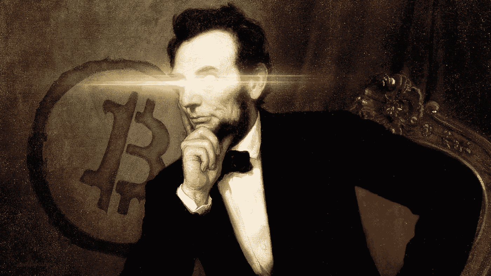

# 货币的民主化和数字化

> 原文：<https://medium.com/coinmonks/the-democratization-and-digitization-of-monetary-energy-96767a43030e?source=collection_archive---------4----------------------->

金钱主宰着我们周围的世界。我们都知道如何赚钱；我们都知道如何花钱。然而，尽管我们每天都与金钱打交道，但我们并不都从根本上理解金钱到底是什么。理解货币本质的一个简单方法是将货币视为能量。这种能量被称为货币能量，已被人类收获和创新，以帮助彼此交易价值(跨越空间)，以及储存价值以备后用(跨越时间)。纵观历史，货币能量以各种形式表现出来，以使能量的促进和储存更加有效。一些被用作货币或交换媒介的物品包括珠子、贝壳、石灰石和金属。你可能会问，为什么石灰岩或珠子会被用作货币？简单的答案是，货币能量自然会被吸引到能够长期保值的稀缺资产上；这就是所谓的价值储存。在使用上述货币的地区，它们是很难生产更多的稀缺物品。这些物品现在被视为过时的有效交换媒介的原因是由于外部力量使供应过剩的市场饱和。当供给增加时，在货币能量的集中上有一个漏洞，因为一些能量被迫从先前存在的岩石、珠子或贝壳中迁移，并移入新引入的岩石、珠子或贝壳中(膨胀)。这种从先前存在的货币到新引入的货币的能量外流削弱了在供给增加之前持有货币的每个实体的价值。现在能够铸造新货币(想想现代政府和中央银行)并将其投入流通的外部力量能够随意增加他们的市场资本，并且随着每一批新货币进入流通供应，他们会进一步贬值其他人的货币能量。最终，市场将感受到这种破坏的影响，并做出最终崩溃的回应，因为岩石、珠子和贝壳不再适合作为货币能量的长期保存者。

Trade Beads used in Africa until Europeans started producing large quantities and introducing them into the existing supply, ultimately causing the extinction of an effective money.

The monetary energy does not disappear in this case, rather it undergoes a process which could be viewed as Monetary Darwinism. Energy will move on from beads, rocks, and seashells to find something else which is stronger, and more fit to withstand the threat of outside entities trying to produce more and flood the market with. Over time, it had become evident that monetary energy had chosen gold as the best choice on a global scale for any region that had access to it. The reason why gold has been able to hold its value over the course of thousands of years is due to its virtually indestructible properties, as well as it being a resource that is difficult to produce more of on an international level versus a regional level. Gold is relatively scarce in the sense that only about 2% of gold is able to be mined every year and introduced into the market, making the threat of a supply flood nearly impossible. However, with a 2% yearly increase, gold is not thermodynamically sound and although there is no real threat of a flood, there is still a leak that cannot be plugged up.

Gold allowed societies to flourish under a hard money whose store of value properties were able to protect the monetary energy and purchasing power of gold holders centuries into the future. Having a money whose value increases or maintains its purchasing power over time rather than a money whose value decreases allows human beings to have peace of mind regarding their future. It is why many governments and nation-states eventually adopted what is known as the Gold Standard. Before going any further though, it is important to understand some of the main properties needed to not only be an efficient store of value, but a functioning medium of exchange.

An effective money (sound money) should be easily divisible, portable, durable, homogenous, and it should be scarce. Two of the big issues with gold revolve around the aspects of divisibility and portability. It is difficult for the average person to divide gold into smaller parts, and size and weight pose issues with the portability of gold. Many societies combatted these issues with the production of gold coins, which unfortunately often led to coin clipping and debasement of the coins from centralized authorities (see Byzantine gold coins for example). Although gold was effective in transacting value across time, it was not as effective in transacting value across space. Eventually, at the end of the 19th century, many governments decided to peg paper bank notes to gold. The bank notes in a sense acted as redeemable receipts for gold where you could, for example, at any time walk into a bank and redeem your dollar bill for 1/35th of an ounce of gold. The bank notes played a helpful role in increasing the ease of gold’s portability and divisibility by expressing the value as a lightweight piece of paper with different value increments. Although the Gold Standard was effective while it lasted and provided a period of stabilized monetary energy conservation, gold was eventually centralized and many countries trusted the USA to safeguard their gold reserves and uphold the dollar to gold ratio. A mixture of political and economic pressures on a global scale ultimately led to the US failing at this and abandoning the gold standard in 1971\.

The abandonment of the Gold Standard issued in a new era of monetary policy which, referred to by Saifedean Ammous, can be better known as the Fiat Standard. The Fiat Standard is a monetary policy that enables the exterior forces mentioned earlier to mint their new money and inject it into the circulating supply, while simultaneously stealing monetary energy from anyone unable to play by the same rules as them. This fiat money is not backed by the energy storage properties of gold, but by trust in the government to maintain social and economic order and influence to stabilize and store the value. It is no coincidence that since the Vietnam War and Nixon’s decision to break off the Gold Standard, trust in the US government by its citizens has been on a consistent downtrend.

In a world where the state controls the money, it puts its citizens at a clear disadvantage since it is illegal for citizens to print money. Having institutions in place designed to monitor inflation and control government printing and spending have proved pointless as the US now faces roughly $30,000,000,000,000 worth of debt with no sign of putting a stop to their ongoing debasement of their peoples’ energy and purchasing power. After the 2008 financial crisis when the US government decided to not hold the banks accountable for their part in the mess, but instead bail them out with stimulus packages, it was clear that this age of government issued money needed a solution. A solution to this problem of time and energy theft by the governments across the world was posed by a pseudonymous coder who went by the name Satoshi Nakamoto and went live in the following year.

The chart of a government unable to resist the temptations of printing of fiat.

这个解决方案叫做比特币。比特币是第一个工程化的热力学货币系统，旨在存储跨时间和空间的货币能量。凭借 2100 万比特币(稀缺)的硬上限供应(可以被分解为 2.1 万亿个被称为 satoshis(可分)的单位)，以及由任何个人或实体都无法改变或篡改的不可变代码管理的货币政策，中本聪能够利用多年的计算机科学和奥地利经济思想解决这个破碎的系统。由于比特币协议是去中心化的，因此不存在单一的弱点，这使得该协议不可能被黑客攻击(持久)。通过使用比特币闪电网络，可以瞬间将任意数量的比特币传送到世界各地，只需支付微小的费用(便携)。要加入比特币网络，你需要的只是一台可以上网的移动设备或电脑，而且你不需要提供任何个人信息。比特币网络的参与者，尤其是那些生活在独裁统治者和监控国家下的参与者，能够在没有中央实体许可或干预的情况下，在彼此之间进行私下交易。这是一个没有统治者的平等主义规则体系，富人必须遵守与穷人相同的规则，政府必须遵守与人民相同的规则(同质)。

随着 21 世纪技术的快速创新，我们通过互联网的诞生见证了信息和通信的数字化和民主化。这也导致了许多其他事物的数字化和民主化。一个例子是音乐；音乐曾经有很高的准入门槛，这经常导致艺术家们争先恐后地将他们的实体混音带拿到他人手中，但他们现在可以录制并立即上传到 SoundCloud 或 Spotify 等平台上，数百万人可以在那里看到他们来自世界各地的作品。亚马逊能够将书籍和阅读材料数字化和大众化，现在不需要借书证或附近的书店，你可以在线浏览你最喜欢的书籍，并将整个图书馆下载到你的智能手机或平板电脑上。新冠肺炎的不幸到来也推动了劳动力的数字化和民主化，现在许多行业的员工都能够自由地重新定位，并在组织中获得更多机会，因为像 Zoom 和微软团队这样的通信技术，他们以前可能由于身体限制而没有机会。作为一个全球社会，我们现在正在向一个货币已经数字化和民主化的世界过渡。我们现在有一个无需许可、防查封、防审查、分散的体系，准入门槛极低，允许一个人对自己的货币能量拥有完全的主权，并容易进入世界经济，而许多人被排除在外。

Crowds gather to try and withdraw money from the bank in Myanmar after the military coup, paralyzing the banking system which was unable to keep up with withdrawals. (*Yangon, Myanmar, May 12, 2021)*

需要强调的是，历史会重演。在比特币的案例中，以及在对人类进步的研究中，更好的技术总是会胜出。人类终于完善了货币技术，随着时间的推移，这一点会越来越清晰。比特币是世界各国人民的希望，他们正遭受外部力量窃取他们的货币能量，并禁止他们拥有财产权和良好的生活质量。比特币让世界各地的人们——无论是在社会经济稳定还是不稳定的国家——能够亲自保管自己的财富或储蓄，而不必冒险依赖一个中央实体来保护它们。我们已经解决了钱的问题；我们可以拯救世界。