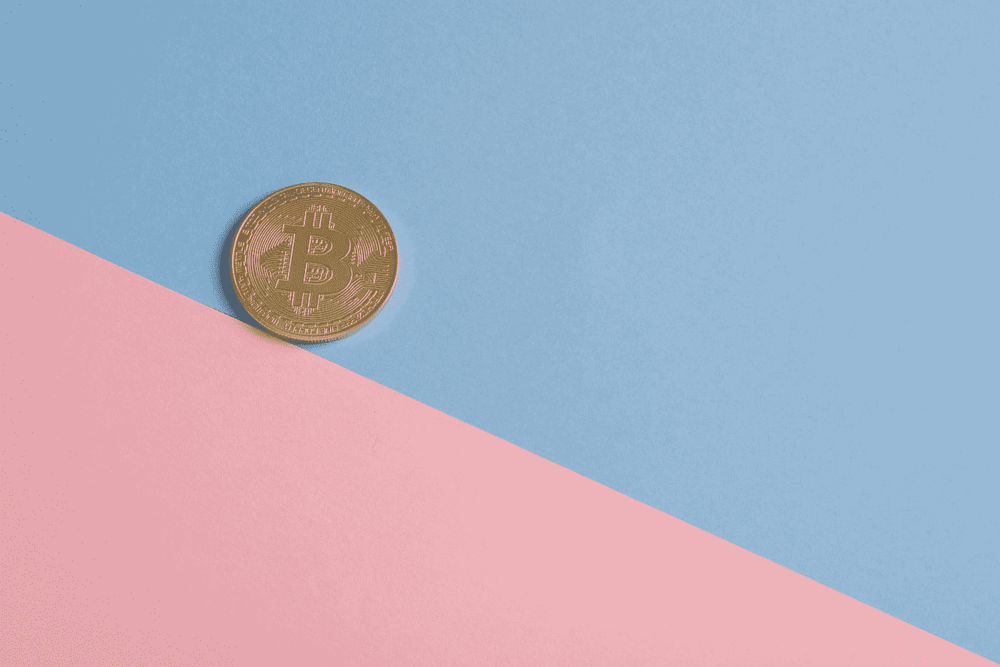

# 硬币和代币的区别

> 原文：<https://medium.com/coinmonks/the-difference-between-a-coin-and-a-token-f062ca1ca46f?source=collection_archive---------5----------------------->

## 是啊，没错。我也不知道有区别。

Photo by [Icons8 Team](https://unsplash.com/@icons8?utm_source=medium&utm_medium=referral) on [Unsplash](https://unsplash.com?utm_source=medium&utm_medium=referral)

整整 2 年后，我才意识到“硬币”和“代币”这两个词是有区别的，因为这两个词被反复使用，几乎可以互换。因此，包括我自己在内的许多人认为它们指的是同一件事，但它们实际上是完全不同的概念。

What? There’s a difference?!

> 硬币就是硬币。代币就是代币。代币不是硬币。硬币不是代币。——某个名人。

术语 **coin** 指的是任何拥有自己单独、独立的区块链的加密货币(如比特币、以太坊、波尔卡多特、卡尔达诺等。).术语**令牌**指的是建立在现有区块链之上的任何加密货币(例如 ERC-20 令牌，如 Maker (MKR)、Basic Attention Token(蝙蝠)、USDT、Chainlink(链接))。

## 为什么 token 不建造自己的区块链？

许多区块链项目在他们的 ico 期间发行令牌，打算在未来创建他们自己的区块链(EOS，TRON)。创造一个完全不同的区块链不是一件容易的事(尽管现在做起来会容易得多)，这种复杂性需要大量的双手和大脑来构建所需要的东西。这些加起来就是成本，最简单的融资方式之一是通过首次公开募股(ICO) 。

对于这些项目团队中的许多人来说，推出他们的令牌 ICO 的一种流行方式是在以太坊或 Neo 等区块链平台上构建。这些基于以太坊的代币被称为 ERC-20 代币。如果你使用 NEO，那么令牌被称为 NEP-5 令牌。

基于这些平台的构建允许项目团队释放大量的时间和资源，同时也允许他们构建自己的分散应用程序，或者通过测试网将他们的应用程序转变为硬币。由于它们建立在现有区块链的基础上，这些令牌还可以在应用程序中使用加密货币(交易)的功能，同时受益于原生区块链的安全性(即共识机制)。

## 从代币到硬币

Feels like graduation

在理解了硬币和代币之间的区别之后，你可能会意识到过去的一些项目已经从代币转换成了硬币，并且做了一件叫做“硬币交换”的事情。

这通常是在一个项目已经成功地测试了他们自己的区块链之后进行的。一旦主网准备好启动，这种交换就会发生，将现有的代币转换成硬币。然后，它们作为功能完整的区块链运行，独立于构建它们的原始平台。

一些著名的项目已经做到了这些，如 EOS、Tron 和 VeChain。

## 概括一下(以及如何辨别某物是硬币还是代币):

下面这个漂亮的表格总结了我们之前讨论的所有内容。

Credit: Coinguides.com

但房间里隐约出现的问题是:我们如何知道加密货币是硬币还是代币？

去[CoinGecko.com](https://www.coingecko.com/en)找到你正在看的加密货币。资产的标签应该显示它是否是令牌。硬币壁虎曾经有一个“硬币”标签，但我想任何不是代币的东西*都是硬币，所以没有必要有两个单独的标签。*

Enjin is tagged as a ‘token’ on Coin Gecko

现在你应该是解释代币和硬币区别的专家了！

谢谢你走到最后！如果你喜欢读这篇文章，请在这里为我鼓掌，或者在[推特](https://twitter.com/lukexzq)或[媒体](https://lukezyx.medium.com/)上关注我。

> 加入 Coinmonks [Telegram group](https://t.me/joinchat/Trz8jaxd6xEsBI4p) 并了解加密交易和投资

## 另外，阅读

*   [什么是融资融券交易](https://blog.coincodecap.com/margin-trading)
*   最好的[密码交易机器人](/coinmonks/crypto-trading-bot-c2ffce8acb2a) | [网格交易](https://blog.coincodecap.com/grid-trading)
*   [3 商业评论](/coinmonks/3commas-review-an-excellent-crypto-trading-bot-2020-1313a58bec92) | [Pionex 评论](/coinmonks/pionex-review-exchange-with-crypto-trading-bot-1e459d0191ea) | [Coinrule 评论](/coinmonks/coinrule-review-2021-a-beginner-friendly-crypto-trading-bot-daf0504848ba)
*   [AAX 交易所评论](/coinmonks/aax-exchange-review-2021-67c5ea09330c) | [德里比特评论](/coinmonks/deribit-review-options-fees-apis-and-testnet-2ca16c4bbdb2) | [FTX 交易所评论](/coinmonks/ftx-crypto-exchange-review-53664ac1198f)
*   [n 零复习](/coinmonks/ngrave-zero-review-c465cf8307fc) | [Phemex 复习](/coinmonks/phemex-review-4cfba0b49e28) | [PrimeXBT 复习](/coinmonks/primexbt-review-88e0815be858)
*   [Bybit Exchange 审查](/coinmonks/bybit-exchange-review-dbd570019b71) | [Bityard 审查](/coinmonks/bityard-review-7d104239be35) | [CoinSpot 审查](https://blog.coincodecap.com/coinspot-review)
*   [3 commas vs Cryptohopper](/coinmonks/3commas-vs-pionex-vs-cryptohopper-best-crypto-bot-6a98d2baa203)|[赚取加密利息](/coinmonks/earn-crypto-interest-b10b810fdda3)
*   最好的比特币[硬件钱包](/coinmonks/the-best-cryptocurrency-hardware-wallets-of-2020-e28b1c124069?source=friends_link&sk=324dd9ff8556ab578d71e7ad7658ad7c) | [BitBox02 回顾](/coinmonks/bitbox02-review-your-swiss-bitcoin-hardware-wallet-c36c88fff29)
*   [总账 vs n 平均](/coinmonks/ledger-vs-ngrave-zero-7e40f0c1d694) | [总账 nano s vs x](/coinmonks/ledger-nano-s-vs-x-battery-hardware-price-storage-59a6663fe3b0)
*   [密码本交易平台](/coinmonks/top-10-crypto-copy-trading-platforms-for-beginners-d0c37c7d698c) | [Coinmama 审核](/coinmonks/coinmama-review-ace5641bde6e)
*   [CoinLoan 评论](/coinmonks/coinloan-review-18128b9badc4) | [YouHodler 评论](/coinmonks/youhodler-4-easy-ways-to-make-money-98969b9689f2) | [BlockFi 评论](/coinmonks/blockfi-review-53096053c097)
*   最好的[加密税务软件](/coinmonks/best-crypto-tax-tool-for-my-money-72d4b430816b) | [硬币追踪评论](/coinmonks/cointracking-review-a-reliable-cryptocurrency-tax-software-5114e3eb5737)
*   最佳[加密借贷平台](/coinmonks/top-5-crypto-lending-platforms-in-2020-that-you-need-to-know-a1b675cec3fa) | [杠杆代币](/coinmonks/leveraged-token-3f5257808b22)
*   [block fi vs Celsius](/coinmonks/blockfi-vs-celsius-vs-hodlnaut-8a1cc8c26630)|[Hodlnaut Review](/coinmonks/hodlnaut-review-best-way-to-hodl-is-to-earn-interest-on-your-bitcoin-6658a8c19edf)
*   [Bitsgap 审查](/coinmonks/bitsgap-review-a-crypto-trading-bot-that-makes-easy-money-a5d88a336df2) | [Quadency 审查](/coinmonks/quadency-review-a-crypto-trading-automation-platform-3068eaa374e1) | [Bitbns 审查](/coinmonks/bitbns-review-38256a07e161)
*   [埃利帕尔泰坦评论](/coinmonks/ellipal-titan-review-85e9071dd029) | [塞克斯斯通评论](/coinmonks/secux-stone-hardware-wallet-review-15-discount-coupon-2020-7577032faa6e)
*   [本地比特币审核](/coinmonks/localbitcoins-review-6cc001c6ed56) | [加密货币储蓄账户](https://blog.coincodecap.com/cryptocurrency-savings-accounts)
*   最佳[区块链分析](https://bitquery.io/blog/best-blockchain-analysis-tools-and-software)工具| [赚比特币](/coinmonks/earn-bitcoin-6e8bd3c592d9)
*   [加密套利](/coinmonks/crypto-arbitrage-guide-how-to-make-money-as-a-beginner-62bfe5c868f6)指南| [如何做空比特币](/coinmonks/how-to-short-bitcoin-568a2d0b4ae5)
*   最佳[加密制图工具](/coinmonks/what-are-the-best-charting-platforms-for-cryptocurrency-trading-85aade584d80) | [最佳加密交易所](/coinmonks/crypto-exchange-dd2f9d6f3769)
*   [如何在印度购买比特币？](/coinmonks/buy-bitcoin-in-india-feb50ddfef94) | [瓦济克斯审查](/coinmonks/wazirx-review-5c811b074f5b)
*   [印度比特币交易所](/coinmonks/bitcoin-exchange-in-india-7f1fe79715c9) | [比特币储蓄账户](/coinmonks/bitcoin-savings-account-e65b13f92451)
*   [CoinDCX 评论](/coinmonks/coindcx-review-8444db3621a2) | [加密保证金交易交易所](https://blog.coincodecap.com/crypto-margin-trading-exchanges)