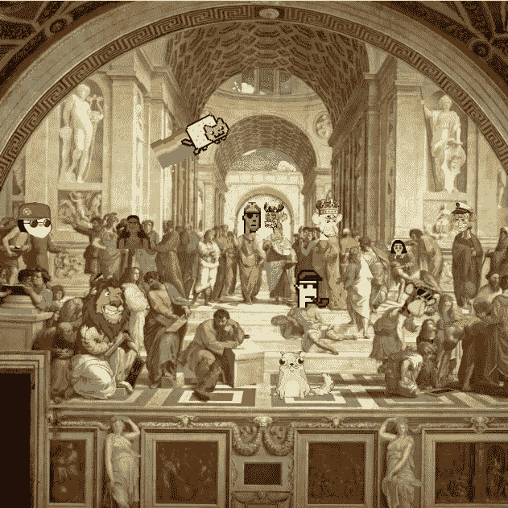
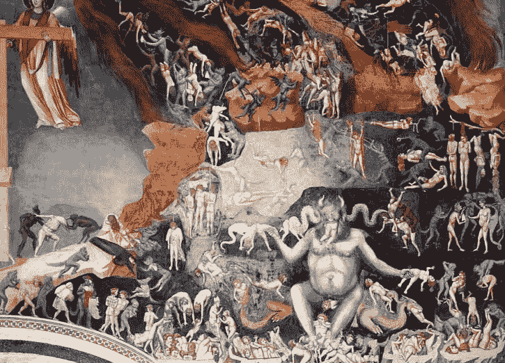
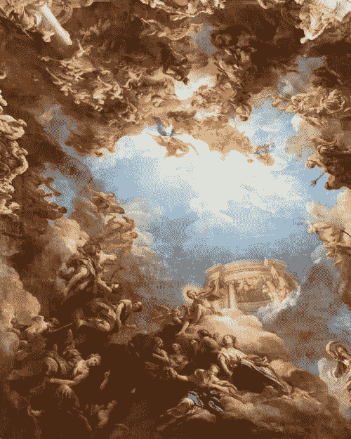

# 数字文艺复兴——NFT 文化的喜与忧

> 原文：<https://medium.com/coinmonks/the-digital-renaissance-the-joys-and-woes-of-nft-culture-66c55866c50f?source=collection_archive---------5----------------------->

“每个艺术家最初都是业余的”——拉尔夫·瓦尔多·爱默生

对于艺术家来说，这是一个前所未有的好时机，区块链的采用对艺术家在传统上经济节俭的职业道路上赚钱的能力来说是一个革命性的进步。除了极少数极其成功的人之外，从历史上看，艺术家是一个极难赚钱的职业。

记得小时候在都柏林圣史蒂芬格林购物中心顶楼的美术馆里逛。我停下来，凝视着一个女人的肖像，上面有一个 2000 美元的价格标签。我转向我的父亲，说“哇，成为一名艺术家一定很棒”，他愉快地回答说“他们中的大多数人都饿死了”。这是一个相当不和谐的反应，但他很少需要超过几句话来说明一个观点。艺术上的钱很难赚。

## **游戏规则改变者**

不可替代符号(NFT)的发明似乎彻底改变了这一切，普通艺术家的经济前景看起来确实非常光明。NFT 是所有权的数字印记，它重振了艺术收藏的进程，智能合同的使用意味着艺术家现在可以从他们的艺术的所有后续转售中获得版税，从现在起直到时间的尽头。如果你不知道什么是智能合约，我建议你去查一下，但简单来说，它是在特定条件下执行的可编程货币。在这种情况下，条件是当 NFT 被购买或出售时，销售额的一定百分比(通常为 2-5%)作为版税被支付给创作者。

文艺复兴发生在 14 至 17 世纪的欧洲。这一时期因中世纪之后发生的艺术、文化和经济复兴而闻名。毫无疑问，今天我们看到的是第二次复兴。NFT 是一种不折不扣的文化现象，这种加密革命导致大量资金流入艺术界。散户和机构投资者都在向毫无疑问风险很高的资产砸钱。对于艺术家和创作者来说，这是一个激动人心的时代，但每一件好事都伴随着麻烦。

## **大混乱**

密码行业被描述为“不受监管的疯狂”和“金融的狂野西部”。作为一个初入太空的新手，你的旅程充满了危险。你不仅要承受压力，在某些情况下，当你看到你的善变资产的波动无情地暴涨暴跌时，你还会感到极度恐惧，而且你还必须应对无数排队抢你钱的恶意行为者。无论是欺诈项目、山寨网站还是击键恶意软件，很少有人能毫发无损地进入这个领域。这并不是说 noobs 是唯一被骗的人。其中一些骗局看起来非常真实，即使是最老练和精通技术的加密爱好者也会不时被刺痛。

不要误解我的意思，我喜欢加密，我对区块链充满热情，我相信这项技术能够真正对世界产生积极的影响，但是这个空间是危险的。它也很贵，汽油费现在高得惊人，如果你想与以太坊区块链互动，你必须支付。对于艺术家和投资者来说，这些因素的组合无疑是大规模采用的障碍，它表明了一个事实，即该行业本身还有很大的改进空间。

## **乌托邦**

不过，这也不全是坏事，NFT 社区已经发展成了一个特别的地方。一个志趣相投的人可以投资、交流和分享他们的艺术的地方。许多主题都专注于心理健康、相互支持，在个体社区中有一种真正的关爱和同志情谊，这是非常深刻的。我自己也遇到过艺术家，并与他们合作，这在以前似乎是不可能的。NFTs 的大部分价值不是基于艺术作品本身，而是基于社区。拥有一个 NFT 就意味着拥有了一个社区的成员资格，这个社区共同努力提升和增值资产的价值，从而为其成员创造财富。

从采用的角度来看，这场革命的步伐还在继续加快。今年年初，领先的 NFT 市场 OpenSea 的日交易量为 7 万美元。到 8 月底，这一数字已经达到每天 2.5 亿美元，这是一个惊人的 350，000%的增长率。围绕这个领域的兴奋让人想起了互联网和互联网泡沫的早期，当时投资者不加选择地向任何移动的互联网企业投入资金，我们都知道结果如何。

如果你投资 NFTs 和 Crypto 赚了钱，那对你有好处。然而，暂停一会儿，客观地看待形势，可能是一个好主意。这些项目中有很多可能在一年后就不复存在了。在任何情况下，重要的是不要太沉迷于密码狂热，并保持一定程度的谨慎。

你对加密文化有什么看法，好处大于坏处吗？

> 加入 Coinmonks [电报频道](https://t.me/coincodecap)和 [Youtube 频道](https://www.youtube.com/c/coinmonks/videos)了解加密交易和投资

## 另外，阅读

 [## 使用 Rarible [2021] | CoinCodeCap 创建并出售您的第一个 NFT

### 编辑描述

blog.coincodecap.com](https://blog.coincodecap.com/create-nft)  [## 如何在 WazirX 上购买印度的 NFT？[2021] | CoinCodeCap

### 编辑描述

blog.coincodecap.com](https://blog.coincodecap.com/wazirx-nft-india)