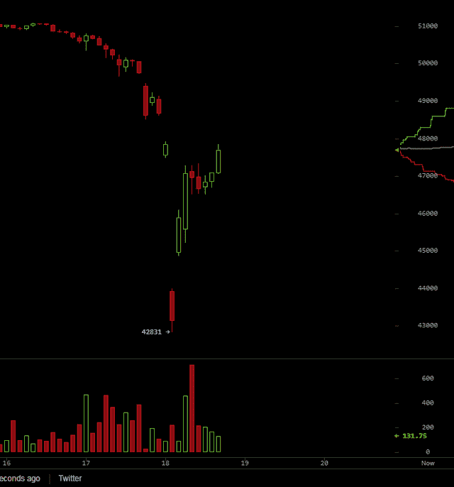

# 下跌将验证牛市的抛物线终点

> 原文：<https://medium.com/coinmonks/the-dip-that-will-verify-the-parabolic-end-of-the-bull-run-c74b6a5fd1e2?source=collection_archive---------9----------------------->

Source: [Unsplash](https://unsplash.com/photos/_LZbDkRaedE)

有些人预计加密货币会出现更大的下跌，但即使是对年度低点的重新测试也不会破坏这种机会。

不要慌！我们完了！

目前，这种巨大的下跌帮助加密交易所通过清算多头获利。

然而，谁在底部买入了呢？我试图登录我的交易所，但它只是永远加载。可能是 Bukele，因为这是他几个小时后在 Twitter 上声称的。

所以，这是一个错过的机会。正是因为这些原因，我有稳定的硬币闲置，但复苏如此之快，BTC 的价格现在只是回到了 8 月 30 日的水平。

虽然有进一步下跌的可能。在这里，我们将得到牛市是否会继续的明确答案。

# 接下来的衰退将是决定性的

> 我在 5 月份有这样的印象，牛市结束了，但在我们最近看到的情况后，BTC 和其他硬币有可能创新高。以太坊证明了我们仍然无法承受 8 月份的热潮。我也不能说我们处于未知领域。它看起来与 2017 年夏天非常相似，**所以在 9 月份，我将等待某种 fud** 可能发生的崩溃。如果我们是正确的，那么我们将谈论荒谬的价格和市值。

我昨天写了这篇评论，是关于我在 Leo 上读到的一篇特别的文章。金融，由 [@empoderat](https://leofinance.io/@empoderat) 。([链接到文章](https://leofinance.io/@empoderat/power-down-started-thinking-out-loud-plans-for-the-bear-market))

通常，当 10-20%的下跌发生时，复苏不会立即出现。这次也不会有什么不同。

图表太荒谬了，毫无意义。

如果我们能从这种图表中看出什么的话，那就是有人试图卖出很多，但交易所里的订单只是骗人的——订单躺在那里，制造有人有兴趣购买的印象。

这个垃圾场可能有某种意义。但目前来看，变化不大。

我们已经观察到，当 BTC 失去太多统治力时，通常会出现这种情况。一个新的“替代硬币”季节(不太喜欢这个表达)即将来临，许多人都在建仓。

BTC 经常以 20%的降幅打破这种“替代硬币季节”的形成。

BTC 的主导地位有可能下降到 40%以下，这是令人担忧的。我不能肯定这就是原因，但这种模式已经出现不止一次了。坦率地说，我现在没有时间来证明这一点，因为仅仅是为了验证本文中的一个段落，就需要花费许多小时的研究。我会试着找到更多交易者观察到的图表来证明这个模式。

# 为最好的情况做准备

我预计会出现下跌，并在昨天的评论中讨论了这一点。但是，和往常一样，比特币又让所有人大吃一惊，看到它因为萨尔瓦多而倾倒，有点出乎意料。或许这种激进的抛售包含了某种信息，但这只是怀疑。

我看到的是，这不是主要的打击，但第二次可能会随之而来，这将是密码市场的决策时间。可能在 30k 左右，如果这是应该发生的，那么我们将看到 2017 年秋季的重演。

我坚信，在这个夏天我们所看到的一切之后，BTC 和所有的 crypto 将在接下来的三个月里开始抛物线式的上升。

我们无法确定地知道未来，但我们可以说，有些条件可以带来惊人的结果。既然历史经常重演，那我们不应该冒一次险，抓住机遇吗？

我并不总是乐观，但我们已经看到了一个伟大的运行，但没有很多人期待的那么好。

我确信这种调整还没有结束，但我非常相信，在未来的三个月里，我们将有一些令人兴奋的时刻，BTC 和大多数 cryptos 都将出现爆炸性增长。

# 记得订阅和喜欢！

**在以下网络上书写:**

*●*[***read cash***](https://read.cash/@Pantera)*●*[***noise cash***](https://noise.cash/u/Pantera99)*●*[***Medium***](/@panterabch)*●*[***Hive***](https://hive.blog/@pantera1)*●*[***Steemit【t】*** *●*](https://steemit.com/@pantera1)[***Twitter***](https://twitter.com/Panterabch)*●*[***LinkedIn***](https://www.linkedin.com/in/panterabch/)**●*[***Reddit***](https://www.reddit.com/user/PanteraBCH)*

****原载于 2021 年 9 月 7 日*[*https://Leo finance . io*](https://leofinance.io/@pantera1/the-dip-that-will-verify-the-parabolic-end-of-the-bull-run)*。****

> ***加入 [Coinmonks 电报频道](https://t.me/coincodecap)，了解加密交易和投资***

## ***另外，阅读***

*   ***[什么是融资融券交易](https://blog.coincodecap.com/margin-trading) | [成本平均法](https://blog.coincodecap.com/dca)***
*   ***[BigONE 交易所点评](/coinmonks/bigone-exchange-review-64705d85a1d4) | [电网交易 Bot](https://blog.coincodecap.com/grid-trading)***
*   ***最佳[密码交易机器人](https://blog.coincodecap.com/best-crypto-trading-bots) | [购买索拉纳](https://blog.coincodecap.com/buy-solana)***
*   ***[Coldcard 评论](https://blog.coincodecap.com/coldcard-review) | [BOXtradEX 评论](https://blog.coincodecap.com/boxtradex-review)|[uni swap 指南](https://blog.coincodecap.com/uniswap)***
*   ***[阿联酋 5 大最佳加密交易所](https://blog.coincodecap.com/best-crypto-exchanges-in-uae) | [SimpleSwap 评论](https://blog.coincodecap.com/simpleswap-review)***
*   ***购买 Dogecoin 的 7 种最佳方式***
*   ***[最佳期货交易信号](https://blog.coincodecap.com/futures-trading-signals) | [流动性交易所评论](https://blog.coincodecap.com/liquid-exchange-review)***
*   ***[3 商业评论](/coinmonks/3commas-review-an-excellent-crypto-trading-bot-2020-1313a58bec92) | [Pionex 评论](/coinmonks/pionex-review-exchange-with-crypto-trading-bot-1e459d0191ea) | [Coinrule 评论](/coinmonks/coinrule-review-2021-a-beginner-friendly-crypto-trading-bot-daf0504848ba)***
*   ***[莱杰 vs n rave](/coinmonks/ledger-vs-ngrave-zero-7e40f0c1d694)|[莱杰 nano s vs x](/coinmonks/ledger-nano-s-vs-x-battery-hardware-price-storage-59a6663fe3b0) | [币安评论](/coinmonks/binance-review-ee10d3bf3b6e)***
*   ***[Bybit Exchange 审查](/coinmonks/bybit-exchange-review-dbd570019b71) | [Bityard 审查](https://blog.coincodecap.com/bityard-reivew) | [CoinSpot 审查](https://blog.coincodecap.com/coinspot-review)***
*   ***[3 commas vs Cryptohopper](/coinmonks/3commas-vs-pionex-vs-cryptohopper-best-crypto-bot-6a98d2baa203)|[赚取加密利息](/coinmonks/earn-crypto-interest-b10b810fdda3)***
*   ***最好的比特币[硬件钱包](https://blog.coincodecap.com/best-hardware-wallet-bitcoin) | [BitBox02 回顾](/coinmonks/bitbox02-review-your-swiss-bitcoin-hardware-wallet-c36c88fff29)***
*   ***[block fi vs Celsius](/coinmonks/blockfi-vs-celsius-vs-hodlnaut-8a1cc8c26630)|[Hodlnaut 审核](/coinmonks/hodlnaut-review-best-way-to-hodl-is-to-earn-interest-on-your-bitcoin-6658a8c19edf) | [KuCoin 审核](https://blog.coincodecap.com/kucoin-review)***
*   ***[Bitsgap 审查](/coinmonks/bitsgap-review-a-crypto-trading-bot-that-makes-easy-money-a5d88a336df2) | [Quadency 审查](/coinmonks/quadency-review-a-crypto-trading-automation-platform-3068eaa374e1) | [Bitbns 审查](/coinmonks/bitbns-review-38256a07e161)***
*   ***[加密复制交易平台](/coinmonks/top-10-crypto-copy-trading-platforms-for-beginners-d0c37c7d698c) | [Coinmama 评论](/coinmonks/coinmama-review-ace5641bde6e)***
*   ***[印度的加密交易所](/coinmonks/bitcoin-exchange-in-india-7f1fe79715c9) | [比特币储蓄账户](/coinmonks/bitcoin-savings-account-e65b13f92451)***
*   ***[OKEx vs KuCoin](https://blog.coincodecap.com/okex-kucoin) | [摄氏替代品](https://blog.coincodecap.com/celsius-alternatives) | [如何购买 VeChain](https://blog.coincodecap.com/buy-vechain)***
*   ***[币安期货交易](https://blog.coincodecap.com/binance-futures-trading)|[3 commas vs Mudrex vs eToro](https://blog.coincodecap.com/mudrex-3commas-etoro)***
*   ***[如何购买 Monero](https://blog.coincodecap.com/buy-monero) | [IDEX 评论](https://blog.coincodecap.com/idex-review) | [BitKan 交易机器人](https://blog.coincodecap.com/bitkan-trading-bot)***
*   ***[CoinDCX 评论](/coinmonks/coindcx-review-8444db3621a2) | [加密保证金交易交易所](https://blog.coincodecap.com/crypto-margin-trading-exchanges)***
*   ***[Bookmap 点评](https://blog.coincodecap.com/bookmap-review-2021-best-trading-software) | [美国 5 大最佳加密交易所](https://blog.coincodecap.com/crypto-exchange-usa)***
*   ***[如何在 FTX 交易所交易期货](https://blog.coincodecap.com/ftx-futures-trading) | [OKEx vs 币安](https://blog.coincodecap.com/okex-vs-binance)***
*   ***[CoinLoan 审查](https://blog.coincodecap.com/coinloan-review) | [YouHodler 审查](/coinmonks/youhodler-4-easy-ways-to-make-money-98969b9689f2) | [BlockFi 审查](https://blog.coincodecap.com/blockfi-review)***