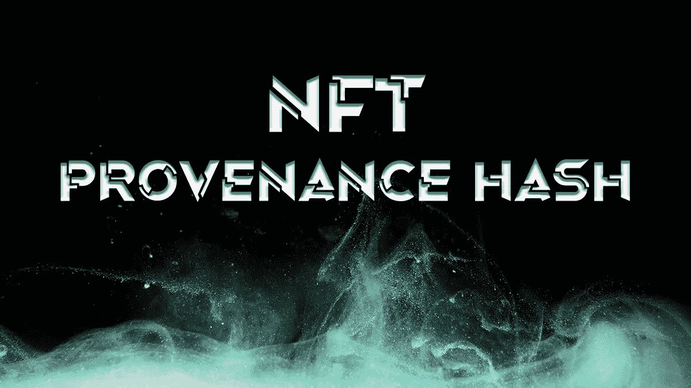
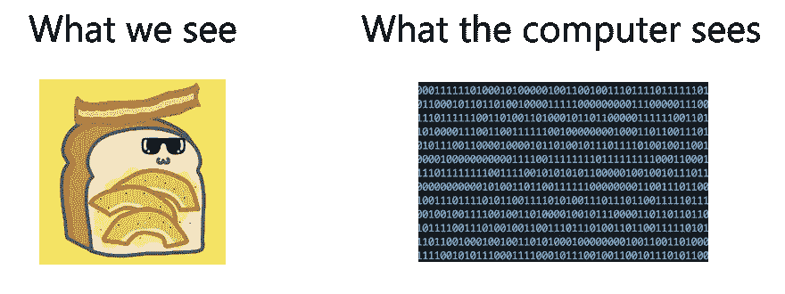
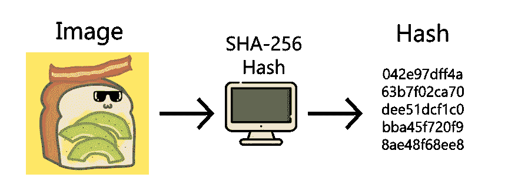
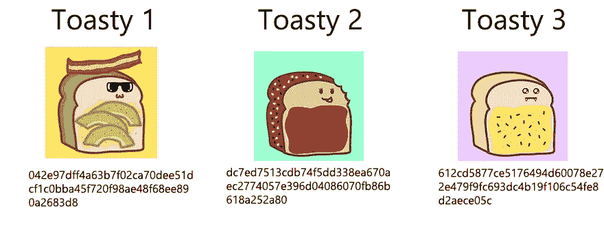
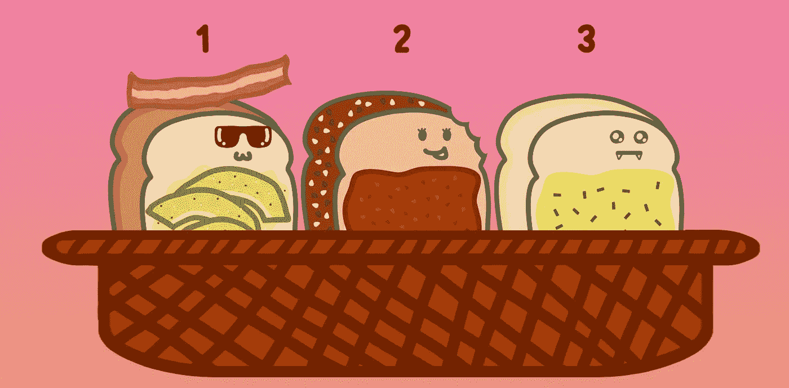
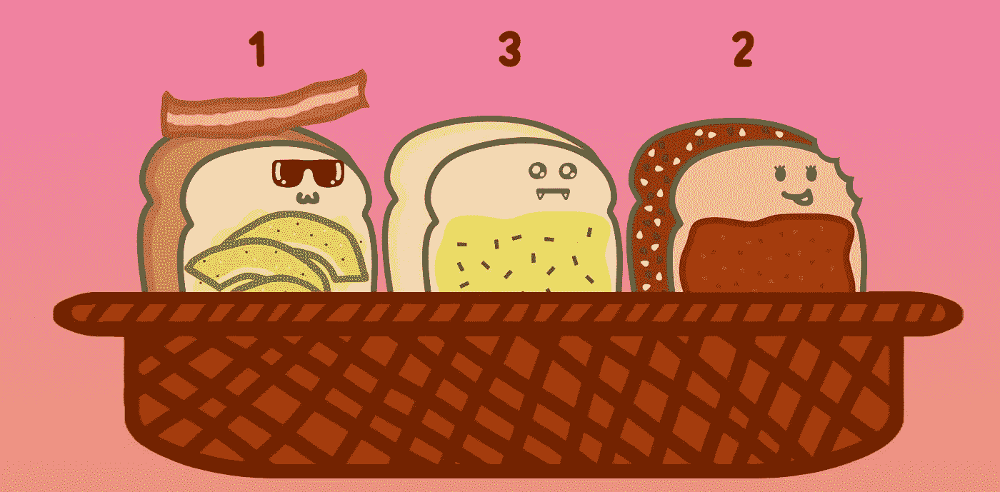

# NFT 出处散列解决方案的优雅

> 原文：<https://medium.com/coinmonks/the-elegance-of-the-nft-provenance-hash-solution-823b39f99473?source=collection_archive---------0----------------------->



Photo by [Denis Stefanides](https://unsplash.com/@stefanides?utm_source=unsplash&utm_medium=referral&utm_content=creditCopyText) on [Unsplash](https://unsplash.com/@stefanides?utm_source=unsplash&utm_medium=referral&utm_content=creditCopyText)

## 它是如何工作的以及为什么重要。

对于那些想知道 NFT 出处散列是什么以及它是如何工作的人，这篇文章是为你准备的。

# 介绍

NFT 空间在过去几个月里有了相当大的增长，成功的 NFT 系列达到了历史新高。这导致了即将到来的项目数量的爆炸性增长。对于有抱负和长期的 NFT 爱好者来说，越来越需要能够辨别好的项目和坏的项目。

对于一个典型的 NFT 下降，收集内的 NFT 具有不同的特点和稀有性，有些是非常罕见的，甚至是传奇。因此，稀有程度较高的非功能性测试比更常见的版本更有价值。因此，公平分配和透明度在 NFT 发行期间极其重要，因为这直接影响到 NFT 系列发行后的信心和价值。NFT 出处散列，做得正确，确保了在铸币期间和铸币后项目的 NFT 分布的公平性。


A BAYC NFT. The Gold Standard in NFT Provenance Hash

就个人而言，我确实相信 **Bored Ape 游艇俱乐部**对 NFT 出处散列解决方案的实现是黄金标准。[点击这里在他们的网站上看！](https://boredapeyachtclub.com/#/provenance)

> 交易新手？尝试[加密交易机器人](/coinmonks/crypto-trading-bot-c2ffce8acb2a)或[复制交易](/coinmonks/top-10-crypto-copy-trading-platforms-for-beginners-d0c37c7d698c)

# **什么是 NFT 产地哈希？**

## 问题是

为了理解 NFT 起源散列，我们必须首先理解它被开发来解决的问题。铸造 NFT 收藏时，将 NFT 标记分配给 NFT 艺术品和元数据的顺序非常重要。如果转让顺序(令牌 1 到图像 1…令牌 n 到图像 n)在造币厂之前被隐藏，NFT 买家无法保证项目不会在造币厂之后为自己的利益操纵转让。然而，如果 NFT 令牌 URI 设置为最终的元数据和图像列表，精明的 NFT 买家将能够看到整个集合的元数据和图像，甚至在造币厂完成之前。这使得他们可以在一系列数字周围瞄准薄荷，试图获得收集的最稀有的 NFT。

这对开发者提出了一个矛盾的问题。我们如何在发布期间保护 NFT 元数据，并证明令牌分配是真正公平的？

## 解决方案

1.  NFT 项目**在最终的 NFT 铸造完成之前不应该发布最终的令牌 URI** ，以防止精明的狙击手获得集合中最好的。
2.  开发人员需要一种方法来证明令牌图像和元数据的顺序是预先设置的，并且没有被操纵。
3.  开发者需要在造币后生成一个公平的随机数，从这个数开始 NFT 的发行。

这就是出处散列的由来。

## 说明

## 散列图像

那么什么是哈希呢？哈希只是数据到字符串的单向转换，这是非常难以逆转的[(在这里阅读强力破解一个 256 哈希需要多少时间)](https://www.quora.com/How-long-would-it-take-to-crack-SHA-256)。把它想象成给一段数据一个**特有的指纹！**

你可以用指纹来匹配一个给你指纹的人，但是你不能简单地从他的指纹推断出这个人的长相。同样，我们可以:

1.  从无法反向工程的映像生成哈希。
2.  如果我们有原始图像，证明哈希属于原始图像。

## 图像到哈希演示

首先，我们将图像作为字符串读取。我将使用我即将推出的 NFT 作品集《美味烤面包》中的艺术作为例子。



接下来，我们使用阿沙-256 哈希算法，使用图像的字节数据来生成图像的哈希。



SHA-256 algorithm to generate Image Hash

**瞧！我们有了第一个图像指纹！**

**但这还不是全部！**

## 散列散列散列

我们可以更进一步，创建散列的散列，以证明图像的顺序是在创建散列时预先确定的。我们可以通过按顺序组合图像的散列来实现这一点，并散列这个新字符串！该顺序是不可变的，因为改变散列组合的顺序将导致不同的散列。我们称这个最终散列为起源散列。

## **哈希到哈希的演示**

对于图像 1 到 N，我们可以生成它们所有单独的散列:



Toastys and their respective hashes

接下来，我们按照正确的顺序组合每个图像的哈希字符串。



A basket of Tasty Toastys in a sequence

**组合哈希字符串:**

```
042e97dff4a63b7f02ca70dee51dcf1c0bba45f720f98ae48f68ee890a2683d8dc7ed7513cdb74f5dd338ea670aec2774057e396d04086070fb86b618a252a80612cd5877ce5176494d60078e272e479f9fc693dc4b19f106c54fe8d2aece05
```

然后我们散列这个新字符串来创建我们的出处散列！

**篮子 1 来源散列:**

```
f056aca1a9bd62f1e5a37fa7edfbc79527f4ff0efe7ba08fccb6ebf297cbfa46
```

如果我们改变 NFT 图像的排序，我们会得到一个完全不同的出处散列。



Basket 2 example

**组合哈希字符串:**

```
042e97dff4a63b7f02ca70dee51dcf1c0bba45f720f98ae48f68ee890a2683d8612cd5877ce5176494d60078e272e479f9fc693dc4b19f106c54fe8d2aece05cdc7ed7513cdb74f5dd338ea670aec2774057e396d04086070fb86b618a252a80
```

**篮子 2 出处散列:**

```
72d176866081ac054f3b94d5d533718c9f48c1901bd6d076ce947598f24d02dd
```

有了出处散列，NFT 项目可以向社区证明 NFT 图像和元数据是预先确定的，而不必在发布前暴露它们的元数据！

## 起跑顺序号码

最后但并非最不重要的一点是，开发人员可以证明用于开始向他们的图像分配令牌的起始数字没有被操纵。我们可以在铸造智能合同中做到这一点。通过获取集合中最后铸造的 NFT 的块号，并将其除以 NFT 的总供应量，然后取余数，我们可以生成一个不能被开发者操纵的数字。购买者也没有操纵这个数字的动机，因为他们不知道 NFT 图像和元数据的起始序列。

## 一个警告

需要注意的一点是，出处散列应该在 mint 发布之前发布，这样很明显，图像和元数据的顺序是在令牌 id 分发给购买者之前确定的。如果出处散列在造币后被公开，这意味着订单可能是在造币后确定的。

## 概括起来

NFT 出处散列解决方案能够解决成功的 NFT 投放的矛盾需求；确保发布期间的图像和元数据隐私，并确保发布后的透明度和分发的公平性。

一个**简单而优雅的解决方案**的确如此。

# 为什么这很重要

1.  对于 NFT 的买家来说，重要的是要看看即将到来的项目是否会实施这一点。实现出处散列解决方案是对公平和透明的公开承诺。
2.  对于 NFT 的项目，做一个出处散列将增加买家的信心，并消除任何潜在的怀疑，即 NFT 的分配是操纵或不公平的。

我希望这篇文章能帮助您更好地理解 NFT 出处散列，并在 NFT 社区中建立意识和透明度。

如果你喜欢这篇文章，并想了解更多关于我即将推出的 NFT 下降， [**美味吐司**](http://tastytoastys.io) ，你可以在我们的 [**不和谐论坛**](https://discord.com/invite/tastytoastys) 中联系我，或者在 [**Twitter**](https://twitter.com/tastytoastys) 上关注这个项目。

另外，记得在媒体上关注我，因为我将在接下来的几周内写更多关于 NFT 空间的内容！

> 加入 Coinmonks [电报频道](https://t.me/coincodecap)和 [Youtube 频道](https://www.youtube.com/c/coinmonks/videos)获取每日[加密新闻](http://coincodecap.com/)

## 另外，阅读

*   [复制交易](/coinmonks/top-10-crypto-copy-trading-platforms-for-beginners-d0c37c7d698c) | [加密税务软件](/coinmonks/crypto-tax-software-ed4b4810e338)
*   [网格交易](https://coincodecap.com/grid-trading) | [加密硬件钱包](/coinmonks/the-best-cryptocurrency-hardware-wallets-of-2020-e28b1c124069)
*   [10 本关于加密的最佳书籍](https://coincodecap.com/best-crypto-books) | [英国 5 个最佳加密机器人](https://coincodecap.com/uk-trading-bots)
*   [ko only Review](https://coincodecap.com/koinly-review)|[Binaryx Review](https://coincodecap.com/binaryx-review)|[Hodlnaut vs CakeDefi](https://coincodecap.com/hodlnaut-vs-cakedefi-vs-celsius)
*   [MoonXBT vs Bybit vs 币安](https://coincodecap.com/bybit-binance-moonxbt) | [硬件钱包](/coinmonks/hardware-wallets-dfa1211730c6)
*   [火币交易 Bot](https://coincodecap.com/huobi-trading-bot) | [如何购买 ADA](https://coincodecap.com/buy-ada-cardano) | [Geco？一次审查](https://coincodecap.com/geco-one-review)
*   [币安 vs 比特邮票](https://coincodecap.com/binance-vs-bitstamp) | [比特熊猫 vs 比特币基地 vs Coinsbit](https://coincodecap.com/bitpanda-coinbase-coinsbit)
*   [密码电报信号](http://Top 4 Telegram Channels for Crypto Traders) | [密码交易机器人](/coinmonks/crypto-trading-bot-c2ffce8acb2a)
*   [最佳加密交易所](/coinmonks/crypto-exchange-dd2f9d6f3769) | [印度最佳加密交易所](/coinmonks/bitcoin-exchange-in-india-7f1fe79715c9)
*   [开发人员的最佳加密 API](/coinmonks/best-crypto-apis-for-developers-5efe3a597a9f)
*   最佳[密码借贷平台](/coinmonks/top-5-crypto-lending-platforms-in-2020-that-you-need-to-know-a1b675cec3fa)
*   [杠杆代币](/coinmonks/leveraged-token-3f5257808b22)终极指南