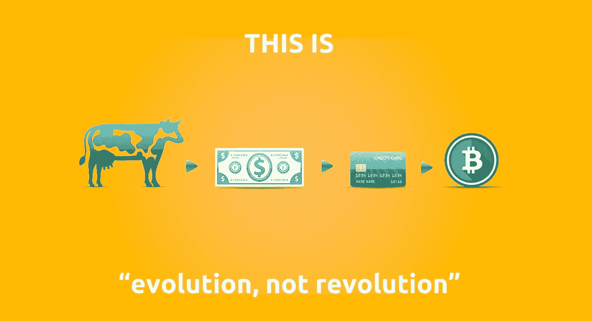
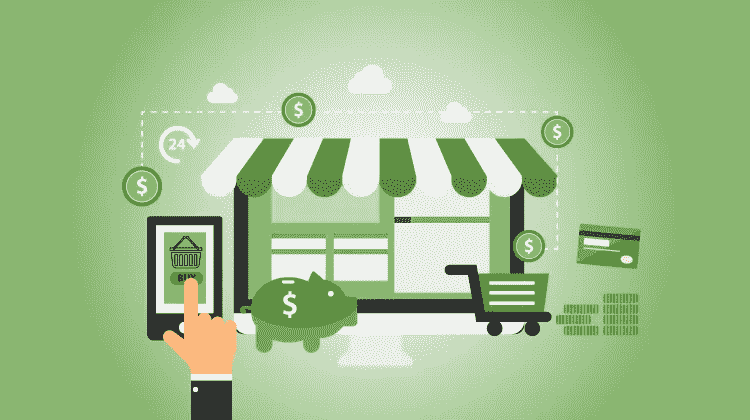
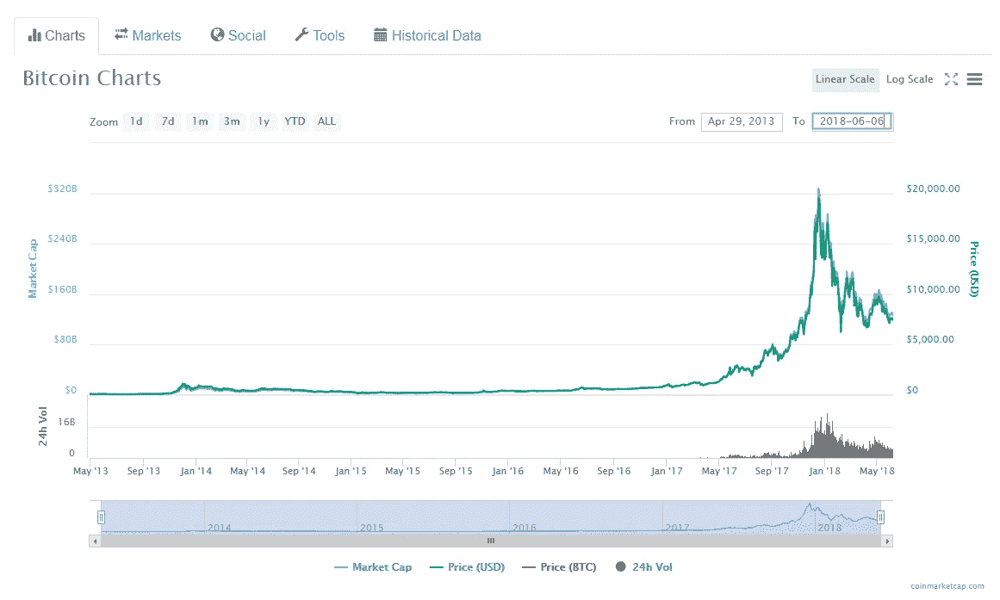
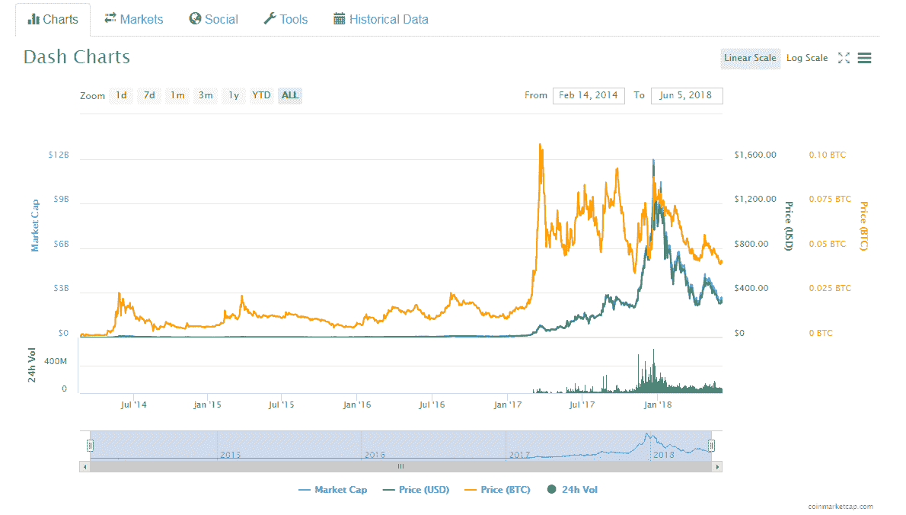
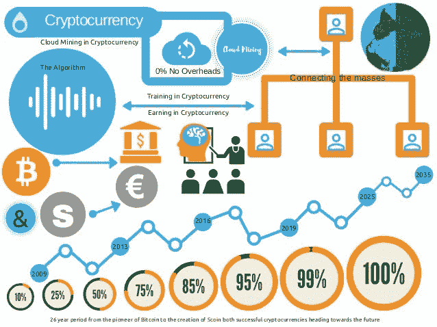

# 加密货币支付的出现和采用你应该知道！

> 原文：<https://medium.com/coinmonks/the-emergence-and-adoption-of-cryptocurrency-payment-you-should-know-6124c44693d9?source=collection_archive---------3----------------------->

Evolution of cryptocurrency payment

2009 年，当第一种去中心化的货币比特币诞生时，加密货币首次出现。从那时起，它的价值正在飙升

加密货币背后的主要目标是设计一种安全和匿名的货币转移方式，从那时起，它就被称为“数字黄金”。为了培养匿名性，中本聪(匿名开发者)开发了一个系统；后来被称为区块链——比特币交易的数字账本。

自从比特币出现以来，已经有几种密码进入市场。由于价格便宜，它们被认为是比特币的替代品，被恰当地命名为替代币。一些受欢迎的替代品是以太币(交易价格为 229.24)、莱特币(交易价格为 47.75)和 Dogecoin(随机货币，最近有 1 亿枚开采的硬币)。

## **让我们深入一点！**

虽然 2017 年经历了加密货币价值的大幅飙升，但其价值却大幅下降。拥有大量比特币的人都是为了投资，而不是把它们作为一种新的购物方式。

> 如今，[几乎所有的东西都可以用加密货币](https://steemit.com/bitcoin/@steemitguide/2017-top-list-of-big-companies-that-accept-bitcoin-and-cryptocurrencies)，2013 年 12 月[一辆特斯拉 Model S 售价 91.4 比特币](http://money.cnn.com/2013/12/06/autos/tesla-bitcoin/index.html)，星巴克接受食物和饮料的加密货币[，Ultimez 也允许顾客在他们的网络服务中使用数字货币](https://ultimez.com/crypto-web-service/)。

允许客户使用加密货币购物有几个好处。让我们讨论一下商家应该考虑将 cryptos 集成到他们的支付方式组合中的一些主要原因:

*   为现有客户提供新的支付方式
*   接触喜欢使用密码购买商品/服务的新客户
*   允许客户使用简单的支付方式(没有任何信用卡账单的尴尬)
*   降低不同支付方式(信用卡等)带来的成本。
*   付款将无限期保留在区块链分类账中，并且是安全的
*   帮助支持加密货币革命

**加密需要什么？**

Volatility — the key problem for the adoption of cryptocurrency for payments. Stable coins might solve this problem in a coming future!

加密货币作为替代投资的流行带来了强大的网络，拥有大量交易者，他们有数字硬币可供零售商使用，以启动暴跌。加密货币已经获得了一些动力，但是大多数人还没有准备好冒价值每天两位数波动的风险。

我们来分析一下目前关于比特币和 Dash 市值的一些报道:

Bitcoin market cap value

Dash market cap value

在分析比特币和 Dash 时，可以看到在交易量和规模方面有很大的波动。

分散化…即时支付…很少甚至可以忽略的欺诈…如果你了解加密货币，你可能会意识到数字货币的好处不仅限于这三种，还有很多。

有各种因素影响加密货币的大规模采用，从而导致这种波动，让我们从几个方面来看:

这些问题是密码无法取代传统货币或信用卡的部分原因。

让我们考虑一下影响加密货币大规模采用的因素:

medium

**1。意识/教育**

通过教育提高对加密货币的认识肯定会促进采用，并减少人们使用它但甚至不知道“它如何工作”或“它是什么”的情况[基思说](http://www.keithmcevoy.com/category/goals/)。

**2。稳定性**

专家认为不确定的需求和固定的总供给仍然是价格变动的主要原因。如何通过加密货币的去中心化特性来抑制这种情况还有待观察。

**3。全球事件**

2017 年 11 月-越南[国家银行](https://www.sbv.gov.vn/webcenter/portal/vi/menu/trangchu/ttsk/ttsk_chitiet?leftWidth=20%25&showFooter=false&showHeader=false&dDocName=SBV307772&rightWidth=0%25&centerWidth=80%25&_afrLoop=270701443080000#%40%3F_afrLoop%3D270701443080000%26centerWidth%3D80%2525%26dDocName%3DSBV307772%26leftWidth%3D20%2525%26rightWidth%3D0%2525%26showFooter%3Dfalse%26showHeader%3Dfalse%26_adf.ctrl-state%3D10vjcqtf8s_9)禁止使用数字货币支付产品和服务。2017 年 9 月-对于中国，[华尔街日报](https://www.wsj.com/articles/china-widens-bitcoin-crackdown-beyond-commercial-trading-1505733976?mod=e2tw)报道称，他们正在关闭比特币交易所。

然而，中国仍是最大的比特币矿工群体的家园。

在得出结论之前，outcome 需要一些研究，你会意识到德国、荷兰、瑞典和俄罗斯等国家[欢迎采用加密货币活动](https://news.bitcoin.com/germanys-tourism-board-accepts-bitcoin-payments/)，甚至其中一些国家正在尝试建立自己的国家加密货币。

因此，加密货币并非一片灰暗。

**主要问题-网络安全**

对于投资加密货币的人来说，安全水平仍然是最大的吸引力之一。通过区块链，虚拟货币建立了一个保护用户身份的分散经济。

如果用户保持匿名，黑客就无法根据他们进行的交易来锁定他们。相反，如果黑客希望破坏或损坏区块链，那么他们将不得不影响个人用户系统上的数据储存，这几乎是不可能的。

去中心化加密货币的挫折之一

> 马克·弗劳恩菲尔德(Mark Frauenfelder)写道 *:“他的 pin 丢失后，他损失了价值近 3 万美元的比特币”。*

这说明，无论以何种方式使用加密货币，都应该保持警惕！

下一步是什么？

> 向前看很难把点点滴滴联系起来；你只能回头看才能把它们联系起来。所以你需要相信这些点会以某种方式连接起来…
> 
> 史蒂夫·乔布斯

加密货币是一个难以监管的空间，它依赖于用户对价值的集体共识。无论未来是比特币，现有加密货币中的一些，还是即将出现的一种，现实是加密市场的动荡方式正在迅速转变为全球范围内的创新。

**加密货币拥有进入主流的潜力吗？**

加密货币是一种数字资产，通过消除中介来保护交易，因此被称为互联网的*货币，目前用作支付流程。很明显他们已经是主流了。例如，比特币、Dash、ARK、NEO 都是目前被用作数字支付的加密货币。*

Incrypts

**2018 年部分加密货币支付网关:**

**1) TapJets**

最大的私人飞机即时预订平台已经开始接受客户的以太坊。

官方网站访问[此处](https://www.tapjets.com/)

在推特[上关注他们](https://twitter.com/tapjets?lang=en)

购物化

你可以通过 Etsy 和易贝等其他平台建立一个个人网店。2013 年初，Shopify 脱颖而出，成为接受比特币的公司之一。

官方网站访问[此处](https://www.shopify.com/)

在推特上关注他们

**3)盘**

Dish Network 是一家互联网服务和卫星电视提供商，于 2014 年 8 月首次支付比特币。

官方网站访问[此处](https://www.dish.com/)

在[推特](https://twitter.com/dish)上关注他们

**4) Ultimez**

一家总部位于阿联酋、在印度设有分支机构的公司最近为其网络服务集成了加密货币支付。

官方网站访问[此处](https://ultimez.com/)

在推特[上关注他们](https://twitter.com/Ultimez)

> ***这可能会变得更大更好；看来我们只是触及了冰山的一角！***

虽然我们可能不相信加密货币被广泛使用，但我们只是在日常生活中没有注意到它。从亚马逊到星巴克的购物，数字硬币就像非接触式卡或 Apple Pay 一样被使用；它有能力很快成为即将到来的主要支付方式。

**非常正确！**

比特币已经向世界展示了加密技术的价值，随着这个领域开始将加密技术作为一种可行的支付方式，那些拥有开发、设计或网络安全技能的人肯定会有越来越高的需求。

SlideShare

**未来是什么样子？**

数字货币的理念是跨越和打破所有的边界和壁垒，至少在金融和贸易方面是如此。在区块链发展的早期阶段，有近一千枚硬币在竞争。

未来可能会出现一个单一的领导者，而其他人则被淘汰，或者出现 3-4 个领先的硬币，它们将在全球范围内保持整个支付、交易贷款和银行基础设施。

在未来几年内，加密货币也会变得足够出名，成为区块链应用程序的主流。它将成为一个新世界，带着新的光芒，在一个新的时代出现。

***来，和我一起读，一起连接！***

如果这篇文章抓住了你的心，如果你对加密货币和投资相关的话题感兴趣，请在[Medium](/me/stories/public)&[Twitter](https://twitter.com/Monica_P20)上关注我

> 请继续关注 Ultimez，了解 SEO 和设计技巧、技术、加密网络服务以及来自加密货币领域的新闻。在 Ultimez 交易愉快。