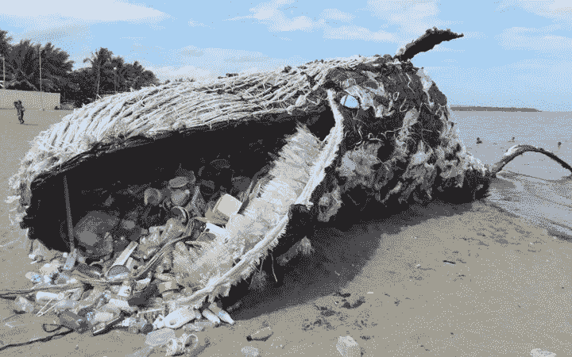
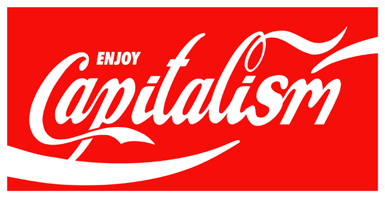
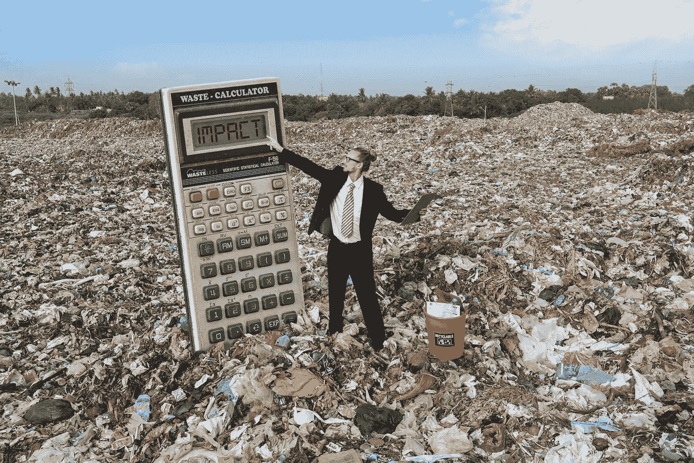

# 能源辩论——为什么我们不去改变当前的系统？

> 原文：<https://medium.com/coinmonks/the-energy-debate-why-we-dont-bother-changing-the-current-system-5a9c60a10a1d?source=collection_archive---------8----------------------->

## 第一部分——资本主义、痴迷和浪费的故事

# 一个行业要消耗多少能源？

现在，世界各地的组织都面临着限制不可再生能源消耗和碳排放到大气中的压力。但是，计算多少消费是太多是一个复杂的问题，它与围绕我们社会优先事项的辩论交织在一起。毕竟，计算哪些商品和服务“值得”花费这些资源，实际上是一个价值观问题。

被科学家和活动家推到全球政治议程首位的*气候问题，正处于全球辩论的前沿，提出了许多关于如何——事实上——实施被认为是必要的变革进程的问题。*

**

*随着*加密货币*，以及 [***比特币*** ，](/the-capital/a-tale-called-bitcoin-58ec764ff119)的日益突出，能源使用已经成为关于**什么**，**谁**，*数字货币*真正与 ***废物概念纠缠在一起的更大范围的对话中的最新*爆发点*。***’*

*然而，引人注目的是，*

## *几乎完全没有激进的批评或改变经济体系的需要*

*遏制气候变化的首要行动之一。*

# *资本主义和浪费*

**

> *人天生自私，这就是社会主义行不通的原因。资本主义更好地反映了人性的根本特征。*

*资本主义的捍卫者可能会说。不过，我们可能都同意，在'*过程中，一个*相对于'*另一个*'处于有利地位意味着其中一方将总是处于不利地位——在以能量消耗为代价的过程中——总是产生与此相关的' ***浪费的*** '产品。*

*在英语中， ***waste*** 这个名词的意思是*垃圾*，凡是不能或不会被使用的，只对垃圾桶有好处的。动词“ ***浪费*** ”有更微妙的变化:一个意思是挥霍，挥霍，或低效和不经济地使用一种资源。但是“ ***夷为平地*** ”就是毁灭，比如一支军队或者蛮族部落夷为平地一座城市。在黑社会俚语中，浪费也可以指杀人:“我掏出枪，把他浪费了。”“*”的主题被资本主义制度很好地阐释了，这三者都做到了。**

**资本主义把人组织成等级制度，阻止绝大多数工人在经营企业中有任何发言权，从而浪费了人。它认为员工只是一个成本因素。 ***这个证明？一旦宣布大规模裁员，公司的股票就会上涨。大多数人很少或根本无法控制自己的职业发展，尤其是在危机时期，他们会发现自己被解雇了，尽管这并不是他们的错。*****

****

**资本主义浪费社会凝聚力。资本主义社会自然会造成巨大的不平等，即使在最富裕的国家，也有数百万人被边缘化或被排斥在外。**

**欧洲联盟正式承认有 9200 万穷人；**

** [## 2019 年，超过 20%的欧盟人口面临贫困或社会排斥的风险

### 2019 年，欧盟(EU)21.1%的人口，相当于 9240 万人，面临贫困风险……

欧盟](https://ec.europa.eu/eurostat/web/products-eurostat-news/-/edn-20201016-2) 

而在美国，一家大公司的首席执行官的工资通常至少是普通员工的 350 倍。前百分之一美国人的财富曾经是总财富的三倍。

 [## 2020 年，顶级首席执行官的收入是普通工人的 351 倍

### 在过去的几十年里，首席执行官和员工之间的薪酬差距呈指数级增长。经济政策研究所…

www.cnbc.com](https://www.cnbc.com/2021/09/15/in-2020-top-ceos-earned-351-times-more-than-the-typical-worker.html) 

世界上超过 80，000 家跨国公司是避税的专家，他们充分利用转移定价和避税天堂来逃避向他们赚取利润的国家的社会和公共服务缴纳他们应得的份额。众所周知，尽管银行家和交易员的赌场资本主义方法给他们的同胞带来了灾难，但他们仍继续获得巨额奖金。

不平等的增加和社会凝聚力的瓦解与酗酒和吸毒成瘾、身体和精神疾病或肥胖等不同现象密切相关；犯罪、杀人、少年犯罪和监狱人口；早孕、婴儿死亡率和预期寿命——对每个人来说，成本都很高，即使是富人。

**资本主义浪费资源**通过众所周知的技术，如“*有计划的淘汰*和故意引入令人满意的小创新和“*酷*”通过大规模广告。在做任何工作之前，有很大比例的能量被浪费掉了，而且在许多国家，大量的食物在到达消费者手中之前，在储存、加工和分配过程中就已经变质了。

资本主义甚至浪费金钱。在*美国*，不到*全部投资的 20%*直接投资于金融产品。这些产品中有许多是*“债务抵押债券”*或其他几乎没有或根本没有社会价值的衍生品。仅货币交易一天就吸收***6 万亿*** 美元。**

**[**资本主义**](https://www.investopedia.com/terms/c/capitalism.asp) ，*出于设计，*是基于两种意义上的浪费:**

1.  **对规模消费经济至关重要的有形浪费，**

***和***

**2.金融和生产性资本积累在著名的*手中所给予的社会浪费。***

## ***对当前经济体系或其缓解措施的回顾有助于解决环境问题吗？***

***当然可以，就消费而言:例如，通过减少许多技术产品的计划淘汰来减少有形废物，可以产生上述废物的当地可持续经济。***

# ***那怎么办呢？***

***首先分析一下要重新分配的是什么——**流动性**、**资源**还是**权利**？***

## ***流动性:***

***例如，通过向发展中国家的每个家庭分配*2000 美元*，将会产生国内需求的激增，而在缺乏本地生产集群的情况下，这些需求将会被跨国公司*即*习惯于掠夺性政策的外部代理所覆盖，从而产生额外的浪费。***

## **资源:**

**许多贫穷国家拥有丰富的自然资源，但在腐败政府和肆无忌惮的公司的共谋下，这些资源仍在被掠夺。阻止这种情况是促进当地可持续增长的关键问题。**

## **权利？**

**对于许多当地的社区/部落/殖民地来说，权利是一个陌生的概念，或者充其量是一个通过自然和有机的发展循环形成的过程，应该在没有任何干预的情况下得到支持。**

**萨里大学可持续发展教授蒂姆·杰克森(Tim Jackson)在他的书《没有增长的繁荣(T22)【T23)】:***明日经济的基础(T28)【T29)】中概述了这种“没有增长的繁荣(T13)******’****”的模式现在正在进入著名的经济界***

***约翰·梅纳德·凯因斯在 1930 年*设想了一个 2030 年*的社会，通过允许每个人每天最多工作 *15* 小时，并将剩余时间用于个人福祉，技术和投资将使财富增加 8 倍，这是一种*的低废物模式。******

***凯恩斯无法想象的是从 20 世纪 70 年代开始的社会屠杀，但他肯定是对的，对金钱的热爱作为一种财产将被真实地展现出来:***

# ******令人厌恶的执念*** 。***

******

> ***第 1 部分结束***

*****了解我们的新平台**👉**[**https://thecapital.io/**](https://thecapital.io/)*****

*****[https://twitter.com/thecapital_io](https://twitter.com/thecapital_io)*****

> *****加入 Coinmonks [电报频道](https://t.me/coincodecap)和 [Youtube 频道](https://www.youtube.com/c/coinmonks/videos)了解加密交易和投资*****

# *****另外，阅读*****

*   *****[币安 vs FTX](https://coincodecap.com/binance-vs-ftx) | [最佳(SOL)索拉纳钱包](https://coincodecap.com/solana-wallets)*****
*   *****[比诺莫评论](https://coincodecap.com/binomo-review) | [斯多葛派 vs 3Commas vs TradeSanta](https://coincodecap.com/stoic-vs-3commas-vs-tradesanta)*****
*   *****[Capital.com 评论](https://coincodecap.com/capital-com-review) | [香港的加密借贷平台](https://coincodecap.com/crypto-lending-hong-kong)*****
*   *****[如何在 Uniswap 上交换加密？](https://coincodecap.com/swap-crypto-on-uniswap) | [A-Ads 审查](https://coincodecap.com/a-ads-review)*****
*   *****[WazirX vs CoinDCX vs bit bns](/coinmonks/wazirx-vs-coindcx-vs-bitbns-149f4f19a2f1)|[block fi vs coin loan vs Nexo](/coinmonks/blockfi-vs-coinloan-vs-nexo-cb624635230d)*******