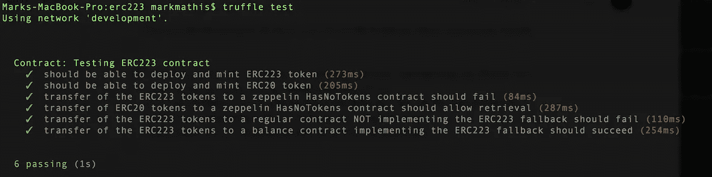

# ERC-223 的演变

> 原文：<https://medium.com/coinmonks/the-erc-223-evolution-eec0ef23e5cc?source=collection_archive---------2----------------------->


**免责声明** : *我很轻松地使用 ERC-223 这个术语。对于 EIP 是否会重见天日，社会上并无共识。* *话虽如此，但仔细思考它试图解决的问题并参与讨论是一种很好的练习。*

*完整的项目源代码可用* — [此处](https://github.com/cipherzzz/erc223)

以太坊也有令牌丢失的灾难，就像大多数区块链项目在加密领域一样。其中一些损失是对智能合约的复杂攻击，一些令牌持有者只是将令牌发送到了错误的地址。如果你错把你的 ERC20 代币送给了某人，而他们心情很好，你可以把它们拿回来。如果你把它们发送到智能合同地址，你就可以和它们说再见了。他们走了。以太坊团队目前正在审核 ERC223 EIP 请求，可在此处找到。

## 本文的目的

本文将尝试使用 ERC-20 令牌的 [OpenZeppelin](https://github.com/OpenZeppelin/openzeppelin-solidity/tree/master/contracts/token/ERC721) 实现并实现建议的 ERC-223 方法，以最简单有用的形式创建一个 ERC-223。我们还将创建测试来说明 ERC-223 规范所依赖的“回退”方法的用法，以便充分说明它在实践中的用法。

## 设置项目

确保您已经安装了 node、npm 和 truffle

```
mkdir erc223 && cd erc223 && truffle init
```

用以下内容替换 *truffle.js* 内容:

安装 [Ganache](http://truffleframework.com/ganache/) 并确保它在 8545 上运行

编译和迁移

```
truffle compile
truffle migrate
```

将文件夹初始化为 npm 项目

```
npm init
```

安装 zeppelin 依赖项

```
npm install zeppelin-solidity
```

## 代币

将以下内容作为 *MyERC223.sol* 添加到/contracts 中

将以下内容添加到/contracts 中作为*ERC 223 receiving contract . sol。*这是我们符合 erc223 的智能合约必须遵循的接口。

The interface an erc223-compliant smart contract must adhere to

将以下内容作为 *MyERC20.sol 添加到/contracts 中。*注意，这是为了我们测试 zeppelin 契约的 ERC20 令牌恢复功能， *HasNoTokens.sol*

将以下迁移添加到/migrations，作为 *2_erc_migration.js*

## 合同

将以下内容添加到/contracts，作为 *BalanceContract.sol*

This contract manually implements the erc223 fallback method

将以下内容添加到/contracts，作为 *SafeContract.sol*

This contract implements the zeppelin HasNoTokens.sol contract that implements the erc223 fallback method

将以下内容添加到/contracts 中，作为 *UnsafeContract.sol*

This contract is unsafe for erc20 but safe for erc223

将以下迁移添加到/migrations as 3*_ contract _ migration . js*

**编译和迁移**

运行编译脚本，并验证它是否编译无误

```
Marks-MacBook-Pro:erc223 markmathis$ truffle compile
```

运行迁移脚本，并验证其部署无误

```
Marks-MacBook-Pro:erc223 markmathis$ truffle migrate
```

## 测试一下

安装测试库

```
npm install chai --save-dev
npm install chai-as-promised --save-dev
npm install babel-preset-es2015 --save-dev
npm install babel-register --save-dev
npm install babel-polyfill --save-dev
```

添加*。babelrc* 到项目根

```
{
  "presets": ["es2015"]
}
```

将 *erc223.spec.js* 添加到/test

从项目根目录运行测试

```
truffle test
```



# **发生了什么…**

上述测试确保以下内容:

*   ERC223 令牌不能转移到未实现*ERC 223 receiving contract . sol*中定义的回退方法的合同地址
*   ERC223 令牌不能被转移到实现*hasnotokens . sol*zeppelin 契约的契约地址
*   在合同实际上支持余额的情况下，ERC223 令牌可以转移到正确实现*ERC 223 receiving contract . sol*中定义的回退方法的合同。
*   发送到实现*hasnotokens . sol*zeppelin 合同的合同的 ERC20 令牌可以由合同的所有者检索。请注意，如果您将您的 ERC20 代币发送到这些合同中的一个，所有者可以请求取回代币到他们的帐户，然后如果您运气好的话，再分发给您。

## 额外资源

[](https://github.com/Dexaran/ERC223-token-standard) [## dex aran/ERC 223-令牌-标准

### ERC 223-令牌-标准- ERC223 令牌标准参考实现。

github.com](https://github.com/Dexaran/ERC223-token-standard) [](/@Nico_Vergauwen/create-your-own-ethereum-token-part-2-erc223-3076f764cf62) [## 创建自己的以太坊令牌(第 2 部分:ERC223)

### 第 1 部分:ERC20 令牌

medium.com](/@Nico_Vergauwen/create-your-own-ethereum-token-part-2-erc223-3076f764cf62) 

*完整的项目源可用* — [此处](https://github.com/cipherzzz/erc223)