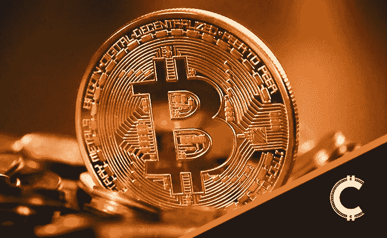

# 以太坊-比特币脱钩论解释了

> 原文：<https://medium.com/coinmonks/the-ethereum-bitcoin-decoupling-debate-explained-d5ea1e4ca6f9?source=collection_archive---------13----------------------->

在这个问题上，我们将采取一种稍微不同的方法，因为当前的技术画面并不那么有趣。具体来说，我们将根据最近的价格走势讨论以太坊/比特币脱钩的情况。

我们来挖一下。

# 什么是比特币主根升级？

与名字所暗示的不同，比特币主根升级不是萝卜，而是一种承诺将交易信息深埋地下的更新。

正如其创始人所写，“*我相信这种结构将通过使固定方智能合同看起来像最简单的可能支付来允许固定方智能合同的最大可能匿名集。*

**查看** [全文点击这里](https://chrisoncrypto.com/blog/f/what-is-the-bitcoin-taproot-update) **！**

# 以太坊能与比特币脱钩吗？

在过去的几个月里，以太坊脱钩或“轻率”的说法已经在加密的 twitter 领域流传开来，投资者急切地以各种方式争论各自的立场。

## 技术指标告诉我们什么？

首先，ETH/USD 的反弹相当引人注目，这篇时事通讯的关注者能够看到从低于 700 美元的价格开始的 550%的波动。最近，ETH/USD 在触及 2000 美元以下价格时，以单根蜡烛线收复了其多周涨势，但最终收于 20 周均线上方[。从技术上来说，这意味着如果我们坚持我们首选的评估牛市的方法，ETH/USD 仍然处于牛市之中。这意味着几乎没有高时间框架顶部阻力，这表明短期内反弹至 3300 美元是可能的，正如之前](https://www.tradingview.com/x/RydUQh40/)[讨论的](https://mailchi.mp/001e0e31c9ab/fed-propels-the-dollar-towards-hyper-inflationary-collapse)。

测试了₿0.055 等级后，尽管有核武器，ETH/BTC 看起来仍然不错，可以磨得更高。这种相对于比特币的优势引发了关于潜在脱钩的讨论。事实上，以太坊无疑为 2020 年 12 月之后的几个月里考虑这种可能性提供了技术上的理由。如果目前的条件占优势，下一个技术目标将是₿0.1 水平。

## “脱钩”是什么意思？

脱钩情景意味着 ETH/USD 将开始与比特币分离，就像去年比特币与标准普尔 500 指数脱钩一样。换句话说，这是一个以太坊可以拥有自己独特的长期趋势和[叙事](https://chrisoncrypto.com/blog/f/the-dominant-application-network-the-case-for-ethereum)的环境，而不仅仅是投资者比特币投资组合的延伸(目前的待遇)。

随着比特币横向运行数周，以太坊表现出相对强势，但当市场下跌时，这种进展完全消失了。事实上，市场表现一如既往——退回到比特币和稳定币。这种现象在任何 altcoin/usd 或 alt/btc 图上都很明显。

这样的事件是有后果的，也就是说，截至目前**没有强有力的证据表明以太坊独立于比特币**而行动。与此同时，BTC 联邦理工学院已经突破了 3 年的累积区间，如前所述，这一区间保持至今。这使得有关潜在脱钩的讨论成为投机的话题，而处于风险曲线末端的投资者和交易员将会面临这种局面。

尽管如此，还是有一些可操作的信息。基本上，在动态变化和以太坊显示出长期脱钩迹象(这可能不会发生)之前，投资者可以将 ETH/美元视为理想的平行交易，以提高回报。比特币的强势降低了“地毯拉”的可能性，因为 BTC/美元将成为顺风而不是逆风。

长话短说，除非比特币相对看涨，否则是时候谨慎了。这完全取决于你的时间框架和你在风险曲线上的位置。

你可以在我的博客上找到更多关于[比特币](https://chrisoncrypto.com/blog/f/unstoppable-the-investment-case-for-bitcoin-in-2021)和[以太坊](https://chrisoncrypto.com/blog/f/the-dominant-application-network-the-case-for-ethereum)的叙述。

下次再见。

**加入** [电报](https://t.me/chrisoncryptochannel) **频道，实时更新&设置！
关注我** [推特](https://twitter.com/ChrisOnCrypto1) **&** [多嘴多舌](https://gab.com/chrisoncrypto) **下面还有我的社交门户。**

[https://www.paypal.com/donate?hosted_button_id=C9VRLGTBHQX2N](https://www.paypal.com/donate?hosted_button_id=C9VRLGTBHQX2N)

# 阅读更多:什么是比特币主根更新？

[https://chrisoncrypto.com/blog/f/what-is-the-bitcoin-taproot-update](https://chrisoncrypto.com/blog/f/what-is-the-bitcoin-taproot-update)

[http://www.chrisoncrypto.com/](http://www.chrisoncrypto.com/)

你也可以用比特币支持我！
**BTC** 地址:**3 eydseypjhn 68 axkncuqbb 7 ebqcxrejamr**

最诚挚的问候，
**克里斯托·阿塔尔德**
克里斯通密码的创始人
撰稿人[www.cityam.com](https://www.cityam.com)
直接接通:[电报](https://t.me/chrisoncrypto)

*最初发布于*[*https://mailchi . MP*](https://mailchi.mp/c469af196013/the-ethereum-bitcoin-decoupling-debate-explained?e=[UNIQID])*。*