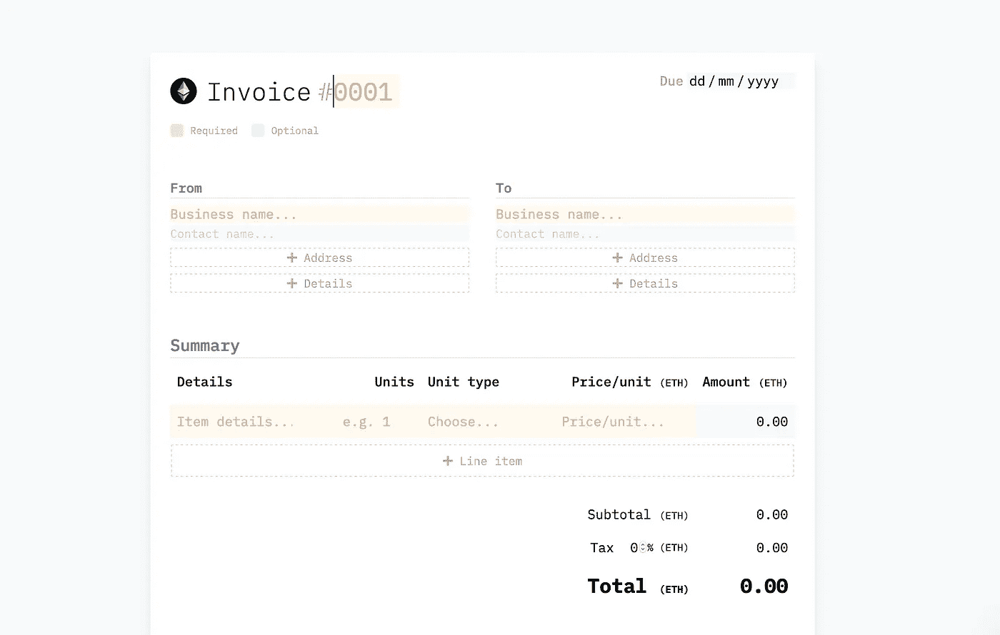
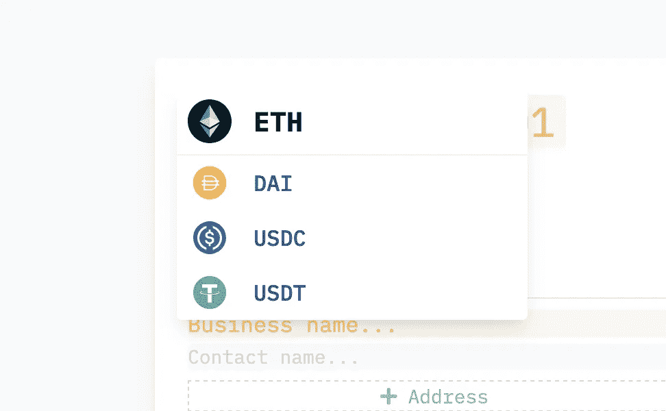
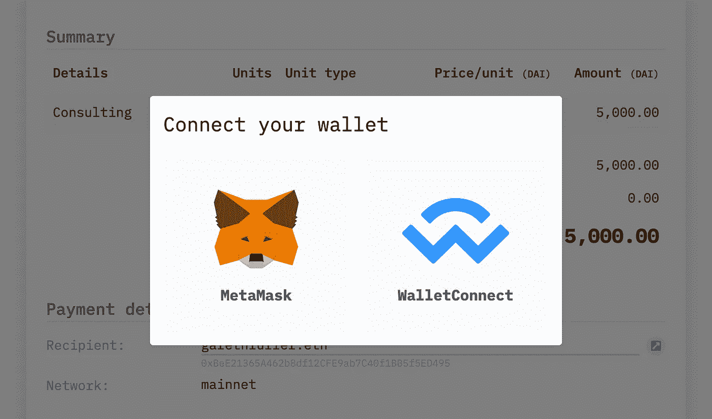
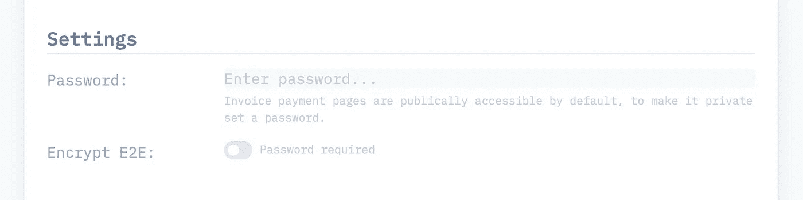

# 以太坊发票生成器

> 原文：<https://medium.com/coinmonks/the-ethereum-invoice-builder-dfd85ce5a839?source=collection_archive---------3----------------------->

这个帖子是对 invoice.build (IB)的介绍，它是什么，它可能会变成什么。

# 事实真相

Invoice.build 尽可能不言自明，它是一个为以太币(如戴和)创建支付页面的发票生成器。

当前支持的令牌的选择列表:

*   以太币
*   奶妈
*   USDC
*   泰达币

发票数据目前不存储在链上，而是存储在常规的 SQL 数据库中。考虑到 IB 是为以太币构建的，你可能会问这是为什么？

将发票数据存储在链上，甚至可能通过以太坊上的智能合同以某种方式标记发票，这是非常有意义的。

然而，IB 并不是以这种方式构建的，因为我想首先提供一个良好的用户体验。我还想快速构建并公开一些有用的东西，这样我就可以获得用户反馈并进行迭代。通过适当的规划和设计，一种更具以太坊本地特色的体验将会到来。

该应用程序目前的目的只是为以太坊交易提供上下文。此处的上下文是传统发票形式的企业对企业交易，例如，自由软件工程师给其客户的加密项目工作发票。

一旦通过 IB 创建了发票，就可以使用支持 Web3 的浏览器和 WalletConnect 支持的钱包进行发票支付。

加密团体，尤其是以太坊团体，自然关心为他们的网络构建的应用程序的隐私和去中心化。这也是为什么在某些时候将发票完全转移到供应链上是有意义的。

与此同时，我添加了一些设置作为这些问题的权宜之计。发票可以密码保护，如果提供了密码，发票可以 E2E 加密。这确保了为创建发票而提供的任何可识别信息都是保密的，只有知道密码的用户才能访问。

除了这些隐私设置，我还尽一切可能公开应用程序的构建和运行方式。这包括[代码](https://github.com/Invoice-build)、[路线图](https://trello.com/b/RKj2K6Hz/product-roadmap)、[分析](https://app.usefathom.com/share/qktowsha/invoice.build#/?range=last_7_days&site=27918)，基本上除了存储在数据库中的数据之外的一切。

# 它会变成什么样

如前所述，主要目标是将整个发票创建和数据存储转移到供应链上。

这看起来像什么？一切都还没有决定，但我打算这样做。

创建发票时，发票数据的散列将存储在 [IPFS](https://ipfs.io/) 中，并且对该散列的引用将作为发票创建事务的一部分存储，而不是将发票信息保存到 SQL 数据库中。

创建事务本身可能会启动以某种方式表示发票的智能契约结构的存储。然后，我想将发票的价值表示为可交易的代币。为什么？

如果客户正式接受发票，发票在付清之前就有价值。这就是众所周知的保理业务，它允许企业以一定的折扣将应收账款(即发票)出售给第三方(称为保理商)。

我可以想象在未来的市场中，通过这些智能合同创建的发票可以公开交易，假设发票已经被一个已知的知名地址(如 maker.eth)接受，并带有加密签名

另一个潜在的未来功能是支付流。也就是说，随着时间的推移将发票支付给接收方。这可以通过像 [Sablier](https://sablier.finance/) 这样的协议来完成。

这是我目前对 invoice.build 的思考状态，可能会随着时间的推移而改变。如果您有任何问题或想要建议一个功能或方向来构建，请联系 [hello@invoice.build](mailto:hello@invoice.build) 。

*原载于 2020 年 11 月 27 日*[*invoice . build*](https://invoice.build/blog/the-ethereum-invoice-builder)*博客。*

## 另外，阅读

*   最好的[密码交易机器人](/coinmonks/crypto-trading-bot-c2ffce8acb2a)
*   [Deribit 审查](/coinmonks/deribit-review-options-fees-apis-and-testnet-2ca16c4bbdb2) |选项、费用、API 和 Testnet
*   [FTX 密码交易所评论](/coinmonks/ftx-crypto-exchange-review-53664ac1198f)
*   [比特交换评论](/coinmonks/bybit-exchange-review-dbd570019b71)
*   最好的比特币[硬件钱包](/coinmonks/the-best-cryptocurrency-hardware-wallets-of-2020-e28b1c124069?source=friends_link&sk=324dd9ff8556ab578d71e7ad7658ad7c)
*   [密码本交易平台](/coinmonks/top-10-crypto-copy-trading-platforms-for-beginners-d0c37c7d698c)
*   最好的[加密税务软件](/coinmonks/best-crypto-tax-tool-for-my-money-72d4b430816b)
*   [最佳加密交易平台](/coinmonks/the-best-crypto-trading-platforms-in-2020-the-definitive-guide-updated-c72f8b874555)
*   最佳[密码借贷平台](/coinmonks/top-5-crypto-lending-platforms-in-2020-that-you-need-to-know-a1b675cec3fa)
*   [莱杰纳米 S vs 特雷佐 one vs 特雷佐 T vs 莱杰纳米 X](https://blog.coincodecap.com/ledger-nano-s-vs-trezor-one-ledger-nano-x-trezor-t)
*   [block fi vs Celsius](/coinmonks/blockfi-vs-celsius-vs-hodlnaut-8a1cc8c26630)vs Hodlnaut
*   bits gap review——一个轻松赚钱的加密交易机器人
*   为专业人士设计的加密交易机器人
*   [PrimeXBT 审查](/coinmonks/primexbt-review-88e0815be858) |杠杆交易、费用和交易
*   [在线评论](/coinmonks/haasonline-review-d8d1a3400419)享受九折优惠
*   [埃利帕尔泰坦评论](/coinmonks/ellipal-titan-review-85e9071dd029)
*   [SecuX Stone 评论](https://blog.coincodecap.com/secux-stone-hardware-wallet-review)
*   区块链评论 |从你的密码中赚取高达 8.6%的利息
*   开发人员的最佳加密 API
*   [最佳区块链分析工具](https://bitquery.io/blog/best-blockchain-analysis-tools-and-software)
*   [加密套利](/coinmonks/crypto-arbitrage-guide-how-to-make-money-as-a-beginner-62bfe5c868f6)指南:新手如何赚钱
*   顶级[比特币节点](https://blog.coincodecap.com/bitcoin-node-solutions)提供商
*   最佳[加密制图工具](/coinmonks/what-are-the-best-charting-platforms-for-cryptocurrency-trading-85aade584d80)
*   了解比特币最好的[书籍有哪些？](/coinmonks/what-are-the-best-books-to-learn-bitcoin-409aeb9aff4b)

> [直接在您的收件箱中获得最佳软件交易](/coinmonks/newsletters/coinmonks)

