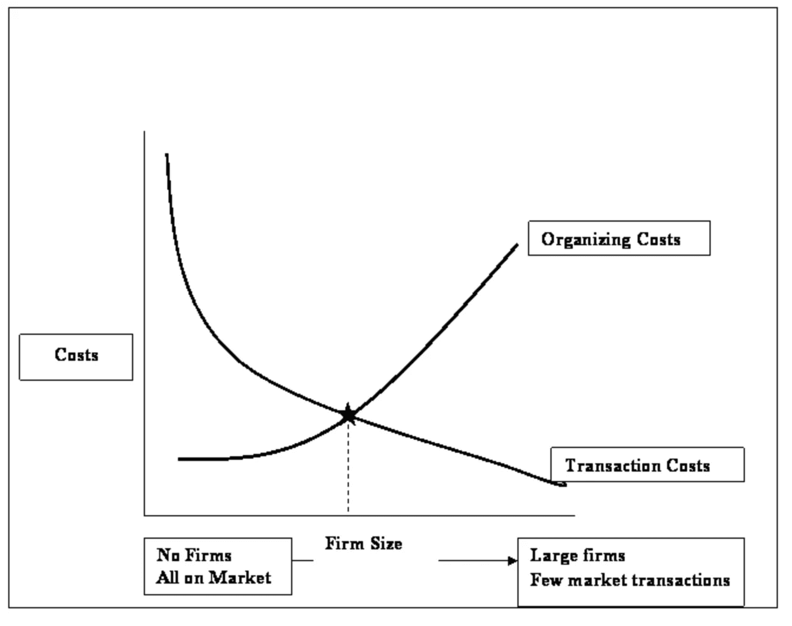
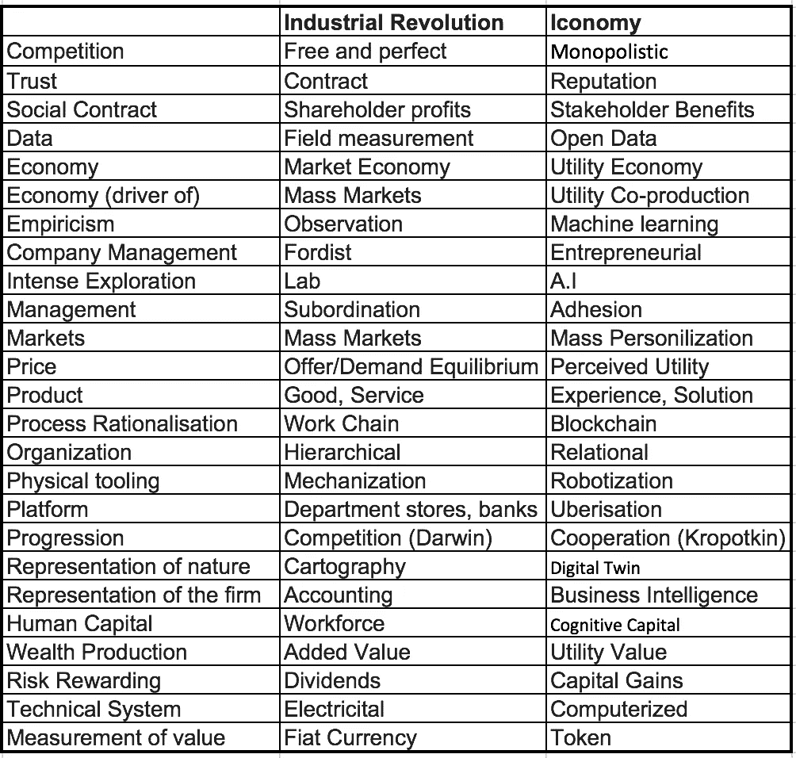
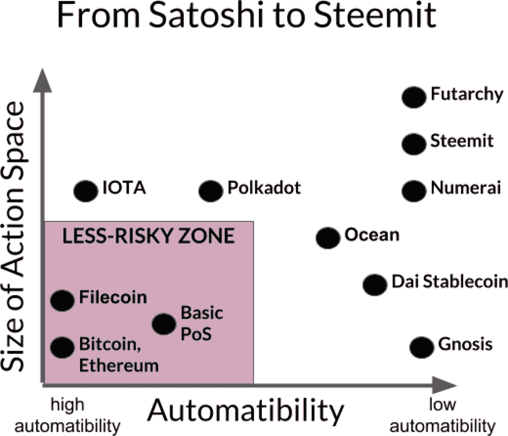
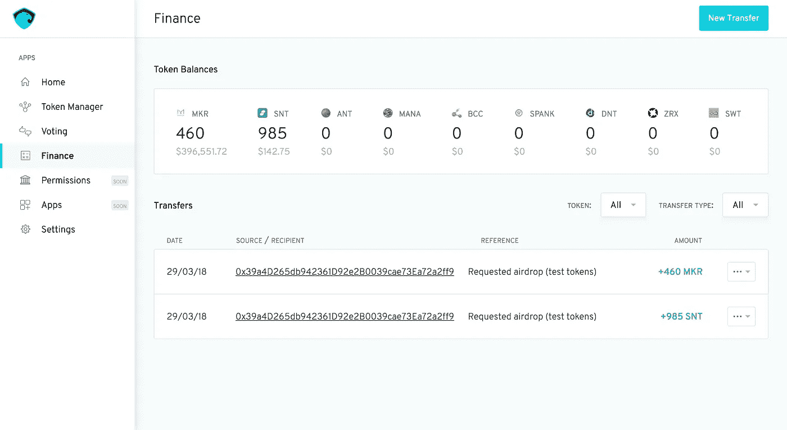
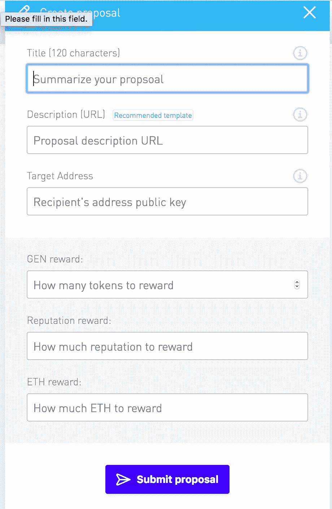
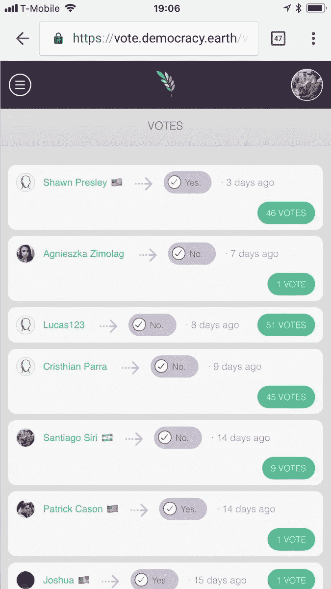
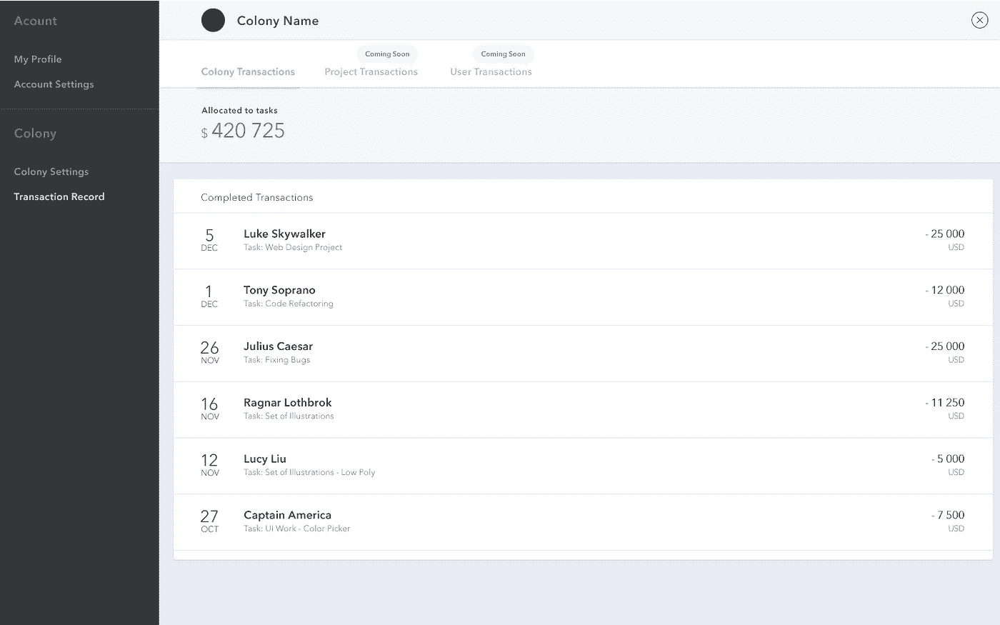

# 合作的演变:道咨询和活动生态系统

> 原文：<https://medium.com/coinmonks/the-evolution-of-cooperation-a-dao-consulting-and-events-ecosystem-6ff08b4a8de3?source=collection_archive---------6----------------------->

Dao，即分散自治组织，一直站在加密货币思想的边缘，在两种截然不同的实际实现方式之间摇摆不定。首先，作为分散化治理的生动体现，技术使得就加密货币的技术、货币和财政政策达成共识成为可能(块大小、通货膨胀率、交易费用等..).相反，它是哲学家、经济学家和政治学家的白日梦，集社会政治组织、生产关系和广义分权治理框架内的劳动(自我)组织的革命于一身。

Dao 是由一组用代码编写并在区块链上执行的规则管理的组织，这些规则可以将不同实体的偏好汇总到一个透明和有约束力的决策流程中(代码中包含法律准则和自愿参与的边界)。第一个这样的实验名为“道”，它在 2016 年的 ICO 期间筹集了所有 ETH 的 15%，并看到其资金被攻击者抽走。从那时起，道这个词就与不稳固的基础和黑客联系在一起，尽管它的创立者有良好的意愿和伟大的愿景，也有其存在的必要性。主要的弱点是以民主和迅速的方式改进议定书的能力有限。

我们也可以将无许可的公共区块链视为在一系列更有限的行动中已经存在的 Dao 模型:比特币核心协议升级(或分叉)的方式是随着 BIP 的采用(Amir Taaki 对生态系统的贡献之一)和矿工支持信号的发展而逐渐形成的综合治理系统的结果，这是技术官僚和政治斗争的结果，其结果决定了协议的命运。

DAO 空间的最终目标是出现一种为信息时代量身定制的新的组织形式，这种组织形式是去中心化的、适应性强的，但也是有弹性的和可伸缩的。在古典企业中，规模允许规模经济和范围经济，但由于协调成本的增加，规模经济和范围经济有一个天然的限制(用科斯的话说，内部化收益低于合同交易成本，在某些情况下，低于多雇用一个人的边际收益)。

通过降低协调成本，DAOs 允许更大规模的生产组织。这种生产流程和劳动组织的重新组织符合整合了区块链、符号化和集体智能的 Iconomy 框架。(这一概念可与各种理论相比较，如后福特主义、信息时代、知识经济、第三/第四次工业革命、认知/矢量/网络资本主义等..).

Iconomy Framework

尽管过去困难重重，但新工具正在出现，以实现维塔利克·布特林所说的加密货币非常不发达的一面。DAOs 可以在代码中实现直接民主和博弈论的思想，如 Ralph Merkle 的 Futarchy。在这个新生的生态系统中，Aragon、Colony、DAOstack、Democracy Earth 和其他一些先驱站在治理创新的最前沿。

难以通过发展由加密货币支持的可扩展、有弹性、可预测和强制(在自愿参与的范围内)的机构来“到达丹麦”(福山对治理导致的高水平发展的类比)的一个原因是 DLT 和分散化治理工具的成熟所固有的。传统的治理模式已经发展了几千年。然而，其他基石机构也是如此，比如货币概念本身，如今正遭到破坏。

但是，Dao 在从基于加密经济原语的狭窄规则集到映射更大的行动空间的过程中，面临着指数级的复杂性，既要设置激励机制，又要防范多种攻击媒介。Elad Verbin 的图表非常清晰地展示了这一点！

我们的祖先钻研治理的哲学和实践实验，而这一代人正在将他们的想法，不管是好是坏，移植到新的背景和新的理解领域。在我们寻求更好和更公平的治理的过程中，我们必须利用现有的最佳工具。

因此，在我们关于去中心化治理系列的第一部分中，我们将放大一个适用的用例，解释其背后的原因，并提出最初的具体步骤。

***用例 1:道/DAC 咨询合作***

在美国，三分之一的工作是自由职业者的工作。随着我们从通过公司或技术平台的契约转向基于信任的关系，经济将越来越多地由分散的合作生产网络驱动，而不是由典型的 20 世纪公司或世纪之交的初创企业驱动。这将是对劳动法规、知识产权和管理理论领域的巨大挑战。通过符号化在组织层面上赋予行动者参与游戏的激励，我们还可以降低由代理风险产生和放大的系统风险。

在 Horatii Partners，我们一直为区块链架构、代币经济学和 ICO 结构的加密货币项目提供建议，但作为一个两人创始团队，我们在保持高质量服务的同时，在接纳更多客户方面遇到了困难。这也是因为不能像一个小团队那样专业化。当在分散的同事、顾问和项目网络中拓展业务时，要符合全球监管体系尤其困难。此外，当你谈论具有不确定和相对遥远的回报的时间投资时，必须考虑固定工资成本，因为 cas 在处理加密项目时经常这样。根据贡献者的附加值公平分配未来收益更有意义。这可以通过一种分散的自治公司，即一种特定形式的"一体行动"来实现。

Horatii+将作为 DAO/DAC 在 DAOstack 和/或 Colony 上运行，用于预算和任务分配、声誉流和奖励建议项目在未来付费令牌中的贡献。这意味着它不仅是一个分散的公司，而且是一个成长网络，充当分散的孵化器，为有前途的项目提供一个以透明方式工作的扩大的合作者社区。

在固定预聘的情况下，需要一个传统的业务结构来接收和支付资金。可以达成股东协议，使理事会的决策与随附的 Dao 集体决策保持一致，从而降低信托风险。

对于新加入的客户，将收取双方同意的成功费，对于 Horatii DAO，将收取结构费，用于声誉和/或代币持有人的再投资或分红(这一组合将进一步讨论并通过投票决定)。这也将用于支付现实生活结构产生的非加密费用(例如商务航班和会议)。

拟议的组织将类似于传统的法律和咨询伙伴关系，由创始合伙人、负责人、合伙人和受训人员组成。

当获得足够的声誉时，职位将通过同行投票解锁。受训者没有直接报酬，而是从事横向研究和文献工作。头寸支持不同份额的年终红利和 DAO 中的投票份额。这种混合模式还允许在需要时对外部实体和合作伙伴进行补偿。

将有一种机制(例如通过 ETHlend)允许合作伙伴或外部债权人以未来收入的利息承诺为费用融资。

(旁注:特伦特·麦克康纳希关于人工智能和 DAOs 交集的思想可以引导我们走向一个未来，在这个未来，自主算法可以充当公司经理[https://blog.bigchaindb.com/ai-daos-series2-3876510d6eb4](https://blog.bigchaindb.com/ai-daos-series2-3876510d6eb4)

咨询师通常会被鄙视，因为他们接受了建议的积极回报，却没有感受到错误的痛苦。这整个系统也将错误的痛苦内化到了顾问身上，因为他们拥有与企业家相同的收益曲线:令牌。通过拥有孵化器和顾问的分布式网络，该系统还通过平衡小成本和项目而更具弹性，这些小成本和项目在投入工作和偶尔的头奖结果的情况下没有回报。我们还必须记住，当这些代币变得可以交易，从而有可能转移给其他人时，这意味着什么。

***用例二:刀会***

亚当·斯密

日益成熟的生态系统的一个重要方面是会议之旅，创始人为推广和建立伙伴关系积累了大量经验，因为在普遍持有的观点中，营销曝光率与估值密切相关，并通过可用预算和净值进行代理(但还没有关于会议跳跃的投资回报率的实证研究)。它们不仅是赚钱的工具，也是身份和社区建设的工具。根据亚里士多德在《尼各马科伦理学》中的观点，古希腊货币的创造对于发展城邦和共同公民的理念至关重要。在更现代的时代，比特币和其他加密货币正在接过身份建设的外衣，这往往会导致狭隘的部落主义。弥合雅典差距的关键是集市，商品、人民和思想的所在地。今天的会议之旅也是。

一个人和一个民族之间的会面，不仅仅是演讲者的聚集，一些“神奇”的会议不知何故加起来不仅仅是各个部分的总和。这就引出了一个问题:由于 blockhain 的出现，纯上下文协作的产出能否被货币化、公平分配和扩大？如果我们将会议视为一个活的有机体，类似于一个生态系统，成员根据团队的表现和产出来来去去，投资和兑现，会怎么样？通过符号化，我们可以赋予所有的利益相关者，不仅仅是组织者，还有演讲者、主持人和赞助商，某种程度上的游戏皮肤。因此，我们也可以根据对捐款的公平估价来确定收益的公平分配。这也是一个非常相关的讨论，关于其他背景事件，如黑客马拉松。

在这一探索中，我们必须问自己，什么对公众更有吸引力，管理更有效率:是一次性活动，还是演讲者和组织者的“巡回”乐队？如何将当地的力量和熟悉度与全球分散的参与者和决策者网络结合起来？如何最好地激励利益相关者？确保可伸缩性和弹性的最佳机制设计是什么？

许多理论问题渗透到这个讨论中，所以唯一的前进道路是开始动手实验，换句话说:BUIDL！

提议的形式是未经许可的国会，一个由专家组成的制宪会议，在法律允许的范围内自治

基于 DAO 的会议必须具备什么(使用今天仍然不成熟的工具):

*   通过密码或法令到密码桥的安全国库的集合。这是由于对资金的攻击而导致的一个失败的高点。在某些情况下，可以使用混合一体行动方案/基金会模式，其中实体基金会代表机构群体的决定支付资金(以智能合同或一体行动方案的产出为条件的法律合同)。还应该有一个治理协议，根据每种代币和法定货币的百分比来决定财政部的平衡。

Aragon’s finance module

*   预算分配方法和支出，通过民主投票或多方签名将资金分配给各方。在会议中，一些费用是在最后一刻支付的，取决于物理空间的条件(例如购买额外的纸杯和毛巾)。一个可能的途径是允许在一定的财务和时间限制内将“预算项目”授权给个人，然后他们将对资金的使用拥有酌处权。
*   提案上传和采用机制，例如在徽标、位置、发言人之间进行选择。这将需要在所有 DAO 协议中找到的链上民主投票。

Democracy Earth’s proposed liquid democracy

*   能够以法定形式和代币形式补偿演讲者、合作伙伴和接受赞助和捐赠。

*   一种处理 DAO 的方法，它可以大规模运行，数千个代理可能会做出数百万个决策，同时保证弹性(对决策给予足够的集体关注)。道斯塔克的全息共识可以提供这一点，它将决策与预测市场的力量结合在一起。[https://www.youtube.com/watch?v=FwL7IYb6YiY](https://www.youtube.com/watch?v=FwL7IYb6YiY)
*   处理保密问题的一种方式:演讲者报酬或公司和个人赞助金额的公开性质可能会引起争议和怨恨，或者相反地巩固摇滚明星的地位。目前没有对此提供任何解决方案，但是可能来自于将来秘密智能合同(零知识证明和安全计算)的使用，这将允许私人投标，其中不会显示贡献，而仅显示发言者的许可或未许可状态。与此同时，公开这些信息将创建一个透明的演讲和赞助费用 TCR(令牌管理注册)。
*   一个贡献评估引擎将是必要的，以评价人们的贡献和技能，以使他们从合作资产和努力中获得公平的回报。(阿拉贡->潘多，殖民地->综合)。这也可以包括声誉加权的同行投票。
*   一个强大的代币经济，通过整合组织者和投资者 R.O.I 的公平报酬，激励采取主动和投资。例如，为 DAO 提供固定数量的代币，并向代币持有者返还一定比例的收益。这增加了流动性和投资吸引力，但也让会议 Dao 面临监管机构的潜在诉讼，因为它将被视为一种安全令牌。

Existing ecosystem summary

最重要的是，这是对我在生态系统中的同事和更广泛的公众的行动呼吁，以便尽早实现这一共同愿景！在这种观点下，我为所有有兴趣在公开论坛上讨论这个问题的人创建了以下电报聊天群:[https://t.me/joinchat/GCUN_RFh1LYIl_R0CE99RA](https://t.me/joinchat/GCUN_RFh1LYIl_R0CE99RA)

感谢 Cem Dagdelen、Theodor Beutel、Erik Rodrigues 和 DAOstack 授粉小组的反馈，感谢 Matan Field、Vincent L'Orphelin、Elad Verbin、Trent Mc Conaghy 和整个 DAOscape 的灵感！