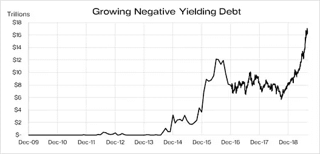

# 金融科技的演变

> 原文：<https://medium.com/coinmonks/the-evolution-of-fintech-2e902f242dcd?source=collection_archive---------4----------------------->

克利斯·凯驰博士

***乘坐采用加密技术的革命性火箭……完全进化***

**区块链的诞生**

历史对银行和金融业危机并不陌生。由于 2008 年的金融危机，全球数千万人失去了工作或家园。区块链减少了对中央机构的依赖，因此有助于建立一个更具弹性的金融部门。集中的中介，即“中间人”，集中风险，同时收取可观的经济租金。当前清算和结算交易的方法仍然成本高昂，存在许多对账和交易对手风险。

> [发现并回顾最佳区块链软件](https://coincodecap.com)

一项研究显示，仅前十大银行，区块链的基础设施就可以降低 30%的成本，相当于节省 80 至 120 亿美元。当然，这种基础设施可以应用于金融系统内的所有机构。然而，这种节约并没有考虑机会成本带来的额外节约。根据资产类别的不同，资金通常会被锁定两天到几周，直到交易完成。

**金融科技迎来部分所有权**

区块链技术的可靠性通过高效的价值分配实现了部分所有权，同时极大地提高了传统上相当缺乏流动性的市场的流动性。就房地产而言，多个投资者可以拥有一块房地产、一些土地、一套公寓或整个公寓楼。当然，这个类比可以扩展到所有类型的硬资产。

区块链提供了一个坚实的基础，在这个基础上，更有效的资本雇佣了真正的银行、真正的律师和真正的会计师，他们在一个更有效的平台上共同工作。事实上，麻省理工学院(MIT)最近发表的一篇论文《区块链技术对金融的影响:变革的催化剂》(The Impact of block chain Technology on Finance:A Catalyst for Change)指出，“许多与金融服务相关的区块链或 DLT(distributed ledger Technology)项目都是基于成本节约和效率提升的。”

**符号化回答 QE 菲亚特降价**

将资产令牌化的公司为市场带来了一个关键的替代方案，允许散户资金以流动性、可交易、令牌化资产(如房地产)的形式投资于以前的非流动性领域，同时降低或消除许多前端和后端成本并提高效率。令牌化将资产的权利转换为数字令牌，并在区块链上存储和管理。这种令牌化资产正在形成，但监管必须赶上令牌化技术，以便主要交易所可以开始上市令牌，从而确保足够的流动性。

在布里奇沃特管理着全球最大对冲基金的雷伊·达里奥等知名华尔街人士，最近谈到了一个正在发生的重大范式转变，即一个人的资本投资方向。尽管他在这个货币贬值的时代准确地评估了“现金是垃圾”,但他可能并不深刻理解如何通过 sto 等工具将硬资产令牌化，以及为什么会有如此大的需求。Dalio 在他的出版物中没有提到这种可能性。

STO 的价值将由其基础硬资产决定，无论是房地产、黄金、股票、收藏品等等。随着法定货币贬值，代币的价值上升，因为基础资产稀缺，也就是说，当涉及到房地产、黄金、比特币或收藏品时，没有“印刷”在进行。

作为补充，比特币的持续上涨是其价值相对于所有形式的法定货币的结果。政府试图禁止它，但无济于事。比特币已经成为互联网 DNA 的重要组成部分。尽管由于其波动性，比特币不是理想的价值储存手段或交易媒介，但人们必须记住，比特币仍相对较新，因此就像一个聪明的青少年，有时情绪会极度波动，但潜力无限。在委内瑞拉和阿根廷等国，数百万人用它来拯救自己的储蓄，使其免受货币快速贬值的影响。其他人用它来汇款，这样就可以把钱汇回给那些缺乏银行基础设施的第三世界国家的亲戚。世界上大约有 30 亿人没有银行账户或者只有部分银行账户。这是一个巨大的顺风，将有助于推动比特币的价值再次创新高。

也就是说，sto 是范式转变的重要组成部分。新的资本应该转移到 sto，因为他们变得可用。与此同时，当菲亚特继续贬值时，资本应该从菲亚特流出。这同样适用于债券，其收益率不仅处于或接近历史低点，而且还在进一步走低。随着央行印更多的钱，债券以贬值的货币偿还。

因此，在这个 QE 时代，资本资产定价模型所建议的相对无风险的投资(如储蓄账户、CDs 和国债等政府债券)不再适用。

**硬资产包括以下内容:**

贵金属

房地产

作为央行新替代货币的股票通常是大股东

收藏品

以上都是可以记号化的。自 2008 年末 QE 开始应对当年的金融危机以来，所有这些股票都普遍升值。所有这些都将继续走高，这可能会成为一个几乎永无止境的债务泡沫。

**象征化的浪潮**

象征性硬资产的浪潮即将到来。纳斯达克前首席执行官表示，所有股票将在 5 年内令牌化。鉴于股票价值约为 70 万亿美元，这是一个重大转变。我们还有 228 万亿美元的房地产，其中一些将被令牌化。

此外，由于物质经济优势，即将上线的效率和成本效益高得多的分散式区块链技术将取代传统技术。区块链空间目前的总估值约为 2200 亿美元，预计未来几年其价值将呈指数级增长。这对比特币和以太坊等工具来说是个好兆头。两者都以 GBTC 和埃塞为代号进行交易。利用我们关于[自私投资](http://www.selfishinvesting.com)的书籍和文章中详述的逻辑买卖原则，到目前为止效果很好，因为我们是第一个(如果不是第一个的话)在今年 3 月 1 日对 GBTC 发出买入信号的公司之一，当时市场情绪仍然悲观，然后一份更全面的报告于 3 月 24 日发送给会员。

监管机构必须加快步伐，以便交易所能够推出代币，为那些储蓄不再安全的零售商打开大门，尤其是在账户收益率接近零或为负的国家，因为 QE 水平不断上升，降低了所有法定货币相对于硬资产的价值。

在最近的一篇文章中，我写了四种可能的情况，其中至少有一种是可能实现的。在这个菲亚特贬值的世界里，传统的、象征性的硬资产将会受益。也就是说，标的化硬资产(其基础价值与房地产等硬资产相关)将代表稳定的回报，波动性最小。随着菲亚特贬值刺激资产价格上涨，基础资产可以获得资本收益和收益率。

**汉斯科因等人**

有几家公司正处于风口浪尖，比如汉斯科因(HanseCoin)，它们正在对硬资产进行令牌化。在一个法定贬值和负收益率债务的世界里，汉斯科因的令牌化证券是下一个财富仓库。HanseCoin 成立于 2018 年，是第一家针对 500 多亿欧元建筑股权项目的受监管公司，这些项目因 MiFID 等繁重的法规而急需资金，这些法规摧毁了封闭式基金市场。

这有效地解决了全球印钞流行导致的法币贬值。储户不再安全，因为传统的低风险储蓄或投资场所正朝着零收益率甚至负收益率水平发展。HanseCoin 通过将流动性引入以前为老练的高净值投资者保留的领域，为投资带来了大规模采用。这使得典型储蓄者和更老练的私人股本投资者之间的竞技场变得平坦，同时解决了自上世纪 30 年代以来从未有过的民粹主义问题。

**基于区块链的软件创新**

HanseCoin 正在开发软件，该软件将推动令牌化领域的创新。该软件可以包含广泛的应用程序，如审计令牌代码或智能合同。智能合同是两个人之间以计算机代码形式达成的协议，本质上是一组如果-那么规则。它们在区块链上运行，因此存储在不能更改的公共数据库中。智能合约中发生的交易由区块链处理，这意味着它们可以自动发送，无需第三方，从而消除了成本高昂的中间商。打个比方，区块链是高阶地形，软件是引擎，令牌是石油。

HanseCoin 的区块链技术为流动性差的市场带来了流动性和效率，同时使散户和机构投资者都能参与部分所有权。区块链的令牌化房地产只是冰山上的冰块。经济优势是巨大的。

因此，前端和后端费用大幅降低，而不需要资金锁定。例如，在通常需要几年资本锁定的造船行业，通过去除许多前端和后端成本，费用可以从 25.5%降至 4%。在建筑股权等其他领域，资本筹集的总费用也大幅降低。作为众多例子中的一个，德国 MiFID 法规使急需发展资金的项目缺乏资金，大约 200 亿欧元。

**无尽的项目队列**

事实上，芬兰、爱沙尼亚、波兰和亚洲部分地区等新兴繁荣城市的开发商对利用区块链技术将其房地产开发项目纳入融资平台很感兴趣。HanseCoin 目前已经审核了 50 多个这样的项目，等待使用其令牌化引擎进行融资。由此节省下来的资金会传递给所有相关方，从买方到卖方，再到投资者。

保守的投资者和储户将从这种象征性证券的可用性中找到安慰，这种证券是接近零收益或负收益的债券和储蓄账户的绝佳替代品。事实上，随着利率走低，德国和其他储蓄国将把部分数万亿储蓄转向收益率更高的投资。HanseCoin 的用例以较低的风险提供了更高的产量。

**雷伊·达里奥的预测**

Dalio 在以下及时声明中被引用:

“我认为，我们所处的范式很可能会在以下情况下终结:a)实际利率回报被压低至如此之低，以至于持有债务的投资者不愿继续持有，并将开始转向他们认为更好的东西；b)与此同时，为债务融资的大量资金需求将导致“大挤压”。'

“将不得不出现货币化的巨额赤字、货币贬值和大幅增税的某种组合，这些情况可能会加剧资本主义富人和社会主义穷人之间的冲突。”

“在这样一个世界里，把钱存进现金和债券将不再安全。”

“当大多数储备货币央行行长希望在法定货币体系中让本币贬值时，这也是一个询问下一个最佳货币或财富储备的好时机。”

一个范式转变正在发生。HanseCoin 为市场带来了一个渐进而必要的替代方案，让广大投资者和储户能够将资本投入到具有高收益率的流动性、可交易、令牌化资产中。著名天使投资人纳威·拉维坎特和雷伊·达里奥都会同意这一点。Ravikant 两年前说，华尔街目前 90%的工作将在 7 年内消失。变形或者死亡。生存和发展。

**由克利斯·凯驰博士的** [的**汉斯数码接入**](https://hansedigitalaccess.com) **，【KJA】数码投资和** [**美德自私投资**](http://www.selfishinvesting.com/)

**(͡:B ͜ʖ ͡:B)**

> [直接在您的收件箱中获得最佳软件交易](https://coincodecap.com/?utm_source=coinmonks)

