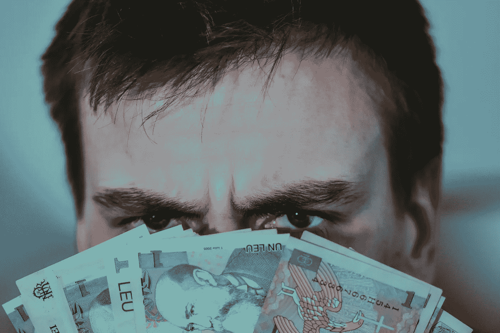
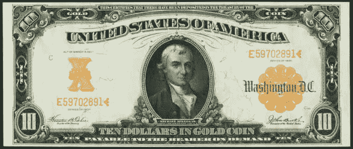
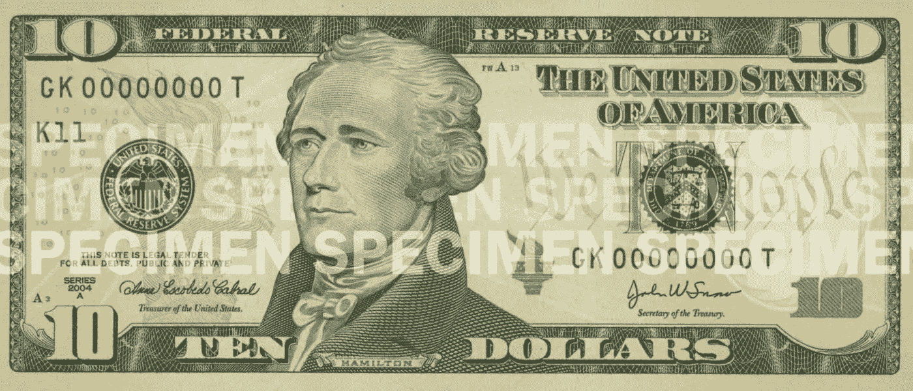

# 货币的演变及其腐败

> 原文：<https://medium.com/coinmonks/the-evolution-of-money-and-its-corruption-9d26990e428f?source=collection_archive---------3----------------------->

## 从物物交换到量化宽松

持久的友谊需要信任；这就是为什么货币不会长久。

Photo by [Dids](https://www.pexels.com/@didsss?utm_content=attributionCopyText&utm_medium=referral&utm_source=pexels) from [Pexels](https://www.pexels.com/photo/serious-young-male-covering-face-with-banknotes-6832333/?utm_content=attributionCopyText&utm_medium=referral&utm_source=pexels)

在菲亚特出现之前，我们有价值商品形式的货币，我们有以物易物的经济。

## **什么是物物交换？**

一个实体想要另一个实体拥有的东西，所以他们必须在汇率上达成一致。这很简单，但是当商品数量增加时，物物交换系统就变得不可行了。这是因为该系统最终会有数百万种汇率。

再者，如果一个人没有另一个人想要的东西呢？交换不会发生…

这些都是货币解决的问题。当所有商品都用货币定价时，每件商品都有一个价格，任何东西都可以用可替代资金支付。

## 史前货币

在硬币和纸币出现之前，古代就有了钱。它具有独特的属性，并且不可替代，因为它的价值随着使用的地点和时间而波动。

**炮弹**

美丽的贝壳可以在远离海岸的地方成为可靠的货币，因为它们在内陆是买不到的。当然，这使得它们变得稀缺和珍贵，但这并不是一个靠近海滩的好办法，在那里每个人都可以收集它们。

**皮毛**

很容易看出毛皮会保值。

毛皮需要大量的工作，如狩猎、杀戮和剥皮，而且它确保了在寒冷气候下的生存，毛皮贸易成为社会的一大部分。

**盐**

在它容易获得之前，它是一种非常受欢迎的商品，可以调味和保存食物。人们用盐来支付工资，并且为了盐矿发生了战争。

## 货币金属

当贸易扩展到广阔的地理区域时，一种新的货币形式出现了。一种在任何地方都同等价值的货币形式。它是可分的，易于运输，经得起时间的磨损。

铜、银、金和镍成为货币。国王、银行和机构控制着铸币和发行。

但是有一些问题。这些货币的持有者无法知道他们收到的付款是否真实，除非对其进行称重或熔化以测试其纯度。

## 纸币

欧洲在 1661 年印制了第一张纸币。

让我们看看这张旧版本的 10 美元钞票。

Source: [www.oldmoneyprices.com](https://oldmoneyprices.com/ten-dollars-1907-gold-certificate-values/)

看下面，你可以看到钞票可以根据要求兑换黄金。

今天的美钞没有承诺这一点，因为金本位制在 1971 年被理查德·尼克松废除了。

**No promise of gold |** Source: [www.uscurrency.gov](https://www.uscurrency.gov/)

## 现代银行业

我们所知道的银行业出现在 17 世纪的伦敦。一位金匠银行家可以进入安全的金库，在那里存放黄金，但要收取一定的费用。收据发给了物主，只有他们才能赎回。这也导致了支票的发展。

银行通过允许金匠出借黄金以换取利息，为储户提供了一个被动的收入流。

问题是(现在仍然是)“银行”开始发放价值超过金库黄金的贷款。

这就是 T2 部分准备金银行和银行挤兑的由来。当大多数人对该机构失去信任，想要回黄金时，就会发生银行挤兑。所以他们都试图同时撤回。显然，这造成了一个问题，因为需要更多的黄金来处理所有的提款。

## 不兑现纸币

菲亚特一词源于拉丁语。意思是顺其自然或者烂车。法定货币没有任何实物资产的支持，其价值仅仅是因为发行当局这么说。

除了人们对它的信仰之外，它没有任何价值，这种信仰是通过暴力威胁来维持的。

政府已经建立了税收制度，他们将通过暴力强制执行，只有法令才能让这种威胁消失。

无法养活孩子或流落街头的威胁是实实在在的，尤其是在那些面临恶性通货膨胀的国家。

## 通货膨胀是腐败

[大贬值](https://en.wikipedia.org/wiki/The_Great_Debasement)是早期通货膨胀和精英摧毁货币的一个例子。

为了资助对外战争和奢侈的生活方式，英国国王亨利八世于 1544 年将英国货币贬值。通过降低硬币中贵金属的百分比，国王可以铸造更多的硬币。

英镑硬币中的银含量从 92.5 %的纯度下降到 25%。这导致了毁灭性的通货膨胀，一直持续到 1560 年贬值的硬币退出市场。

这为亨利赢得了“老铜鼻子”的绰号。薄薄的银层会磨掉硬币上他形象的鼻子，露出下面的铜。

## 量化宽松(货币创造)

这是描述货币印刷的一种奇特而令人困惑的方式。它最早始于 2009 年金融危机期间，当时美联储用凭空创造的资金纾困银行。

不管是量化宽松、纾困还是刺激。这都是印钞，最终导致通货膨胀。

## 结论

*   我们有货币，因为物物交换变得太复杂和不可行。
*   货币是代表价值的无价值纸币。它不包含任何实际值。
*   货币是一种实际的价值储存手段，必须像黄金、白银以及现在的比特币一样保持其购买力。
*   没有一种法定货币幸存下来，因为通货膨胀总是让它们变得一文不值。
*   政府害怕黄金和比特币，因为他们不能印更多的钱。这一事实限制了他们的消费能力以及窃取和控制人民的能力。
*   货币总是按需印刷并被膨胀，这就是价格上涨的原因。
*   并不是待售的物品发生变化并升值。房子是房子，汽车是汽车，棒棒糖不管花多少钱还是棒棒糖。

> 持久的友谊需要信任；这就是为什么货币不会长久。

感谢大家的阅读和鼓掌！你可以给我买杯咖啡让我继续写作。

另请阅读:[这就是银行扣押你的钱作为人质的方式，以及该如何应对。](/coinmonks/banks-are-holding-your-money-hostage-87b8ef14dd04)

如果你想无限制地访问所有媒体内容，请随意[使用我的会员链接](/@crypticliberation/membership)。每月 5 美元，我会收到一半。

你也可以[在 Twitter 上关注我](https://twitter.com/Cryptoliberator)或者通过[电报](https://t.me/Mannish_Boy)联系我……

万事如意！

> 加入 Coinmonks [电报频道](https://t.me/coincodecap)和 [Youtube 频道](https://www.youtube.com/c/coinmonks/videos)了解加密交易和投资

## 也阅读

 [## 杠杆代币[多头代币]终极指南

### 杠杆化令牌是具有杠杆化风险敞口的 ERC20 令牌，不考虑保证金、要求、管理…

medium.com](/coinmonks/leveraged-token-3f5257808b22)  [## 最佳加密交易所| 2021 年十大加密货币交易所

### 加密货币交易所的加密交易需要了解市场，这可以帮助你获得利润。之前…

blog.coincodecap.com](https://blog.coincodecap.com/crypto-exchange)  [## 2021 年最佳加密交换平台| CoinCodeCap

### 如果我们看看今天的场景，许多加密货币交换平台提供了广泛的功能和深度…

blog.coincodecap.com](https://blog.coincodecap.com/best-swap-platforms)  [## 2021 年最佳加密借贷平台| 6 大比特币借贷平台

### 获得比特币和其他加密货币的最佳贷款利率

medium.com](/coinmonks/top-5-crypto-lending-platforms-in-2020-that-you-need-to-know-a1b675cec3fa)  [## 2021 年最佳免费加密交易机器人

### 2021 年币安、比特币基地、库币和其他密码交易所的最佳密码交易机器人。四进制，位间隙…

medium.com](/coinmonks/crypto-trading-bot-c2ffce8acb2a)  [## 最佳 4 个加密交易信号电报通道

### 这是乏味的找到正确的加密交易信号提供商。因此，在本文中，我们将讨论最好的…

medium.com](/coinmonks/best-crypto-signals-telegram-5785cdbc4b2b)  [## 获取信号、交易机器人和套利

### 在本文中，我们将回顾 Bitsgap，这是一个满足您所有交易需求的一站式加密交易平台。它…

blog.coincodecap.com](https://blog.coincodecap.com/bitsgap-review)  [## 40 个最佳电报频道，用于加密、电影、表演和演讲| CoinCodeCap

### 随着我们周围无限的信息，我们很难筛选和了解有价值的信息。电报有…

blog.coincodecap.com](https://blog.coincodecap.com/best-telegram-channels)  [## 5 个最佳社交交易平台[2021] | CoinCodeCap

### 困惑于社交交易和副本交易哪个平台最好？本文将带您了解各种…

blog.coincodecap.com](https://blog.coincodecap.com/best-social-trading-platforms)  [## BlockFi 评论 2021:利弊和利率| CoinCodeCap

### 今天，我们提出了一个全面的 BlockFi 评论，这是一个成立于 2017 年的加密贷款平台，拥有其…

blog.coincodecap.com](https://blog.coincodecap.com/blockfi-review)  [## 如何在印度购买比特币？2021 年购买比特币的 7 款最佳应用[手机版]

### 如何使用移动应用程序购买比特币印度

medium.com](/coinmonks/buy-bitcoin-in-india-feb50ddfef94)