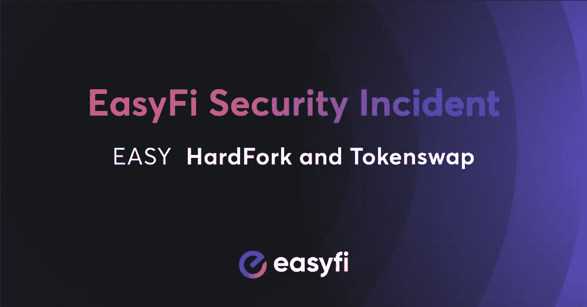
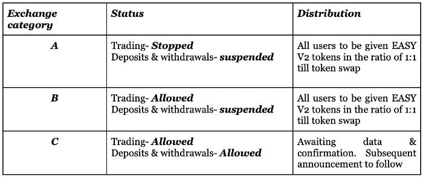
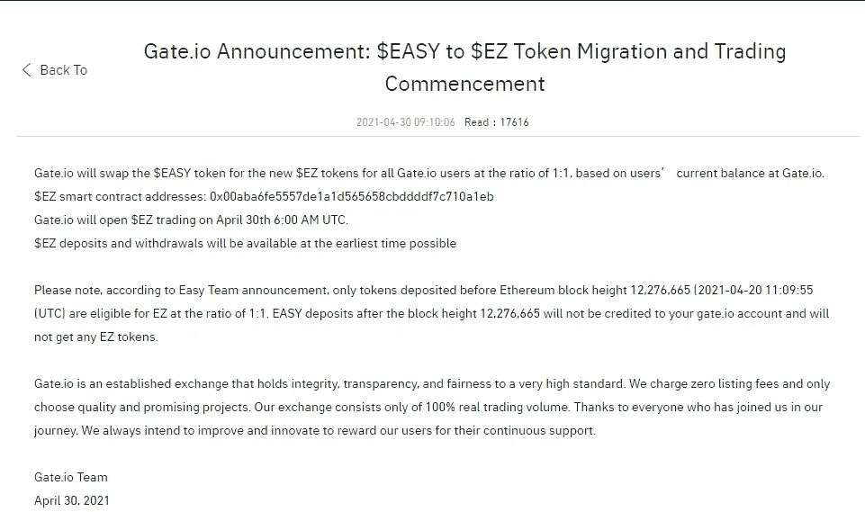
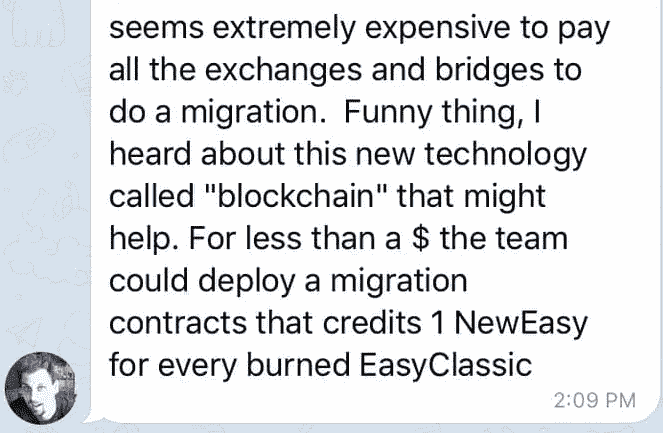
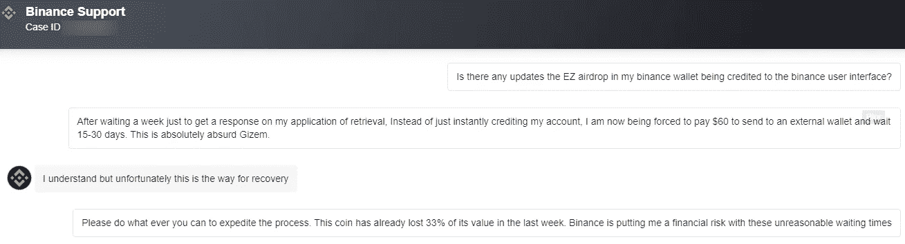

# EasyFi 网络的没落

> 原文：<https://medium.com/coinmonks/the-fall-of-easyfi-network-c4c6773a1378?source=collection_archive---------0----------------------->

## *一家前途无量的 DeFi 初创公司如何损失了 8000 万美元的资产，并背弃了他们的社区和他们赖以建立的分权基础。*

Ah yes, the alleged hack that nobody can’t seem to find the [First Information Report](https://en.wikipedia.org/wiki/First_information_report) for!

T 不生锈。无需许可。自由。当人们谈论分散金融的神奇世界时，这些术语被抛来抛去。 [DeFi](https://blog.coincodecap.com/the-ultimate-guide-to-defi-decentralized-finance) 承诺通过提供产品和服务来颠覆我们今天所知的传统金融，这些产品和服务通常需要在区块链的银行等使用智能合约的地方才能找到。用户不再需要中介来交换资产、发放或接收贷款等等。它可以直接从电脑或移动设备上完成。

过去一年出现了许多 DeFi 协议。有些被认为是重大成功，而有些则是彻头彻尾的骗局。2020 年 8 月，一个新的竞争对手带着巨大的诱惑力步入了印度的舞台。

[EasyFi Network](https://medium.com/u/b99d800f814a?source=post_page-----c4c6773a1378--------------------------------) 是合作伙伴[Ankitt Gaur](https://medium.com/u/dfea0cabff84?source=post_page-----c4c6773a1378--------------------------------)&[Anshul Dhir](https://medium.com/u/199bb00ad1f2?source=post_page-----c4c6773a1378--------------------------------)之间的第二个商业项目，提供超过 3 个不同区块链的各种 DeFi 产品和服务。EasyFi 通过获得大量高质量的合作伙伴关系进入了市场，并通过大量高利率的付费项目给社区留下了深刻的印象。仅在 7 个月内，EasyFi 就成为了币安的创新项目，市值高达 5000 万美元，形势似乎还在不断好转。

然而，对 EasyFi 来说，事情可能会完全变糟，这是一家加密初创公司所能想象到的最糟糕的方式之一。2021 年 4 月 19 日，也就是 EasyFi 宣传的超级星期二(T1)前夕，价值约 8000 万美元的加密资产从创始人兼首席执行官[安基特·高尔](https://medium.com/u/dfea0cabff84?source=post_page-----c4c6773a1378--------------------------------)的钱包中转移。EasyFI 稳定的硬币流动性池瞬间枯竭。更糟糕的是，之前被认为锁定的 300 万美元 EASY token 开始在自由市场上大量涌现，迅速冲击了 EASY token 的价格。

这一事件完全没有被注意到，直到[Telegram](https://twitter.com/EasyfiNetwork/status/1384150012418920459)轻松价格频道的成员开始关注价格暴跌和来自 [Ankitt Gaur](https://medium.com/u/dfea0cabff84?source=post_page-----c4c6773a1378--------------------------------) 钱包的高度可疑活动。虽然该团队将继续调查，但他们开始审查他们的电报频道，将成员置于一小时的慢速模式。在强大的压力下，来自印度的年轻的 DeFi 初创企业开始证明，它与传统的中央集权企业没有什么不同。EasyFi 声称为自己建模的 DeFi 原则和 8000 万美元的加密资产一起被抛弃了。

EasyFi 没有像许多人期望的那样透明和不受审查，而是变得守口如瓶，让社区在黑暗中担心他们持有的$EASY。被问到“难”问题的成员经常会遇到 EasyFi 电报频道的无解释禁令。随着社区变得越来越焦虑，EasyFi 最终在推特上发布消息称，对此事的调查已经开始。在 EasyFi 推文发布约 2 小时后，币安及其附属交易所关闭了他们的$EASY token 转账，但平台上的交易将继续不间断。当天晚些时候， [AscendEX](https://medium.com/u/785be82a92de?source=post_page-----c4c6773a1378--------------------------------) 将完全暂停美元易交易和转账。然而，许多其他的集中交易所(cex)如 [HitBTC](https://medium.com/u/7097b14569d5?source=post_page-----c4c6773a1378--------------------------------) 将保持全面运营。分散式交易所(dex)如 [UniSwap](https://medium.com/u/2e2d11416c42?source=post_page-----c4c6773a1378--------------------------------) 、 [1inch Network](https://medium.com/u/2c9a654f35d?source=post_page-----c4c6773a1378--------------------------------) 通过设计保持活跃。

一度士气高昂的社区完全混乱了。被认为是 EasyFi 平台支柱的流动性提供商的稳定账户完全消失了。两周前在历史高点附近进场的交易者发现他们已经亏空了 50%或更多。许多人被留下来思考如何或是否能解决问题。无奈的是，社区成员除了焦急地等待下一个 EasyFi 公告之外，什么也做不了。

在 EasyFi 最初的调查推文发布约 7 小时后， [Ankitt Gaur](https://medium.com/u/dfea0cabff84?source=post_page-----c4c6773a1378--------------------------------) 终于宣布，他的 [MetaMask](https://medium.com/u/17995a9c1d1c?source=post_page-----c4c6773a1378--------------------------------) 钱包扩展涉嫌被黑客攻击。(你可能会认为一个管理超过 1 亿美元的 CEO 会使用更多的安全措施，比如[多重签名](https://blog.coincodecap.com/multi-signature-wallet)和[硬件钱包](/coinmonks/the-best-cryptocurrency-hardware-wallets-of-2020-e28b1c124069)。但是没有！不是自称的连续技术企业家安基特·高尔！)随后，市场将呈螺旋式上升，当日$EASY token 价格暴跌近 40%。每个人在进入加密世界时得到的第一个教训是，作为你自己资金的保管人，保护你的私人密钥的重要性。我们被告知，如果有人控制了你的钥匙，几乎没有什么可以收回你的资金。

安基特·高尔似乎没有注意到这份备忘录，或者觉得他应该比其他人享有某种特权。虽然如果有人控制了他们的钱包，普通的 Joe trader 会被 S.O.L .收购，但 Gaur 和他的团队认为他们可以利用他们在加密行业的地位来破坏自由开放市场的完整性，以减少 EasyFi 因所谓的黑客攻击而遭受的损失。更令人惊讶的是，EasyFi 通过抹黑区块链上记录的合法 DEX 交易，专门对所有 DeFI 发起了攻击。

在所谓的黑客攻击的消息传出后，EasyFi 宣布他们将实施一个硬分叉，并开始通过命令每个人不要在任何$EASY token 市场上进行交易，对$EASY 持有者和自由市场施加自己的权威。尽管许多市场一直保持开放并处理有效的交易。[随着时间的推移，EasyFi 团队对整个市场持续的交易量越来越不耐烦。EasyFi 将继续向交易员发出措辞严厉的警告，反对他们进入$EASY token 市场，就像他们是违法的罪犯一样。](https://twitter.com/EasyfiNetwork/status/1384868337319038977?s=20)

EasyFi 在 Twitter 和 telegram 频道上总共拥有约 6 万名粉丝(包括订阅了一个或多个频道的个人粉丝)。所以潜在地少于那个)。然而，如果你问他们，他们会让你相信，他们有一个维亚康姆网络的外联。随着消息慢慢在数百万密码交易者中传播，完全无视所谓黑客攻击的 EASY token 买家将开始登记信息，结果却遭到 EasyFi 代表的严厉批评。交易员被指责为“不听”，并被告知，“这就是你使用垃圾交易所而不是币安的后果”。一些 EasyFi 的代表甚至对行使权利在自由市场上购买$EASY 的交易者进行辱骂。此外，EasyFi 没有在他们的网站上列出警告，直到近 4 天后一名社区成员在 Telegram 上通知他们。除了他们在社交媒体上的人数少之外，假设大多数交易者没有看到他们的警告也不为过。即便如此，这也不足以诋毁自由市场交易者，因为他们无能的首席执行官失去了对私人密钥的控制。一些人开始怀疑 EasyFi 是否能够合法地限制交易者参与活跃的自由市场。EasyFi 的下一步行动会给他们充分的理由。

在所谓的黑客攻击发生 4 天后，EasyFi 终于向社区发布了其赔偿计划，但反响极其平淡。越来越明显的是，EasyFi 团队并没有把重点放在压制所谓的黑客上，而是更担心交易者试图通过非法监管自由开放市场来利用余波。补偿计划解释了$EASY 将如何在$Easy 令牌资产内创建一个[双层系统。从而赋予他们在自由市场中决定谁赢谁输的权力。](/easify-network/easyfi-security-incident-66c02a277a91)

What the hell does all this even mean?

一方面，EasyFi 批准了合法的自由市场交易，并将在新的股票代码$EZ 下获得新的硬分叉 EasyV2 令牌的 1:1 交换。大多数被批准的交易很方便地来自币安&附属交易所 [WazirX](https://medium.com/u/d29061a6efc2?source=post_page-----c4c6773a1378--------------------------------) 和 [CoinDCX](https://medium.com/u/a30fa2b03c2f?source=post_page-----c4c6773a1378--------------------------------) ( [拥有合伙 Gaur & Dhir 的](https://coincrunch.in/2019/09/04/bracket-trading-platform-koinfox-coindcx-partnership/) [Koinfox](https://medium.com/u/bf041d2da496?source=post_page-----c4c6773a1378--------------------------------) [业务](https://coincrunch.in/2019/09/04/bracket-trading-platform-koinfox-coindcx-partnership/))的销售额，EAST token 的交易价格比市场上的其他公司高出 10 倍以上。这是因为我们认为全球排名第一的加密交易所——币安——对市场进行了明显和惊人的操纵。

另一方面，EasyFi 不赞成合法的自由市场交易，并试图否认新$EZ 令牌的 1:1 互换。大多数未获批准的交易来自不遵守 EasyFi 停止交易和转让的非法要求的交易所，与 Gaur & Dhir 之前没有业务关系的交易所，分散的交易所以及任何其他以低于 1 美元的真实市场价格出售 EASY 的交易所。

Under these rules, someone who deposited 1 $EASY to Gate.io after April 20th would not get a 1:1 $EZ Swap. But if they sold it, they person who bought the coin would. Makes perfect sense right?!

截至 2021 年 4 月 29 日周一，大多数$EASY token 市场仍因所谓的黑客攻击而开放。HitBTC 是 2021 年 4 月 24 日关闭转账的最后一个主要 CEX，但$EASY 交易市场仍然开放。未经许可和不受信任的 DEX 交易美元也很容易。有趣的是，这一事件实际上显示了支持区块链和分权的真正本质。 [UniSwap](https://medium.com/u/2e2d11416c42?source=post_page-----c4c6773a1378--------------------------------) 的产品和服务经得起 EasyFi 审查的考验，理应获得巨大的声誉。与此同时，一个著名的竞争对手和 EasyFi 的合作伙伴将协助实施 EasyFi 的非法严厉政策。2021 年 4 月 29 日， [QuickSwap](https://medium.com/u/80dddcfffdfc?source=post_page-----c4c6773a1378--------------------------------) [将$EASY 从官方 QuickSwap 令牌列表中移除。](https://tokenlists.org/token-list?url=https://unpkg.com/quickswap-default-token-list@1.0.55/build/quickswap-default.tokenlist.json)目前还没有办法手动给 Quickswap 添加硬币，让它没有他们宣传的那么分散。但是，还有其他一些仍然包含$EASY 标记列表。

根据多名开发者的说法，EasyFi 可以使用智能合约轻松部署一个相当便宜的交换，并在几天前有效地中和了所谓的黑客。相反，他们浪费时间和资源进行不相关的区块链法医研究，试图监管他们毫无权威的自由市场。EasyFi 只能“劝”或者“建议”你不要参与公开市场。他们说什么都不是法律。如果有的话，那些浪费了 8000 万美元的人不应该负责找出补救办法，直到他们被正式证明没有嫌疑。因为正如我们所见，他们只会把事情搞砸。

Instead of forking as soon as possible, [EasyFi Network](https://medium.com/u/b99d800f814a?source=post_page-----c4c6773a1378--------------------------------) allowed the alleged hacker to run wild for weeks while they illegally attempt to void $Easy transactions that they dislike.

Hardfork 和 swap 也是一团糟。2021 年 4 月 30 日，就在币安重启交易的几个小时前， [EasyFi 不得不在最后一刻实施另一次紧急分叉，原因是一个错误导致币安持有者两次被空投。](https://www.binance.com/en/support/announcement/4354aa2e189744719c38901d749d6b35)这意味着当前交易的$EZ ERC-20 代币实际上是一个 [EASY V3 代币](https://etherscan.io/address/0x4e5e67a0ae23e82d36108ded395af0361837bf0a#tokentxns)。一些持有人抱怨说，他们的$EZ airdrop 没有存入他们的币安账户，不得不经历长达一个月的检索申请过程，其中包括 60 美元的费用，只是为了保留本应在抵达时立即存入的空投。如果目前的趋势继续下去，这些用户收到硬币时，硬币可能会大幅贬值。

For many $EASY holders, this incident has been an on going 3 week nightmare.

截至 2021 年 5 月 10 日，HitBTC、 [hotbitio](https://medium.com/u/fe76bbe461bd?source=post_page-----c4c6773a1378--------------------------------) 、 [ProBit](https://medium.com/u/88b8c6d2a78e?source=post_page-----c4c6773a1378--------------------------------) 和各种分散式交易所的用户在所谓的黑客攻击后发生的购买没有被记入 1:1 $EZ 掉期。EasyFi 最近宣布了一项针对流动性池供应商的[补偿计划](/easify-network/interim-compensation-plan-8fa81e46ada4)和[针对有各种不满的人推出了一个索赔系统](/easify-network/easyfi-support-portal-ez-tokenswap-c9979ff1b24d)。赔偿计划和索赔制度背后的细节一直保持着模糊的趋势，给许多 EasyFi 受害者留下了许多悬而未决的问题。到目前为止，还没有人确认他们的问题已经被 EasyFi 的最新行动解决了。

我们让一个法律团队搜索新德里市区，看看安基特·高尔是否在所谓的黑客入侵之日向当局提交了第一份信息报告。在与该地区的每个警察局进行核对后，我们的法律团队无法找到与该指控事件相关的第一份情况报告。对于一个据称遭受 8000 万美元黑客攻击的人来说，忽视通知警方将是一个明显的疏忽。因此，至少可以说，他们对这一事件的叙述很成问题。三个星期后，事情的真相是**我们仍然真的不知道发生了什么。**然而，事情在 easy fi 100%说真话的基础上向前发展。很有可能在我们打字的时候，所谓黑客的实施者仍然在掌舵。

如果说过去的 3 周教会了我们什么，那就是 EasyFi 不关心其社区的最佳利益，也不关心维护分散金融的完整性。EasyFi 没有什么不好，它是这个术语所代表的一切的耻辱。他们只不过是一群懦弱的人，试图从他们自己带来的后果中拯救自己。每一分钟，他们都在继续非法地试图将他们的“权威”强加于自由市场，对于 [Ankitt Gaur](https://medium.com/u/dfea0cabff84?source=post_page-----c4c6773a1378--------------------------------) 和 [EasyFi Network](https://medium.com/u/b99d800f814a?source=post_page-----c4c6773a1378--------------------------------) 来说，这种巨大的头疼将会持续越久，代价也将越大。当[印度加密禁令法案](https://www.reuters.com/article/uk-india-cryptocurrency-ban-idUSKBN2B60QP)被投票表决时，立法者将不得不考虑像 EasyFi 这样的公司，他们可能欺骗了成千上万的亚洲印度人和全球其他人。当你审视 EasyFi 等本地公司的遭遇时，很难不同意他们的断言，即加密对印度不利。

不是你的钥匙。不是你的硬币。不是你的自由市场。

我们联系了 [Ankitt Gaur](https://medium.com/u/dfea0cabff84?source=post_page-----c4c6773a1378--------------------------------) 和 [Anshul Dhir](https://medium.com/u/199bb00ad1f2?source=post_page-----c4c6773a1378--------------------------------) 寻求评论，他们没有回应。

如果你受到所谓的 EasyFi 网络黑客攻击的影响，请加入我们的电报:【https://t.me/EasyFi_ClassAction