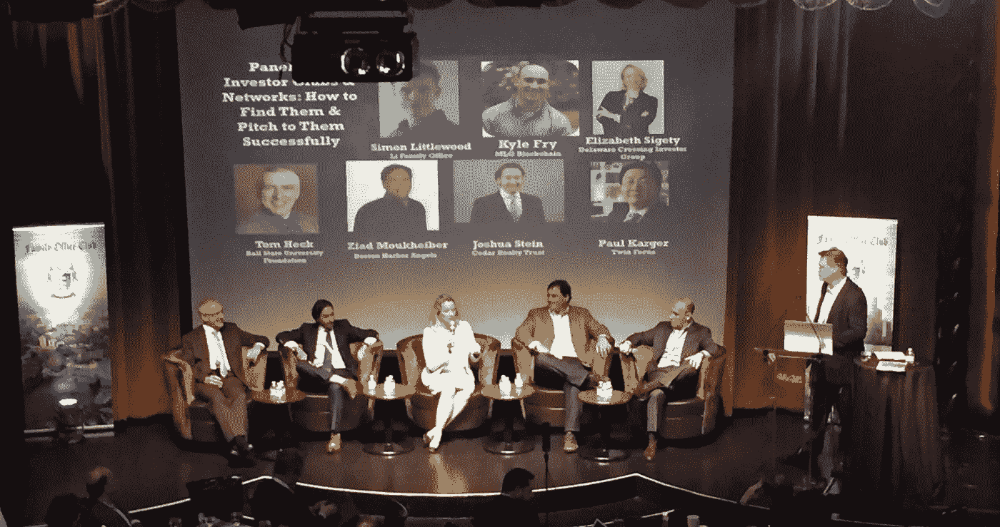
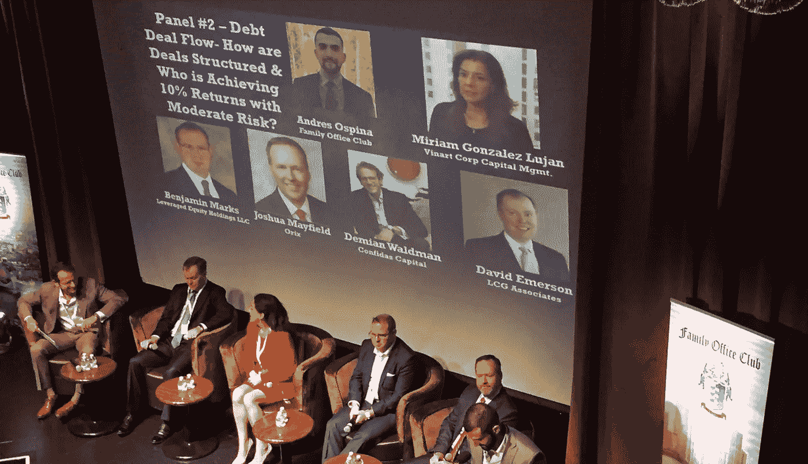
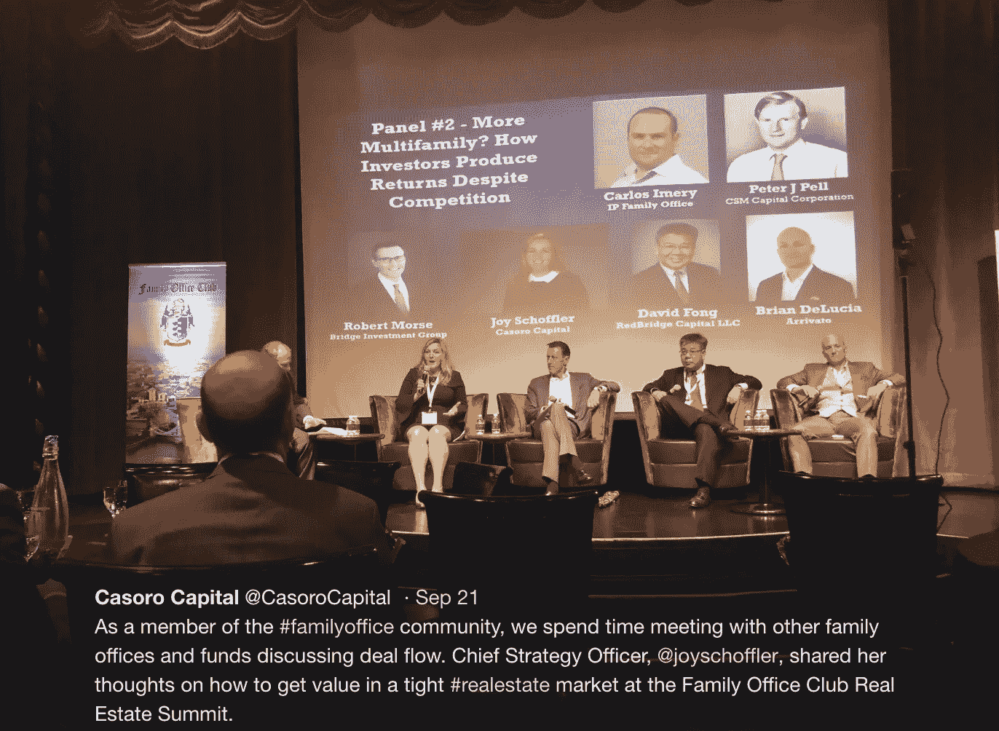

# 纽约家族理财室 Dealflow 峰会(摘要)

> 原文：<https://medium.com/coinmonks/the-family-office-dealflow-summit-summary-b0dcfc17fda2?source=collection_archive---------8----------------------->

在参加了一个由高净值个人和家族理财室参加的令人惊叹的会议后，这里有一些有趣的事情需要考虑，涉及筹资、家族理财室面临的挑战，以及如何优化资本、资源和尽职调查以简化流程。

# 家族理财室存在的问题

*   模糊的视野:流动性事件后有太多的机会和仓促的决定。记录核心价值观
*   长期的家庭纠纷

> 沃伦·巴菲特:我努力工作是为了让我的孩子能挣足够的钱去做任何事情，但不是什么都不做

# 投资者网络和俱乐部:如何找到他们？

*   建立全球网络和分享交易非常重要。经纪人交易商的能力允许有更多的能力
*   其他投资者的关系网也很有价值
*   不要把它当成一个俱乐部，做好尽职调查，致力于尽职调查如何分享。这样，你总是在为社区增加价值
*   有这么多的申请入境，所以尽职调查是需要一个筛选委员会批准一切
*   总是回到人们身边，因为这是一个小社区。
*   因为这是一个小团体，所以要诚实地工作
*   识别来源也有助于过滤交易
*   一定要和管理团队见面，不要盲目相信任何没有经过彻底审查和核实的东西

# 债务交易流程:结构的最佳实践

*   全球金融危机带来了很多机会
*   我们在基金周期中所处的位置非常重要
*   筹集足够的资金，这样在两年内或者当另一次衰退来临时，你就不必再筹集资金了
*   新兴市场提供了一个独特的套利机会，即发展中市场的利率正在上升。
*   随着拉丁美洲较小市场的利率降至 5%，这为美国提供了机会

# 异常交易案例研究:来源和交易流程系统

*   当团队强大时，在新的领域做小实验
*   一些落后的趋势会破坏现有的商业模式

> 例子:如果你有媒体经验，理解 90 年代的互联网会更容易&互联网

*   大多数国际国家处理法币的方式都很糟糕:在过去的 30 年里，有超过 100 种货币被印刷出来，其中许多已经衰落了(除了前 6 种)。
*   比特币是透明的，不依赖于政府，但在规模、应用和采用方面还有很长的路要走
*   建立长期关系，因为人们可能会通过第一次，但会回到你的生态系统中，并在以后与你做生意

> **坚持基本原则:准时出现，说请和谢谢，说你要做什么；然后做**

# 对交易的尽职调查

*   永远不要只相信管理团队在各个方面的话(市场规模、战略、竞争、技术/业务壁垒)
*   对做尽职调查的人做尽职调查
*   小心尽职调查公司让 A 团队向你推销，但之后让 B 团队做实际工作。(类似于法律事务所让律师做实际的法律工作以节省计费成本)
*   确保对管理层进行彻底的背景调查。一名小组成员表示，在交易后期，一名潜在董事虚假地列出了一个不同的身份
*   认识到花费在尽职调查上的时间的机会成本。有一个好的过滤器来区分优先顺序会有所帮助

*最后说一句关于* [*创世纪区块控股*](http://www.genbvc.com) *:*

[***创世纪区块控股***](http://www.genbvc.com) *是一家* *区块链* *风险投资公司、* *crypto* *quant 对冲基金，以及* *矿业* *公司专注于投资区块链生态系统内的项目。我们专注于将资本、网络和专业知识的力量带给前沿技术团队，以解决世界上最大的问题*

*在任何情况下，本网站上的任何材料都不应被视为出售或购买任何单个公司或投资基金的权益、代币或硬币的要约。任何此类要约或邀约将仅通过与特定基金或个人相关的保密私募发行备忘录单独进行，除其他要求外，这些基金或个人符合美国联邦或其他国际证券法规定的特定资格，并且通常在金融事务方面经验丰富，因此他们能够评估预期投资的价值和风险*

如果你觉得这是有帮助的，请为我们鼓掌，分享给你的朋友，并随时在 genbvc.com 给我们发短信。查看我们的电报频道[这里>](https://t.me/genesisblockholdings) 并关注我们的博客[这里>](/@genblockfund)

> [直接在您的收件箱中获得最佳软件交易](https://coincodecap.com/?utm_source=coinmonks)

