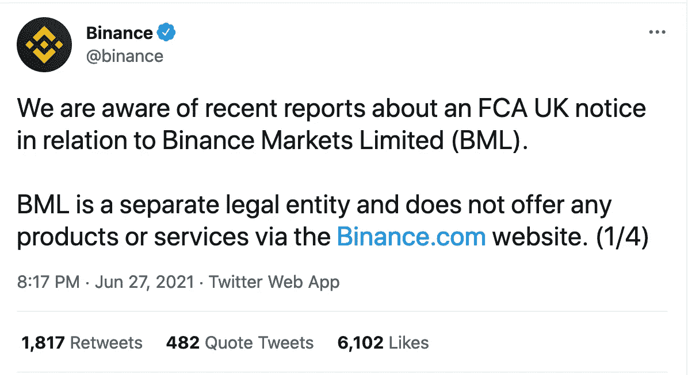
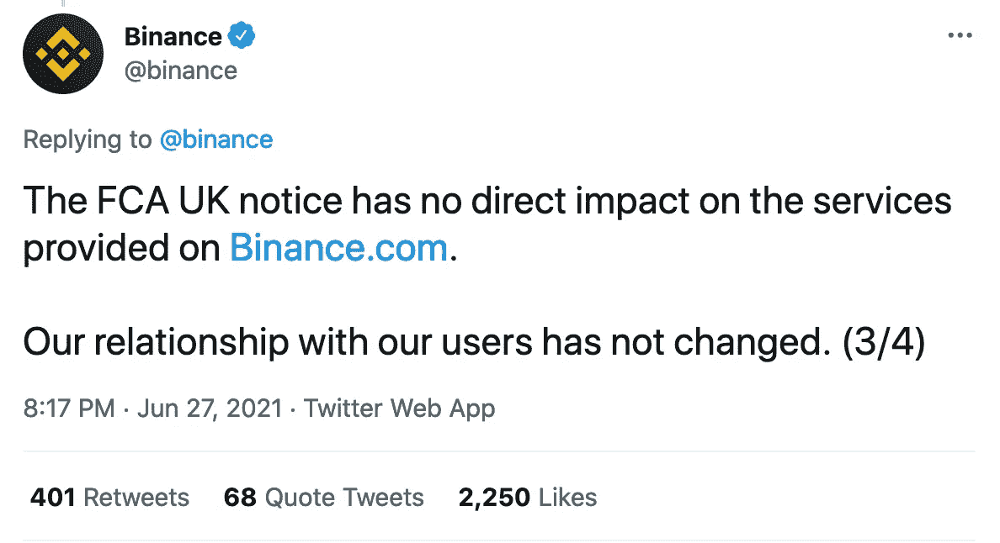
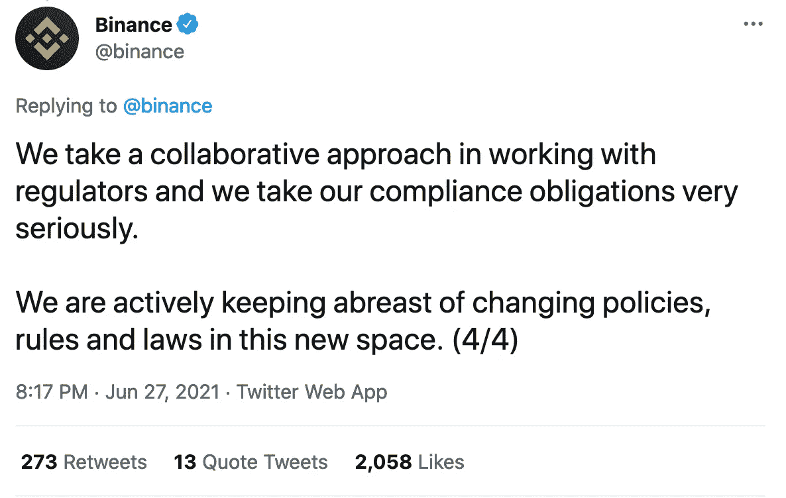
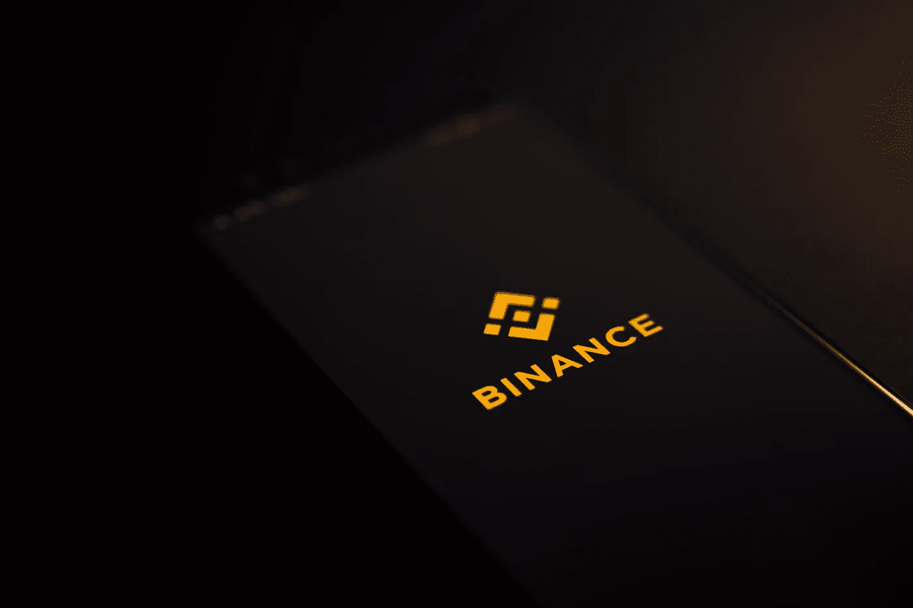

# 《公平竞争法》禁止币安

> 原文：<https://medium.com/coinmonks/the-fca-bans-binance-cf8ee29908c0?source=collection_archive---------7----------------------->

## 英国的加密资产敲响了警钟

## 币安必须停止在英国的所有“受监管活动”

# 消费者警告:FCA 禁止币安

传统机构和保守的思想家对房间里的大象，即加密货币和一般加密资产保持警惕。对于这些圈子里的一些人和那些持这种心态的人来说，加密资产、加密商品和加密金融活动代表着一个危险的深兔子洞。你还可以加上不确定性、波动性、破坏性、不受监管的服务和非法行为。

当 FCA 在 2021 年 6 月 28 日周一决定禁止最大的加密市场之一进行“受监管活动”时，这并不令人感到意外；币安不再被允许在英国从事“受管制服务”交易。至少可以说，这一举动是可以预料的。然而，这项禁令可能不会停止英国居民的所有活动，但至少象征性地传达了一个明确的信息:“你不太符合我们的标准……”

Photo by [Dmitry Demidko](https://unsplash.com/@wildbook?utm_source=unsplash&utm_medium=referral&utm_content=creditCopyText) on [Unsplash](https://unsplash.com/s/photos/cryptocurrency?utm_source=unsplash&utm_medium=referral&utm_content=creditCopyText)

# 加密与传统货币市场

当你阅读比特币白皮书时，这份文件本质上是跨学科的，结合了计算机科学、货币经济学、数学以及哲学和政治学的元素，没有明确推广或陈述什么，但它是这种硬币和支撑所有活动的底层技术的结果:区块链。整个加密“运动”为那些可能无法直接获得资本的人提供了独特的财富分配机会。

加密市场、代币、硬币、NFT 和其他数字资产提供的机会可能意味着，如果“普通”人明智地投资，对他们的活动进行适当的、受过教育的尽职调查，并在试图奔跑之前学会爬行，他们可能会有一代人一次扩大个人投资组合并创造一些财富的机会。

就风险管理和谨慎而言，应该注意的是，加密市场可能会波动，吸引那些不知道自己在做什么的人，这可能是市场倾向于以极端速度波动的最大原因。加密市场在被认为成熟之前还有很长的路要走，就像保险业中的纳斯达克、富时 100 指数或伦敦劳埃德保险公司等传统市场一样。但有一件事是肯定的:加密似乎会继续存在下去，英国《公平竞争法》当然也意识到了这一点。

Photo by [Executium](https://unsplash.com/@executium?utm_source=unsplash&utm_medium=referral&utm_content=creditCopyText) on [Unsplash](https://unsplash.com/s/photos/cryptocurrency?utm_source=unsplash&utm_medium=referral&utm_content=creditCopyText)

# FCA 和一般加密

FCA 的决定已经出台了一段时间。即使英国居民停止使用币安，比特币基地、凯西等其他平台将会取代币安，因此很难理解为什么币安被挑选出来，而完全相同的交易可以在无处不在的平台上进行。FCA 评论道:

> “由于 FCA 的强制要求，币安市场有限公司目前不允许在英国从事任何受监管的活动。”

也许币安没有满足 FCA 的要求，像其他平台或币安是第一个受到 FCA 审查的平台，但很明显，这一举动向加密和金融界发出了一个信息:FCA 有一种开展业务的方式，要么坚持，要么被破坏。币安通过推特回应如下:

币安的回应似乎相当隐晦，向公众发表讲话，承认 FCA 的行为，但并没有透露太多。最中肯的评论是:

> “我们与用户的关系没有改变…”

这种说法可能看起来是收缩性的，因为 FCA 建议在平台上禁止所有受监管的金融活动，但该平台实际上建议什么都没有真正改变；至少可以说这是令人困惑的。币安的推特上有用户提问，询问他们钱包的性质和交易状态，在撰写本文时，币安没有回应这些推文。

# 区块链的力量

谈到加密，我们不能不提到将一切联系在一起的底层框架:区块链。这种技术的本质、设计和实际应用意味着区块链可以有效地自我管理。区块链通常被描述为“分布式账本”,这意味着它存在于一个安全协议中，在记录和批准交易之前，由计算机网络共同验证交易。支撑区块链的实际技术通过促进互不相识的人合作来创造信任，而不需要通过像 FCA 这样的集中、中立的机构。

本质上，区块链是一个共享的、可编程的、密码安全的可信分类账，其中没有单个用户控制、调节、监管或指示交易如何、何时或为何发生，透明的性质使得每个参与者都可以进行检查。

Photo by [Vadim Artyukhin](https://unsplash.com/@vademann?utm_source=unsplash&utm_medium=referral&utm_content=creditCopyText) on [Unsplash](https://unsplash.com/s/photos/cryptocurrency?utm_source=unsplash&utm_medium=referral&utm_content=creditCopyText)

从上面你可以看到与中央机构如公平竞争局的直接冲突。FCA 是英国所有金融事务的监管机构，加密货币在其中运行的区块链可以自我监管，因此中央机构已经过时，这一简单事实确实给传统金融交易带来了一些问题。正是这一概念吸引了比特币和其他加密资产如此多的宣传、关注和权威机构和人士的关注，他们认为加密不能像债券、股票或养老基金一样被分类、监管或对待。

了解了这一点，我们就可以开始明白为什么 FCA 选择禁止币安参与英国境内的监管活动了。实际上，加密交易是自我监管的，在加密资产领域不存在像 FCA 这样的中央机构。平台确实包括风险缓解的咨询内容，大多数平台都警告交易时要谨慎，价格波动要剧烈。平台(包括币安)确实尝试帮助客户，并警告风险。然而，就币安而言，在公平竞争局看来，这似乎还不够。

# FCA 对加密资产有什么看法？

FCA 有义务保护消费者的利益，因此他们拥有与其金融交易相关的对称、准确、可靠和有用的信息。获取和利用此类信息可以降低风险，并大大降低被敲诈的几率。《公平竞争法》还需要确保在可能的情况下建立公平的竞争环境，避免因为竞争太少而出现垄断或寡头垄断。因此,《公平竞争法》维护某些监管标准，市场参与者必须遵守这些标准合法经营。

关于加密资产，公平竞争委员会提出了以下建议:

> “大多数宣传和销售加密资产投资的公司都没有得到《公平竞争法》的授权。这意味着，如果你投资于某些加密资产，如果出现问题，你将无法获得金融调查专员服务或金融服务补偿计划。”

当然，所有的金融交易都有风险关联，根据 FCA 的观点，加密市场有更多的相关风险。当你加上消费者无法接触监管机构的事实时，如金融调查专员服务(FOS)，一个处理客户投诉的机构或金融服务补偿计划(FSCS)，一个在公司倒闭时可以补偿你的机构，这突出了一个事实，即加密市场是传统监管机构不想要的头痛。当一枚“令人不快”的硬币可耻地攫取了现金，让投资者(有些人会说是投机者和赌徒)身无分文时，有多少投资者愿意得到补偿？如果有监管机构围绕金融活动制定更严格的规则，加密肯定会是一个完全不同的局面。

# 数字说明了什么？

总而言之，比特币就是钱。虽然比特币、其他密码和区块链代表的不仅仅是财富创造或另类思维模式，但比特币因其高昂的价格而备受关注。

比特币、以太坊、卡尔达诺莱特币和其他稳定的硬币吸引了投资者、交易者、投机者和赌徒。并非所有这些客户类型都是健康的，但你将很难找到一个完美的市场，在这个市场中，当处理金钱支持的机会时，所有参与者都不会屈服于资本主义的预感和自我的通常恶习。

某些成功的企业主，如 Ark Invest 的凯西·伍德、MicroStrategy 的迈克尔·塞勒和社交资本的查马斯·帕里哈皮蒂亚是比特币和加密技术潜在力量的三个主要支持者。为什么三个大获成功的投资者会支持比特币？因为在这种情况下，数字不会说谎。

Bullish markets: Photo by [Hans Eiskonen](https://unsplash.com/@eiskonen?utm_source=unsplash&utm_medium=referral&utm_content=creditCopyText) on [Unsplash](https://unsplash.com/s/photos/stock-market?utm_source=unsplash&utm_medium=referral&utm_content=creditCopyText)

在写这篇文章的时候，一个比特币等于 36358.50 美元。如果你把 Alphabet(谷歌)、亚马逊、特斯拉、贝莱德、微软、苹果的股价都算进去，你把一盎司黄金加起来，也不等于一个比特币。比特币的力量和潜力体现在它的价格上。如果去掉所有情感，你(认为)知道的一切，仅仅把比特币看作一种资产 1 美元等于 3.5 万美元左右；这是市场所认为的事实。

因此，FCA 不能忽视 crypto，但现在必须承认它的存在并展示“实力”。英国金融服务管理局没有忽视加密市场(批评者可能会认为它到目前为止已经做到了这一点),而是以某种方式(至少是象征性地)表明，它必须成为最大的加密市场之一，才能被视为并被视为英国客户的传统金融服务提供商。

# 这给英国消费者带来了什么？

币安是一个大的、用户友好的和受欢迎的交易所，它有低的和有竞争力的费用、过多的交易选项、教程和其他以用户为中心的功能。FCA 的决定对币安来说是一个打击，即使日常情况不会有太大变化。

英国的客户不会缺少选择，然而，比特币基地也是一个受欢迎的选择，很可能许多客户会转向这个平台，其他平台包括凯西，Jaxx 和许多其他平台。

# FCA 和币安的下一步是什么？

该禁令从整体上来说是不明确的，英国消费者并不缺乏其他选择。币安挑衅性的回应表明，他们并不太担心 FCA 的决定。从 FCA 的角度来看，看看这项禁令是许多禁令中的第一个，还是一次性的，以突出币安在他们看来做错了什么，这将是有趣的。然而，有趣的是，技术颠覆与产品和软件应用领域联系最为紧密，而与金融监管机构无关。通过成为加密资产的领先平台，币安已经引起了 FCA 的注意；接下来的几周和几个月将会非常有趣。

## 也阅读

*   [币安评论](/coinmonks/binance-review-ee10d3bf3b6e)
*   [币安 vs 北海巨妖](/coinmonks/binance-vs-kraken-47828c2d1538)
*   [币安费用](/coinmonks/binance-fees-8588ec17965)
*   [币安交易机器人](/coinmonks/binance-trading-bots-d0d57bb62c4c)
*   [币安融资融券交易](/coinmonks/binance-margin-trading-c9eb5e9d2116)
*   [币安 vs 比特币基地](/coinmonks/binance-vs-coinbase-42343437625a)