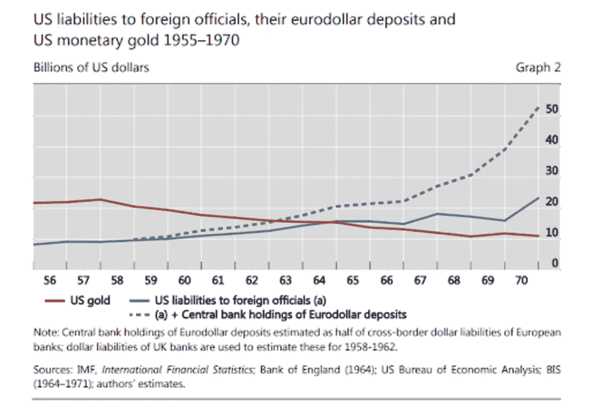
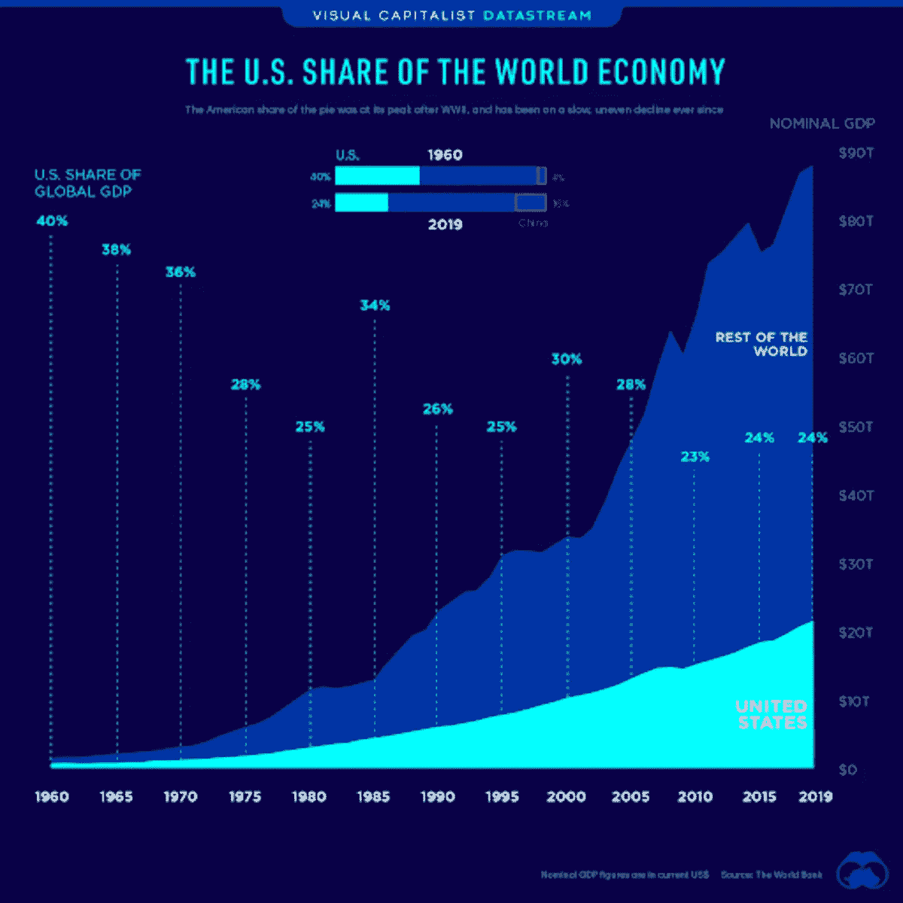

# 法定美元系统不是特权:负担和为什么美国将采用比特币

> 原文：<https://medium.com/coinmonks/the-fiat-dollar-system-is-no-privilege-the-burden-and-why-the-u-s-will-adopt-bitcoin-e0da42fd738e?source=collection_archive---------5----------------------->

在比特币社区，我们经常听到美元被称为“[过度特权](https://en.wikipedia.org/wiki/Exorbitant_privilege)”也就是说，美国从美元的储备货币地位中获得了不成比例的好处。这篇文章将详细说明为什么当前的金融体系实际上是美国的负担，为什么法定美元体系正在终结，以及这对比特币的未来意味着什么。

# 背景

首先，什么是全球储备货币？简而言之，它是政府和大型国际实体(如央行)持有的货币，用于促进全球贸易、信贷、会计，通常还用于支持本国货币。美元今天保持这一地位。

1944 年的布雷顿森林协定正式确立了美元的储备货币地位。由于美国是第二次世界大战后唯一幸存的主要经济体，因此很自然地，人们会同意以美元作为新体系的锚。根据布雷顿森林体系，主要货币与美元挂钩，而美元又与每盎司黄金 35 美元挂钩。

这个系统最初很好地服务于世界，使二战后的快速重建成为可能，特别是在欧洲、日本和几个新兴市场。这也是反对共产主义斗争的一个组成部分。只要各国愿意站在反对苏联的一边，就欢迎它们加入这个国际金融和贸易体系。然而，布雷顿森林体系的设计很快就遇到了限制。尽管全球对货币的需求呈指数增长，但黄金的支持抑制了美元的供应。进入特里芬困境。

# 特里芬难题

罗伯特·特里芬于 1959 年首次阐明了特里芬难题。主要观点是，当一种货币被用作国际储备时，国内约束与国际需求相冲突。对美元的高需求和黄金供应的限制刺激了美国的巨额贸易逆差和货币贬值。如果这就是结局，那就很简单了，但新的激励也会引发市场反应。

不管许多比特币专家和宏观经济专家怎么想，1971 年并不是特别关键的一年。那一年发生的著名事件，即尼克松冲击，是一种自然的发展，是对多年前建立的金融体系现实的认识。当特里芬难题在 20 世纪 60 年代得到普遍认可时，它已经被解决了。市场总会有办法的。

不需要美联储或美国政府通过印刷和向世界出口美元来满足国际需求，世界各地的银行都可以通过发放美元计价的贷款来满足自己的需求。在贷款过程中，所有基于信用的纸币都是这样印刷的。在 1971 年之前，欧洲美元体系形成了一个全球银行体系，非正式地取代了布雷顿森林体系。

> 订阅 [**Coinmonks Youtube 频道**](https://www.youtube.com/c/coinmonks/videos) 获取每日加密新闻。

# 欧洲美元体系

欧洲美元是当前的金融体系，由离岸美元和美元债务组成，不受美联储或美国政府政策的约束。**富有进取心的银行家通过在美国境外印刷美元解决了特里芬的困境**

*Source:* [*BIS Working Papers No 684*](https://www.bis.org/publ/work684.pdf)*, “Triffin: dilemma or myth?” Bardo and McCauley, 2017*

这些离岸(或影子)美元与实际美元一对一交易，因为，嗯，它们*是*美元。基于信用的法定货币的一个怪癖是，它被印在以这种货币命名的贷款中。商品支持的货币要么是完全支持的，要么不是。在某个地方的金库里有一个衡量商品价值的指标，有一个客观的货币与支持物的比率来显示贬值。但是基于信用的法定货币无法区分美国银行和新加坡银行创造的美元。

欧洲美元体系起源于 20 世纪 50 年代末，随着贸易赤字无法满足的对美元的贪得无厌的需求而增长。到 1970 年，各国央行持有的离岸欧洲美元供应量大于官方海外美元供应量(见上图)。

这个新兴的金融体系在早期被完全忽略了，因为它不符合经济学家的模型。欧洲美元体系多年来一直没有得到研究，只有少数勇敢的经济学家冒着职业风险去研究那些不符合主流模型的东西。到 2020 年，国际清算银行(BIS) [估计](https://www.bis.org/statistics/gli2101.htm)将有 12.7 万亿美元可衡量的美元计价债务源自美国境外并由美国境外持有。然而，这只是一小部分，因为它没有考虑衍生品、监管链、货币互换或其他影子产品，因此实际总额要高出许多倍。这就是为什么它被称为“影子银行”，我们不知道他们资产负债表的真实程度。

只要贷款能够得到偿还，这个体系就会继续运转。这意味着这些贷款必须是生产性的，并产生大于贷款本金和利息的现金流。由于这种以信用为基础的欧洲美元体系中的资金是不断循环的债务，信任和信用评级网络中最小的中断都可能导致金融危机。

# 欧洲美元和自由贸易补贴

如果说欧元的弹性是美元的右手，那么对世界大部分市场的开放就是美元的左手。国家不受地区战争的影响，他们的商品可以进入几乎所有的市场，这是一种历史反常现象。在 19 世纪中叶之前，我们今天所知的一体化市场并不存在，直到第二次世界大战，国际贸易都集中在殖民领地网络内的少数商品和贸易伙伴之间。二战后的时代引入了联合国、世贸组织和北约等国际机构，由美国**买单。美国以安全和贸易保护伞的形式提供补贴，使全球经济实现了前所未有的增长。**

许多人误解了这种动态。他们认为美国几十年来在朝鲜和越南、中美洲、伊拉克、利比亚和阿富汗的参与是美帝国主义，而不是主要让安全保护伞下的其他国家受益。美国军方正在扩大对这些特定作战区域的影响和控制，不是为了建立一个美国帝国，而是为了维护一个有利于其他国家的国际体系。美国治下的和平是为了避免类似 1914 年萨拉热窝或 1939 年波兰的事件。

这并不能为美国的暴行和不道德行为开脱，但重要的是要认识到美国不是主要的受益者。20 世纪全球战争对谁的伤害最大？不是美国事实上，二战以来的时期，也就是所谓的美国帝国时代，以美国经济空心化和美国巨额贸易逆差为标志，而世界其他地区则使用欧洲美元繁荣发展。

# 储备货币是一种负担

美国是一个相对较新的创造。直到 1848 年的美墨战争后，它才到达大陆边界。接下来是 20 年的内部政治重组和洲际基础设施建设，最终在 1869 年洲际铁路完工。从那时起，美国又用了 20 年时间成为世界上最大的经济体，远早于 20 世纪的两次世界大战。

事实上，到 1914 年，美国 GDP 是第二大经济体的两倍，约占全球 GDP 的 20%。我给出这些数字是为了表明美国在美联储和拥有全球储备货币之前的地位。它已经占据主导地位，并在扩大领先优势。

这种优势的原因并不在于美元作为储备货币。当来自世界各地的领导人在布雷顿森林开会时，美国占了全球 GDP 的 50%,整个世界经济的一半，可能还占了世界资本积累的更大比例。布雷顿森林体系并没有扩大美国的份额，而是导致其份额下降。

一个常见的反驳是，“二战摧毁了欧洲经济的大部分，所以这就是为什么美国在当时如此占主导地位。”这是事实，但这是地缘政治现实的一部分。欧洲容易发生战争，创造和积累长期资本比美国更困难。

到 1960 年，在欧洲美元的早期，美元的储备货币地位已经不成比例地惠及世界其他地区。美国占 GDP 的比重从 50%下降到 40%。到 1980 年，也就是布雷顿森林体系成立 35 年后，美元作为储备货币已经将美国占全球 GDP 的份额削减了一半，降至 25%。从此一蹶不振。

# 地理经济学

美国的相对财富和实力有两个主要原因，它们是地理和政治原因，而不是美元原因。从地理上看，美国拥有丰富的自然资源，在两个重要的海洋上有世界上最好的天然港口，最大的毗连和最高质量的农田，比世界上其他地方总和还要多的可通航河流，以及防守成本极低的边界。只有地球上最糟糕的政府才能搞糟这一切。但在政治上，美国没有共产主义，而是拥有世界上最强大的宪法传统，一部权利法案以及一定程度的州和个人自治，在很大程度上限制了政府的越权和滥用。

当不偏不倚地看待美国相对于世界其他国家的地理和政治背景时，它成为主导经济体就不足为奇了。命中注定如此。

相比之下，世界上有许多国家和地区直到最近 50 年仍未开发，尽管它们拥有比美国更长的文明史和更长的全球贸易史。欧洲美元的扩张使这些以前不经济的世界角落突然变得经济起来。新技术肯定发挥了作用，但游戏规则的改变者是人为的廉价信贷、自由贸易秩序(在这种秩序下，他们可以安全、公平地出售自己的出口商品)以及不受邻国威胁的自由。

美元的全球储备地位是上述全球化秩序的重要组成部分。有人说，美国军队是美元的终极后盾，这话有一定道理。美元和军队在维护全球和平和贸易方面是协同作用的。在过去的几十年里，选择美元与摆脱美国压迫的帝国主义枷锁毫无关系。另一种选择是存在于全球化保护伞之外，这意味着更低的经济增长、更多的地区战争和邻国的压迫。如果取消美国对全球化和欧元的补贴，许多地区将再次变得不经济，地区冲突的成本将直接由各国自己承担。

# 债务的边际收益产品

在经济学中，有边际收益递减的概念。应用到信贷上，我们通常把这看作是“债务的边际收益产品”，换句话说，我们从每一美元的新债务中获得了多少增长？早期债务具有很高的生产率，用于为最划算的项目融资，而后期债务则相对低效。

对于一个在其整个历史上从未获得过廉价信贷和安全的第三世界国家来说，加入全球化经济意味着有许多唾手可得的果实，如公路、铁路、电力和通信等基础设施，这些基础设施产生了巨大的初始生产率增长。发达经济体有类似的路线，但所有国家现在都在耗尽新债务的生产性用途。

随着国家债务饱和，增长放缓甚至逆转。量化宽松等金融工具已经尝试过，但未能重振之前的增长率。你不能通过增加更多债务来拯救一个债务缠身的系统。全球信贷狂潮即将结束。最著名的例子是日本，但这种模式可以从不断放缓的欧洲增长率和最近的中国看到。中国是最后一个撞上增长墙的大型经济体。

**欧洲美元体系的终结不是一个自愿的过程。它无法再增加生产性债务，支撑自身的重量。**不仅新债务中的每一美元只能创造 0.25 美元左右的经济增长，而且每个人都知道这一点。这种认识造成了一种犹豫不决的气氛，抑制了信贷增长，并危及经济偿还本金和利息的能力。即使实行零利率政策，该体系也极其脆弱。

# 向内转和通往比特币的道路

说全球化不是一种自然状态几乎是异端邪说。毕竟，不言而喻的是，自由市场会促进贸易和劳动分工。这是事实，但现代全球化是世界历史上最大补贴的结果，并将制造业和金融流程的相互联系提高到了荒谬的水平。随着供应链在 2020 年直接失灵，问题持续到 2021 年，这一点变得越来越明显。像所有受补贴的活动一样，这是一种低效的资本利用，会导致投资不当和资源配置不当。

没有了全球储备货币和保护全球化的负担，美国将能够把更多的财富留在国内，投入时间和精力恢复国内秩序。脱离全球化将会产生深远的影响，在边缘经济体和容易发生战争的地区感受最深。美国两者都不是。

全球化结束的迹象就在我们身边。民粹主义的兴起、贸易战以及美国退出长达一代人的军事努力，都表明了这一国际政治秩序的崩溃。

阿富汗的撤军只是美国领导的秩序正在终结的最明显迹象。不管它以各种可以想象的方式被修补，这只是让它变得更加强大，就像全球化棺材上的一颗钉子。是的，结果是对美国声誉的打击，但这无关紧要。从阿富汗撤军改善了美国的财政状况，尤其是相对于那些与阿富汗接壤的国家而言，这些国家现在不得不应对边境上装备精良的塔利班。

回到美国在这场全球化的大实验之前所享有的地位对美国来说是一个巨大的积极因素。它是自给自足的，或者可以自给自足，并且是安全的。如果你把北美其他地区也算进去，作为一个经济集团，它可以轻松实现全球 40%的产出和消费，而无需卷入欧亚大陆的混乱政治。

**随着美国放弃美国主导的全球化，它也将放弃全球储备货币的不必要负担。**为什么美国要保留一个饱受债务陷阱困扰的欧洲美元体系，将对美国经济的控制权拱手让给国际金融市场？欧元已经走到了它的自然终点，必须被取代，这是一个国家安全问题。

随着欧洲美元的终结对每个人来说都变得越来越清晰，政治家和银行家们将不会那么积极地捍卫储备货币的地位。这样做不符合他们的最佳利益，没什么可挽回的。目前的美元体系是一个巨大的负担，美国将自愿放弃新版本的美元。

在美国历史上，改变美元的设计也并不罕见。平均来说，每隔几十年就会发生一次。1834 年的铸币法、1853 年的银币变化、1863 年的国家银行法、1873 年的犯罪、1878 年的布兰德-艾利森法、1913 年的美联储法、1933 年的黄金没收、1944 年的布雷顿森林体系和 1971 年的尼克森冲击。美元早就应该再次调整了。或许最重要的是，美国有摆脱中央银行的历史。

# 比特币支持将如何实现

如何实现向比特币支持的转移？那就是百万比特币问题。在过去的几年里，随着比特币最终被采用的可能性越来越大，我对此进行了一些思考。当然，预测确切的过程是高度投机性的，比特币也将被单独使用或在闪电网络中使用，但这是我目前的预测:

在这一点上，美国政府不太可能直接持有比特币。更自然的路线是通过银行，我们已经看到了这个方向的第一步。2021 年 7 月 29 日，美国历史第二悠久的银行道富银行成为最新一家向客户提供比特币相关服务的主要银行。其他公司包括 BNY 梅隆、摩根大通、花旗集团和高盛，它们现在都在向客户提供比特币相关服务。

随着银行持有更多比特币，比特币价格继续大幅上涨——部分是由于银行持有更多比特币——比特币将成为他们资产负债表的一大部分。这将要么迫使美国政府购买比特币，要么简单地对其进行监管，并遵从持有比特币的银行。

随着银行持有大量比特币，美国将不得不使比特币成为法定货币，并支持形成某种以银行为中心的第二层，如联邦侧链。这个侧链可能类似于 Blockstream 的液体。

在这个侧链中，美元可能是 100 个 satoshis 的面额。这将使银行能够根据联邦政策在最低程度上提供信贷，同时实现最大程度的透明度，从而解决对比特币固定供应的普遍批评。(不为定供求解，那不需要求解。但是允许某种形式的弹性。)

这一过程将导致美联储的大幅削弱，并回到美国一个多少被遗忘的时代，在那个时代，银行而非央行占据主导地位。随着美国重新发现其民粹主义和不干涉主义的过去，它也将根据过去重新定义其货币体系，这一次是围绕比特币。

这是安塞尔·林德纳的客座博文。所表达的观点完全是他们自己的，不一定反映 BTC 公司或比特币杂志*的观点。*

*原载于 2021 年 9 月 1 日 https://bitcoinmagazine.com***。**

> *加入 Coinmonks [电报频道](https://t.me/coincodecap)和 [Youtube 频道](https://www.youtube.com/c/coinmonks/videos)了解加密交易和投资*

## *另外，阅读*

*   *[币安 vs FTX](https://blog.coincodecap.com/binance-vs-ftx) | [最佳(SOL)索拉纳钱包](https://blog.coincodecap.com/solana-wallets)*
*   *如何在 Uniswap 上交换加密？*
*   *[加密货币储蓄账户](/coinmonks/cryptocurrency-savings-accounts-be3bc0feffbf) | [YoBit 评论](/coinmonks/yobit-review-175464162c62)*
*   *[Botsfolio vs nap bots vs Mudrex](/coinmonks/botsfolio-vs-napbots-vs-mudrex-c81344970c02)|[gate . io 交流回顾](/coinmonks/gate-io-exchange-review-61bf87b7078f)*
*   *[CoinFLEX 评论](https://blog.coincodecap.com/coinflex-review) | [AEX 交易所评论](https://blog.coincodecap.com/aex-exchange-review) | [UPbit 评论](https://blog.coincodecap.com/upbit-review)*
*   *[AscendEx 保证金交易](https://blog.coincodecap.com/ascendex-margin-trading) | [Bitfinex 赌注](https://blog.coincodecap.com/bitfinex-staking) | [bitFlyer 审核](https://blog.coincodecap.com/bitflyer-review)*
*   *[Bitget 评论](https://blog.coincodecap.com/bitget-review) | [双子星 vs BlockFi](https://blog.coincodecap.com/gemini-vs-blockfi) | [OKEx 期货交易](https://blog.coincodecap.com/okex-futures-trading)*
*   *[AscendEx Staking](https://blog.coincodecap.com/ascendex-staking)|[Bot Ocean Review](https://blog.coincodecap.com/bot-ocean-review)|[最佳比特币钱包](https://blog.coincodecap.com/bitcoin-wallets-india)*
*   *[霍比审核](https://blog.coincodecap.com/huobi-review) | [OKEx 保证金交易](https://blog.coincodecap.com/okex-margin-trading) | [期货交易](https://blog.coincodecap.com/futures-trading)*
*   *[麻雀交换评论](https://blog.coincodecap.com/sparrow-exchange-review) | [纳什交换评论](https://blog.coincodecap.com/nash-exchange-review)*
*   *[美国最佳加密交易机器人](https://blog.coincodecap.com/crypto-trading-bots-in-the-us) | [经常性回顾](https://blog.coincodecap.com/changelly-review)*
*   *[在印度利用加密套利赚取被动收入](https://blog.coincodecap.com/crypto-arbitrage-in-india)*
*   *[Godex.io 审核](/coinmonks/godex-io-review-7366086519fb) | [邀请审核](/coinmonks/invity-review-70f3030c0502) | [BitForex 审核](https://blog.coincodecap.com/bitforex-review)*
*   *[最佳比特币保证金交易](/coinmonks/bitcoin-margin-trading-exchange-bcbfcbf7b8e3) | [萝莉点评](/coinmonks/lolli-review-e6ddc7895ad8) | [比特币保证金交易](https://blog.coincodecap.com/bityard-margin-trading)*
*   *[创造并出售你的第一个 NFT](https://blog.coincodecap.com/create-nft) | [密码交易机器人](https://blog.coincodecap.com/best-crypto-trading-bots)*
*   *[折叠 App 回顾](https://blog.coincodecap.com/fold-app-review) | [LocalBitcoins 回顾](/coinmonks/localbitcoins-review-6cc001c6ed56) | [Bybit vs 币安](https://blog.coincodecap.com/bybit-binance-moonxbt)*
*   *[加密保证金交易交易所](/coinmonks/crypto-margin-trading-exchanges-428b1f7ad108) | [赚取比特币](/coinmonks/earn-bitcoin-6e8bd3c592d9) | [Mudrex 投资](https://blog.coincodecap.com/mudrex-invest-review-the-best-way-to-invest-in-crypto)*
*   *[WazirX vs coin dcx vs bit bns](/coinmonks/wazirx-vs-coindcx-vs-bitbns-149f4f19a2f1)|[block fi vs coin loan vs Nexo](/coinmonks/blockfi-vs-coinloan-vs-nexo-cb624635230d)*
*   *[杠杆代币](/coinmonks/leveraged-token-3f5257808b22) | [最佳密码交易所](/coinmonks/crypto-exchange-dd2f9d6f3769) | [Paxful 点评](/coinmonks/paxful-review-4daf2354ab70)*
*   *[加密套利](/coinmonks/crypto-arbitrage-guide-how-to-make-money-as-a-beginner-62bfe5c868f6)指南| [如何做空比特币](/coinmonks/how-to-short-bitcoin-568a2d0b4ae5) | [1xBit 回顾](https://blog.coincodecap.com/1xbit-review)*
*   *[如何在印度购买以太坊？](https://blog.coincodecap.com/buy-ethereum-in-india) | [如何在币安购买比特币](https://blog.coincodecap.com/buy-bitcoin-binance)*
*   *[在美国如何使用 BitMEX？](https://blog.coincodecap.com/use-bitmex-in-usa) | [BitMEX 回顾](https://blog.coincodecap.com/bitmex-review) | [买入索拉纳](https://blog.coincodecap.com/buy-solana)*
*   *[德国最佳加密交易所](https://blog.coincodecap.com/crypto-exchanges-in-germany) | [Arbitrum:第二层解决方案](https://blog.coincodecap.com/arbitrum)*
*   *[支持卡审核](https://blog.coincodecap.com/uphold-card-review) | [信任钱包 vs 元掩码](https://blog.coincodecap.com/trust-wallet-vs-metamask)*
*   *[Exness 评论](https://blog.coincodecap.com/exness-review)|[moon xbt Vs bit get Vs Bingbon](https://blog.coincodecap.com/bingbon-vs-bitget-vs-moonxbt)*
*   *[如何开始通过加密贷款赚取被动收入](https://blog.coincodecap.com/passive-income-crypto-lending)*
*   *[Coldcard 评论](https://blog.coincodecap.com/coldcard-review) | [BOXtradEX 评论](https://blog.coincodecap.com/boxtradex-review)|[uni swap 指南](https://blog.coincodecap.com/uniswap)*
*   *[阿联酋 5 大最佳加密交易所](https://blog.coincodecap.com/best-crypto-exchanges-in-uae) | [SimpleSwap 评论](https://blog.coincodecap.com/simpleswap-review)*
*   *[购买 Dogecoin 的 7 种最佳方式](https://blog.coincodecap.com/ways-to-buy-dogecoin) | [ZebPay 评论](https://blog.coincodecap.com/zebpay-review)*
*   *[最佳期货交易信号](https://blog.coincodecap.com/futures-trading-signals) | [流动性交易所评论](https://blog.coincodecap.com/liquid-exchange-review)*
*   *[最佳加密交易信号电报](/coinmonks/best-crypto-signals-telegram-5785cdbc4b2b) | [MoonXBT 评论](/coinmonks/moonxbt-review-6e4ab26d037)*
*   *[OKEx 评论](/coinmonks/okex-review-6b369304110f) | [Coinswitch 俱吠罗评论](/coinmonks/coinswitch-kuber-review-1a8dc5c7a739) | [比特币基地收费](/coinmonks/coinbase-fees-831e77d4f2c5)*
*   *[AscendEX 审查](/coinmonks/ascendex-review-53e829cf75fa) | [OKEx 交易机器人](/coinmonks/okex-trading-bots-234920f61e60) | [OKEx 交易机器人](/coinmonks/okex-trading-bots-234920f61e60)*
*   *[火币交易机器人](https://blog.coincodecap.com/huobi-trading-bot) | [如何购买 ADA](https://blog.coincodecap.com/buy-ada-cardano) | [Geco。一次审查](https://blog.coincodecap.com/geco-one-review)*
*   *[币安 vs Bitstamp](https://blog.coincodecap.com/binance-vs-bitstamp) | [Bitpanda vs 比特币基地 vs Coinsbit](https://blog.coincodecap.com/bitpanda-coinbase-coinsbit)*
*   *[如何购买瑞波(XRP)](https://blog.coincodecap.com/buy-ripple-india) | [非洲最好的加密交易所](https://blog.coincodecap.com/crypto-exchange-africa)*
*   *[非洲最佳加密交易所](https://blog.coincodecap.com/crypto-exchange-africa) | [Hoo 交易所评论](https://blog.coincodecap.com/hoo-exchange-review)*
*   *[eToro vs robin hood](https://blog.coincodecap.com/etoro-robinhood)|[MoonXBT vs by bit vs Bityard](https://blog.coincodecap.com/bybit-bityard-moonxbt)*
*   *[风暴增益评论](https://blog.coincodecap.com/stormgain-review) | [普罗比特评论](https://blog.coincodecap.com/probit-review) | [北海巨妖评论](/coinmonks/kraken-review-6165fc1056ac)*
*   *[如何在势不可挡的域名上购买域名？](https://blog.coincodecap.com/buy-domain-on-unstoppable-domains)*