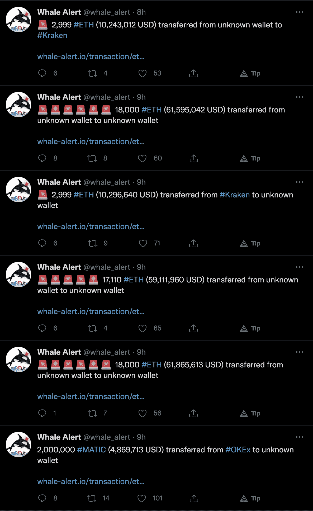
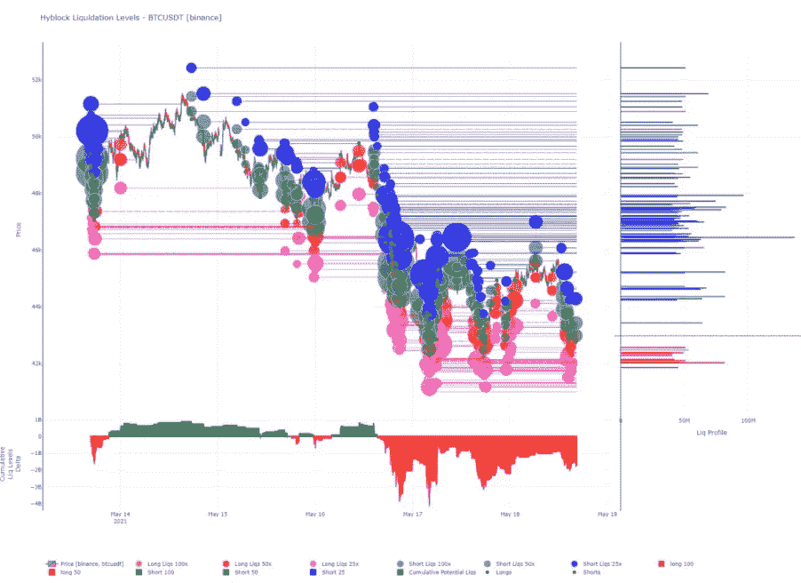

# 加密的最终冲洗

> 原文：<https://medium.com/coinmonks/the-final-flush-for-crypto-e107602337d8?source=collection_archive---------1----------------------->

crypto 中的数据透明性非常棒。

意思是你可以拉任何你想要的东西。找出你在找的东西。没必要去猜测窗帘后面藏着什么。一切都公开了。

对于数据科学家和数据爱好者来说，这是加密成为热门的一天。

您可以随心所欲地查询和操作数据。

数据如此之多，简直会让你头晕目眩。这也是这个领域存在如此多服务和提供商的部分原因。

每个人都试图理解无穷无尽的数据。

事实上，看待同一件事情有太多的方式，服务甚至是建立在彼此之上的。对每个人来说都绰绰有余。

这让我想起了一些定义，有些应用程序依赖于其他应用程序，而其他应用程序又依赖于另一组应用程序。存在的应用程序和服务越多，最终用户获得的结果就越好。

同样的概念也适用于交易者。

以鲸鱼警报的这一系列推文为例。

这些是连锁的大规模运动。一个接一个的发生。

p

每当你被问及加密是否只是一派胡言时，就把它发给那些散布仇恨的人吧。问他们你最后一次看到西联汇款这么快是什么时候？

这也是一个很好的方式来查看什么链是活跃的，哪个链被用来发送或接收加密，甚至当波动性增加时什么交易所被点亮。

对我来说，我喜欢做这个的人。太牛逼了。非常感谢他。

但是对于任何利用它进行可操作交易的人来说…

你在大海捞针。考虑这是你的块浏览器的用户友好版本。它将这些交易集中在一个地方。就像一个聚合器。

现在，为了使它可行，你需要创造对它的洞察力。从信号中分离出噪声。创造事物的智慧一面。

这就是我们的切入点。

我们的团队希望将这些数据转化为一致的 alpha 值。也就是说，如果一个信号出现 10 次，我们希望这个信号在一定比例的时间里会根据特定的风险管理策略产生回报。

如果该信号低于我们的阈值，它就不再具有可操作性，而成为噪声。

对我们来说，crypto 中有各种各样的实体，我们认为它们是市场推动者。这些是为价格创造动力的因素。当他们开始行动时，市场会朝着他们的方向变化。

对我们的团队来说，这就是我们如何产生一致的阿尔法。

把它归咎于埃隆，称它为黑天鹅，称它为试图在芝加哥商业交易所进行套利交易的机构，都没关系。在一天结束时，需要移动资金来进行交易。

链上是你的镜头，看到钱在哪里，什么时候流动。

我的 TED 演讲到此结束。

Espresso 的每日节拍正在利用链上数据为密码交易员提供见解。这样做有助于你更好地了解当前的市场结构。

上面的咆哮简单地提醒了我们为什么要看我们所做的数据。

在一天结束的时候，我们需要月复一月地产生一致的 alpha 否则我们将不复存在。

我们发现最好的方法是依靠工具箱。就像大多数手巧的人一样，他们有一些比其他人用得更多的工具。

我们喜欢用交换流量来解读市场结构。一旦我们开始看到交换流从正的“翻转”到负的，或者反之亦然，那么结构就被认为是在变化。

现在，我们刚刚目睹了一点负面流动的迹象。

这意味着进入的比特币数量少于流出的数量，表明抛售压力小于前一天。

这是我们要注意的第一个小脉搏。

此外，大约 4.2 万美元的流动性正在增加。这是一张流动性图。它有助于想象在不同层面上可能被抹去的资本数量。泡沫越大，资本越多。泡沫越多，资本越多。

图表中有趣的洞见可以在隐藏的价格线下面的泡泡中看到…粉红色的泡泡。它们代表 25 倍杠杆多头。

红色是 50x 长，几乎不存在。而黄橙色是 100 倍长，实际上是不存在的。

相比之下，价格线上方的泡沫不仅显示了大量 25 倍的空头，还显示了 50 倍甚至 100 倍的空头。

这告诉我，我们正接近投降式下跌。或者交易者进入多头头寸。

投降是试图做多的交易者开始认输的时候。

根据价格下跌的幅度和持续的时间，另一轮下跌可能会导致价格下跌。

如果我们得到一个同花顺，并看到 netflows 明天打印另一个负面读数，这将是我们看到的第一个积极的事态发展以外，更多的 USDT 被打印。

敬请关注。这里没有必要急着做任何事情…除非你喜欢穿着松鼠服从山上飞下来。

你的脉搏在加密，

本·莉莉

附注——这最初发表于 5 月 18 日我们的子堆栈中。你可以[在这里](https://jarvislabs.substack.com/p/the-final-flush)找到原文。一定要订阅保持在循环中。