# 金融转变

> 原文：<https://medium.com/coinmonks/the-financial-shift-4aa816b278b1?source=collection_archive---------4----------------------->

对我们所有人来说越来越清楚的是，COVID 之前的世界再也不会回来了。世界正在经历巨大的变化，许多人现在应该已经意识到，我们正在走向的新常态将与我们留下的世界大不相同。

然而，当你审视历史和自然周期时，不安的感觉开始变得更有意义。这是因为我们正在经历金融周期中的一个重要时期。我们不能只着眼于未来而盲目地经历这个循环，我们还必须从过去吸取教训，不要犯类似的错误，并利用这些教训为我们所用。因为毕竟；那些不记得过去的人注定要重蹈覆辙。

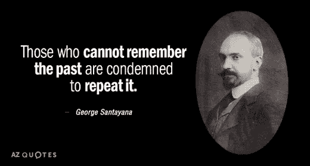

在这篇文章中，我将深入探讨为什么我认为我们目前正接近长期金融周期的终点，以及未来会是什么样子。我们当前的金融体系碰巧在循环运行，有点像潮起潮落或者用金融术语来说就是牛市和熊市。了解这些动向是你在个人资产和财务方面正确定位的关键，也是你更好地理解政府和中央银行宏观经济政策的关键。

当我们缩小时，我们可以看到财富的中心从一个国家转移到另一个国家。目前，控制全球储备货币的全球超级大国是美国。正如我们从历史上看到的，这种状态通常每 100 年改变一次。美元现在已经保持这一地位 100 多年了，但是如果你看看历史的周期性，很明显这种现状可能会比我们想象的更快改变。

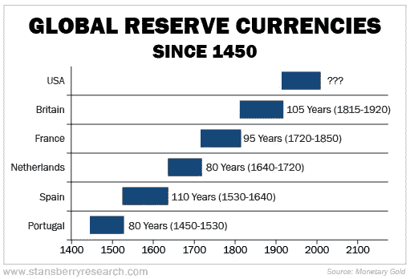

拥有世界储备货币为发行国提供了一定的好处。这被戴高乐在 1965 年描述为“过分的特权”。下面我将解释戴高乐为什么做出这一评论，以及自 20 世纪初大英帝国经济衰落以来，特别是第一次世界大战后，货币体系是如何发展的。美国在二战后的表现比饱受战争蹂躏的欧洲国家要好。他们拥有最多的黄金储备，美元超越英镑成为世界上最有影响力的国家货币。

## **从金本位到石油美元**

二战期间，各国政府仍然使用黄金作为基本的全球储备货币。然而，在经历了两次世界大战之间的混乱之后，美国和英国想要一个更加灵活和稳定的体系。因为这个愿望，超过 44 个国家聚集在新罕布什尔州的布雷顿森林，创建一个新的全球标准。在这次谈判中，美国占据了最有影响力的位置，因为国际贸易逆差仍然以黄金结算。美国保持着良好的国际收支状况，并在很大程度上控制着全球的黄金供应，这为他们实现自己的目标提供了杠杆。

世界逐渐转向布雷顿森林标准，各种国家货币与可调整的美元数额挂钩。它将美元与黄金固定在每盎司 35 美元的现有平价上，美国被委托保管黄金以保持整个体系的稳定。所有其他国家的货币对美元都有固定但可调整的汇率。资本管制也被允许，以使政府能够刺激经济而不受市场惩罚。在此期间，世界经济快速增长，凯恩斯经济学允许政府抑制经济波动和衰退。[【1】](https://www.gold.org/about-gold/history-of-gold/bretton-woods-system)

该系统运行良好。在承诺用黄金支付的支持下，美元成为国际结算的主要交易媒介。美国成为最大的债权国，因为它必须向全世界提供美元。然而，在 20 世纪 60 年代，这个体系开始出现裂缝。前总统肯尼迪遇刺后，美国选择增加庞大的“伟大社会”社会项目和军事入侵越南的开支。鉴于越南战争完全是用债务支付的，美国债务飙升。

美国实质上是在利用其特权地位，利用其储备货币向美国的外国债权人征收铸币税。他们印刷美元并使他们的货币贬值，同时在这个过程中慢慢侵蚀外国美元持有者的购买力。60 年代，法国经济学家雅克·勒夫称之为“西方的货币罪恶”。很明显，美国债务是一个大问题，法国不相信与黄金挂钩的持续性。最终，他们派遣了一艘战舰到纽约市收集国家的黄金。

英国一直在准备一个类似的计划，直到理查德·尼克松(Richard Nixon)在 1971 年 8 月 15 日发表了一次历史性的演讲，他在演讲中表示，美国将暂时停止用美元兑换黄金，同时实施工资和价格冻结，以拯救经济。美元贬值 10%以上，世界进入重大金融危机。最重要的是，尼克松明确表示，他一点也不关心“尼克松冲击”对外国的影响。"我不在乎里拉。"[【2】](https://www.nixonlibrary.gov/sites/default/files/forresearchers/find/tapes/watergate/wspf/741-002.pdf)

Source: [https://www.pinterest.com.mx/pin/210613720055351959/](https://www.pinterest.com.mx/pin/210613720055351959/)

像许多临时政府项目一样，它最终变成了永久性项目。这带来了一个纯粹的法定标准，世界各地持有的美元失去了支持。美元仍然拥有的唯一后盾是美国政府的“完全信任和信用”。[【3】](https://buygoldandsilversafely.com/gold/what-really-backs-the-us-dollar/)美国的地缘政治主导地位受到质疑，人们讨论着一个更加多极化的金融世界的可能性。1973-1974 年的石油禁运进一步暴露了依赖外国石油的美国经济的脆弱性。随着美元贬值，向法定标准的转变加剧了油价的螺旋上升，油价翻了两番，这意味着消费者和生产商的成本飙升。[【4】](https://history.state.gov/milestones/1969-1976/oil-embargo)

尽管如此，尼克松和基辛格有一个重新夺回美国金融主导地位的计划。1974 年，他们派财政部长威廉·西蒙前往沙特，劝说沙特推行石油美元标准。框架简单得令人难以置信，美国将“从沙特阿拉伯购买石油，并向该王国提供军事援助和装备。作为回报，沙特将把数十亿美元的石油收入重新投入美国国债，为美国的支出提供资金。”[【5】](https://time.com/5428669/saudi-arabia-military-relationship/)

其他石油输出国组织国家在 1975 年效仿沙特阿拉伯，只接受美元来换取石油，鉴于他们拥有世界石油储备的 80%左右，世界被迫使用美元。在持续高通胀和全球经济不确定的情况下，这大大增加了对美元的新需求。有兴趣购买石油的国家要么向美国出口商品，要么在外汇市场上购买美元。由于全球对美元的巨大需求，美国必须保持持续的贸易赤字，向世界提供美元，以便他们能够购买石油。美国贸易平衡的结果如下所示:

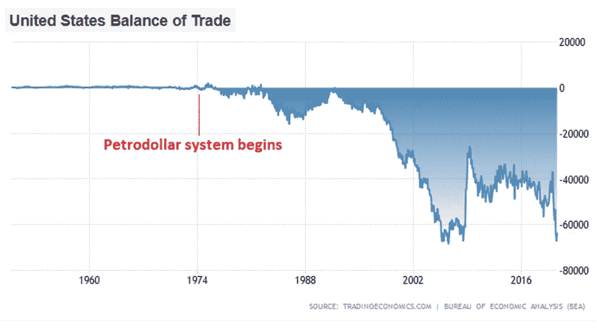

*Source:* [Trading Economics](https://tradingeconomics.com/united-states/balance-of-trade)

20 世纪 60 年代，一位名叫罗伯特·特里芬的比利时裔美国经济学家指出，这一体系中存在一个根本性的两难问题。

他指出，外国人希望持有其货币美元的国家需要向世界提供持续的盈余，以建立无风险储备货币(外汇储备)，从而产生贸易逆差。在这样做的同时，发行国对外国的负债越来越多，直到无风险资产不再是无风险的，这最终会打破这个体系。因此，特里芬难题认为，从长远来看，国际上对美元的高需求将损害美元的价值，1971 年布雷顿森林体系的崩溃证明了这一点，当时美国基本上拖欠了债务。[【6】](https://dailyreckoning.com/the-triffin-dilemma/)

## **石油美元体系的裂缝**

石油美元全球储备标准已经存在了 50 年，这个体系中有一些明显的裂缝，也与特里芬难题有关。

以下是受[亚历克斯·格拉德斯坦](https://bitcoinmagazine.com/culture/the-hidden-costs-of-the-petrodollar)启发的一些最重要的观察。

*   美国的“过度特权”允许他们为战争、外国干预和社会项目融资，这些项目部分由外国支付。
*   变得依赖美元计价债务的新兴市场经济体极度脆弱。该体系鼓励美元积累，而不是国内投资。上世纪 80 年代，美联储主席保罗·沃尔克(Paul Volcker)收紧了美国的货币政策，并提高了名义利率以遏制通胀，这导致世界经济进入衰退。与此同时，商业银行要求更高的贷款利率和更快的还款合同。这使得新兴市场的债务负担不可持续，引发了全球大规模债务危机。在拉丁美洲，这也被称为“失去的十年”。[【7】](https://www.federalreservehistory.org/essays/latin-american-debt-crisis)
*   美国和沙特阿拉伯独裁政权以及海湾地区其他独裁政权之间紧密联盟的强化。
*   美国军工复合体的强化和持续的金融霸主地位。
*   最后，美国经济的全面金融化，外国对美元的强劲需求使得出口失去竞争力。这削弱了中产阶级，用与国防、技术、服务和金融相关的工作取代了制造业工作。精英阶层变得更加富有，而普通人却一直在应对工资停滞不前的问题。[【第八期】](https://bitcoinmagazine.com/culture/the-hidden-costs-of-the-petrodollar)

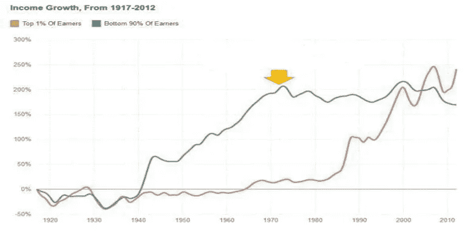

*Source:* [*https://wtfhappenedin1971.com/*](https://wtfhappenedin1971.com/)

美国经济的金融化已经在社会内部引起了一些令人讨厌的副作用**。因为强势美元降低了进口商品的价格，提高了出口商品的价格，这给了外国公司优势，也刺激了他们将制造业的工作转移到劳动力和生产成本更低的国家，比如中国和越南。此外，这间接助长了政治两极分化以及几年前特朗普和 MAGA 运动的崛起，他们试图重新获得制造业就业机会。从制造业到服务业的转变可以从下图看出。**

**

*Source: Federal Reserve Bank of St. Louis*

*中国和俄罗斯等大国一直在推行“去美元化”政策。去年，美元在两国贸易中的份额跌至 46%的历史低点。一些人甚至称之为两国之间的新“金融联盟”。[【9】](https://thefrontierpost.com/dollars-share-of-russia-china-trade-falls-to-record-46-low-hinting-at-new-financial-alliance/)正如本文开头所讨论的，历史和数据向我们表明，当前的全球石油美元储备货币体系可能很快就会走到尽头。*

## ***基于债务的菲亚特系统出现裂缝***

*有更多的迹象表明，我们正在接近一个新时代或某种类型的重置。这与我们主要由债务驱动的经济的周期性有关。这种债务是通过赊账产生的，通过赊账你可以得到今天可以花掉的钱，但承诺以后会连本带利偿还。信贷允许我们消费多于生产，但也允许我们借钱来扩大我们的业务，这将带来更多的就业机会和经济增长。*

*然而，这笔债务总要在某个时候偿还。天下没有免费的午餐。短期债务周期通常持续大约 5-8 年，或者被称为*商业周期*。由于我们的法定货币不再由商品支撑，商业银行和中央银行可以相当容易地凭空创造信用。这一点在 2008 年之前变得很明显，当时我们的消费远远超过了生产，最终导致不可持续的房地产泡沫破裂，引发了大衰退和欧元危机。*

*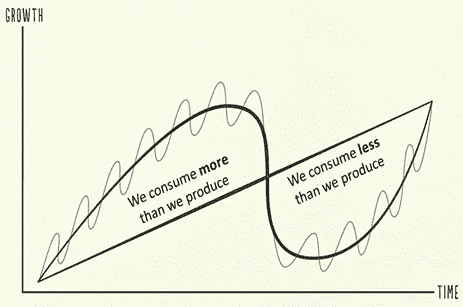*

## ***央行干预***

*由于中央银行的干预，股票市场可能会迅速复苏。这种干预政策被称为量化宽松(QE)，它允许中央银行迅速向经济注入新的流动性。央行从公开市场购买长期证券，以增加货币供应，鼓励更多贷款和投资。这给经济增加了新的货币，它成为最重要的扩张性货币政策。从 2008 年到 2010 年，美联储从其成员银行购买债务，包括抵押贷款支持证券、消费贷款和短期国库券、债券和票据。到 2010 年 6 月，美联储的投资组合已经扩大到 2.1 万亿美元，主席本·伯南克停止了进一步的购买，因为经济已经改善。[【10】](https://psc.ky.gov/pscecf/2014-00371/mkurtz%40bkllawfirm.com/04062015050241/Quantitative_Easing_Timeline___What_Is_Quantitative_Easing_.pdf)*

*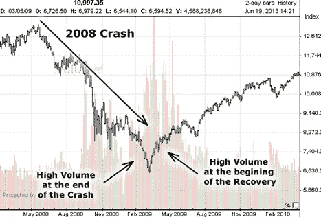*

*经济缓慢复苏，利率继续下降。这使得借贷成本降低，从而进一步刺激了消费者支出、投资和新的就业岗位。通常情况下，如果经济增长过快，通货膨胀加剧，央行可以提高利率，使信贷成本更高。这减缓了借贷和消费。*

*然而，利率已经逐渐下降到 0%，这意味着信贷对每个人来说都很便宜。在这种宽松的信贷环境下，人们通常会背上不可持续的债务。它抑制储蓄，因为人们无法获得收益，而它刺激风险投资，抬高硬资产(房地产、商品等)。).结果是资产价格膨胀，导致财富更加集中。*

*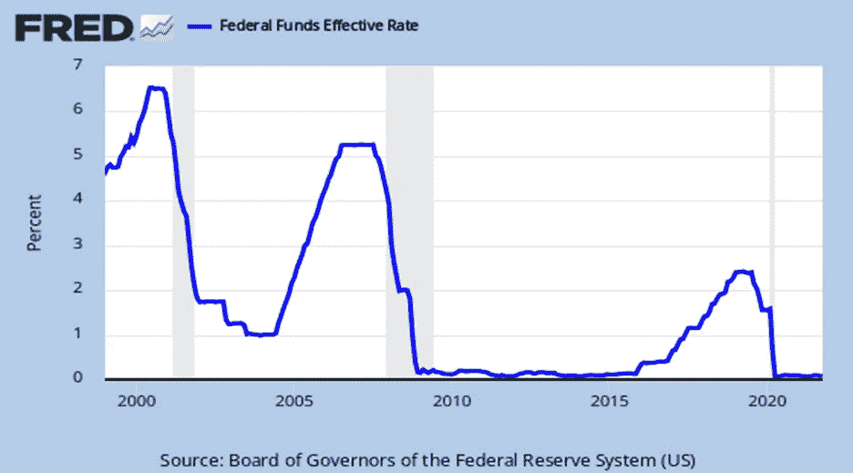*

*Source: Board of Governors of the Federal Reserve System (US)*

*钱渗透到实体经济总是需要时间的。金融机构、银行和富有的投资者通常是信贷设施的第一受益者*。*这些公司和富人拥有特权地位，可以将所有额外的流动性投资于价格低于普通消费者的金融资产，这意味着他们从资产价格上涨中相对受益更多。这被称为“坎蒂隆效应”。*

*这个理论是由 18 世纪的银行家理查德·坎蒂伦提出的。在 18 世纪，你与国王和富人越亲近，你就越能从货币扩张中获益，因为你能够以低价购买资产，并随后看到这些资产的价格上涨。货币刺激的效果稍后会出现在其他地方，你离国王越远，你受到的食品/能源价格上涨和相对工资下降的伤害就越大。[【11】](https://materials-risk.com/what-is-the-cantillon-effect/)*

***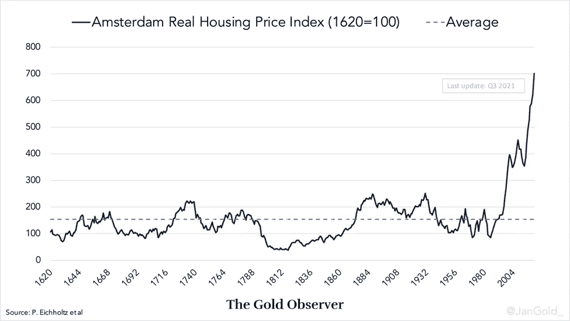*

*Source: P. Eichholtz et al.*

*上面的图表说明了 S&P500 和美联储的资产负债表有多么紧密的联系。他们的市场操纵和廉价信贷推动股价上涨。此外，经通胀修正后的荷兰房价在有记录的历史上从未如此之高。 [[12]](https://thegoldobserver.substack.com/p/amsterdam-real-housing-prices-highest?r=16jfi&utm_campaign=post&utm_medium=web&utm_source=) 除了短缺之外，这是由投机者推动的，他们试图通过抬高房价来保护自己的财富，以抵御通货膨胀和低收益率的储蓄环境。结果是，年轻家庭如果不背上巨额债务，就买不起房子，这导致了社会内部大规模的合理不满。*

*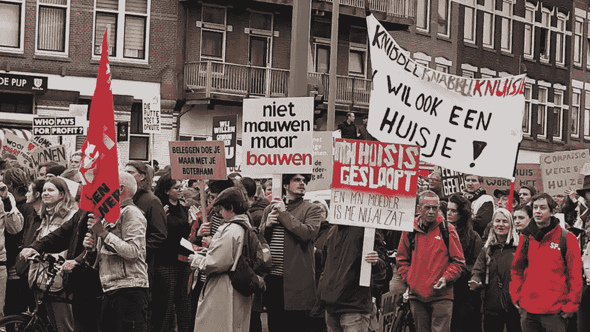*

*Source: [VoxWeb](https://www.voxweb.nl/nieuws/ook-studenten-protesteren-tegen-woningnood-beleid-kan-zo-niet-langer)*

*这种宽松的货币环境将财富集中度提高到了天文数字的高度，但这种趋势已经持续了几十年。看下面的图表，我们可以看到最富有的 1%的人持有的总净资产份额一直在增加，而最底层的 90%的人持有的总净资产份额一直在减少。最重要的是，这一趋势似乎在大规模量化宽松的时候(2008 & 2020 年)会加速。美联储的定性宽松政策导致财富集中的逻辑解释是，结合低利率，它推高了资产价格，如股票和房地产，这些资产主要由富人所有。然而，情况远比这复杂。[林恩·奥尔登](https://www.lynalden.com/qe-and-inequality/)在探索量化宽松和财富不平等之间的联系方面做得很好。[【13】](https://www.lynalden.com/qe-and-inequality/)*

*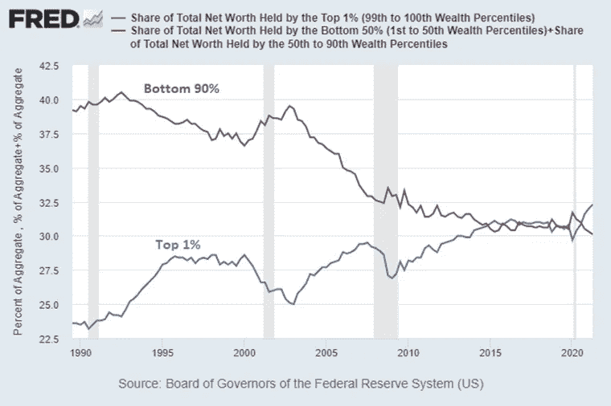*

*Source: Board of Governons of the Federal Reserve System (US)*

## ***从资产价格通胀到 CPI 通胀***

*资产价格上涨导致的财富日益集中和不平等产生了许多负面的社会后果，但 CPI 通胀率长期保持在低位。因此，普通公民在日常开支中并没有立即感受到货币扩张的后果。*

*然而，今年全球的 CPI 通胀也开始上升。美国的通胀率创下 31 年来的新高。包括德国在内，这个在 20 世纪 30 年代经历了恶性通货膨胀/魏玛化的国家今年的通货膨胀率达到了 29 年来的最高水平。[[15]](https://edition.cnn.com/2021/10/01/business/germany-inflation-eurozone/index.html)在发展中国家，情况更为严峻。据来自[人权基金会的 Alex Gladstein 称，全球约有 12 亿人生活在两位数的通货膨胀下。](https://hrf.org/)*

*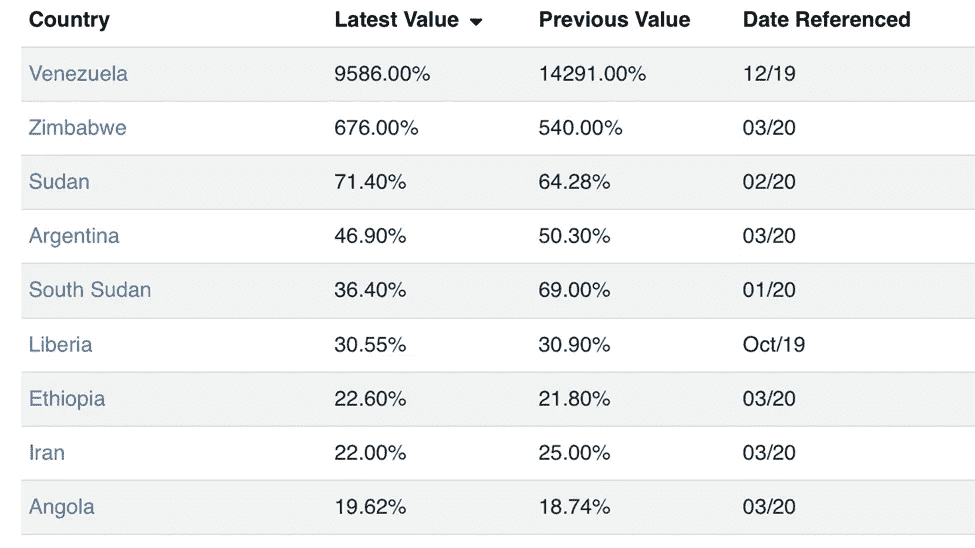*

*Source: Worldpopulationreview.com Statistics on March, 9, 2021.*

*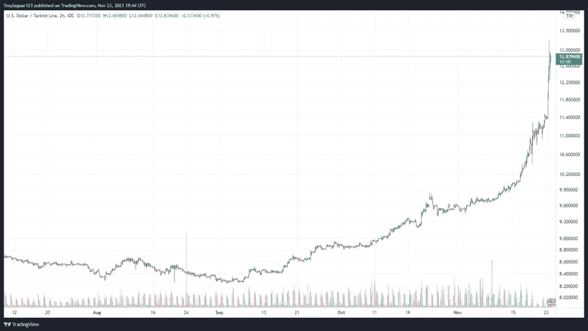*

*这张图表看起来像是一只迷因股票涌向月球，但实际上是土耳其里拉对美元的购买力迅速下降，给土耳其人民带来了真正的痛苦。全面的价格上涨主要影响穷人和中产阶级，他们将努力支付更高的食品/能源价格。这种不断加剧的通货膨胀和宽松的货币政策也导致了猖獗的投机，人们试图通过投机和抬高风险资产来超越通货膨胀的数字。*

**

*Source: Bloomberg — *Eurozone CPI inflation ’02 — ‘21**

*问题是这种疯狂的通货膨胀是否会持续下去。通货膨胀可能会平静下来，但价格通常是粘性的，不会轻易下降。由于劳动力短缺和物价上涨，我们也看到工资上涨。问题是这些工资增长完全被通货膨胀抵消了。[【16】](https://www.washingtonpost.com/business/2021/11/10/inflation-wages-workers-october/)*目前我们还看不到，但**我们必须谨慎，不要陷入欧元区内部的工资-价格螺旋，这是一种因工资上涨而导致的价格上涨现象。当工人获得更高的工资时，他们需要更多的商品和服务，这导致价格进一步上涨。本质上，这是一个价格持续上涨的永久循环。[【17】](https://www.investopedia.com/terms/w/wage-price-spiral.asp)****

***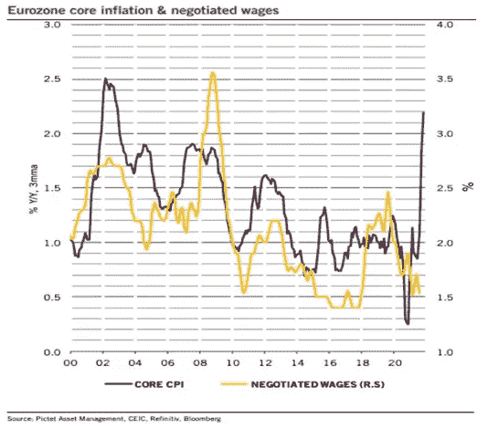***

***Source: Bloomberg — Pictet Asset Management***

## *****大通货膨胀*****

***西方世界上一次出现高通胀是在上世纪 70 年代，也就是所谓的“大通胀”(The Great Inflation)。美国一直存在巨额财政赤字，为越南战争和各种社会福利支出提供资金，直到美元与黄金的挂钩变得不可持续，尼克松在 1971 年打破了美元与黄金的挂钩。1973 年，在石油输出国组织国家对美国实施石油禁运后，石油价格翻了两番。这一禁运停止了美国的石油进口，并开始减产，从而提高了世界石油价格。禁运在 1974 年被解除，但是石油价格并没有回落。其他商品的价格也上涨了(矿物、农作物等)。)而当时经济已经处于高失业率的疲软状态。脆弱的经济无法应对这些价格上涨，通货膨胀失去了控制。[【19】](https://someunpleasant.substack.com/p/why-did-the-great-inflation-happen)***

***当时许多经济学家对 1929 年的大萧条记忆犹新，他们担心通过提高利率来控制通货膨胀会故意增加失业率。尼克松游说不要提高利率，因为糟糕的经济通常意味着被赶下台。由于这些动态，人们预期美联储不会对通胀采取任何措施，因此人们开始要求更高的工资，因为他们预计他们的钱在未来会贬值，这进一步助长了通胀和通胀预期。***

***结果是 1980 年被称为“沃尔克冲击”的激进加息，利率在最高点达到 20%，随后几年逐渐下降。它造成了 1981-1982 年的经济衰退，这是美国自大萧条以来最严重的经济衰退，但至少在接下来的几十年里通货膨胀呈下降趋势。[【20】](https://www.federalreservehistory.org/essays/recession-of-1981-82)***

***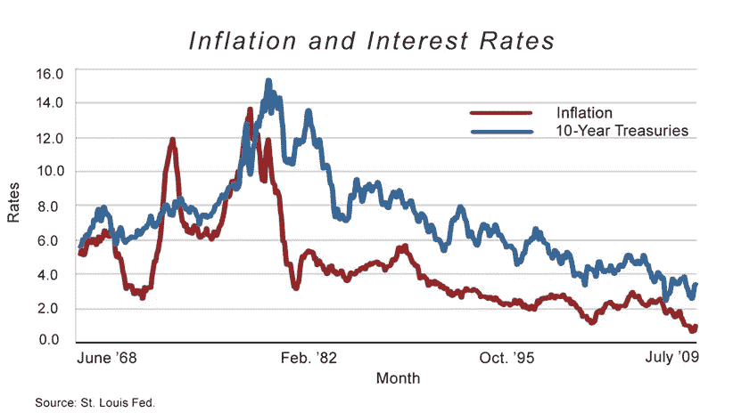***

***Source: St. Louis Fed***

*****在岩石和坚硬的地方之间*****

***如果通货膨胀继续上升，我们现在会看到类似的加息吗？不幸的是，事情没那么简单。尽管一些国家似乎正在经历劳动力短缺、供应链问题和相对高通胀的滞胀时期，但今天的央行似乎并不急于减少货币供应和提高利率。无论央行会做什么；他们的行为将会遭到大众的反对。如果央行收紧货币政策，将导致巨大的市场抛售、失业率飙升和整体经济活动减少。如果不收紧政策，通胀可能会完全失控。[【21】](https://www.gold-eagle.com/article/inflation-and-gold-1970s%C2%A0-vs-todays-situation)***

***问题是央行到底能不能加息。20 世纪 70 年代，债务与 GDP 的比率在 30%-40%之间，与我们今天看到的极高水平相比相对较低。问题在于，随着债务占 GDP 的比重越来越高，利率必然会越来越低，以保持债务偿付的可持续性。随着利率下降，积累大量杠杆变得更加容易(因为偿债成本如此之低)，这导致了更高的债务-GDP 比率、经济中更多的金融化/脆弱性，并迫使决策者继续降低利率。这是一个恶性循环，央行帮助吹大了一个如此巨大的泡沫，以至于它们被困在其中，无法提高利率，担心整个泡沫会崩溃。我们现在已经到了这一步。***

******

****Source: Macrotrends.net — Historical Debt-to-GDP ratio****

## *****残局*****

***每当短期债务周期(商业周期)结束后出现经济放缓和去杠杆化时期，央行就会进一步降息，这将鼓励更多的债务借贷，并通过降低贴现率来支持更高的资产价格。然而，如上所述，我们已经达到了零下限，这意味着利率处于或接近零，这限制了中央银行进一步刺激经济增长的能力。如果利率远低于零，银行挤兑可能会接踵而至，人们会把钱存在银行之外。[【22】](https://www.imf.org/external/pubs/ft/wp/2015/wp15224.pdf)在长期债务周期结束时，央行不再有能力延长债务周期，因为瓶子里没有更多的兴奋剂(例如进一步降低利率)。***

***有影响力的奥地利经济学家路德维希·冯·米塞斯将各国央行目前面临的困境描述为 ***崩溃繁荣*** 。当经济因信贷扩张而繁荣时，经济结构就会扭曲，最终导致各种商品和劳动力的短缺，进而导致 CPI 通胀。劳动力短缺和供应链问题如今显而易见，部分原因是全球范围的限制。***

**随着危机点的临近，央行面临着一个选择:要么加快货币供应的扩张，以帮助企业支付不断上涨的价格和工资，要么冒着让一些企业倒闭、资产价格下跌和通货紧缩(导致衰退或萧条)发生的风险不这么做。[【23】](https://mises.org/library/hyperinflation-money-demand-and-crack-boom)很明显，就目前而言，中央银行选择了加速货币扩张。**

****

**此外，这也意味着我们正在接近长期债务周期的终点，这一周期大约需要 50—75 年。雷伊·达里奥就此写了一本精彩的书，他在书中说:“上一个大的长期债务周期，也就是我们现在所处的这个周期，是 1944 年在新罕布什尔州布雷顿森林设计的，并在 1945 年二战结束时实施，我们开始了美元/美国主导的新世界秩序。”[【24】](https://www.wealthrisecapital.com/insights/endgame-is-a-name-depicting-the-end-of-this-most-recent)**

**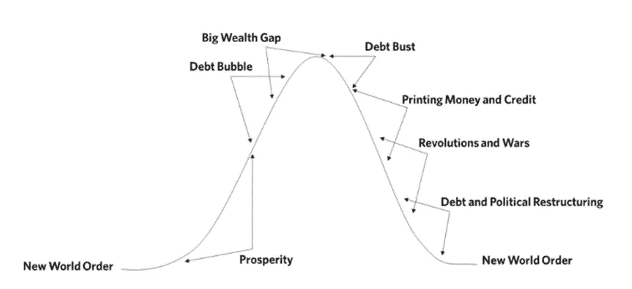**

**Source: Ray Dalio’s debt-cycle.**

****

***Source:* [*https://www.wealthrisecapital.com/insights/endgame-is-a-name-depicting-the-end-of-this-most-recent*](https://www.wealthrisecapital.com/insights/endgame-is-a-name-depicting-the-end-of-this-most-recent)**

**在每个长期债务周期结束之前，债务与 GDP 之比会飙升至不可持续的水平。在臭名昭著的恐慌年 1929 年之后的几年里，债务占 GDP 的比例飙升至 300%。这标志着大萧条的开始，整个世界经历了债务重组和免除。通常，必须发生债务违约或贬值来偿还当前债务。大萧条之后，重启的按钮被按下，这个按钮必须被再次按下，这将导致一个新的世界秩序。**

**当我们审视上一个长期债务周期结束前的几十年时，我们可以进行一些宽泛的比较。在 20 世纪 20 年代和 30 年代，魏玛德国的人们在股票市场和其他投资中承担了过多的风险。如今，我们看到所有人都在试图投资和投机，以至于像 Dogecoin 和 Shiba Inu 这样的 meme 币在“价值”上爆炸了。这是《当金钱消亡时》一书中的一段话:**

***“在股票交易中，所有阶层的人几个月来都在无视常识的情况下进行投机。”***

**今天的人们在投机和赌博，因为这似乎是获得成功的唯一途径之一。许多人几乎没有任何储蓄，而他们的工资却跟不上通货膨胀。如果通货膨胀继续缓慢上升，这种行为只会增加。这是书中另一段关于 20 世纪 20 年代德国中产阶级的引文:**

***“随着节俭、努力工作和诚实这些古老美德失去吸引力，每个人都想快速致富，尤其是在货币或股票投机显然能比劳动产生更大回报的情况下。”***

**听起来很熟悉，不是吗？另一个相似之处是当今社会日益加剧的两极分化、意识形态分歧和政治极端主义。我们看到指责受害者和隔离在欧洲正变得正常化，在那里“未接种疫苗者”特别成为目标，被污名化，有时甚至被锁起来。在许多国家，当他们被认为有病，直到被证明“健康”时，他们才能去餐馆、健身房、剧院、活动，有时甚至是他们自己的工作。连续几个月，欧洲出现了反对 COVID 措施的抗议活动，特别是反对医疗歧视的抗议活动。在光谱的另一端，我们看到针对抗议者的仇恨和激进化增加，这些抗议者经常被定性为“极右”和/或“反 vax”。很明显，这个最初让我们走到一起的疫情现在已经让我们完全两极化了。**

**人们正在寻找经济问题的原因，他们受到极右或极左政治人物的影响，这些人向他们提供了他们接受为完全真理的狭隘叙事。人们变得激进，认为他们的解决方案是解决问题的唯一方法，他们把持不同观点的人当成替罪羊。同样的事情发生在上世纪 30 年代的德国，人们开始为他们的货币贬值寻找替罪羊。这导致了遍及全国的大规模社会主义和法西斯革命。希特勒的反犹言论成为中产阶级痛苦的一个普遍接受的原因，我们都知道随之而来的暴行。找替罪羊和隔离永远不会带来一个更加繁荣和谐的社会。**

***“通货膨胀是政治极端主义的盟友，秩序的对立面”***

## **货币贬值和金融抑制**

**除了降低利率，中央银行只剩下另外一个选择来进一步刺激经济，那就是扩大货币供应，如上文所解释的**。美国和欧盟印刷了数万亿美元/欧元来减轻 COVID19 措施造成的损害，各央行公开表示，他们将允许高于最初 2%的年度目标的通胀率。[【26】](https://voxeu.org/article/rethinking-ecbs-inflation-objective)****

***这一政策转变表明，我们已经进入了债务周期的贬值阶段，其主要目标是大规模印钞，主动让货币贬值，进而让未偿债务贬值。对货币供应的大规模货币注入将使全球债务负担贬值，但也使普通人的储蓄贬值。这导致受益于高资产估值的上层阶级和受价格上涨影响最大的下层阶级之间出现巨大的财富差距。巨大的贫富差距会导致社会动荡，有时甚至会引发革命。如今，内乱显而易见，这也是为什么政治越来越关注向富人征税。税收在将贫富差距缩小到可持续水平方面可以发挥重要作用。***

***当今世界正面临着不断上升的工资压力、真正的劳动力短缺和供应链问题、部分去全球化和商品稀缺。由于系统中有如此多的债务，即使通货膨胀加剧，央行也很难维持低利率。经通胀调整的深度负利率倾向于支持硬资产，如贵金属、价值股、大宗商品生产商和比特币。历史上，拥有有限的资产是保护自己免受货币贬值影响的最佳方式。[【27】](https://www.lynalden.com/qe-and-inequality/)***

***国际货币基金组织警告说，高公共债务经常导致违约和重组。然而，他们表示:“债务也可以通过*金融抑制*来减少，即通过负利率或低于市场实际利率对债券持有人和储户征税。”[【28】](https://www.imf.org/en/Publications/WP/Issues/2016/12/31/The-Liquidation-of-Government-Debt-42610)他们基本上是在警告债券持有人和储户，他们将成为金融抑制的目标，以减轻未来十年的公共债务负担。举例来说，10 年期德国债券的实际收益率最近跌至-5.52%，创历史新低。***

**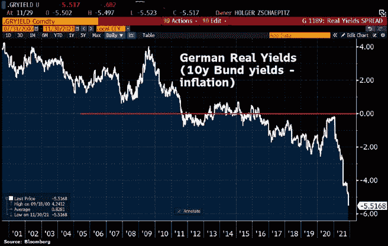**

**Source: Bloomberg**

## ****布雷顿森林体系 II****

**正如一些工作文件中的警告所显示的那样，国际货币基金组织(货币基金组织)知道我们正在接近长期债务周期的终点，这就是为什么他们呼吁布雷顿森林体系 II 时刻。用他们自己的话说:“*用凯恩斯的话来说，我们能够为那些在这场危机中丧生的人建立的最好的纪念就是“更大的事情”——建立一个更加可持续和公平的世界。我们的创始人做到了。现在轮到我们了。这是我们的时刻！*[【29】](https://www.imf.org/en/News/Articles/2020/10/15/sp101520-a-new-bretton-woods-moment)**

**这听起来很有希望，但是他们想要什么？正如我们在本文开头所探讨的，美元作为全球储备货币的日子可能屈指可数了。一种新的全球储备货币的时代正在到来。IMF 提出的解决方案是特别提款权(SDR)。这是由国际货币基金组织发行的所谓货币篮子，其中已经包括了全球最重要的货币，包括美元、欧元、日元、英镑和中国人民币。**

**根据国际货币基金组织的说法，这一雄心勃勃的改革还应该包括这一全球货币的私人使用，这意味着它们可以用于私人或政府债券的计价，或者作为商业交易的记账单位(例如，商品定价，而不是石油美元)。这种虚拟 SDR 可以创造一种用于私人交易的全球加密货币，可以与央行支持的国家或地区加密货币(央行数字货币/cbdc)一起流通。根据国际货币基金组织的说法，这将优于现有的加密资产或 Libra 等私营部门货币。[【30】](https://www.imf.org/external/pubs/ft/fandd/2019/12/future-of-the-IMF-special-drawing-right-SDR-Ocampo.htm)**

**毫不奇怪，政府和国际组织更喜欢 SDR 和 CBDCs，而不是比特币和 Libra 等货币。如果你控制了金钱，你也就控制了人民。国际清算银行总经理公开承认了这一点。他表示:“(T2)与 CBDC 的关键区别在于，央行将对决定央行责任表述使用的规则和法规拥有绝对控制权，而且我们将拥有实施这些规则和法规的技术。”[【31】](https://www.youtube.com/watch?v=9FM4Fu2ujDE)**

**这一点的潜在影响是巨大的，如果你重视自由市场和个人主权，它们应该会吓到你。这意味着中央银行对你的钱花在什么地方有完全的透明度，它允许他们在现金慢慢从我们的社会消失的时候实施深度负利率。他们甚至可以决定给你的钱设定一个到期日，在最糟糕的情况下，他们可以决定审查政治对手或持不同政见者，只需封锁他们的银行账户。[【32】](https://www.wsj.com/articles/digital-currencies-pave-way-for-deeply-negative-interest-rates-11631091581)**

**另一方面，可编程货币允许央行实施更加个性化的财政和货币政策。例如，他们可以在个人层面上扩大信贷和微观管理利率，这在 COVID19 危机期间是有用的。然而，这给了他们对经济需求方面的很大控制权。中央机构可以根据你的个人信用评分决定你可以购买哪些商品，不可以购买哪些商品。无论如何，我们都应该密切关注央行和其他国际机构希望通过它们的 CBD 实现什么目标。**

****

**Source: World Bank**

**很明显，像国际货币基金组织、WEF 和国际清算银行这样的机构想要一个更加中央计划和集中控制的世界。问题是，人们是否会简单地接受中央机构拥有如此大的权力。世界向中心化和全球化转变已经很久了，但它似乎正在慢慢拒绝这一点。自 2008 年以来，我们一直处于去全球化趋势，如上图所示。无论如何，未来十年很可能是一个巨大的金融转变，也是一个我们可以见证的历史性时刻。**

> **加入 Coinmonks [电报频道](https://t.me/coincodecap)和 [Youtube 频道](https://www.youtube.com/c/coinmonks/videos)了解加密交易和投资**

## **也阅读**

** [## 杠杆代币[多头代币]终极指南

### 杠杆化令牌是具有杠杆化风险敞口的 ERC20 令牌，不考虑保证金、要求、管理…

medium.com](/coinmonks/leveraged-token-3f5257808b22)  [## 最佳加密交易所| 2021 年十大加密货币交易所

### 加密货币交易所的加密交易需要了解市场，这可以帮助你获得利润。之前…

blog.coincodecap.com](https://blog.coincodecap.com/crypto-exchange)  [## 2021 年最佳加密交换平台| CoinCodeCap

### 如果我们看看今天的场景，许多加密货币交换平台提供了广泛的功能和深度…

blog.coincodecap.com](https://blog.coincodecap.com/best-swap-platforms)  [## 2021 年最佳加密借贷平台| 6 大比特币借贷平台

### 获得比特币和其他加密货币的最佳贷款利率

medium.com](/coinmonks/top-5-crypto-lending-platforms-in-2020-that-you-need-to-know-a1b675cec3fa)  [## 2021 年 6 大最佳硬件钱包|顶级加密硬件钱包[更新]

### 最好的加密货币硬件钱包是绝对必要的。我们将在 NGRAVE、Ledger Nano X 和…

medium.com](/coinmonks/the-best-cryptocurrency-hardware-wallets-of-2020-e28b1c124069)  [## 2021 年最佳免费加密交易机器人

### 2021 年币安、比特币基地、库币和其他密码交易所的最佳密码交易机器人。四进制，位间隙…

medium.com](/coinmonks/crypto-trading-bot-c2ffce8acb2a)  [## 最佳 4 个加密交易信号电报通道

### 这是乏味的找到正确的加密交易信号提供商。因此，在本文中，我们将讨论最好的…

medium.com](/coinmonks/best-crypto-signals-telegram-5785cdbc4b2b)  [## 获取信号、交易机器人和套利

### 在本文中，我们将讨论 bits gap——一个满足您所有交易需求的一站式加密交易平台…

blog.coincodecap.com](https://blog.coincodecap.com/bitsgap-review)  [## 40 个最佳电报频道，用于加密、电影、表演和演讲| CoinCodeCap

### 随着我们周围无限的信息，我们很难筛选和了解有价值的信息。电报有…

blog.coincodecap.com](https://blog.coincodecap.com/best-telegram-channels)  [## BlockFi 评论 2021:利弊和利率| CoinCodeCap

### 今天，我们提出了一个全面的 BlockFi 评论，这是一个成立于 2017 年的加密贷款平台，拥有其…

blog.coincodecap.com](https://blog.coincodecap.com/blockfi-review)  [## 加密税务软件——五大最佳比特币税务计算器[2021]

### 不管你是刚接触加密还是已经在这个领域呆了一段时间，你都需要交税。

medium.com](/coinmonks/best-crypto-tax-tool-for-my-money-72d4b430816b)  [## Pionex 评论 2021 |免费加密交易机器人和交换

### Pionex 是为交易自动化提供工具的后起之秀。Pionex 上提供了 9 个加密交易机器人…

medium.com](/coinmonks/pionex-review-exchange-with-crypto-trading-bot-1e459d0191ea)**