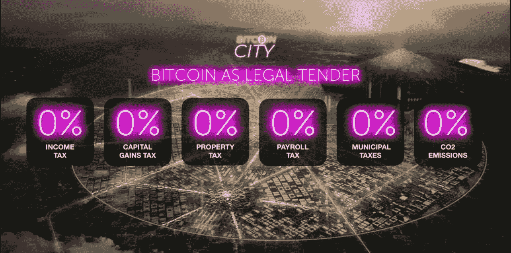

# 第一个 10 亿美元的比特币火山债券在这里

> 原文：<https://medium.com/coinmonks/the-first-1-billion-usd-bitcoin-volcano-bond-is-here-56964d8f7bbe?source=collection_archive---------1----------------------->

## 为什么萨尔瓦多的债券交易近乎天才

Photo by [Hamzah Hanafi](https://unsplash.com/@hamzahanafi_?utm_source=medium&utm_medium=referral) on [Unsplash](https://unsplash.com?utm_source=medium&utm_medium=referral)

# 火山债券

nayib buke le 11 月 21 日在 FeelTheBit 的演讲约会是另一个重大宣布。萨尔瓦多总统透露了该国最新的债券发行计划。EBB1，或萨尔瓦多比特币债券 1，或坚持用朗朗上口的名字-火山债券#1。

该债券将以美元计价，融资 10 亿英镑。它将与 Blockstream 合作发行，是一个令牌化的 24/7 可交易产品，在 Blockstream 的 Liquid sidechain 上运行。成熟将是经典的 10 年。最低投资:低至 100 美元！

资金将对半分配使用。正如 Samson Mow 在台上宣布的那样，5 亿美元将用于市场购买比特币，另外 5 亿美元将用于建设能源基础设施和扩大该国自己的比特币采矿计划。

该债券将为投资者提供 6.5%的票面利率，外加一笔特殊的“比特币股息”。经过五年的锁定期后，萨尔瓦多将开始每季度出售比特币，并将与投资者分享利润。按照 Blockstream 构建的模型，去年的 APY 将高达 147%。

第一手资料显示，第一次债券发行的到期日将是 2032 年 1 月，这意味着债券将于 2022 年 1 月发行。这是一个雄心勃勃的目标，因为法律框架，如最新的证券法，必须在大约 60 天内建立起来。但他们也在几个月内使比特币成为法定货币，因此事情的进展可能比任何人预期的都要快。

# 比特币城市

萨尔瓦多新数字经济的另一部分是比特币城市的宣布。这将是一个全新的生态火山城市，拥有数字化经济和各种居民福利。该城市将从债券发行中获得部分融资，并拥有以下设施:

*   0%所得税
*   0%资本收益税
*   0%财产税
*   0%工资税
*   0%市政税
*   0 克二氧化碳排放量
*   10%增值税

截至今天，还不清楚投资者必须满足哪些要求才能住在比特币城市。有传言说，投资 10 万美元将确保你的位置(如永久居留)和 5 年的公民身份。

Screenshot from FeelTheBit conference

# 挑战

让我们来谈谈自然出现并被世界各地的新闻媒体报道的挑战。

## 萨尔瓦多的其他债券收益率超过 10%

在几篇文章中，以及在彭博电视台臭名昭著的 Samson Mow 采访中，记者们谈论萨尔瓦多的其他债券为他们的投资者带来了更多的 APY。

你肯定可以组合一个投资组合，其中包含收益率高达 13%的普通萨尔瓦多债券和直接比特币敞口，在 Blockstream 为 EBB1 的表现在其模型中做出的假设下，这将更加成功。鉴于你与萨尔瓦多分享“比特币红利”。

为什么个人投资者的货币结果不一定是故事的全部，这将是本文后面的问题。

## 法律框架

必须为这种债券建立一种新的法律结构。由于 Bukele 对立法的影响，他在实施新法律方面速度很快。对此不能全信。

## 萨尔瓦多可能会出现债券违约

风险是每项投资的一部分。目前的债券价值约为 1 美元 75 美分，简单来说，这意味着投资者将违约风险定价为 25%。EBB1 是比特币支持的。如果你认为比特币 10 年后会比现在更值钱，那你就没有问题。

## 比特币城市是一种迷因

没有明确的进步计划，一个巨大的比特币标志作为中心广场，火山电力作为一种能源，富裕的比特币投资者没有税收。听起来像一个迷因，我们将会发现这些年来有多少是真的。演讲现场的观众小声问“这是真的吗？”-这的确是个合理的问题。

# 谁来投资？

当我想到这种金融产品时，脑海中浮现出一系列不同类型的潜在投资者。毕竟，它给这个空间带来了一些不可忽视的创新。该债券将被令牌化，由比特币支持，最低投资额低至 100 美元。最后但并非最不重要的一点是，从第 5 年开始，它将通过出售比特币获得可能不断增加的股息。

## 机构

由民族国家**和**比特币支持的债券绝对是新事物。鉴于大多数基金和机构不得直接持有比特币等大宗商品，它们依赖于金融工具。

这种债券可能会变得非常有吸引力，吸引机构增加比特币敞口，同时投资于率先采用比特币的国家。

## 个人投资者

购买债券而不是直接持有比特币或将投资组合的一部分转移到债券的几个可能原因。

你可以购买一些债券来:

1.  降低风险。无论比特币发生什么，你都将获得有保证的回报，同时仍能接触到它的价格波动。
2.  获得免税的第二居所。和成为公民的潜在途径。
3.  支持收养事业，同时仍有诱人的回报。
4.  作为传统金融、民族国家和比特币的首次融合，将债券作为收藏品持有。

## 慈善家

Samson Mow 在各种场合宣布，他认识的鲸鱼和投资者将为“萨尔瓦多人民”投资。如果是真的，那就太疯狂了，因为通常情况下不会这样。然后，我再次看到密码社区做了一些了不起的慈善事业。

# 大局

萨尔瓦多的这一有趣举动在塑造数字经济、比特币应用进展和旗帜理论的更大图景的许多层面上都值得一提。

## 数字经济

火山债券和比特币城市开创了一个数字化的新时代。债券将被象征性地，全天候交易，很容易获得。比特币城市将是一个完全数字化的经济体，你可以用比特币支付，用比特币赚取，用比特币缴税(嗯，只是增值税)。从娱乐到采矿，一切都将由火山热能驱动。比特币的乌托邦。

## 民族国家竞争

在你的国家分配资本对每个国家都非常重要。为该国有偿付能力的投资者建立一个比特币城市是萨尔瓦多吸引资本进入该国的一个极其明智的举措。他们是第一个让比特币成为法定货币的国家，现在他们正在这个故事的基础上发展。

该债券从全球对比特币感兴趣的传统金融中吸引资本，比特币之城吸引着个人。这是一个激励的游戏，萨尔瓦多将自己定位为服务于不断增长的秘密经济并从中获利。这个套餐可能会成为通往第二居所的最有吸引力的途径之一。

## 走向独立

鉴于国际货币基金组织的警告，萨尔瓦多对基于比特币的经济的持续做法有时似乎有些鲁莽。但随着比特币的持续采用、出色的实施以及全球投资者的信任，在不太遥远的未来，布克勒的决定可能会被视为勇敢。毕竟，在比特币经济中，萨尔瓦多不需要国际货币基金组织。尽管路还很长。

目前，国际货币基金组织看起来像一个疯狂的前女友，想要与萨尔瓦多恢复联系。

# 结论

先行者效应将继续对萨尔瓦多有利，我支持 Anthony Pompliano 的预测:

萨尔瓦多很快就能发行 EBB2、3 和 4。

比特币城市的发展会超级有趣。Bukele 表示，资助将于 2022 年开始。我怀疑第一个比特币制造者会在 2026 年前搬进他的新家。

我们应该继续批判性地评估萨尔瓦多在比特币领域的举措，但迄今为止，它看起来肯定是令人兴奋和积极的。当然，如果他们袖手旁观他们的话。这是对比特币标准可能性的真实世界实验。很高兴在萨尔瓦多看到超高速的采用！

本文仅供参考。不应将其视为财务或法律建议。并非所有信息都是准确的。在做任何重大财务决定之前，先咨询财务专家。

> 加入 Coinmonks [电报频道](https://t.me/coincodecap)和 [Youtube 频道](https://www.youtube.com/c/coinmonks/videos)了解加密交易和投资

## 另外，阅读

*   [什么是融资融券交易](https://blog.coincodecap.com/margin-trading) | [美元成本平均法](https://blog.coincodecap.com/dca)
*   [拥护卡审核](https://blog.coincodecap.com/uphold-card-review) | [信任钱包 vs MetaMask](https://blog.coincodecap.com/trust-wallet-vs-metamask)
*   [Exness 评测](https://blog.coincodecap.com/exness-review)|[moon xbt Vs bit get Vs Bingbon](https://blog.coincodecap.com/bingbon-vs-bitget-vs-moonxbt)
*   [如何开始通过加密贷款赚取被动收入](https://blog.coincodecap.com/passive-income-crypto-lending)
*   [BigONE 交易所评论](/coinmonks/bigone-exchange-review-64705d85a1d4) | [电网交易机器人](https://blog.coincodecap.com/grid-trading)
*   [如何在 Bitbns 上购买柴犬(SHIB)币？](https://blog.coincodecap.com/buy-shiba-bitbns) | [购买弗洛基](https://blog.coincodecap.com/buy-floki-inu-token)
*   [Godex.io 审核](/coinmonks/godex-io-review-7366086519fb) | [邀请审核](/coinmonks/invity-review-70f3030c0502) | [BitForex 审核](https://blog.coincodecap.com/bitforex-review)
*   [10 本关于加密的最佳书籍](https://blog.coincodecap.com/best-crypto-books) | [英国 5 个最佳加密机器人](https://blog.coincodecap.com/uk-trading-bots)
*   [ko only Review](https://blog.coincodecap.com/koinly-review)|[Binaryx Review](https://blog.coincodecap.com/binaryx-review)|[Hodlnaut vs CakeDefi](https://blog.coincodecap.com/hodlnaut-vs-cakedefi-vs-celsius)
*   [MoonXBT vs Bybit vs 币安](https://blog.coincodecap.com/bybit-binance-moonxbt) | [硬件钱包](/coinmonks/hardware-wallets-dfa1211730c6)
*   [火币交易机器人](https://blog.coincodecap.com/huobi-trading-bot) | [如何购买 ADA](https://blog.coincodecap.com/buy-ada-cardano) | [Geco。一次复习](https://blog.coincodecap.com/geco-one-review)
*   [币安 vs 比特邮票](https://blog.coincodecap.com/binance-vs-bitstamp) | [比特熊猫 vs 比特币基地 vs Coinsbit](https://blog.coincodecap.com/bitpanda-coinbase-coinsbit)
*   [如何购买 Ripple (XRP)](https://blog.coincodecap.com/buy-ripple-india) | [非洲最好的加密交易所](https://blog.coincodecap.com/crypto-exchange-africa)
*   [非洲最佳加密交易所](https://blog.coincodecap.com/crypto-exchange-africa) | [胡交易所评论](https://blog.coincodecap.com/hoo-exchange-review)
*   [eToro vs robin hood](https://blog.coincodecap.com/etoro-robinhood)|[MoonXBT vs Bybit vs Bityard](https://blog.coincodecap.com/bybit-bityard-moonxbt)
*   [有哪些交易信号？](https://blog.coincodecap.com/trading-signal) | [比特斯坦普 vs 比特币基地](https://blog.coincodecap.com/bitstamp-coinbase)
*   [ProfitFarmers 回顾](https://blog.coincodecap.com/profitfarmers-review) | [如何使用 Cornix Trading Bot](https://blog.coincodecap.com/cornix-trading-bot)