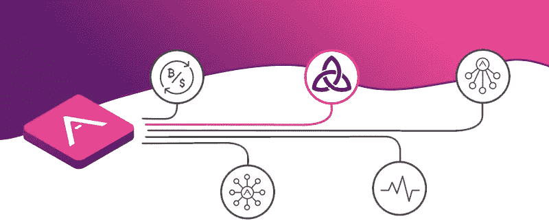
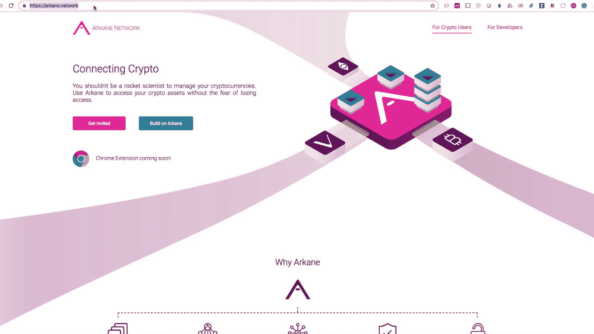
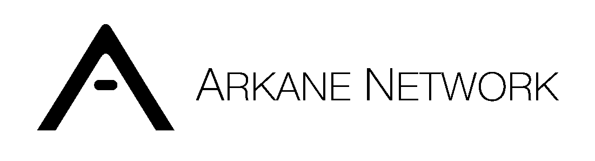

# Vechain 区块链上的第一批应用是实时的

> 原文：<https://medium.com/coinmonks/the-first-applications-on-vechain-blockchain-are-live-40cbe5e1f230?source=collection_archive---------4----------------------->

## Arkane 如何支持区块链和应用程序的演练

> 感谢你对阿尔凯恩·❤️感兴趣，我们希望了解你，所以请不要害羞，加入我们的[电报](https://t.me/ArkaneNetworkOfficial) ✨

[ThorBlock](https://thorblock.io?utm_campaign=arkane.network) ，由[避风港](https://safehaven.io)开发的拼车服务和 dapp，上线。Thorblock 是第一个与 Arkane 集成的实时应用程序之一。这篇文章解释了 ThorBlock 如何利用 Arkane Network 的力量。

> ⚠️剧透——文章底部的演示

安全港希望 ThorBlock 的消费者在创建或加入加密池时体验非常用户友好的区块链界面，为此，ThorBlock 使用以下组件:

*   证明
*   钱包供应
*   事务处理

## 证明🔐

Arkane 用户可以使用他们的 Arkane 账户登录 ThorBlock，ThorBlock 用户也可以在 Arkane 中进行同样的操作。这种整合到目前为止，如果用户在 ThorBlock 中通过认证，他们甚至不需要登录 Arkane。这是通过使用一种叫做[单点登录](https://en.wikipedia.org/wiki/Single_sign-on)的技术来实现的。如果 Safe Haven 继续在其所有产品中应用相同的身份验证策略，其用户将只需登录一次即可登录所有产品，这同样适用于注销。

## 钱包供应💳

让区块链应用程序更加用户友好是避风港和 Arkane Network 的共同目标。消费者可以使用社交账户在 ThorBlock 注册。Arkane 将检测用户是否有 VeChain 钱包，如果没有，将动态创建一个钱包。

通过使用“自动逻辑”🌟钱包创建功能，避风港可以搭载新用户轻松访问他们的产品。

## 事务处理🔗

大多数区块链用户能够找到创建钱包的方法，但要求他们在区块链上进行交易似乎仍然遥不可及。在年轻的生态系统 VeChain 上，情况稍微复杂一些，因为支持其生态系统的工具较少。Arkane Network 正在通过提供一组 API 来解决这个问题，应用程序开发人员可以使用这些 API 在他们的 DAPPS 中实现 VeChain 上的区块链交易。ThorBlock 是区块链应用程序应该如何与终端用户互动的一个完美例子。

下面是一个小 gif，展示了 Arkane 给 ThorBlock 带来的一些功能。

Arkane integrated into ThorBlock

## 在 Arkane 上开始建造什么？

如果你是一名开发者，并且你想以一种**非常用户友好的**方式将区块链整合到你的项目中，你今天就可以请求开发者访问 Arkane！只需填写[一个小表格](https://arkane-network.typeform.com/to/kTGcKf)就可以得到你的 api 密匙。

> [在您的收件箱中直接获得最佳软件交易](https://coincodecap.com/?utm_source=coinmonks)

