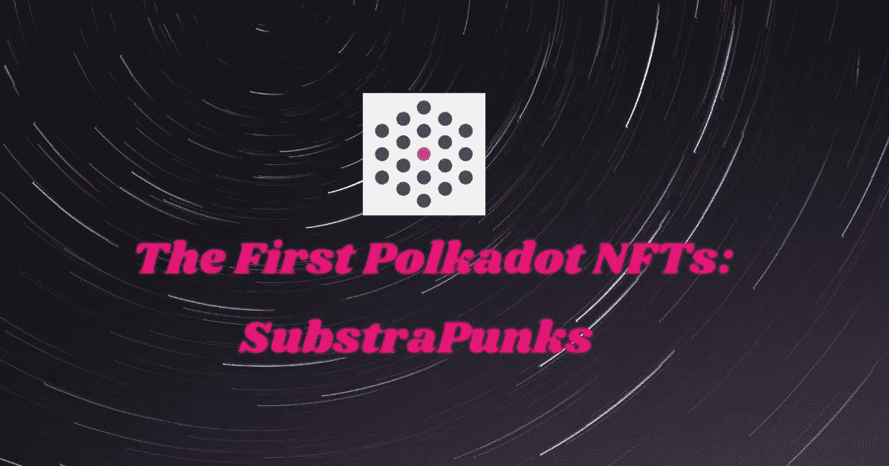
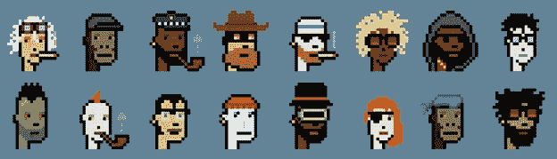
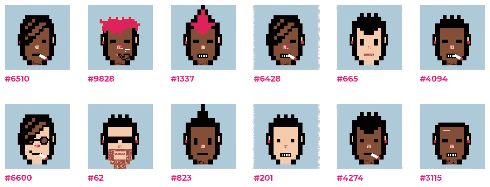

# 第一个波尔卡多特 NFTs:sub punks

> 原文：<https://medium.com/coinmonks/the-first-polkadot-nfts-substrapunks-3398f33c8ae1?source=collection_archive---------0----------------------->

在[语音](https://www.voice.com/post/@tulip/the-first-polkadot-nfts-substrapunks-1604598466-1)阅读我的原创文章。

最近我在[写了很多关于 NFTs 的文章](/coinmonks/the-world-of-nfts-part-1-the-present-8a2de175c2e9)。我还谈到了这种 NFT 的未来潜力，以及生态系统在未来将如何爆炸。评估非功能性测试最重要的标准之一是“稀有性”。CryptoPunks 是以太坊区块链上创建的第一批 NFT(如果不是第一批的话)之一。一个普通的密码朋克目前售价约为 4 ETH(1200 美元)！

我们已经错过了隐朋克船，但是波尔卡多特给了我们第二次机会。随着第一批波尔卡多特 NFTs 的创建，[***sub punk***](https://github.com/usetech-llc/substrapunks)波尔卡多特的第一个 NFT 市场即将启动

**幼虫实验室** [**以太坊区块链**的历史](https://larvalabs.com/cryptopunks)

****

**幼虫实验室是密码朋克的创造者。这些是通过算法生成的 24x24 像素艺术图像。总共产生了 10000 个朋克，但没有一个是完全一样的。这些朋克最初是免费赠送给以太坊区块链拥有的。朋克通常是有不同特质的男孩和女孩。更罕见的类型包括猿、僵尸和外星人。加密朋克现在在[市场](https://larvalabs.com/cryptopunks/bids)出售。您需要元掩码来连接到门户。**

**下面是一些有趣的数据:**

****销售数量(过去 12 个月):4184****

****·平均销售价格(过去 12 个月):3.71 =(1481 美元)****

****·所有销售的总价值(生命周期):1553 万=(620 万美元)****

****过去一年的平均出价为 4.41 ETH(1，759.28 美元)。****

****独网与** [**子朋克**](https://ipfs-gateway.usetech.com/ipns/QmaMtDqE9nhMX9RQLTpaCboqg7bqkb6Gi67iCKMe8NDpCE) **在 Polkadot 区块链****

****

**SubstraPunk NFTs 是由独特的网络创建的。Unique Network 是 Hackusama 在“建立区块链类别”中的获胜者。SubstraPunk 是 CryptoPunks 的翻拍版。10，000 个独特的人物形象是用一套全新的面部部件创造出来的。Substrapunk 图像由 8 部分自动生成。有些是可选的(比如胡子或雪茄)，有些是必须的(比如脸)。有些是单一性别(如耳环或鼻环)，但有些定义了生成角色的性别(如女孩的口红或金发或男孩的胡子)。如果性别没有确定，那么在它们产生的那一刻，机会就决定了它将会是什么。**

**组成部分包括:**

**1.面部(2 种选择:黑色和白色)**

**2.胡子，可选(7 个选项)**

**3.耳环，可选(3 个选项)**

**4.眼睛/太阳镜(5 种选择)**

**5.头发(12 种选择)**

**6.嘴巴(6 个选项)**

**7.鼻环，可选(1 个选项)**

**8.雪茄或烟斗，可选**

**可能的组合总数是 89820，但算法随机选取了其中的 10000 个。**

**现在，所有的次级市场都已被认领，交易正在不受监管的灰色市场中进行。**

**电报用户“nsai”的详细分析得出以下结果(近似值和数字可能不一致)**

*****稀有性状的计数*****

***1 特质(21)——非常非常罕见***

**2 个特征(228)——非常罕见**

**7 个特征(395) —罕见**

**3 个特征(1094) —不太常见**

**6 特征(2003 年)——更频繁**

**4 特质(2766) —非常常见**

**5 性状(3493) —丰富**

*****9 大稀有特质*****

**1.面部毛发(首先是胡子)**

**2.紫色口红**

**3.红色口红**

**4.圆圆的眼睛**

**5.亚洲人的眼睛**

*****按发型区分的稀有度:*****

**1.金发——118**

**2.泡泡— 561**

**3.秃头——569**

**4.插入符号— 570**

**5.瘦— 572**

**6.马尾— 579**

**7.向上的头发— 856**

**8.Emo — 887**

**9.羽绒— 1304**

**10.橙色头发— 1306**

**11.马霍克— 1337 年**

**12.红色马哈瓦克— 1341 年**

*****稀有度按眼型:*****

**1.圆眼睛— 1952 年**

**2.亚洲人的眼睛——2001 年**

**3.太阳镜— 2022**

**4.红色眼镜— 2082**

*****稀有度由鼻型:*****

**1.鼻环— 5096**

*****稀有度由口型:*****

**1.紫色口红**

**2.红色口红**

**3.牙齿微笑**

**4.微笑**

*****稀有程度由配件决定:*****

**1.管道— 2065**

**2.雪茄— 3993**

*****稀有度按穗型:*****

**1.右耳环— 2440**

**2.两只耳环— 2451**

**3.左耳环— 2495**

*****按面部毛发类型区分的稀有度:*****

**1.小胡子— 715**

**2.普通胡子——729**

**3.棕色胡子— 738**

**4.小胡子—胡须— 747**

****下一步:****

**Substrapunks 非常受欢迎，明年上线时，它们将被转移到 Polkadot mainnet。**

**市场在一个由 10 名早期采用者组成的封闭小组中进行了测试。测试非常成功，发现了一些小问题。提出了额外的门户功能(例如引入过滤器等)。**

**投票功能将在 Mainnet 启动前激活**

**我看到人们对波尔卡多特 NFTs 有很大兴趣。我建议在市场出现时进行测试，这可能会是一项不错的投资。更多细节可在[唯一网络电报](http://t.me/Uniquechain)中找到。在非官方论坛交易要小心。**

****如果你能在评论中留下你的观点供进一步讨论，我将不胜感激。****

****延伸阅读****

**[**NFTs 的世界:第一部分——现在**](/coinmonks/the-world-of-nfts-part-1-the-present-8a2de175c2e9)**

**[**NFTs 的世界:第二部分——未来**](https://tulip311bit.medium.com/the-world-of-nfts-part-2-the-future-eb0f9c965f55)**

****跟着我****

**https://twitter.com/rumadas123➡推特:**

**https://www.linkedin.com/in/ruma-das-a1439320/➡领英:**

## **另外，阅读**

*   **最佳加密交易机器人**
*   **最好的比特币[硬件钱包](/coinmonks/the-best-cryptocurrency-hardware-wallets-of-2020-e28b1c124069?source=friends_link&sk=324dd9ff8556ab578d71e7ad7658ad7c)**
*   **[密码本交易平台](/coinmonks/top-10-crypto-copy-trading-platforms-for-beginners-d0c37c7d698c)**
*   **最好的[加密税务软件](/coinmonks/best-crypto-tax-tool-for-my-money-72d4b430816b)**
*   **[最佳加密交易平台](/coinmonks/the-best-crypto-trading-platforms-in-2020-the-definitive-guide-updated-c72f8b874555)**
*   **[unis WAP 最佳钱包](/coinmonks/best-wallets-to-use-uniswap-e91a6385d9e8)**
*   **最佳[加密贷款平台](/coinmonks/top-5-crypto-lending-platforms-in-2020-that-you-need-to-know-a1b675cec3fa)**
*   **[block fi vs Celsius](/coinmonks/blockfi-vs-celsius-vs-hodlnaut-8a1cc8c26630)vs Hodlnaut**
*   **[莱杰 vs 特雷佐](/coinmonks/ledger-vs-trezor-best-hardware-wallet-to-secure-cryptocurrency-22c7a3fd391e)**
*   **[德里比特评论](/coinmonks/deribit-review-options-fees-apis-and-testnet-2ca16c4bbdb2)**
*   **[Bitsgap 评论](/coinmonks/bitsgap-review-a-crypto-trading-bot-that-makes-easy-money-a5d88a336df2)——一个轻松赚钱的加密交易机器人**
*   **[Quadency Review](/coinmonks/quadency-review-a-crypto-trading-automation-platform-3068eaa374e1) -专为专业人士打造的加密交易机器人**
*   **[3commas Review](https://blog.coincodecap.com/3commas-review-an-excellent-crypto-trading-bot) |一款优秀的密码交易机器人**
*   **[3Commas vs Cryptohopper](/coinmonks/cryptohopper-vs-3commas-vs-shrimpy-a2c16095b8fe)**
*   **Bitmex 的[保证金交易指南](/coinmonks/the-idiots-guide-to-margin-trading-on-bitmex-dbbd7742c6fc?source=friends_link&sk=7bfa99d2a181142510c8442c8ddb0786)**
*   **[加密摇摆交易权威指南](/coinmonks/the-definitive-guide-to-crypto-swing-trading-7e4af6496d4d?source=friends_link&sk=70448050bd9323b42f63bfc0bb1e60d1)**
*   **[Bitmex 高级保证金交易指南](/coinmonks/bitmex-advanced-margin-trading-guide-2270c195ce25?source=friends_link&sk=1d986cca731f5084b9a2db4a4bc4a7ad)**
*   **[开发人员的最佳加密 API](/coinmonks/best-crypto-apis-for-developers-5efe3a597a9f)**
*   **[加密套利](/coinmonks/crypto-arbitrage-guide-how-to-make-money-as-a-beginner-62bfe5c868f6)指南:新手如何赚钱**
*   **顶级[比特币节点](https://blog.coincodecap.com/bitcoin-node-solutions)提供商**
*   **最佳[加密制图工具](/coinmonks/what-are-the-best-charting-platforms-for-cryptocurrency-trading-85aade584d80)**
*   **了解比特币的[最佳书籍有哪些？](/coinmonks/what-are-the-best-books-to-learn-bitcoin-409aeb9aff4b)**

> **[直接在您的收件箱中获得最佳软件交易](https://coincodecap.com?utm_source=coinmonks)**

****