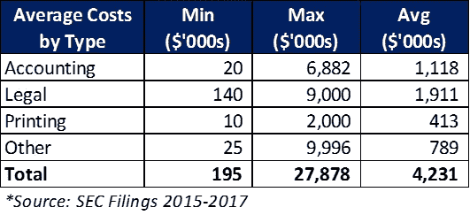
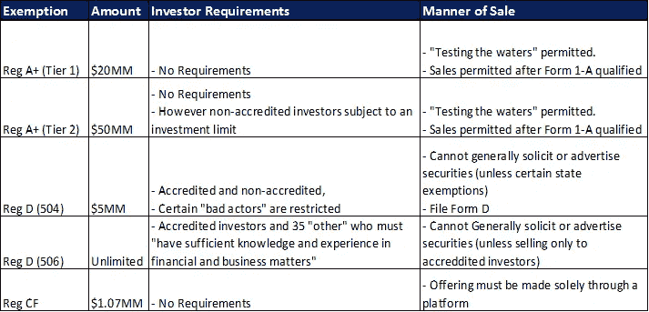

# 密码的首次万亿美元使用

> 原文：<https://medium.com/coinmonks/the-first-trillion-dollar-use-of-crypto-bf852a51308?source=collection_archive---------9----------------------->

如果您一直关注加密领域，那么您一定会听到关于实用令牌合法性的争论。论点是——如果令牌具有真正的“效用”,因为它是消费者使用网络所必需的，那么它就不应该被贴上安全的标签。然而，美国证券交易委员会反驳说，在任何情况下，如果你出售代币是为了发展它将被使用的网络，那么它就是一种证券。

没有人会认为赌场筹码不是一种证券，它仅仅是一种用于在赌场赌博的实物代币。也就是说，如果你向公众出售赌场筹码，然后去建造使用这些筹码的赌场，那么你猜对了…这是一种证券。

为了筹集资金来实际建设项目，公司需要开始寻找完全符合标准的证券代币，而不是试图用公用代币来规避现有的证券法规。正是这些代币有可能彻底改变公司筹集资本的方式和投资者投资的方式， ***释放数万亿美元的价值。***

# **当前系统的问题**

在公开市场筹集资金并非易事。无论是股票、债务还是房地产，这都是一个漫长而昂贵的过程。对于这个例子，我们将看看通过公共股票市场筹集资金——或 IPO。

首先，这个过程从开始到结束通常需要至少一至两年的时间。公司需要提交 S-1，这是 SEC 要求的初始登记表。这种形式包括收益的用途、公司的商业模式和竞争、证券本身的招股说明书以及发行价格方法。它通常有数百页，根据 OMB 管理和预算局的数据，完成[平均需要 972 小时。请记住，这些也是收入至少在 1 亿美元左右的公司，因此对于较小的公司来说，填写这些表格会更加麻烦。](https://www.merrillcorp.com/en/glossary/form-s1)

[根据普华永道的一份报告](https://www.pwc.com/us/en/deals/publications/assets/cost-of-an-ipo.pdf)，公司上市的平均成本通常为 420 万美元(详见下表)。此外，还有约占总收益 4%-7%的承销商费用，以及上市后每年 150 万美元的财务报告、法律和合规成本。上市所需的成本和时间对许多公司来说可能是一个巨大的负担，并阻止他们获得公开市场的流动性。

Printing alone can cost up to $2 million….

虽然这些确切的成本是 IPO 特有的，但其他融资方式也会产生类似的成本。这是因为在这个过程中总是有银行家和律师参与，也是安全令牌能够提供巨大改进的原因。

# 安全令牌的优势

那么安全令牌到底是由什么组成的呢？

根据 [ConsenSys 的数字资产分类法](https://thebrooklynproject.consensys.net/token-taxonomy):

> “代币的内在特征是金融工具所固有的。例如，这些内在特征包括公司股权、基金权益以及结构性债务、贷款和分红权。”

与它们的传统对应物相比，安全令牌没有什么本质上的不同。从本质上讲，它们是一样的东西，不同之处在于它们是如何被创造和交换的，这也是改进的地方。

我说的那些中间商几乎都可以被淘汰。银行不再是必要的，因为公司可以利用代币平台，如 T2 的 coin list T3、T4 的 ICOBox T5 或 IndieGoGo T7 来发行他们的证券。智能合同将消除对律师的需求，代码将成为法律，这些平台将有助于确保筹资符合监管规定。

一旦推出，这些证券将在交易所进行交易，如 [tZero](https://www.tzero.com/) 或 [Templum](https://www.tradetemplum.com/) ，结算时间从几天到几分钟不等。这些交易所将向全球流动性池开放证券，让投资者能够灵活地随时出售传统上缺乏流动性的私人证券。这种流动性的增加不能低估，Aswath Damodoran，公司融资和估值领域最著名的学者之一，[估计流动性溢价](http://people.stern.nyu.edu/adamodar/pdfiles/papers/liquidity.pdf)约为 20%-30%(外国私营企业为 40%-50%)。当你把它应用于价值数万亿的全球私有化证券时，你可以看到这种增加的流动性可以释放出多少价值。

另一个好处是资产的可分割性。如果你想投资房地产，你可以购买房地产投资信托基金。但是，如果你连最低投资都负担不起，那你就倒霉了。证券代币提供的是将任何金额的资金投资于此类证券的可能性，甚至更进一步，能够投资于房地产投资信托基金的各个组成部分。

## 这一切怎么可能？

1933 年的《证券法》是第一部规范证券发行和销售的重要联邦立法。近一个世纪以来，它“保护”了普通投资者免受高风险投资的影响。然而，这种保护也意味着，如果你不是一个合格的投资者，你就不能从这些高风险/高回报的投资中获利。这种情况一直持续到 2012 年，当时通过了《就业法案》( JOBS act ),允许在例外情况下允许公司通过 IPO 或传统风险投资以外的方式筹集资金。根据这一法案，公司可以有其他选择，而不需要昂贵、耗时的 IPO 来进入公开市场。或者，投资者现在可以参与早期投资，而不一定需要获得认证。以下是这些免于向 SEC 注册证券的高层次总结:

如您所见，公司有各种选择，这取决于他们想要筹集的资金量以及他们想要在安全产品上花费的时间和金钱量。

# 真正的差异制造者

到目前为止，我已经就安全令牌如何在成本和时间效率、流动性和可分性方面改善公司和投资者的现有基础设施进行了论证。但证券代币将创造数万亿美元价值的真正原因是在传统系统中不可能实现的新的创新用途。

通过将证券转换成一系列智能合约，可能性变得深远。想象一下，创造一种股权，但通过使投票权或股息份额与证券持有时间成比例，为公司的真正信徒提供各种激励机制。相反，如果你持有一种证券完全是为了资本增值，那么如果你可以卖掉投票权或股息流会怎么样。这只是冰山一角。一旦引入可编程安全性的概念，可能性似乎是无穷无尽的。

为了进一步阅读，这些文章确实是该领域一些有远见的思想家的必读之作。

[令牌化证券官方指南](/@apompliano/the-official-guide-to-tokenized-securities-44e8342bb24f)——[安东尼·庞普利亚诺](https://medium.com/u/1d0168ffead9?source=post_page-----bf852a51308--------------------------------)

[传统资产证券化](https://hackernoon.com/traditional-asset-tokenization-b8a59585a7e0)；还有[安全令牌论文](/@sbmckeon/the-security-token-thesis-4c5904761063)——[斯蒂芬·麦肯](https://medium.com/u/d1b00c9f1ea7?source=post_page-----bf852a51308--------------------------------)