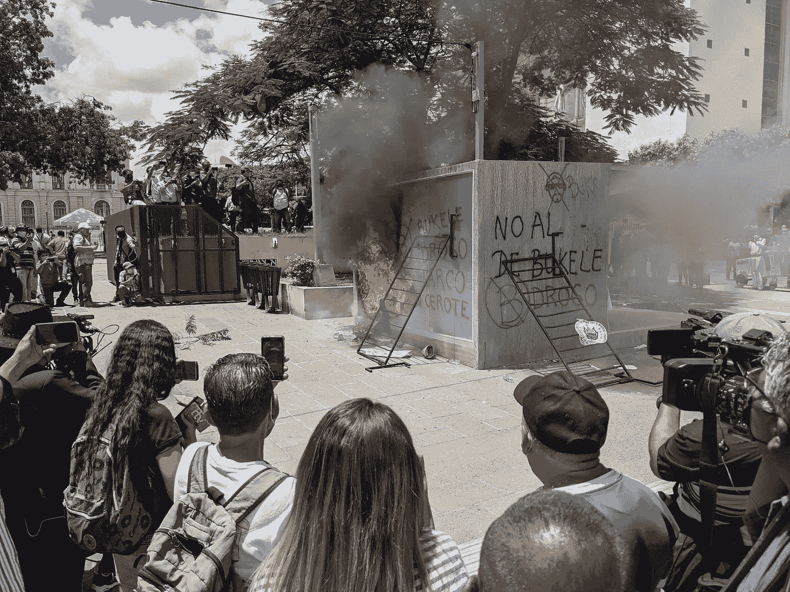

# 比特币国家的最初几周

> 原文：<https://medium.com/coinmonks/the-first-weeks-of-a-bitcoin-nation-970529947f90?source=collection_archive---------3----------------------->

## 我在萨尔瓦多呆了一个月，已经发生了很多变化

At the conclusion of an anti-government protest on Sept 15th, demonstrators burned a Chivo ATM kiosk

这是一场旋风。

当我 8 月份到达圣萨尔瓦多时，我对比特币在这里的存在如此之少感到震惊。在我四处走动的第一天，我没有看到一家接受比特币的商店，也没有遇到任何超过表面的当地人…