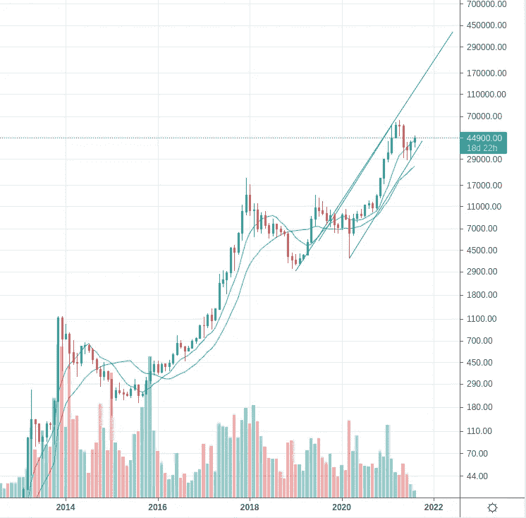

# 翻转近在咫尺，秘密价格目标

> 原文：<https://medium.com/coinmonks/the-flippening-is-nigh-crypto-price-targets-c99171486292?source=collection_archive---------3----------------------->

标准的免责声明适用，这是我的野生猜测，DYOR。总的来说，我不关心多月价格目标，因为我要么持有，要么在更短的时间框架内交易。也就是说，我昨天看到了这条推文，想看看图表，看看他看到了什么:

有几个基本的交易原则我会用到，但不会完全解释它们:

1.  市场是分形的，在所有的时间尺度上，价格和时间的百分比变动是相似的。
2.  趋势是你的朋友。动量是一种典型的市场无效率，在密码领域非常真实。

首先我们来看看 BTC

从这张图表中我们可以看到，我们刚刚在 30K 的较低趋势线上反弹了巨大的支撑。加密公牛活了！我们可以为这波牛市的最终走势确定 3 个价格:140，200，600。140K 来自 2019 年 1 月至 7 月的百分比涨幅，200K 是 2 个季度的趋势上线的预测，这是牛市第一次上行的时间(从 2019 年 1 月开始)。60 万来自 2020 年 3 月-2021 年 4 月的百分比收益。一切皆有可能，但我想说 20 万是 BTC 在 2022 年 1 月 1 日前后最有可能的价格。

接下来让我们看看 BTC 理工大学

当我们看这个图表时，我们看到 ETH 从 2016 年到 2018 年有一个巨大的牛市，由两个惊人的上涨组成，涨幅大致相等。我们看到，瑞士联邦理工学院一直处于 2020 年开始的新一轮牛市中。通过两种方法，我们得到了大致相同的目标价 0.37 英镑。按照这个价格，ETH 的市值将是 BTC 的两倍。应用之前上涨的百分比涨幅，我们就得到目标价格。我们也可以假设当前的盘整是整个上升过程的中点，这是这种图表模式的常见情况。这也指向 0.37 的目标。未来 6-12 个月，瑞士联邦理工学院的市值可能是 BTC 的两倍。随着 EIP-1559 的成功推出，以及即将到来的将 ETH 转化为通缩资产的“合并”，该图表模式符合一个令人信服的基本面情况。

最后，我们有瑞士法郎/美元

我们看到，尽管从 4380 美元到 1700 美元的巨大回调，我们从未离开定义当前牛市的狭窄趋势通道。从 86 美元到 4380 美元的第一波牛市上涨了 50 倍。尽管看起来有些疯狂，但我们并非不可能看到另一次类似幅度的变动。这无疑是一个极端的例子，预计 2022 年夏季将达到 86，000 美元的高点。到目前为止，我们能想出的另外两个价格目标将来自移动的内部细分。类似于 2020 年 3 月-2020 年 9 月的终端移动将使 ETH 达到 10，000 美元。在中期案例中，从 2020 年 9 月至 2021 年 5 月的类似涨幅将为我们提供 24，000 美元的目标价格。这一高点的时间是 2022 年 1 月-2022 年 7 月，可能是更高目标的窗口晚些时候。无论最终价格如何，我不认为这一趋势会结束，直到 ETH 在 2022 年上半年的某个时候标记出趋势线。

也就是说，让我们重温一下免责声明。没有一个理智的人通过设定价格目标并盲目持有直到达到目标，或者更糟，盲目跟随别人的价格目标来交易。我没有和这些目标结婚，在今年剩下的日子里，我可能每天都在修改我的观点，当然也不会花时间发表这样的修改，不管现实与我认为的最大概率结果相差多远。散户投资者在 crypto 中能做的最好的事情就是在一个好项目中买入一小部分，并持有 5-10 年。大多数散户投资者会在最高点买入，你需要足够的时间来出仓。我的个人投资组合正是这三个最好的第 1 层加密项目:

*   80%的 ETH(生态系统方面的市场领导者)
*   10%的 AVAX(最好的技术，如果 ETH 失败，可能会赢)
*   10% SOL(第二好的技术，如果 ETH 和 AVAX 都失败，可能会赢)

我不交易我的核心头寸，如果你交易了，你就是个傻瓜。

> 加入 [Coinmonks 电报频道](https://t.me/coincodecap)，了解加密交易和投资

 [## 最佳加密交易所| 2021 年十大加密货币交易所

### 加密货币交易所的加密交易需要了解市场，这可以帮助你获得利润…

blog.coincodecap.com](https://blog.coincodecap.com/crypto-exchange)  [## 2021 年 9 大最佳加密借贷平台

### 当谈到加密货币贷款时，大量因素等同于良好的收入状况。此外，借款的一部分…

blog.coincodecap.com](https://blog.coincodecap.com/crypto-lending)  [## 2021 年最佳加密交易机器人(免费和付费)

### 2021 年币安、比特币基地、库币和其他密码交易所的最佳密码交易机器人。四进制，位间隙…

medium.com](/coinmonks/crypto-trading-bot-c2ffce8acb2a)