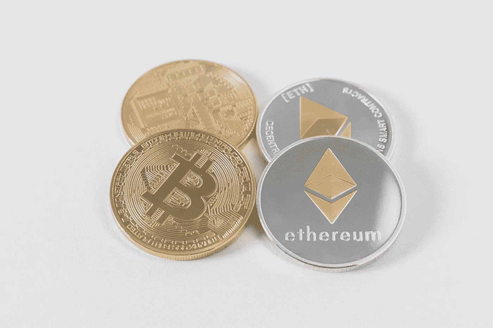
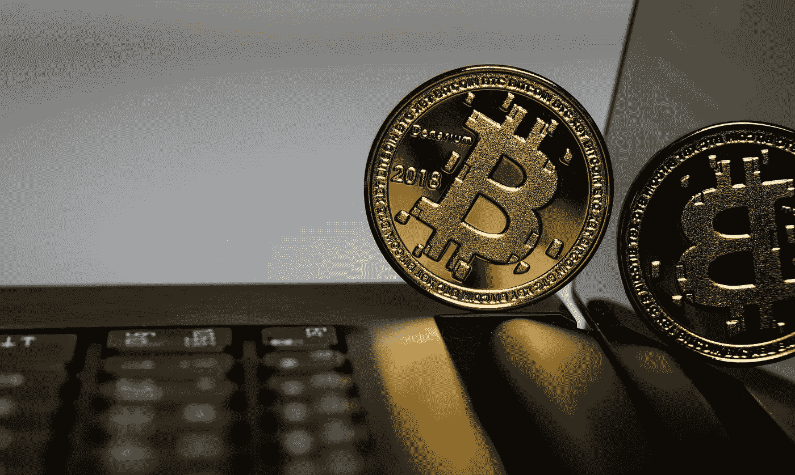
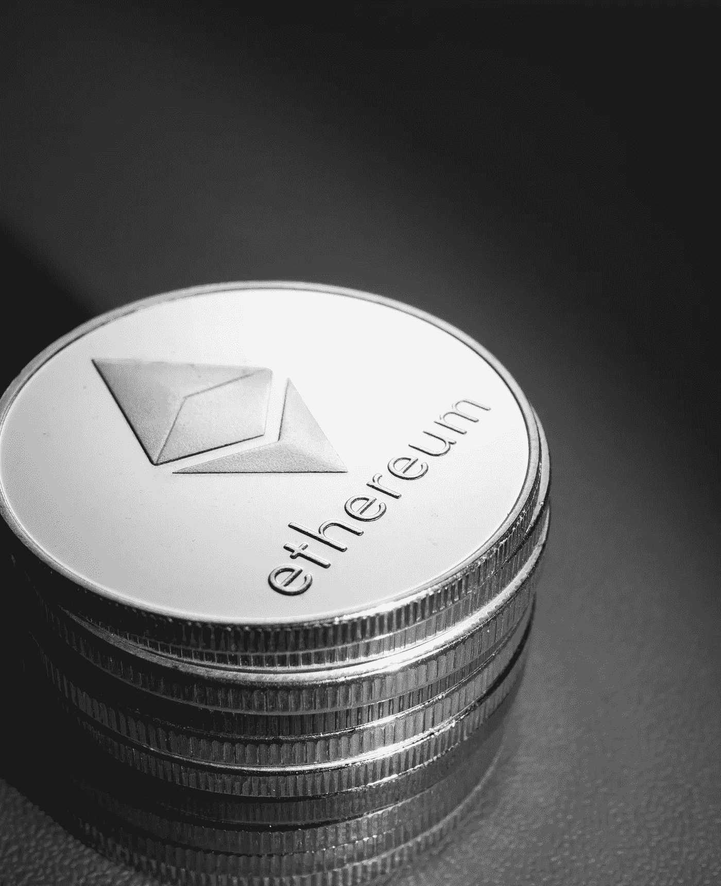

# 翻转——它是什么，为什么重要

> 原文：<https://medium.com/coinmonks/the-flippening-what-it-is-and-why-it-matters-63e22486ca44?source=collection_archive---------1----------------------->

## *以太取代比特币是迟早的事*

Photo by [Thought Catalog](https://unsplash.com/@thoughtcatalog?utm_source=unsplash&utm_medium=referral&utm_content=creditCopyText) on [Unsplash](https://unsplash.com/s/photos/blockchain?utm_source=unsplash&utm_medium=referral&utm_content=creditCopyText)

这种翻转指的是以太取代比特币成为市值最高的加密货币的假设时刻。市值是流通中的代币总数乘以一枚代币的价值

[本网站](https://www.blockchaincenter.net/flippening/)对这两种加密货币的 9 项指标进行跟踪和比较。

## 一种加密货币超越另一种加密货币到底有什么关系？

在我们开始之前，让我们快速回顾一下一些关键概念。

# 比特币

虽然已经有很多创造数字货币的尝试，但比特币是迄今为止最成功的。它也是其后每一种加密货币的灵感来源。

> 交易由网络[节点](https://en.wikipedia.org/wiki/Node_(networking))到[密码术](https://en.wikipedia.org/wiki/Cryptography)验证，并记录在被称为[区块链](https://en.wikipedia.org/wiki/Blockchain)的公共[分布式分类账](https://en.wikipedia.org/wiki/Distributed_ledger)中。

Photo by [Aleksi Räisä](https://unsplash.com/@denarium_bitcoin?utm_source=unsplash&utm_medium=referral&utm_content=creditCopyText) on [Unsplash](https://unsplash.com/s/photos/bitcoin?utm_source=unsplash&utm_medium=referral&utm_content=creditCopyText)

有许多特性使得比特币成为一个真正新颖的想法—

*   去中心化——没有中央服务器，交易存储在一个防篡改、公开分布的点对点账本上，称为**区块链**。这与我们日常生活中接触的大多数其他系统形成对比，因为它们涉及某种创建、管理和控制系统的中央实体。这种系统容易受到攻击，因为它们具有单点故障。
*   它是无权限的——任何人都可以在不寻求许可的情况下加入网络并与之互动，要么通过比特币交易，要么通过验证交易来帮助保护网络。
*   它是公开的——尽管交易背后的真实身份是隐藏的，但区块链的交易历史是公开的，任何人都可以查看。
*   无信任—传统的集中式系统建立在信任的基础上。只要参与者信任中央权威，这个系统就能运行。当一个人把钱汇给另一个人时，银行保证 B 会收到钱。这种系统有一个中心故障点，容易受到黑客攻击。众所周知，他们恶意行事，违背公众利益。比特币通过激励参与者的良好行为来实现不信任，并由计算机代码管理。信任并没有被完全消除，而是被最小化，只存在于抽象的概念中。

 [## 最佳免费加密交易机器人——前 16 名比特币交易机器人[2021]

### 2021 年币安、比特币基地、库币和其他密码交易所的最佳密码交易机器人。四进制，位间隙…

medium.com](/coinmonks/crypto-trading-bot-c2ffce8acb2a) 

# 区块链

在传统金融中，银行是一个必要的中介，被信任来维护一个记录交易清单的分类账。

比特币的区块链是一个分布式账本，将交易捆绑成块，按时间顺序链接在一起。

由于没有更新区块链的中央权威机构，因此由网络参与者通过向所有人开放的共识机制来验证交易。

分布式分类帐没有单点故障。每个节点都拥有区块链的副本，更改一个节点中的记录不会更改其他节点上存储的信息。

要使攻击成功，需要同时修改区块链的大多数副本。这完全不需要第三方来保证信任。

# 以太坊

以太坊是第二受欢迎的加密货币。与比特币非常相似，以太坊区块链也是一个用于验证和记录交易的开源分布式账本。以太坊有自己的数字货币以太网(Ether)来促进网络交易。

Photo by [Jievani Weerasinghe](https://unsplash.com/@jievani?utm_source=unsplash&utm_medium=referral&utm_content=creditCopyText) on [Unsplash](https://unsplash.com/s/photos/ethereum?utm_source=unsplash&utm_medium=referral&utm_content=creditCopyText)

以太坊不仅将区块链用于支付，还支持智能合约和分散应用的部署。

 [## 最佳 6 个加密交易信号电报通道

### 这是乏味的找到正确的加密交易信号提供商。因此，在本文中，我们将讨论最好的…

medium.com](/coinmonks/best-crypto-signals-telegram-5785cdbc4b2b) 

## **分散应用(dApps)**

dApps 是部署在区块链或对等计算机网络上的数字应用程序，而不是中央服务器。这确保了应用程序不受单个实体或机构的控制，而是由社区驱动的。

## **智能合约**

智能合同是用计算机代码编写的一组指令，可自动运行协议的所有部分，并可用于使当事人之间的协议自动化。这完全消除了对中介的需要，因为结果是预先确定的。

因为区块链上的信息是不可变的，所以部署的智能合约不能被修改。

我们注意到，当谈到区块链时，排除中间商和中介是一个持续的主题。比特币白皮书于 2008 年底首次发布。这发生在 2008 年全球金融危机之后，那场危机是受托保护资金的银行机构过度冒险的结果。其结果是财富的损失和生命的毁灭，而肇事者却没有受到什么影响。

中间人的问题不仅在于恶意行为，还在于官僚主义、无能或利益冲突导致的人在圈内的低效率。

让我们来看看一些创新的应用——

## 投票

在我的国家尼日利亚，人们不投票的两个常见原因是 1。对选举制度和选举的公平性缺乏信任。第二。害怕选举暴力。人们普遍认为，暴力是压制选民投票率的一种策略，因为它确保街上的许多人都是被收买在反对派地区制造混乱的人，并以某种方式投票。

区块链的透明度解决了这两个问题，因为它允许实时更新选票计数，同时消除了昂贵的重新计票的需要。只需点击一个按钮，任何人都可以填写和查看选举结果。

由于个人能够在自己舒适的家中投票，因此不必担心成为身体暴力的受害者。这可能会导致更多的参与，而更多的参与只会是一件好事。

 [## BlockFi 评论 2021 —通过您的加密获得 8.6%的利率

### 让你的密码发挥作用，获得比特币和其他加密货币的最佳利率

medium.com](/coinmonks/blockfi-review-53096053c097) 

## 管理

Dao 是由一群拥有共同目标的人管理的实体，没有集中的领导或层级。

与传统组织不同，DAO 的章程在智能合同中是硬编码的，并且**是绝对的法律。**一旦部署，除非协商一致，否则不得进行任何更改。成员的投票会被记录下来，修改会自动执行，不需要任何中介。

包括支出在内的所有活动都必须由社区投票和批准。所有成员都可以提出想法和投票。这使得陌生人能够以一种真正前所未有的方式进行高效、公开和透明的合作。

> 把它们想象成一个由成员集体拥有和管理的互联网原生企业。它们有内置的金库，未经集团批准，任何人都无权动用。决策由提案和投票管理，以确保组织中的每个人都有发言权。
> 
> 没有首席执行官可以根据自己的奇思妙想授权支出，也没有狡猾的首席财务官篡改账目的可能。一切都是公开的，关于消费的规则通过代码嵌入到 DAO 中。

在传统组织中，与他人一起创业是基于信任的，有时会充满问题和风险，尤其是在涉及金钱的时候。有了 DAOs，就没有必要再去信任另一个人了。信任只需要放在抽象的概念里。

它的治理、运营和活动是完全公开透明的，所有人都可以看到。Dao 能够通过消除传统组织带来的大量臃肿来有效地运作。

 [## 加密税务软件——五大最佳比特币税务计算器[2021]

### 不管你是刚接触加密还是已经在这个领域呆了一段时间，你都需要交税。

medium.com](/coinmonks/best-crypto-tax-tool-for-my-money-72d4b430816b) 

## 分散融资

DeFi 可能是该领域最有趣和发展最快的趋势之一。DeFi 背后的总体思路是开发以代码编写并在区块链上部署的非托管金融产品和服务。

Photo by [Michael Longmire](https://unsplash.com/@f7photo?utm_source=unsplash&utm_medium=referral&utm_content=creditCopyText) on [Unsplash](https://unsplash.com/s/photos/decentralized-finance?utm_source=unsplash&utm_medium=referral&utm_content=creditCopyText)

这将使这些产品公开、透明，所有人都可以获得，而不需要中间人。金融产品的例子包括贷款服务、交易所、衍生品和保险。

比特币可能被认为是第一个用于支付的 DeFi 协议。

智能合同用于自动执行协议参与者之间的协议条款，从而消除对信任和中介的需求。

让我们看两个 DeFi 项目的例子

## **Aave**

> Aave 是一个开源的非托管流动性协议，用于赚取存款和借贷资产的利息。

用户可以通过以下方式作为借款人或存款人参与—

*   存放代币以提供流动性并赚取利息。
*   通过提供其他代币作为抵押品来借用代币。

Aave 目前支持 20 多种不同的加密货币，截至 2021 年 6 月底，锁定的总价值超过 160 亿美元(TVL)，这是衡量协议中锁定的资产数量的常用指标。

## **Uniswap**

Uniswap 是一种分散式金融协议，用于交换加密货币和代币。Uniswap 是非托管的、开放的和未经许可的，这与币安和比特币基地等集中的交易所形成对比(也更符合区块链的精神)。

在 uniswap 中，流动性提供者提供流动性，并通过存放代币赚取费用，然后交易者使用代币促进代币之间的交换。

> 该协议通过使用智能合约，促进了以太坊区块链上加密货币令牌之间的自动化交易。

截至 2021 年 6 月底，Uniswap 锁定的总价值约为 50 亿美元。

## **DeFi 可组合性**

由于 DeFi 协议是开源的和无许可的，这允许为最终用户开发创新和创造性的金融产品，这些产品自由地利用现有的协议，而无需寻求许可。

> 无损失的 DeFi 彩票 Pooltogether 建立了一个有趣的储蓄产品，将存款集中起来，每周将累积的利息给一个幸运的赢家。Pooltogether 不需要构建太多；它严重依赖 Compound 和戴，不需要他们的许可。

DeFi 智能合约锁定的总价值已从 2020 年 6 月的约 500 亿美元 1B 增至一年后的约 500 亿美元。

DeFi 运动有可能改变世界，因为它在全球范围内提供了替代金融解决方案，并允许用户使用代币做更多的事情，而不仅仅是作为价值储存手段。

# 最后的想法

毫无疑问，比特币是有史以来最具创新性和变革性的技术之一。这解释了为什么它现在仍然是最有价值和最受欢迎的加密货币。

在撰写本文时，比特币的总市值为 6250 亿美元，占加密市场总市值的 47%以上。

比特币永远不会超过 2100 万枚，其中 1900 万枚已经被铸造出来。其有限的供应，加上其简单性和可接受性，使其对机构投资者越来越有吸引力。

以太坊很大程度上受到比特币的启发，目前是市值超过 216 亿美元的第二大最有价值的加密货币。

比特币的产生是为了绕过世界金融体系不得不依赖的中介和中间人。另一方面，以太坊的目的是创建一个网络，在这个网络上可以构建不受财务限制的应用程序。

> BTC 和以太网都是数字货币，但以太网的主要目的不是将自己确立为替代货币系统，而是促进和货币化以太坊智能合约和去中心化应用(dapp)平台的运营。

今天存在的大多数加密货币和 dApps 都建立在以太坊网络上，以及其他创新的用例，如 NFT(不可替代的令牌)。

可以想象未来的无人驾驶汽车公司是一个 DAO，智能合同定义了汽车的行为方式，当有人要求搭车并以电子方式付款时，人们可以接送，当检测到故障时，车辆会前往服务站，并前往加油站加油。

所有人都可以参与公司的拥有和经营。

在未来，智能合约定义了个人之间的许多互动。在这样的未来，除了作为一种数字支付形式的使用之外，拥有以太网促进的执行和参与这种合同的能力是一种附加的效用。

毫无争议的是，也许支持更大范围和各种用例的平台最终会成为主导平台。

# 参考

什么是 DeFi 可组合性？金钱乐高简介[https://academy . shrimpy . io/post/what-is-defi-composability-an-Introduction-To-Money-Legos](https://academy.shrimpy.io/post/what-is-defi-composability-an-introduction-to-money-legos)

[克里斯·鲍尔斯](https://doseofdefi.substack.com/people/22852-chris-powers)2020 DeFi 用户的可组合性[https://doseofdefi . substack . com/p/The-Composability-of-DeFi-Users](https://doseofdefi.substack.com/p/the-composability-of-defi-users)

monolith 2021 Understanding DeFi:stable coins explained[https://medium . com/monolith/Understanding-DeFi-stable coins-explained-cab 82d 1 d3c b 2](/monolith/understanding-defi-stablecoins-explained-cab82d1d3cb2)

Finematics 2021 分散金融(DeFi)【https://ethereum.org/en/defi/ T2

Andrés Engler 2020 阿根廷人为什么从美元转向像戴这样稳定的货币

内森·雷夫 2020 比特币 vs 以太坊:有什么区别？[https://www . investopedia . com/articles/investing/031416/bit coin-vs-ether eum-driven-different-purposes . ASP](https://www.investopedia.com/articles/investing/031416/bitcoin-vs-ethereum-driven-different-purposes.asp)

Olowojolu Olakunle，Rasak Bamidele，Ake mod UPE 1 Ogundele Oluwaseun AFO layan Magdalene 2019 年尼日利亚选举暴力趋势[https://core.ac.uk/download/pdf/195394498.pdf](https://core.ac.uk/download/pdf/195394498.pdf)

John Divine 2021 比特币 vs 以太坊:哪个更好买？[https://money . us news . com/investing/crypto currency/articles/比特币与以太坊孰优孰劣](https://money.usnews.com/investing/cryptocurrency/articles/bitcoin-vs-ethereum-which-is-a-better-buy)

Sean Stein Smith 2021 Bitcoin，Ether，The Flippening，And Future Trends For Crypto-Development[https://www . Forbes . com/sites/seansteinsmith/2021/05/04/bit coin-Ether-The-Flippening-And-Future-Trends For-Crypto-Development/？sh=472f01f241bb](https://www.forbes.com/sites/seansteinsmith/2021/05/04/bitcoin-ether-the-flippening-and-future-trends-for-crypto-development/?sh=472f01f241bb)

阿卜杜拉赫曼·雷杰布·卡里姆·雷杰布·约翰·g·基奥 2021 货币供应过程中的集中分类账与分散分类账:SWOT 分析[https://www . research gate . net/publication/348579421 _ Centralized _ vs _ decentralized _ ledgers _ in _ the _ money _ supply _ process _ a _ SWOT _ analysis](https://www.researchgate.net/publication/348579421_Centralized_vs_decentralized_ledgers_in_the_money_supply_process_a_SWOT_analysis)

0xjim 2021 DAOs 是下一件大事[https://medium . com/coin monks/Dao-be-better-than-companies-2 ab 3 e 6 e 50 a 14](/coinmonks/daos-are-better-than-companies-2ab3e6e50a14)

Sankarshan Damle 和 Sujit Gujar 2021 FASTEN:使用智能合同进行公平安全的分布式投票[https://arxiv.org/pdf/2102.10594.pdf](https://arxiv.org/pdf/2102.10594.pdf)

> 加入 [Coinmonks 电报频道](https://t.me/coincodecap)，了解加密交易和投资

## 另外，阅读

*   [尤霍德勒 vs 科恩洛安 vs 霍德诺特](/coinmonks/youhodler-vs-coinloan-vs-hodlnaut-b1050acde55a) | [Cryptohopper vs 哈斯博特](https://blog.coincodecap.com/cryptohopper-vs-haasbot)
*   [币安 vs 北海巨妖](https://blog.coincodecap.com/binance-vs-kraken) | [美元成本平均交易机器人](https://blog.coincodecap.com/pionex-dca-bot)
*   [如何在印度购买比特币？](/coinmonks/buy-bitcoin-in-india-feb50ddfef94) | [WazirX 审核](/coinmonks/wazirx-review-5c811b074f5b) | [BitMEX 审核](https://blog.coincodecap.com/bitmex-review)
*   [比特币主根](https://blog.coincodecap.com/bitcoin-taproot) | [Bitso 评论](https://blog.coincodecap.com/bitso-review) | [排名前 6 的比特币信用卡](/coinmonks/bitcoin-credit-card-bc8ab6f377c6)
*   [双子座 vs 比特币基地](https://blog.coincodecap.com/gemini-vs-coinbase) | [比特币基地 vs 北海巨妖](https://blog.coincodecap.com/kraken-vs-coinbase) | [硬币罐 vs 硬币点](https://blog.coincodecap.com/coinspot-vs-coinjar)
*   [印度加密交易所](/coinmonks/bitcoin-exchange-in-india-7f1fe79715c9) | [比特币储蓄账户](/coinmonks/bitcoin-savings-account-e65b13f92451) | [Paxful 审核](/coinmonks/paxful-review-4daf2354ab70)
*   [杠杆令牌](/coinmonks/leveraged-token-3f5257808b22) | [最佳加密交易所](/coinmonks/crypto-exchange-dd2f9d6f3769) | [AscendEX 评论](/coinmonks/ascendex-review-53e829cf75fa)
*   [Godex.io 审核](/coinmonks/godex-io-review-7366086519fb) | [邀请审核](/coinmonks/invity-review-70f3030c0502) | [BitForex 审核](/coinmonks/bitforex-review-c4bb28d9e271) | [HitBTC 审核](/coinmonks/hitbtc-review-c5143c5d53c2)
*   [Crypto.com 费用](/coinmonks/binance-fees-8588ec17965) | [僵尸加密审查](/coinmonks/botcrypto-review-2021-build-your-own-trading-bot-coincodecap-6b8332d736c7) | [替代品](https://blog.coincodecap.com/crypto-com-alternatives)
*   [MXC 交易所评论](/coinmonks/mxc-exchange-review-3af0ec1cba8c) | [Pionex vs 币安](https://blog.coincodecap.com/pionex-vs-binance) | [Pionex 套利机器人](https://blog.coincodecap.com/pionex-arbitrage-bot)
*   [我的密码交易经验](/coinmonks/my-experience-with-crypto-copy-trading-d6feb2ce3ac5) | [比特币基地评论](/coinmonks/coinbase-review-6ef4e0f56064)
*   [加密货币储蓄账户](/coinmonks/cryptocurrency-savings-accounts-be3bc0feffbf) | [赌注加密](https://blog.coincodecap.com/staking-crypto) | [窃取 x 评论](/coinmonks/stealthex-review-396c67309988)
*   [BigONE 交易所评论](/coinmonks/bigone-exchange-review-64705d85a1d4) | [CEX。IO 审查](https://blog.coincodecap.com/cex-io-review) | [交换区审查](/coinmonks/swapzone-review-crypto-exchange-data-aggregator-e0ad78e55ed7)
*   [最佳比特币保证金交易](/coinmonks/bitcoin-margin-trading-exchange-bcbfcbf7b8e3) | [Bityard 保证金交易](https://blog.coincodecap.com/bityard-margin-trading) | [Prokey 审核](/coinmonks/prokey-review-26611173c13c)
*   [加密保证金交易交易所](/coinmonks/crypto-margin-trading-exchanges-428b1f7ad108) | [赚取比特币](/coinmonks/earn-bitcoin-6e8bd3c592d9) | [Mudrex 投资](https://blog.coincodecap.com/mudrex-invest-review-the-best-way-to-invest-in-crypto)
*   [WazirX vs coin dcx vs bit bns](/coinmonks/wazirx-vs-coindcx-vs-bitbns-149f4f19a2f1)|[block fi vs coin loan vs Nexo](/coinmonks/blockfi-vs-coinloan-vs-nexo-cb624635230d)